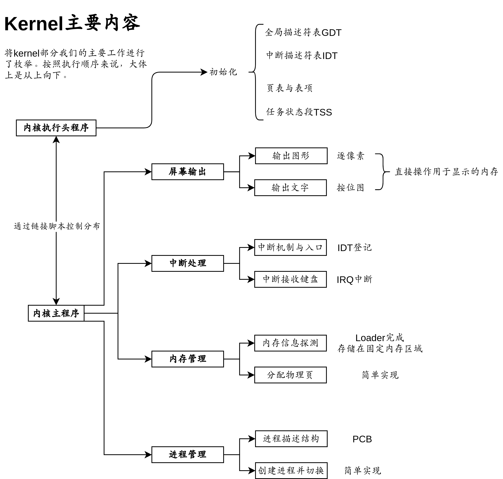
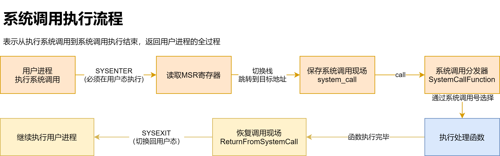
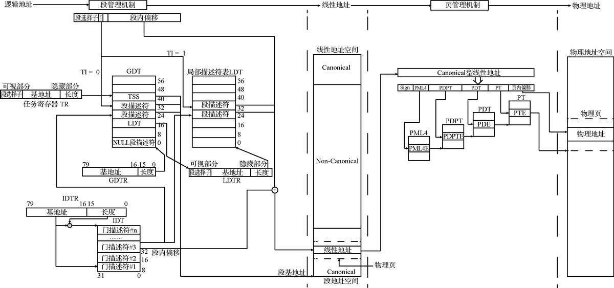

# 64BIT_OS

操作系统项目，完成一个可以使用的linux系统


# 初级部分——完成简单的操作系统框架

## 启动引导——BootLoader

### [启动引导部分文档](docs/lab1.md)


## 操作系统内核

### [操作系统内核文档](docs/lab2.md)



## 应用层

### [操作系统应用层文档](docs/lab3.md)




# 高级部分——对完成的不同区域进行升级


## 预备知识——处理器体系结构

### [处理器体系结构文档](docs/lab4.md)



## 目录结构

```
64BIT_OS
├─ build
│  └─ boot.img
├─ docs
│  ├─ pics
│  ├─ lab1.md
│  ├─ lab2.md
│  ├─ lab3.md
│  └─ lab4.md
├─ src
│  ├─ boot
│  └─ kernel
├─ LICENSE
├─ makefile
├─ README.md
```
