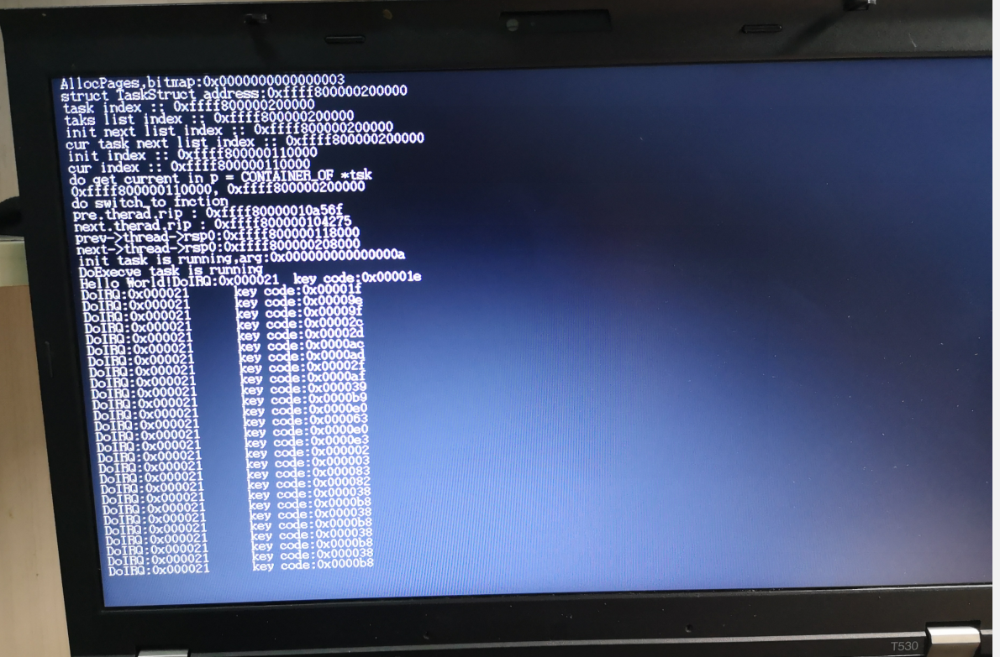
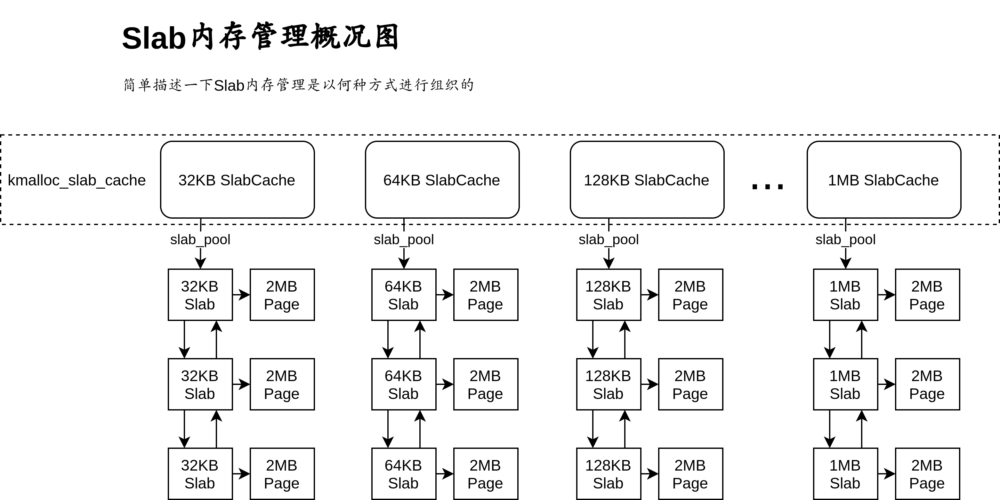

# 64BIT_OS

操作系统项目，完成一个可以使用的linux系统


# 初级部分——完成简单的操作系统框架

## 启动引导——BootLoader

### [启动引导部分文档](docs/lab1.md)


## 操作系统内核

### [操作系统内核文档](docs/lab2.md)


## 应用层

### [操作系统应用层文档](docs/lab3.md)


# 高级部分——对完成的不同区域进行升级


## 预备知识——处理器体系结构

### [处理器体系结构文档](docs/lab4.md)


## 从虚拟平台（bochs）向物理平台的迁移
### [迁移方法文档](docs/lab5.md)


## 内核主程序的完善
### [内核主程序的知识点补充文档](docs/lab6.md)


## 高级内存管理单元

### [高级内存管理单元文档](docs/lab7.md)



## 目录结构

```
64BIT_OS
├─ build
│  └─ boot.img
├─ docs
│  ├─ pics
│  ├─ lab1.md
│  ├─ lab2.md
│  ├─ lab3.md
|  ├─ lab4.md
|  ├─ lab5.md
│  └─ lab6.md
├─ src
│  ├─ boot
│  └─ kernel
├─ LICENSE
├─ makefile
└─ README.md
```


## 主要参考

- 《一个64位操作系统的设计与实现》田宇 [链接](https://www.ituring.com.cn/book/2450)
- Intel® 64 Architecture x2APIC Specification [链接](https://software.intel.com/content/www/us/en/develop/download/intel-64-architecture-x2apic-specification.html?wapkw=APIC)
- Intel® 64 and IA-32 Architectures Software Developer Manuals [链接](https://software.intel.com/content/www/us/en/develop/articles/intel-sdm.html)