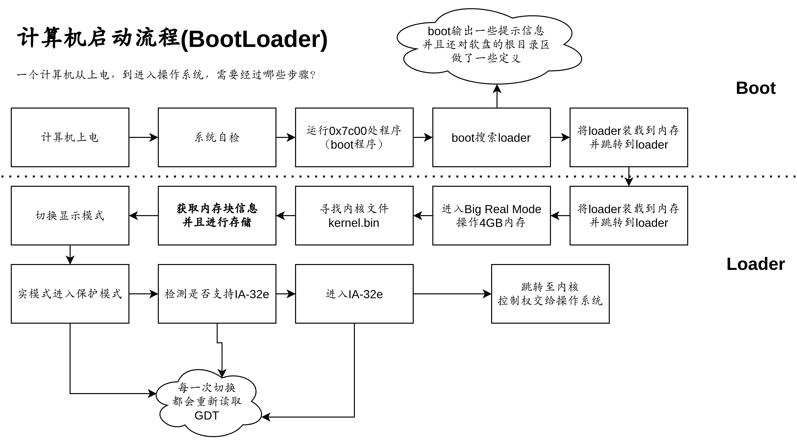

# 64BIT_OS

操作系统项目，完成一个可以使用的linux系统


## 启动引导——BootLoader

### [启动引导部分文档](docs/lab1.md)



## 操作系统内核

### [操作系统内核文档](docs/lab2.md)


## 应用层

### [操作系统应用层文档](docs/lab3.md)


## 目录结构

```
64BIT_OS
├─ build
│  └─ boot.img
├─ docs
│  ├─ pics
│  ├─ lab1.md
│  ├─ lab2.md
│  └─ lab3.md
├─ src
│  ├─ boot
│  └─ kernel
├─ LICENSE
├─ makefile
├─ README.md
```
