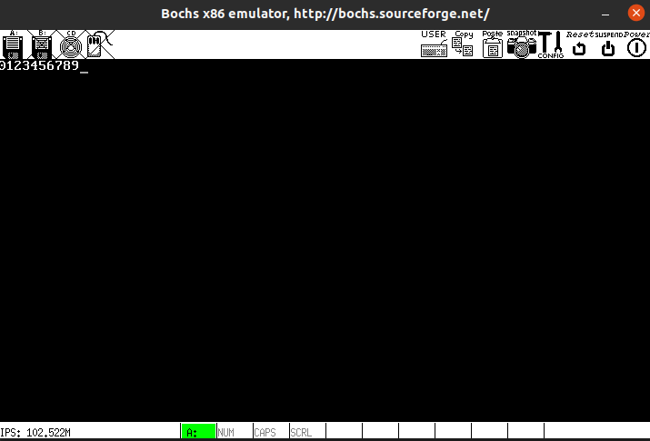
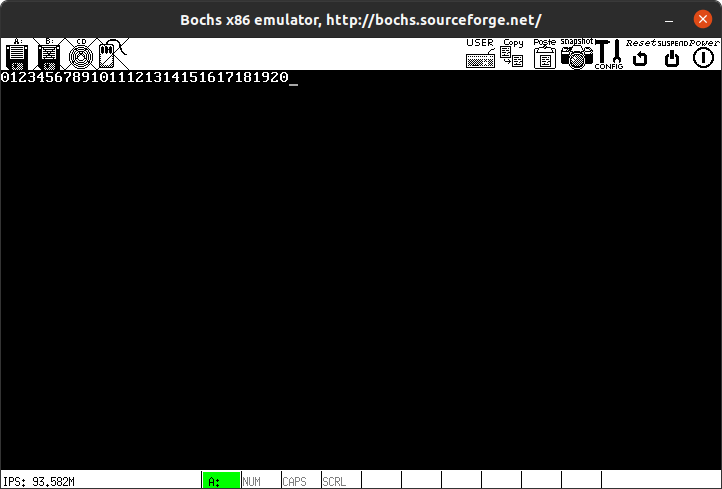
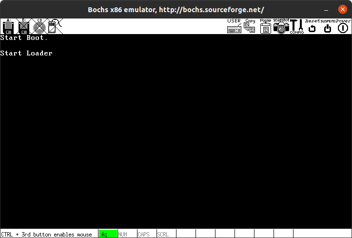
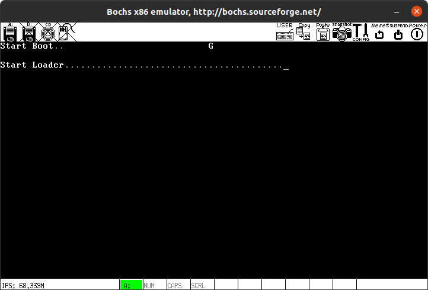
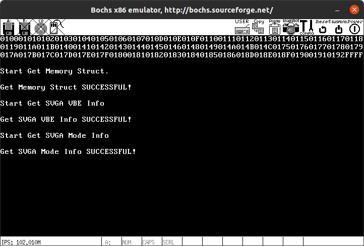
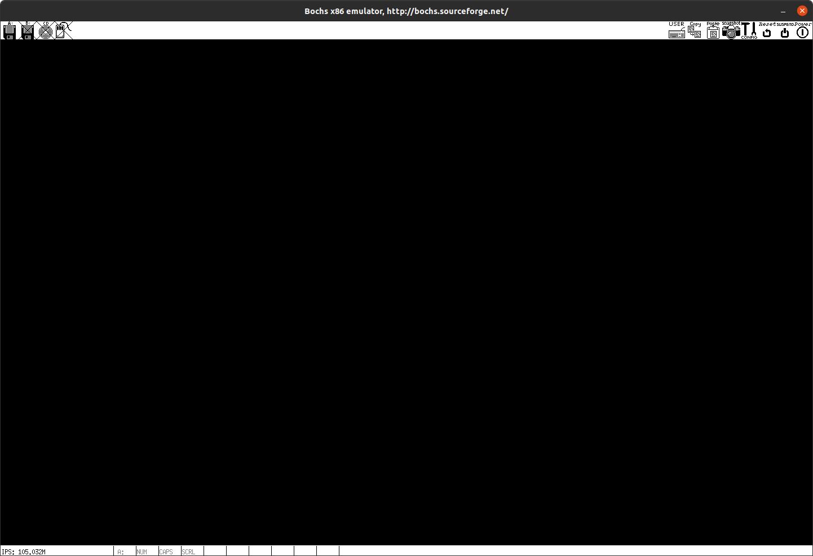

# 64位操作系统——bootLoader


## 第一部分： 写一个简单的引导程序并且显示一些字符

```assembly
    org 0x7c00 ; 将程序加载到0x7c00位置，即：指定程序的起始地址

BaseOfStack equ 0x7c00


; 将CS寄存器的段基址设置到DS、ES、SS中
Label_Start:

    mov ax, cs
    mov ds, ax
    mov es, ax
    mov ss, ax
    mov sp, BaseOfStack

; ======  清空屏幕

    mov ax, 0600h
    mov bx, 0700h
    mov cx, 0
    mov dx, 184fh
    int 10h

; ===== set focus ??? 没看懂这是啥意思

    mov ax, 0200h
    mov bx, 0000h
    mov dx, 0000h
    int 10h

; ===== 在屏幕上显示：Start Booting......

    mov ax, 1301h
    mov bx, 000fh
    mov dx, 0000h
    mov cx, 10
    push ax
    mov ax, ds
    mov es, ax
    pop ax
    mov bp, StartBootMessage
    int 10h

; ===== 软盘驱动器复位

    xor ah, ah
    xor dl, dl
    int 13h

    jmp $


StartBootMessage:	db	"Start Boot"

;=======	fill zero until whole sector

	times	510 - ($ - $$)	db	0
	dw	0xaa55

```


这个程序可以被分为几个部分：

- 初始化部分： 定义了程序被加载到的地方，以及程序中的常量，并且对所有寄存器进行了简单的初始化
- 显示部分：  通过`int 10h`的指令，进行了显示方面的一系列处理
- 软盘驱动器复位：这里我暂时也没搞明白是在干什么
- 填充部分


### 简单的汇编知识

在搞明白这些之前，我们需要先学一点简单的汇编：

我们会发现，上面的程序主要是在对一些寄存器进行简单的操作，这些寄存器是：`ax,bx,cx,dx`他们是nasm语言的通用寄存器。同时，这些寄存器可以根据高位、低位被划分成：`ah,al,bh,bl,ch,cl,dh,dl`，可以理解为：`ax = ah << 16 + al`也就是说`ax`是由`ah\al`两个部分拼接而成的。


理解了这一点之后，你往下看，暂时就没有太大的难度了。


### int 指令

我们首先来看一下这里的`int`指令，学过组成原理的同学都知道，这里的int就是软件中断，我们这里用到了两种int指令，他们实际上就是调用了BIOS里面的一些固有程序，进行了一些我们期望中的处理，我们来看一下这些`int`分别做了哪些操作：


#### 第一次

```assembly
; ======  清空屏幕
mov ax, 0600h
mov bx, 0700h
mov cx, 0
mov dx, 184fh
int 10h
```


这里设置了`ax = 0600h`,`bx=0700h`,`cx=0`,`dx=184fh`,然后调用了`int 10h`,`INT 10h`主要执行的是一些与显示相关的操作。我们来看一下这里的操作：

首先来看`ax`寄存器：我们经过划分可以知道：`ah = 0x06`，`al = 0x00`，这里的ah指示得是执行`INT 10h`相关程序中的哪种操作：当`ah = 0x06`时，执行的是**按指定范围滚动窗口的功能**。

具体的参数如下：

>- AL=滚动的列数，若为0则实现清空屏幕功能；
>- BH=滚动后空出位置放入的属性；
>- CH=滚动范围的左上角坐标列号；
>- CL=滚动范围的左上角坐标行号；
>- DH=滚动范围的右下角坐标列号；
>- DL=滚动范围的右下角坐标行号；
>- BH=颜色属性。
>  - bit 0~2：字体颜色（0：黑，1：蓝，2：绿，3：青，4：红，5：紫，6：综，7：白）。
>  - bit 3：字体亮度（0：字体正常，1：字体高亮度）。
>  - bit 4~6：背景颜色（0：黑，1：蓝，2：绿，3：青，4：红，5：紫，6：综，7：白）。
>  - bit 7：字体闪烁（0：不闪烁，1：字体闪烁）。

这里我们将`AL `设置为了0， 所以实现的是清空屏幕的功能。


#### 第二次

```assembly
; ===== set focus ??? 没看懂这是啥意思
    mov ax, 0200h
    mov bx, 0000h
    mov dx, 0000h
    int 10h
```

这里作者给出的代码中写的是`set focus`，我们还是来看一下`ah`的值：`ah = 0x02`，`ah = 0x02`时`INT 10h`执行**屏幕光标位置的设置功能**。

> - DH=游标的列数；
> - DL=游标的行数；
> - BH=页码。


#### 第三次

```assembly
; ===== 在屏幕上显示：Start Booting......

    mov ax, 1301h
    mov bx, 000fh
    mov dx, 0000h
    mov cx, 10
    push ax
    mov ax, ds
    mov es, ax
    pop ax
    mov bp, StartBootMessage
    int 10h
```

相信大家已经掌握了这套研究的方法了，我们直入主题： 这里执行的是显示字符串的方法，字符串存储在`StartBootMessage`位置，参数如下：

> - AL=写入模式。
>   - AL=00h：字符串的属性由BL寄存器提供，而CX寄存器提供字符串长度（以B为单位），显示后光标位置不变，即显示前的光标位置。
>   - AL=01h：同AL=00h，但光标会移动至字符串尾端位置。
>   - AL=02h：字符串属性由每个字符后面紧跟的字节提供，故CX寄存器提供的字符串长度改成以Word为单位，显示后光标位置不变。
>   - AL=03h：同AL=02h，但光标会移动至字符串尾端位置。
> - CX=字符串的长度。
> - DH=游标的坐标行号。
> - DL=游标的坐标列号。
> - ES:BP=>要显示字符串的内存地址。
> - BH=页码。
> - BL=字符属性/颜色属性。
>   - bit 0~2：字体颜色（0：黑，1：蓝，2：绿，3：青，4：红，5：紫，6：综，7：白）。
>   - bit 3 ：字体亮度（0：字体正常，1：字体高亮度）。
>   - bit 4~6：背景颜色（0：黑，1：蓝，2：绿，3：青，4：红，5：紫，6：综，7：白）。
>   - bit 7：字体闪烁（0：不闪烁，1：字体闪烁）

我们注意到这里执行的是光标移动到字符串尾端位置的写入模式，通过规定cx，规定了字符串的长度。我们尝试加长字符串的长度，但不更改cx会发生什么样的事情：我们将下面的`StartBootMessage`部分更改为：

```assembly
StartBootMessage:	db	"01234567891011121314151617181920"
```

随后进行查看，结果如下：



我们对`cx`进行修改后即可显示完全：

```assembly
    mov cx, 0x20
```




### 其他值得一提的


####  `$` 与  `$$`

在nasm语言中，`$`代表当前行的地址，`$$`代表本段程序起始地址。那么我们来看：

```assembly
;=======	fill zero until whole sector

	times	510 - ($ - $$)	db	0
	dw	0xaa55
```

这里的`($ - $$)`就是当前行地址减掉程序开始的地址也就是当前程序占用的空间，我们的第一个扇区大小必须是`512Byte`，并且必须以`0xaa55`作为结尾，所以我们使用0来填充剩下的部分。


####     org 0x7c00

这里的意思，我们在注释里已经描述过了：

```assembly
    org 0x7c00 ; 将程序加载到0x7c00位置，即：指定程序的起始地址
```

相信大家看到这里都会想，为什么要加载到`0x7c00`呢？实际上，不是我们不想加载到更前面，而是因为更前面已经被`BIOS`的标准例程给占上了，所以我们只能使用可以使用的最前面的空间了。


## 第二部分：加载Loader到内存


### 先导知识：FAT12文件系统

为了使操作简单一些，作者在这里使用的是`FAT12`文件系统，我们这里主要来了解一下`FAT12`文件系统。


#### 引导扇区


首先来看引导扇区的结构：

> | 名称              | 偏移 | 长度 | 内容                                        | 本系统引导程序数据        |
> | :---------------- | :--- | :--- | :------------------------------------------ | :------------------------ |
> | `BS_jmpBoot`      | 0    | 3    | 跳转指令                                    | jmp short Label_Start nop |
> | `BS_OEMName`      | 3    | 8    | 生产厂商名                                  | 'MINEboot'                |
> | `BPB_BytesPerSec` | 11   | 2    | 每扇区字节数                                | 512                       |
> | `BPB_SecPerClus`  | 13   | 1    | 每簇扇区数                                  | 1                         |
> | `BPB_RsvdSecCnt`  | 14   | 2    | 保留扇区数                                  | 1                         |
> | `BPB_NumFATs`     | 16   | 1    | FAT表的份数                                 | 2                         |
> | `BPB_RootEntCnt`  | 17   | 2    | 根目录可容纳的目录项数                      | 224                       |
> | `BPB_TotSec16`    | 19   | 2    | 总扇区数                                    | 2880                      |
> | `BPB_Media`       | 21   | 1    | 介质描述符                                  | 0xF0                      |
> | `BPB_FATSz16`     | 22   | 2    | 每FAT扇区数                                 | 9                         |
> | `BPB_SecPerTrk`   | 24   | 2    | 每磁道扇区数                                | 18                        |
> | `BPB_NumHeads`    | 26   | 2    | 磁头数                                      | 2                         |
> | `BPB_HiddSec`     | 28   | 4    | 隐藏扇区数                                  | 0                         |
> | `BPB_TotSec32`    | 32   | 4    | 如果BPB_TotSec16值为0，则由这个值记录扇区数 | 0                         |
> | `BS_DrvNum`       | 36   | 1    | int 13h的驱动器号                           | 0                         |
> | `BS_Reserved1`    | 37   | 1    | 未使用                                      | 0                         |
> | `BS_BootSig`      | 38   | 1    | 扩展引导标记（29h）                         | 0x29                      |
> | `BS_VolID`        | 39   | 4    | 卷序列号                                    | 0                         |
> | `BS_VolLab`       | 43   | 11   | 卷标                                        | 'boot loader'             |
> | `BS_FileSysType`  | 54   | 8    | 文件系统类型                                | 'FAT12'                   |
> | 引导代码          | 62   | 448  | 引导代码、数据及其他信息                    |                           |
> | 结束标志          | 510  | 2    | 结束标志0xAA55                              | 0xAA55                    |

下图所展示的就是FAT12格式组织的软盘的文件系统分配图：


#### FAT表

FAT12用簇作为基本单位来分配数据区的存储空间。我们来回顾一下上面所说到的几个变量：

- `BPB_SecPerClus`： 每个扇区的字节数
- `BPB_SecPerClus`：每个簇的扇区数

那么我们也可以知道：`簇中字节数 =  BPB_SecPerClus * BPB_SecPerClus`，数据区的簇号与FAT表的表项是一一对应的关系，因此文件在FAT系统总的存储单位是簇。即使文件的大小不足一个簇， 也会为该文件分配一个簇的空间进行存储。这种存储方式与操作系统中的页表非常相似，它的意义在于将磁盘存储空间按照固定存储片有效管理，从而可以按照文件偏移，分片段的访问文件内的数据，不必一次将文件内的数据全部取出。

下面我们来看FAT表的存储结构：

> | FAT项 | 实例值 | 描述                                        |
> | :---- | :----- | :------------------------------------------ |
> | 0     | FF0h   | 磁盘标示字，低字节与`BPB_Media`数值保持一致 |
> | 1     | FFFh   | 第一个簇已经被占用                          |
> | 2     | 003h   | 000h：可用簇                                |
> | 3     | 004h   | 002h~FEFh：已用簇，标识下一个簇的簇号       |
> | ……    | ……     | FF0h~FF6h：保留簇                           |
> | N     | FFFh   | FF7h：坏簇                                  |
> | N+1   | 000h   | FF8h~FFFh：文件的最后一个簇                 |
> | ……    | ……     |                                             |

可以看到，FAT表的存储结构与单向链表的存储方式非常相似。

#### 根目录区和数据区

根目录区和数据区是两个不同的分区，他们都保存着文件相关的数据，但是根目录区只能保存目录项信息，而数据区不仅保存目录项信息还保存文件内的数据。这里的目录项是一个32B的结构体，记录着名字、长度、数据起始簇号等信息。对于树状的目录结构而言，树的层级结构是由目录项结构建立，从根目录开始经过目录项的逐层嵌套渐渐形成了 树的结构（非常像TreeNode）。

| 名称         | 偏移 | 长度 | 描述                 |
| :----------- | :--- | :--- | :------------------- |
| DIR_Name     | 0x00 | 11   | 文件名8 B，扩展名3 B |
| DIR_Attr     | 0x0B | 1    | 文件属性             |
| 保留         | 0x0C | 10   | 保留位               |
| DIR_WrtTime  | 0x16 | 2    | 最后一次写入时间     |
| DIR_WrtDate  | 0x18 | 2    | 最后一次写入日期     |
| DIR_FstClus  | 0x1A | 2    | 起始簇号             |
| DIR_FileSize | 0x1C | 4    | 文件大小             |


### 开始书写引导区


#### 变量约束

首先在头部添加代码

```assembly
    org 0x7c00 ; 将程序加载到0x7c00位置，即：指定程序的起始地址

BaseOfStack             equ 0x7c00

BaseOfLoader            equ 0x1000
OffsetOfLoader          equ 0x00

RootDirSectors          equ 14
SectorNumOfRootDirStart equ 19
SectorNumOfFAT1Start    equ 1
SectorBalance           equ 17

    jmp short Label_Start ; 这里是BS_jmpBoot 
    ; 实现的是段内转移，如果转移范围超过128，那么就会出错
    nop
    BS_OEMName          db  'WSYuboot'  ; 表示的是生产商的名字，我不要脸一点直接写自己名字了
    BPB_BytesPerSec     dw  512         ; 每个扇区的字节数
    BPB_SecPerClus      db  1           ; 每个簇的扇区数
    BPB_RsvdSecCnt	    dw	1           ; 保留扇区数
	BPB_NumFATs	        db	2           ; FAT表的数量
	BPB_RootEntCnt	    dw	224         ; 根目录可容纳的目录项数
	BPB_TotSec16	    dw	2880        ; 总扇区数
	BPB_Media	        db	0xf0        ; 介质描述符
	BPB_FATSz16	        dw	9           ; 每FAT扇区数
	BPB_SecPerTrk	    dw	18          ; 每磁道扇区数
	BPB_NumHeads	    dw	2           ; 磁头数
	BPB_HiddSec	        dd	0           ; 隐藏扇区数
	BPB_TotSec32	    dd	0           
	BS_DrvNum	        db	0           ; int 13h 的驱动器号
	BS_Reserved1	    db	0           ; 未使用
	BS_BootSig	        db	0x29        ; 扩展引导标记
	BS_VolID	        dd	0           ; 卷序列号
	BS_VolLab	        db	'boot loader' ; 卷标
	BS_FileSysType	    db	'FAT12   '  ; 文件系统类型
```

这里各部分的信息，我们在注释里面已经写得非常详细了，其实这些就对应这上面的FAT12文件系统引导扇区的部分。同时，我们在上面进行了一些宏定义，宏定义的内容包括：`BaseOfLoader + OffsetOfLoader`这两个分别代表Loader的起始物理地址和偏移量，共同构成了Loader的起始物理地址，构成方法如下：
$$
BaseOfLoader << 4 + OffsetOfLoader = 0 \times 10000
$$
`RootDirSectors`定义的是**根目录占用的扇区数**，这个值是通过计算得到的：
$$
\begin{align}
(BPB\_RootEntCnt * 32 + BPB\_BytesPerSec - 1) / BPB\_BytesPerSec
\end{align}
$$
实质上就是：根目录容纳的目录项数*32（每个项目的大小）除以每个扇区的字节数，这样就可以得到占用的扇区数，后面加上了扇区的字节数 - 1，是为了对结果做上取整的。

`SectorNumOfRootDirStart`记录的是根目录起始的扇区号，他也是通过计算而得的，他的计算方法如下：
$$
保留扇区数 +FAT表扇区数 * FAT表份数
$$
`SectorNumOfFAT1Start`记录的是起始扇区号，在FAT1表前面只有一个保留扇区，而且它的扇区编号是0，那么FAT1标的起始扇区号是1.

`SectorBalance`用于平衡文件的起始簇号与数据区起始簇号的差值。由于数据区对应的有效簇号为2，为了正确计算出FAT表项对应的数据起始扇区号，则必须将FAT表项值减2，或者将数据区的起始簇号减2。这里用的是一种比较取巧的方法，就是将根目录区的起始扇区号减2，从而间接地把数据区的起始扇区号减2.


#### 软盘读取

```assembly
;======  从软盘中读取一个扇区

Func_ReadOneSector:

    push    bp 
    mov bp, sp
    sub esp, 2
    mov byte    [bp - 2]. cl
    div	bl
	inc	ah
	mov	cl,	ah
	mov	dh,	al
	shr	al,	1
	mov	ch,	al
	and	dh,	1
	pop	bx
	mov	dl,	[BS_DrvNum]
Label_Go_On_Reading:
	mov	ah,	2
	mov	al,	byte	[bp - 2]
	int	13h
	jc	Label_Go_On_Reading
	add	esp,	2
	pop	bp
	ret
```


##### 前导知识

首先我们需要了解的是：`bp`,`sp`,`ss`,`esp`四个寄存器的作用：

- SS:存放栈的段地址；

- SP:堆栈寄存器SP(stack pointer)存放栈的偏移地址;

  `SS + SP`就可以得到该堆栈栈顶元素的地址

- BP: 基数指针寄存器BP(base pointer)是一个寄存器，它的用途有点特殊，是和堆栈指针SP联合使用的，作为SP校准使用的，只有在寻找堆栈里的数据和使用个别的寻址方式时候才能用到

- SP：为栈指针，用于指向栈的栈顶（下一个压入栈的活动记录的顶部）


这里的BP、SP都是16位的，如果需要三十二位的操作，那么就使用`EBP`以及`ESP`即可，`E`即extend。


在上面的代码片段中，作者实际上是写了一个函数，作为一个函数，除了函数的主体部分外，他需要进行如下操作（下面内容来自nasm官方文档）：

- `Step1`：调用者按照相反的顺序（从右向左），一个接一个的将函数的参数压入栈
- `Step2`：调用者执行`CALL `指令，将控制权传递给被调用者
- `Step3`：被调用方获得控制权，并且通常从将ESP的值保存在EBP中开始，以便能够将EBP作为基本指针来查找其堆栈上的参数。但是，调用方也可能也在执行此操作，因此调用约定的一部分规定，任何C函数都必须保留EBP。 因此，如果被调用方要将EBP设置为帧指针，则必须先推送前一个值。（如果觉得太抽象了也没关系，一会结合作者的代码理解一些就可以了）
- `Step4`：被呼叫者然后可以访问其相对于EBP的参数。 [EBP]中的双字保留了被推入时EBP的先前值； 下一个双字[EBP + 4]保留返回地址，
  由CALL隐式推送。 此后，参数从[EBP + 8]开始。 该函数的最左侧参数（自上次推送起）可以在距EBP的此偏移量处访问； 其他的则以相继更大的偏移量跟随。 因此，在诸如printf之类的函数中，该函数需要可变数量的参数，以相反顺序推入参数意味着该函数知道在哪里可以找到其第一个参数，从而告诉它其余参数的数量和类型。
- `Step5`：被呼叫者如果希望将值返回给呼叫者，则应根据值的大小将其保留在AL，AX或EAX中。 浮点结果通常在ST0中返回。
- `Step6`：被调用方完成处理后，如果已分配了本地堆栈空间，则从EBP中还原ESP，然后弹出先前的EBP值，并通过RET（等效于RETN）返回。
- `Step7`：调用方从被调用方重新获得控制权时，功能参数仍在堆栈上，因此通常会向ESP添加立即数以将其删除（而不是执行许多慢速POP指令）。 因此，如果由于原型不匹配而意外地用错误数量的参数调用了函数，则堆栈将仍返回到明智的状态，这是因为知道调用了多少参数的调用者执行了删除操作。


除此之外，我们还需要熟悉一下除法指令，除法指令：`div 寄存器`，这个指令中，没有显式的表示除数和被除数。被除数，默认的将被除数放在了AX或DX和AX中。如果除数是8位的寄存器，那么被除数被认为是AX，如果除数是16位那么被除数是DX和AX，我们可以看下下面的表格：


就是在这里感觉，mips的设计实在是比`x86`人性化太多了。

##### Func_ReadOneSector

现在我们回到作者的程序，我们按照上面的流程来分析一下这个程序段：

- 第一步：进入本程序段时，我们先将`bp`原来的值缓存到栈中，对应的语句是：`push bp`
- 第二步：将sp的值赋给bp，sp是调用该函数前的堆栈寄存器的偏移值
- 第三步：将`esp`的值减二，这里实际上是在更新栈的大小，因为前面压入栈的元素大小为2字节。
- 第四步：后面就是函数的主体了，在主体中，会进行一系列的操作，在操作的时候，会以bp为基址进行寻址
- 第五步：函数主题执行完毕后，会对栈进行还原，也就是：先将栈的大小进行还原：`add  esp,  2`
- 第六步：对bp进行还原，同时也对栈进行出栈操作：`pop  bp`
- 第七步：退出当前函数：`ret`


到此为止，我们把汇编中的函数相关的部分，基本都看完了，接下来我们来看bootloader相关的部分：


这里的`div bl`就是计算`AX / BL`，将商放到`AL`，余数放到`AH`。

我们实质上是在调用一个中断方法来读取软盘相应扇区的，这个中断方法如下：

INT 13h，AH=02h 功能：读取磁盘扇区。

- AL=读入的扇区数（必须非0）；
- CH=磁道号（柱面号）的低8位；
- CL=扇区号1~63（bit 0~5），磁道号（柱面号）的高2位（bit 6~7, 只对硬盘有效）；
- DH=磁头号；
- DL=驱动器号（如果操作的是硬盘驱动器，bit 7必须被置位）；
- ES:BX=>数据缓冲区。


到此为止，我们也就发现了，这里就是对这个中断函数的一个封装而已，只需要将下面的参数放置到对应的寄存器中，就可以实现读取扇区的功能：

- AX=待读取的磁盘起始扇区号；
- CL=读入的扇区数量；
- ES:BX=>目标缓冲区起始地址。


同时，`inc`指令就是加1的意思，`jc`就是jump if carry，进位则跳转，和上一句操作有关。这里jc的含义就是，控制一直发生中断，直到正确读出为止。


### 搜索出引导加载程序

```assembly
;=======   search loader.bin
    mov    word    [SectorNo],    SectorNumOfRootDirStart

Lable_Search_In_Root_Dir_Begin:

    cmp    word    [RootDirSizeForLoop],    0
    jz     Label_No_LoaderBin
    dec    word    [RootDirSizeForLoop]
    mov    ax,     00h
    mov    es,     ax
    mov    bx,     8000h
    mov    ax,     [SectorNo]
    mov    cl,     1
    call   Func_ReadOneSector
    mov    si,     LoaderFileName
    mov    di,     8000h
    cld
    mov    dx,     10h; 将dx赋值为10h，循环控制变量

Label_Search_For_LoaderBin:

    cmp    dx,     0
    jz     Label_Goto_Next_Sector_In_Root_Dir;循环十次
    dec    dx
    mov    cx,     11 ; 再循环十一次

Label_Cmp_FileName:

    cmp    cx,     0
    jz     Label_FileName_Found
    dec    cx
    lodsb  ; 
    cmp    al,     byte    [es:di]
    jz     Label_Go_On
    jmp    Label_Different

Label_Go_On:

    inc    di
    jmp    Label_Cmp_FileName

Label_Different:

    and    di,     0ffe0h
    add    di,     20h
    mov    si,     LoaderFileName
    jmp    Label_Search_For_LoaderBin

Label_Goto_Next_Sector_In_Root_Dir:

    add    word    [SectorNo],    1
    jmp    Lable_Search_In_Root_Dir_Begin
```


这段代码完成的是从根目录中搜索出引导加载程序的任务，我们跟随代码，对这段程序进行简单的解读。


- 首先，将根目录的起始扇区号存储在`[SectorNo]`中，从这个地方开始搜索。

- 在这段代码前，还有一小段：`RootDirSizeForLoop dw RootDirSectors`，这里执行` cmp    word    [RootDirSizeForLoop],    0`

  | CMP结果               | ZF   | CF   |
  | --------------------- | ---- | ---- |
  | 目的操作数 < 源操作数 | 0    | 1    |
  | 目的操作数 > 源操作数 | 0    | 0    |
  | 目的操作数 = 源操作数 | 1    | 0    |

  比较`RootDirSectors`对应内存区域是否是0：

  - 是0：ZF=1，CF=0
  - 不是0，一定大于0：ZF=CF=0

  反观这里的jz，就是如果ZF寄存器为1，那么就进行跳转，也就是说，如果根目录存储的文件数量为0，那么就跳转到`SectorNumOfRootDirStart`进行处理。

- 对`[RootDirSizeForLoop]`对应的值减一（其实这个就是控制变量啦）

  其实前面这些就相当于：`for(int [RootDirSizeForLoop] = [RootDirSectors]; [RootDirSizeForLoop] > 0; [[RootDirSizeForLoop]] -- )`，也就是循环体，接下来要看的是循环执行的具体内容

- 调用读取扇区的功能：

  - AX=待读取的磁盘起始扇区号，在这里是[SectorNo]；
  - CL=读入的扇区数量，在这里是1；
  - ES:BX=>目标缓冲区起始地址，此处是0000h:8000h。

  对这些变量初始化完成后使用`Func_ReadOneSector`对相应功能完成调用，调用结束后，扇区内的内容被放置到目标缓冲区。

- 将`si`置为 LoaderFileName，这里的`LoaderFileName`就是字符串`"LOADER BIN"`

- 使用CLD指令，将DF设置为0，即告诉程序，后面的si，di向前移动

- 嵌套了两重循环，循环内执行了`lodsb`指令：

- 以下是Intel官方白皮书对`LODSB/LODSW/LODSD/LODSQ`指令的概括描述。

  - 该命令可从DS:(R|E)SI寄存器指定的内存地址中读取数据到AL/AX/EAX/RAX寄存器。
  - 当数据载入到AL/AX/EAX/RAX寄存器后，(R|E)SI寄存器将会依据`R|EFLAGS`标志寄存器的DF标志位自动增加或减少载入的数据长度（1/2/4/8字节）。当`DF=0`时，(R|E)SI寄存器将会自动增加；反之，(R|E)SI寄存器将会自动减少。

- 在这里执行的操作就是：将对应的字符放入`AL`之中，然后再使用cmp语句进行比对，如果相同，就进入`Label_Go_On`，否则就进入`Label_Different`

- 看`Label_Go_On`，执行的就是：

  ```assembly
  inc    di
  jmp    Label_Cmp_FileName
  ```

  也就是先--，然后再开始循环比对，也就是说，这里执行的实际上就是按位比对字符串的工作。

- `Label_Different`：

  ```assembly
   and    di,     0ffe0h
   add    di,     20h
   mov    si,     LoaderFileName
   jmp    Label_Search_For_LoaderBin
  ```

  相当于break了本次读取到的字符，跳转到下一次。

- 同理，如果在当前的Sector没找到，那么就找下一个`Label_Goto_Next_Sector_In_Root_Dir`


总的来说，上面代码的作用就是找到Loader.bin 这个文件。


### 错误提示

当loader没有被找到的时候，会调用这段代码，来进行错误提示：

```assembly
;=======   display on screen : ERROR:No LOADER Found

Label_No_LoaderBin:

    mov    ax,    1301h
    mov    bx,    008ch
    mov    dx,    0100h
    mov    cx,    21
    push   ax
    mov    ax,    ds
    mov    es,    ax
    pop    ax
    mov    bp,    NoLoaderMessage
    int    10h
    jmp    $
```


这里就不多谈了，调用的是`int 10h`中断，负责输出一些信息。


### FAT表项解析

```assembly
;=======   get FAT Entry

Func_GetFATEntry:

    push   es
    push   bx
    push   ax
    mov    ax,    00
    mov    es,    ax
    pop    ax
    mov    byte   [Odd],    0
    mov    bx,    3
    mul    bx
    mov    bx,    2
    div    bx
    cmp    dx,    0
    jz     Label_Even
    mov    byte   [Odd],    1

Label_Even:

    xor    dx,    dx
    mov    bx,    [BPB_BytesPerSec]
    div    bx
    push   dx
    mov    bx,    8000h
    add    ax,    SectorNumOfFAT1Start
    mov    cl,    2
    call   Func_ReadOneSector

    pop    dx
    add    bx,    dx
    mov    ax,    [es:bx]
    cmp    byte   [Odd],    1
    jnz    Label_Even_2
    shr    ax,    4

Label_Even_2:
    and    ax,    0fffh
    pop    bx
    pop    es
    ret
```


Func_GetFATEntry是一个函数，可以通过当前表项索引出下一个表项，调用它需要给出一个参数：

- AX=FAT表项号（输入参数/输出参数）。

这段程序首先会保存FAT表项号，并将奇偶标志变量（变量`[odd]`）置0。因为每个FAT表项占1.5 B，所以将FAT表项乘以3除以2（扩大1.5倍），来判读余数的奇偶性并保存在`[odd]`中（奇数为1，偶数为0），再将计算结果除以每扇区字节数，商值为FAT表项的偏移扇区号，余数值为FAT表项在扇区中的偏移位置。接着，通过`Func_ReadOneSector`模块连续读入两个扇区的数据，此举的目的是为了解决FAT表项横跨两个扇区的问题。最后，根据奇偶标志变量进一步处理奇偶项错位问题，即奇数项向右移动4位。


```assembly
;=======   found loader.bin name in root director struct

Label_FileName_Found:

    mov    ax,    RootDirSectors
    and    di,    0ffe0h
    add    di,    01ah
    mov    cx,    word    [es:di]
    push   cx
    add    cx,    ax
    add    cx,    SectorBalance
    mov    ax,    BaseOfLoader
    mov    es,    ax
    mov    bx,    OffsetOfLoader
    mov    ax,    cx

Label_Go_On_Loading_File:
    push   ax
    push   bx
    mov    ah,    0eh
    mov    al,    '.'
    mov    bl,    0fh
    int    10h
    pop    bx
    pop    ax

    mov    cl,    1
    call   Func_ReadOneSector
    pop    ax
    call   Func_GetFATEntry
    cmp    ax,    0fffh
    jz     Label_File_Loaded
    push   ax
    mov    dx,    RootDirSectors
    add    ax,    dx
    add    ax,    SectorBalance
    add    bx,    [BPB_BytesPerSec]
    jmp    Label_Go_On_Loading_File

Label_File_Loaded:

    jmp    $
```

在`Label_FileName_Found`模块中，程序会先取得目录项DIR_FstClus字段的数值，并通过配置ES寄存器和BX寄存器来指定loader.bin程序在内存中的起始地址，再根据loader.bin程序的起始簇号计算出其对应的扇区号。为了增强人机交互效果，此处还使用BIOS中断服务程序INT 10h在屏幕上显示一个字符`'.'`。接着，每读入一个扇区的数据就通过`Func_GetFATEntry`模块取得下一个FAT表项，并跳转至`Label_Go_On_Loading_File`处继续读入下一个簇的数据，如此往复，直至`Func_GetFATEntry`模块返回的FAT表项值是`0fffh`为止。当loader.bin文件的数据全部读取到内存后，跳转至`Label_File_Loaded`处准备执行loader.bin程序。


### 从Boot跳转到Loader

我们在boot中植入跳转到loader的指令：

```assembly
Label_File_Loaded:
	jmp BaseOfLoader:OffsetOfLoader
```


然后再写一个Loader的程序：

```assembly

org	10000h

	mov	ax,	cs
	mov	ds,	ax
	mov	es,	ax
	mov	ax,	0x00
	mov	ss,	ax
	mov	sp,	0x7c00

;=======	display on screen : Start Loader......

	mov	ax,	1301h
	mov	bx,	000fh
	mov	dx,	0200h		;row 2
	mov	cx,	12
	push	ax
	mov	ax,	ds
	mov	es,	ax
	pop	ax
	mov	bp,	StartLoaderMessage
	int	10h

	jmp	$

;=======	display messages

StartLoaderMessage:	db	"Start Loader"


```

接下来就可以执行了，为了执行，我更改了一下makefile文件，同时添加了一些提示以防我忘记一些关键步骤：

```makefile
BOOT_DIR=./src/boot
BUILD_DIR=./build
BUILD_BIN_DIR=./build/bin

all: boot.bin loader.bin
	echo 执行完成

boot.bin: 
# 生成boot的bin文件
	nasm $(BOOT_DIR)/boot.asm -o $(BUILD_BIN_DIR)/boot.bin 

loader.bin:
# 生成loader的bin文件
	nasm $(BOOT_DIR)/loader.asm -o $(BUILD_BIN_DIR)/loader.bin 


install: 
# 将boot的bin写入到引导扇区内 

	echo "特别声明：不要删除boot.img，如果删除了， 请到64位操作系统书中36页寻找复原方法"
	dd if=$(BUILD_BIN_DIR)/boot.bin of=$(BUILD_DIR)/boot.img bs=512 count=1 conv=notrunc 
	sudo mount $(BUILD_DIR)/boot.img /media/ -t vfat -o loop

	sudo cp $(BUILD_BIN_DIR)/loader.bin /media
	sync
	sudo umount /media/
	echo 挂载完成，请进入build文件夹后输入"bochs -f ./bochsrc"以启动虚拟机

clean: 
# 清空生成的文件的方法, 不清空本来就有的img文件
	rm -rf $(BUILD_BIN_DIR)/boot.bin $(BUILD_BIN_DIR)/loader.bin
```


执行结果：



### 总体回顾

经过上面的学习，我们已经对boot有了一个比较全面的认知了，在这里我们再全面的梳理一下boot时发生的事件：

- 首先，boot程序挂载在`0x7c00`的位置，在`0x7c00`前面的是bios例程，boot程序不需要我们手动操作，就会被自动执行，当然boot程序必须以`0xaa55`结尾，这样才能被系统识别，这是boot程序的一些基本属性。
- 作为开机后执行的第一个程序，boot的大小被限制在512kb，显然，这是不够的，所以我们需要让boot加载磁盘中其他扇区的程序。
- 在boot最开始的时候，我们定义了一些宏定义变量，同时也将临时文件系统定义为了`FAT12`文件系统，为此我们db、dw了一系列的变量。
- 随后，我们将基地址存储到了相应寄存器中，又通过`int 10h`的方法清空了屏幕，并且在屏幕上输出了`BootStarting`的提示语
- 其后，我们开始加载loader，为此我们需要在**根目录区**搜索名为`LOADER BIN`的文件，如果没有找到，那么就报错
- 如果找到了，那就调用预定义好的`Func_ReadOneSector`函数读取对应扇区，同时使用`Func_GetFATEntry`检索FAT表项
- 读取完毕后，跳转到对应区域，执行loader中的内容
- 我们的loader非常简易，就是直接输出了一段话而已，在下一节中我们会继续完善loader部分


## 第三部分Loader


在上一节中，我们已经把Boot写好了，这一章的半壁江山也被我们打下来了。我们还记得在第二部分中，我们使用Boot将Loader读取到了内存中，并且跳转到了Loader中，也就是说，接下来就会执行Loader中的内容，或者用作者的话来讲就是控制权交到了Loader的手中，我们在上一节中，只是完成了一个极简的、能够验证loader是否被执行的程序。在这一节中，我们想要写出来一个正正八经的loader，那么在写loader之前，我们需要知道它是干什么的


### Loader的作用


#### 前导知识——实模式与保护模式

CPU复位或是上电的时候就是从实模式来启动的，在这个时候处理器以实模式来工作，不区分任何权限，也不能访问20位以上的地址线（1M内存），之后加载操作系统模块后，进入保护模式。

进入保护模式后，操作系统全权接管cpu，这个时候能够访问所有的内存，但是进入保护模式后，有些机器自身的信息是不能被读取的了。


#### Loader执行的操作

我们可以先简单的把Loader执行的操作划分为三个阶段：

- 检测硬件信息：这个操作是只有在实模式下才能够进行的，Loader会检测硬件的一些参数，然后将他们传递到下一阶段
- 处理器模式切换：这个就是我们前面说的从实模式转化到保护模式，进入到保护模式后，还要再进行一次切换，因为内核模式只能操作32位的操作系统，也就是智能操作`4G`内存，所以我们需要切换到`IA-32e`模式，也叫`长模式`，在该模式下才能够成为64位的操作系统。
- 向内核传递数据：Loader实质上是一个预处理的阶段，如果你用的是双系统的话，进入`grub2`的时候，执行的应该就是Loader的操作，即：进行系统自检，并且让用户选择启动模式，然后再根据不同的启动模式来进入系统，综合来说，这些功能被参数控制，参数可以被概括为：
  - 控制信息：用户选择的启动模式等等（由软件决定）。
  - 硬件数据信息：获取一些硬件的信息，比如内存信息。


懂了他做的事情之后，我们来正式的写一下这个程序（看到作者给的例程接近800行，我感觉整个人都要归西了）


### 一些宏定义以及include

是的，汇编也可以include，我们首先建立一个`fat12.inc`：

```assembly
RootDirSectors	equ	14 ; 根目录区占用的扇区数
SectorNumOfRootDirStart	equ	19 ; 根目录区起始扇区号
SectorNumOfFAT1Start	equ	1 ; 起始扇区号
SectorBalance	equ	17	

    BS_OEMName          db  'MINEboot'  ; 表示的是生产商的名字，我不要脸一点直接写自己名字了
    BPB_BytesPerSec     dw  512         ; 每个扇区的字节数
    BPB_SecPerClus      db  1           ; 每个簇的扇区数
    BPB_RsvdSecCnt	    dw	1           ; 保留扇区数
	BPB_NumFATs	        db	2           ; FAT表的数量
	BPB_RootEntCnt	    dw	224         ; 根目录可容纳的目录项数
	BPB_TotSec16	    dw	2880        ; 总扇区数
	BPB_Media	        db	0xf0        ; 介质描述符
	BPB_FATSz16	        dw	9           ; 每FAT扇区数
	BPB_SecPerTrk	    dw	18          ; 每磁道扇区数
	BPB_NumHeads	    dw	2           ; 磁头数
	BPB_HiddSec	        dd	0           ; 隐藏扇区数
	BPB_TotSec32	    dd	0           
	BS_DrvNum	        db	0           ; int 13h 的驱动器号
	BS_Reserved1	    db	0           ; 未使用
	BS_BootSig	        db	0x29        ; 扩展引导标记
	BS_VolID	        dd	0           ; 卷序列号
	BS_VolLab	        db	'boot loader' ; 卷标
	BS_FileSysType	    db	'FAT12   '  ; 文件系统类型

```


这段内容就是我们将`boot.asm`中的内容去掉jump语句以及空语句完全复制过来的，上面的文件就是我们要`%include`的东西，我们来看下如何`include`：

```assembly
org    10000h
    jmp    Label_Start

%include    "fat12.inc" ; 引用了一个文件
;这个文件就在同目录下的fat12.inc中，其中储存着fat12的一些基本信息


BaseOfKernelFile          equ    0x00
OffsetOfKernelFile        equ    0x100000

BaseTmpOfKernelAddr       equ    0x00
OffsetTmpOfKernelFile     equ    0x7E00

MemoryStructBufferAddr    equ    0x7E00
```


可以看到，我们直接使用`%include "fileName"`的形式就将上面的东西都引入进来了。这里的Loader最终会被加载到：`0x100000`处，也就是内存的`1MB`处，因为`1MB`以下的地址并不全是可用空间，这段空间被划分成若干个子空间段，我们的内核程序跳过复杂的前1MB，从平坦的`1MB`开始，也是一个很好的选择。当然，由于我们的处理器在实模式下需要使用中断方法`INT 13h`实现读取内核程序，只能访问1MB的内存，所以我们需要将内核程序暂时存储在`0x7E00`内存处，然后再通过特殊方式搬运到1MB以上的内存空间中。当内核程序被转存到最终内存空间后，这个临时转存空间就可以另作他用，此处将其改为内存结构数据的存储空间，供内核程序初始化时使用。


### 输出提示信息

```assembly
;=======	声明，在16位宽模式下实现
[SECTION .s16]
[BITS 16]

Label_Start:

	mov	ax,	cs
	mov	ds,	ax
	mov	es,	ax
	mov	ax,	0x00
	mov	ss,	ax
	mov	sp,	0x7c00

;=======	在屏幕上显示 : Start Loader......

	mov	ax,	1301h
	mov	bx,	000fh
	mov	dx,	0200h		;row 2
	mov	cx,	12
	push	ax
	mov	ax,	ds
	mov	es,	ax
	pop	ax
	mov	bp,	StartLoaderMessage
	int	10h
```


这里这些东西，我们都是非常的熟悉了，就不多做赘述了，主要要说的是：

```assembly
[SECTION .s16]
[BITS 16]
```

这一段代码在做的是：声明这段代码处于`16位宽`状态下，如果我们想在这种状态下使用32位宽的数据指令或地址指令，那么我们需要在指令前加入前缀：`0x66`或`0x67`。同理在32位模式下，如果要使用16位宽的指令也需要加入前缀，但显然这不是我们需要研究的主要内容，所以我们不多赘述。


### 在实模式下4GB寻址

```assembly
;=======	打开 A20， 进入Big Real Mode
	push	ax
	in	al,	92h ; 从92h端口读取一字节数据到al
	or	al,	00000010b ; 或一下
	out	92h,	al ; 将al输出到92h端口
	pop	ax 
	; 我猜测这里在做的就是不管92h是什么，都用92h这个端口将20A功能开启

	cli ; 禁止所有中断

	db	0x66 ; 声明在16位情况下使用32位宽数据指令
	lgdt	[GdtPtr]	; lgdt将段描述子读取到对应区域

	;  启动保护模式， 通过更改cr0的最低位
	mov	eax,	cr0
	or	eax,	1
	mov	cr0,	eax

	mov	ax,	SelectorData32 ; 将不知道啥玩意读取到ax
	mov	fs,	ax ; 再存到fs?
	mov	eax,	cr0 ; 重新更改cr0以进入实模式
	and	al,	11111110b
	mov	cr0,	eax

	sti ; 开始接收中断
```


我们首先需要搞懂的是，我们的代码是怎么在实模式下访问到`1MB`以外的内存空间的。这要从`A20`开始讲起：

#### A20

早期的处理器只有20根地址线，这就代表处理器只能寻找到`1MB`以内的物理地址空间，如果超过了那就只有低20位有效。但是后来的处理器变强了，已经突破了20根地址线了，这个时候就出现了**兼容性问题**，为解决该问题，就只好设置一个控制开启或禁止`1MB`范围的开关。对此，英特尔的8042键盘控制器上恰好有空闲的端口引脚，从而使用此引脚作为功能控制开关，这个被称为`A20`功能。这个8042控制器是一个芯片，位于我们的电脑主板上，负责与我们的键盘进行通信，可以把它理解为一个桥（interface）。


**一句话总结**：`A20`对应的引脚：

- 低电平(0)：那么只有低20位有效，其他位都是0
- 高电平(1)：那么就全都有效


#### 开启A20的方法


既然存在`A20`这个玩意，那就有很多开启他的方法：

- 方法一：直接操作键盘控制器
- 方法二：快速门，使用IO端口来处理`A20`信号线。
- 方法三：使用BIOS中的中断服务程序`INT 15h`的主功能号`AX=2401`可以开启`A20`地址线，`AX=2402`可以关闭`A20`地址线，`AX=2402`可以查看`A20`的状态
- 方法四：读`0xee`端口来开启`A20`信号线


如果让我选的话，我肯定用中断的方法来开启他（因为我只会这个），但可惜作者选择了使用快速门的方法，那么我们也跟着他学一手吧。


#### 开启A20后的操作

- 使用`CLI`指令关闭外部中断（这个指令是禁止一切中断发生的指令）
- 通过指令`LGDT`加载保护模式结构数据信息
- 为FS段寄存器加载新的数据段值
- 一旦数据加载完成就从保护模式退出，并且开启外部中断（`STI`）
- 操作完成，进入Big Real Mode


#### 调试观察

我们在sti语句下添加`jmp $`语句，以让程序停留在此处，然后让虚拟机运行起来，我们在这里调试一下，那段代码如下：

```assembly
sti

jump $
```

开启后，按`Ctrl + C`并且执行`sreg`指令：

```shell
<bochs:2> sreg
es:0x1000, dh=0x00009301, dl=0x0000ffff, valid=1
        Data segment, base=0x00010000, limit=0x0000ffff, Read/Write, Accessed
cs:0x1000, dh=0x00009301, dl=0x0000ffff, valid=1
        Data segment, base=0x00010000, limit=0x0000ffff, Read/Write, Accessed
ss:0x0000, dh=0x00009300, dl=0x0000ffff, valid=7
        Data segment, base=0x00000000, limit=0x0000ffff, Read/Write, Accessed
ds:0x1000, dh=0x00009301, dl=0x0000ffff, valid=1
        Data segment, base=0x00010000, limit=0x0000ffff, Read/Write, Accessed
fs:0x0010, dh=0x00cf9300, dl=0x0000ffff, valid=1
        Data segment, base=0x00000000, limit=0xffffffff, Read/Write, Accessed
gs:0x0000, dh=0x00009300, dl=0x0000ffff, valid=1
        Data segment, base=0x00000000, limit=0x0000ffff, Read/Write, Accessed
ldtr:0x0000, dh=0x00008200, dl=0x0000ffff, valid=1
tr:0x0000, dh=0x00008b00, dl=0x0000ffff, valid=1
gdtr:base=0x00010040, limit=0x17
idtr:base=0x00000000, limit=0x3ff
```

我们看fs寄存器还有段的Data：

```
fs:0x0010
Data segment, base=0x00000000, limit=0xffffffff, Read/Write, Accessed
```

段基址：`base=0x00000000`，段限长：`limit=0xffffffff`寻址能力从20位到了32位。

需要注意的是：我们让段寄存器拥有这种特殊能力后，如果重新对其赋值的话，那么他就会失去特殊能力，变为之前的实模式寄存器。（但是bochs虚拟机放宽了这一需求）这一阶段就算完成了。


### 寻找kernel.bin

这段仍然是在根目录中寻找文件，只不过这里找的是`kernel.bin`，我们这里就把原来的代码搬过来用，需要改变的就是用于比较的字符串了：

```assembly
;=======	搜索kernel.bin
	mov	word	[SectorNo],	SectorNumOfRootDirStart

Lable_Search_In_Root_Dir_Begin:

	cmp	word	[RootDirSizeForLoop],	0
	jz	Label_No_LoaderBin
	dec	word	[RootDirSizeForLoop]	
	mov	ax,	00h
	mov	es,	ax
	mov	bx,	8000h
	mov	ax,	[SectorNo]
	mov	cl,	1
	call	Func_ReadOneSector
	mov	si,	KernelFileName
	mov	di,	8000h
	cld
	mov	dx,	10h
	
Label_Search_For_LoaderBin:

	cmp	dx,	0
	jz	Label_Goto_Next_Sector_In_Root_Dir
	dec	dx
	mov	cx,	11

Label_Cmp_FileName:

	cmp	cx,	0
	jz	Label_FileName_Found
	dec	cx
	lodsb	
	cmp	al,	byte	[es:di]
	jz	Label_Go_On
	jmp	Label_Different

Label_Go_On:
	
	inc	di
	jmp	Label_Cmp_FileName

Label_Different:

	and	di,	0FFE0h
	add	di,	20h
	mov	si,	KernelFileName
	jmp	Label_Search_For_LoaderBin

Label_Goto_Next_Sector_In_Root_Dir:
	
	add	word	[SectorNo],	1
	jmp	Lable_Search_In_Root_Dir_Begin
	
;=======	没有找到时进入，输出 : ERROR:No KERNEL Found

Label_No_LoaderBin:

	mov	ax,	1301h
	mov	bx,	008Ch
	mov	dx,	0300h		;row 3
	mov	cx,	21
	push	ax
	mov	ax,	ds
	mov	es,	ax
	pop	ax
	mov	bp,	NoLoaderMessage
	int	10h
	jmp	$
```


### 转移内核程序

```assembly
;=======	找到文件后进行，将内核程序从软盘转移到内存

Label_FileName_Found:
	mov	ax,	RootDirSectors
	and	di,	0FFE0h
	add	di,	01Ah
	mov	cx,	word	[es:di]
	push	cx
	add	cx,	ax
	add	cx,	SectorBalance
	mov	eax,	BaseTmpOfKernelAddr	;BaseOfKernelFile
	mov	es,	eax
	mov	bx,	OffsetTmpOfKernelFile	;OffsetOfKernelFile
	mov	ax,	cx

Label_Go_On_Loading_File:
	push	ax
	push	bx
	mov	ah,	0Eh
	mov	al,	'.'
	mov	bl,	0Fh
	int	10h
	pop	bx
	pop	ax

	mov	cl,	1
	call	Func_ReadOneSector
	pop	ax

;;;;;;;;;;;;;;;;;;;;;;;	
	push	cx
	push	eax
	push	fs
	push	edi
	push	ds
	push	esi

	mov	cx,	200h
	mov	ax,	BaseOfKernelFile
	mov	fs,	ax
	mov	edi,	dword	[OffsetOfKernelFileCount]

	mov	ax,	BaseTmpOfKernelAddr
	mov	ds,	ax
	mov	esi,	OffsetTmpOfKernelFile

Label_Mov_Kernel:	;------------------
	
	mov	al,	byte	[ds:esi]
	mov	byte	[fs:edi],	al

	inc	esi
	inc	edi

	loop	Label_Mov_Kernel

	mov	eax,	0x1000
	mov	ds,	eax

	mov	dword	[OffsetOfKernelFileCount],	edi

	pop	esi
	pop	ds
	pop	edi
	pop	fs
	pop	eax
	pop	cx
;;;;;;;;;;;;;;;;;;;;;;;	

	call	Func_GetFATEntry
	cmp	ax,	0FFFh
	jz	Label_File_Loaded
	push	ax
	mov	dx,	RootDirSectors
	add	ax,	dx
	add	ax,	SectorBalance

	jmp	Label_Go_On_Loading_File
```

这段主要在执行的就是：逐字节的将kernel文件移动到`1MB`以上的物理内存空间。还是老规矩，我们来解读一下代码，我们可以将他工作的流程大致分为以下几个阶段：

- 调用`Func_ReadOneSector`，读取一个扇区

- `loop	Label_Mov_Kernel`循环转移Kernel，这段代码用于转移kernel的核心语句是：

  ```assembly
  mov	al,	byte	[ds:esi]
  mov	byte	[fs:edi],	al
  
  inc	esi
  inc	edi
  ```

  他们的意思就是：将原来的一个字节存到al中，再将al存到目标地址，然后再将目标地址与当前存储的指针都向后移动。这个非常简单。

- 通过`Func_GetFATEntry`进入下一个扇区继续使用`Func_ReadOneSector`进行读取，读取完毕后继续转移

可以说整体的流程还是非常简单的，我感觉读汇编最困难的地方，就像是你在读一个只会用abcd命名的人写的c语言一样，你看不懂每一个变量名都在干啥，就很难受，同时如果你像我一样没有`nasm`汇编基础，只学过`mips`的话，你会觉得`intel`设计的汇编语言非常不适合人类使用，我猜想，在早期，因特尔的汇编应当也是非常简单易用的，只不过随着时代的发展，汇编语言也在不断更新，但身为一个大厂，需要做到向下兼容，所以才导致了一条语句在不同情况下对应不同的操作数等等的情况，这种情况实属无奈。


### 快速显示文字

```assembly
Label_File_Loaded:
		
	mov	ax, 0B800h
	mov	gs, ax
	mov	ah, 0Fh				; 0000: 黑底    1111: 白字
	mov	al, 'G'
	mov	[gs:((80 * 0 + 39) * 2)], ax	; 屏幕第 0 行, 第 39 列。
```

在这段代码中，我们实际上是在将'G'这个字符放到了内存中`gs:((80 * 0 + 39) * 2)`的这个地方，这个gs在这里是`0B800h`以这里为起点，向后偏移一段区域的内存专门用于存储在屏幕上显示的字，每个字占位两个字节，每行最多显示80个字符，所以就有上面的公式：`((80 * 0 + 39) * 2)`这表示第0行的39列显示该字符。


我们使用作者在下一章提供的`kernel`文件夹编译出的`kernel.bin`文件作为这里的内核文件，进行编译，结果如下：



可以看到，先显示了一些点，然后又在前面显示了G，这个G没有通过系统中断进行显示，而是直接写入到了显示文字的内存区域。

### 关闭软驱马达

到上一个步骤，在屏幕上显示了那个G之后，我们已经成功的将`kernel.bin`文件从软盘加载到了内存，所以我们就可以把软盘的驱动关掉了。

```assembly
KillMotor:
	
	push	dx
	mov	dx,	03F2h
	mov	al,	0	
	out	dx,	al
	pop	dx

```

这个操作是向`IO`端口`03F2h`写入控制命令实现的，这个端口控制着软驱的一些硬件功能。可以通过作者给出的表格了解具体的功能：

| 位   | 名称     | 说明                                            |
| :--- | :------- | :---------------------------------------------- |
| 7    | MOT_EN3  | 控制软驱D马达，1：启动；0：关闭                 |
| 6    | MOT_EN2  | 控制软驱C马达，1：启动；0：关闭                 |
| 5    | MOT_EN1  | 控制软驱B马达，1：启动；0：关闭                 |
| 4    | MOT_EN0  | 控制软驱A马达，1：启动；0：关闭                 |
| 3    | DMA_INT  | 1：允许DMA和中断请求 0：禁止DMA和中断请求       |
| 2    | RESET    | 1：允许软盘控制器发送控制信息 0：复位软盘驱动器 |
| 1    | DRV_SEL1 | 00~11用于选择软盘驱动器A~D                      |
| 0    | DRV_SEL0 |                                                 |

我们在前面已经调用过汇编语言中的`OUT`了，它是用于将一个寄存器中的值或是立即数等等，输出到`I/O`端口的。


### 获取不同类型内存块的范围

```assembly
;=======	get memory address size type

	mov	ax,	1301h
	mov	bx,	000Fh
	mov	dx,	0400h		;row 4
	mov	cx,	24
	push	ax
	mov	ax,	ds
	mov	es,	ax
	pop	ax
	mov	bp,	StartGetMemStructMessage
	int	10h

	mov	ebx,	0
	mov	ax,	0x00
	mov	es,	ax
	mov	di,	MemoryStructBufferAddr	

Label_Get_Mem_Struct:

	mov	eax,	0x0E820
	mov	ecx,	20
	mov	edx,	0x534D4150
	int	15h
	jc	Label_Get_Mem_Fail
	add	di,	20

	cmp	ebx,	0
	jne	Label_Get_Mem_Struct
	jmp	Label_Get_Mem_OK

Label_Get_Mem_Fail:

	mov	ax,	1301h
	mov	bx,	008Ch
	mov	dx,	0500h		;row 5
	mov	cx,	23
	push	ax
	mov	ax,	ds
	mov	es,	ax
	pop	ax
	mov	bp,	GetMemStructErrMessage
	int	10h
	jmp	$

Label_Get_Mem_OK:
	
	mov	ax,	1301h
	mov	bx,	000Fh
	mov	dx,	0600h		;row 6
	mov	cx,	29
	push	ax
	mov	ax,	ds
	mov	es,	ax
	pop	ax
	mov	bp,	GetMemStructOKMessage
	int	10h	

```


这一节的名字并不严谨，它实际上执行的操作是：获取地址空间类型（寄存器地址空间、内存空洞等等的），并且将这些信息存储在`0x7E00`地址处的临时转存空间中。为了得到这些信息，我们使用了`INT 15h`中断（我们之前说过，可以用它开启A20模式）。我们先来看一下 INT 15h中断，再来讲解具体的执行过程。


#### INT 15 中断详解

这里的内容摘自一篇博客——[《INT 15h AX=E820h的用法》](https://blog.csdn.net/weixin_42707324/article/details/108306596)

##### 输入信息

| 寄存器 | 作用                                                         |
| ------ | ------------------------------------------------------------ |
| eax    | 功能码，当输入e820h时能够探测内存                            |
| ebx    | 主要用于指向内存区域，第一次调用时ebx=0,被称为continuation value |
| es:di  | 用于指令执行后，在指向的内存写入描述内存区域的数据结构ARDS(Address Range Descriptor Structure) |
| ecx    | 用于限制指令填充的ARDS的大小，实际上大多数情况这个是无效的，无论ecx设置为多少，BIOS始终会填充20字节的ARDS |
| edx    | 0534D4150h(‘SMAP’),输入时在edx，输出时将会在eax中            |


##### 输出信息

| 寄存器 | 结果                                                         |
| ------ | ------------------------------------------------------------ |
| CF     | 当没有发生错误时,CF=0,否则CF=1                               |
| eax    | 0534D4150h(‘SMAP’)                                           |
| ebx    | 指向下一个内存区域，而不是调用之前的内存区域，当ebx=0且CF=0时，表示当前是最后一个内存区域。 |
| es:di  | 和调用之前一样，如果要保存多个ARDS，需要手动修改es:di        |
| ecx    | 返回写入的ARDS的大小                                         |

##### ARDS的结构（共20字节，Type为4字节）

| 偏移 | 名称         | 意义                 |
| ---- | ------------ | -------------------- |
| 0    | BaseAddrLow  | 基地址的低32位       |
| 4    | BaseAddrHigh | 基地址的高32位       |
| 8    | LengthLow    | 长度（字节）的低32位 |
| 12   | LengthHigh   | 长度（字节）的高32位 |
| 16   | Type         | 这个内存区域的类型   |

##### ARDS的Type取值如下：

| 取值 | 名称                 | 意义                                                         |
| ---- | -------------------- | ------------------------------------------------------------ |
| 1    | AddressRangeMemory   | 可以被OS使用的内存                                           |
| 2    | AddressRangeReserved | 正在使用的区域或者不能系统保留不能使用的区域                 |
| 其他 | 未定义               | 各个具体机器会有不同的意义，在这里我们暂时不用关心，将它视为AddressRangeReserved即可 |


结合我们的代码来理解一下，在这里我将执行`INT 15h`之前的一些参数列了出来：

```assembly
mov	ebx,	0
mov	ax,	0x00
mov	es,	ax
mov	di,	MemoryStructBufferAddr	
mov	eax,	0x0E820
mov	ecx,	20
mov	edx,	0x534D4150
int	15h
```

这里：

- `ebx=0`说明是第一次调用
- `es=0`基地址为0，`di`偏移量是`MemoryStructBufferAddr=0x7E00`，共同构成了结果的返回地址`0:0x7E00`，这个和我们之前说的目标地址相同。
- `eax=0x0E820`功能码，说明要探测内存
- `ecx`据上面所说，没啥用
- `edx`输入时在edx，输出时将会在eax中（这个没看懂是干啥的）


同理，返回时的结果就像上面表里说的一样，我们就不多提了，需要注意的是，进位那里如果是0则说明没有错误。

#### 执行过程

- 输出提示信息"Start Get Memory Struct."
- 使用INT 15中断，获取内存信息，如果出错，进位为1跳转到`Label_Get_Mem_Fail`，如果没有错则继续执行
- 判断ebx，如果ebx是0，那么就说明他指向的是最后一个内存区域，那么就跳转到`Label_Get_Mem_OK`，否则回到`Label_Get_Mem_Struct`
- 如果回到`Label_Get_Mem_Struct`，那么就使用新的ebx继续读取，直到探测完毕为止
- 探测完毕后进入`Label_Get_Mem_OK`，使用`int    10h `输出一行字进行提示


### 定义函数：输出十六进制数字到屏幕

```assembly
;=======	输出al中的数字到屏幕

Label_DispAL:

	push	ecx
	push	edx
	push	edi
	
	mov	edi,	[DisplayPosition]
	mov	ah,	0Fh
	mov	dl,	al
	shr	al,	4
	mov	ecx,	2
.begin:

	and	al,	0Fh
	cmp	al,	9
	ja	.1
	add	al,	'0'
	jmp	.2
.1:

	sub	al,	0Ah
	add	al,	'A'
.2:

	mov	[gs:edi],	ax
	add	edi,	2
	
	mov	al,	dl
	loop	.begin

	mov	[DisplayPosition],	edi

	pop	edi
	pop	edx
	pop	ecx
	
	ret
```


这个函数就是将一个十六进制的数字输出到屏幕，我们也不去剖析它的原理了，和C语言处理字符串基本一致，别问我为什么是`al`，我也想把参数变成`oct_num`。

调用方法：

```assembly
mov al, 13
call Label_DispAL
```


### 获取显示模式信息进行展示，并且设置显示模式


#### 获取显示模式的信息进行展示（非关键）

```assembly
;=======	get SVGA information

	mov	ax,	1301h
	mov	bx,	000Fh
	mov	dx,	0800h		;row 8
	mov	cx,	23
	push	ax
	mov	ax,	ds
	mov	es,	ax
	pop	ax
	mov	bp,	StartGetSVGAVBEInfoMessage
	int	10h

	mov	ax,	0x00
	mov	es,	ax
	mov	di,	0x8000
	mov	ax,	4F00h

	int	10h

	cmp	ax,	004Fh

	jz	.KO
	
;=======	Fail

	mov	ax,	1301h
	mov	bx,	008Ch
	mov	dx,	0900h		;row 9
	mov	cx,	23
	push	ax
	mov	ax,	ds
	mov	es,	ax
	pop	ax
	mov	bp,	GetSVGAVBEInfoErrMessage
	int	10h

	jmp	$

.KO:

	mov	ax,	1301h
	mov	bx,	000Fh
	mov	dx,	0A00h		;row 10
	mov	cx,	29
	push	ax
	mov	ax,	ds
	mov	es,	ax
	pop	ax
	mov	bp,	GetSVGAVBEInfoOKMessage
	int	10h

;=======	Get SVGA Mode Info

	mov	ax,	1301h
	mov	bx,	000Fh
	mov	dx,	0C00h		;row 12
	mov	cx,	24
	push	ax
	mov	ax,	ds
	mov	es,	ax
	pop	ax
	mov	bp,	StartGetSVGAModeInfoMessage
	int	10h


	mov	ax,	0x00
	mov	es,	ax
	mov	si,	0x800e

	mov	esi,	dword	[es:si]
	mov	edi,	0x8200

Label_SVGA_Mode_Info_Get:

	mov	cx,	word	[es:esi]

;=======	display SVGA mode information

	push	ax
	
	mov	ax,	00h
	mov	al,	ch
	call	Label_DispAL

	mov	ax,	00h
	mov	al,	cl	
	call	Label_DispAL
	
	pop	ax

;=======
	
	cmp	cx,	0FFFFh
	jz	Label_SVGA_Mode_Info_Finish

	mov	ax,	4F01h
	int	10h

	cmp	ax,	004Fh

	jnz	Label_SVGA_Mode_Info_FAIL	

	add	esi,	2
	add	edi,	0x100

	jmp	Label_SVGA_Mode_Info_Get
		
Label_SVGA_Mode_Info_FAIL:

	mov	ax,	1301h
	mov	bx,	008Ch
	mov	dx,	0D00h		;row 13
	mov	cx,	24
	push	ax
	mov	ax,	ds
	mov	es,	ax
	pop	ax
	mov	bp,	GetSVGAModeInfoErrMessage
	int	10h

Label_SET_SVGA_Mode_VESA_VBE_FAIL:

	jmp	$

Label_SVGA_Mode_Info_Finish:

	mov	ax,	1301h
	mov	bx,	000Fh
	mov	dx,	0E00h		;row 14
	mov	cx,	30
	push	ax
	mov	ax,	ds
	mov	es,	ax
	pop	ax
	mov	bp,	GetSVGAModeInfoOKMessage
	int	10h

	jmp $

```


最后一行的` jmp $ `是我自己加进来的，为了在这里停留一下。我们的程序输出了很多的字符，在第一排，这些字符就表示SVGA芯片支持显示的显示模式号。这个时候我们最开始输出的一些信息已经被覆盖了，这说明我们写入的这块内存就是用于存储屏幕上显示的字符的区域。

大家不要太过纠结这块代码，因为这块意义不大，最后显示的结果如下：



#### 设置显示模式

上面我们看到了一堆显示模式，这里我们就设置一下他们就可以了：

```assembly
;=======	set the SVGA mode(VESA VBE)

	mov	ax,	4F02h
	mov	bx,	4180h	;========================mode : 0x180 or 0x143
	int 	10h

	cmp	ax,	004Fh
	jnz	Label_SET_SVGA_Mode_VESA_VBE_FAIL

	jmp $
```

设置完成后，程序在本地停留，我们现实的结果如下：可以看出来屏幕变大了哈哈哈，但是由于是图片的原因，所以可能感受不是特别直观，这张图片和上一张图片都缩放了`67%`，大家可以进行一个简单的对比。



最后提醒一下大家，从这里继续向下之前，记得把`jmp $`删掉，要不然程序会一直停留在这里。


### 模式转化（知识性讲解）

在正式开始写这块代码之前，我们先来进行一些简单的讲解。

#### 为什么需要转化模式

我们在实模式下开启了“Big Real Mode”，在该模式下可以访问4G内存了，那么我们为什么还需要转换模式呢？这是因为，我们虽然可以访问任何的内存空间，但是没有办法限制程序执行的权限，在这种情况下如果程序执行错误，那么就会让系统全部崩溃。

在保护模式中，处理器按照程序的级别分为`0,1,2,3`四个等级，最高级是0由操作系统的内核调用，可以执行所有的指令，最低的等级3由应用程序使用，中间的等级可以预留给系统调用等程序来使用。同时，保护模式引入了分页的功能。


#### 如何从实模式进入保护模式

需要经过下面的过程：

- 准备一个GDT表：GDT就是全局描述符表
- 用lgdt加载gdtr
- 关闭系统中断（在保护模式下，中断和异常都是由IDT来管理，需要使用LIDT指令将这个表加载到IDTR寄存器）
- 打开A20
- cr0的PE置为1（需要分页机制的话还需要将CR0寄存器的PG标志位开启【在此之前需要在内存中创建一个页目录和页表】）
- 如果需要多任务机制，那么需要创建至少一个任务状态段TSS结构和附加的TSS段描述符并且使用LTR汇编指令将其加载至TR寄存器
- 跳转，进入保护模式


我们这里就大概一讲，接下来我们看具体的代码是怎么做的：


### 创建GDT表

```assembly
[SECTION gdt]

LABEL_GDT:		dd	0,0
LABEL_DESC_CODE32:	dd	0x0000FFFF,0x00CF9A00 ; 两个字拼接而成
LABEL_DESC_DATA32:	dd	0x0000FFFF,0x00CF9200 ; 双字

GdtLen	equ	$ - LABEL_GDT
GdtPtr	dw	GdtLen - 1
	dd	LABEL_GDT

SelectorCode32	equ	LABEL_DESC_CODE32 - LABEL_GDT
SelectorData32	equ	LABEL_DESC_DATA32 - LABEL_GDT
```


这段代码就是用于创建一个临时的GDT表的代码

这里将代码段和数据段的段基址都设置在了`0x0000`，同时将段限长设置为了`0xffff`，可以索引0~4GB的内存空间。

`GdtPtr`是此结构的起始地址，`SelectorCode32`和`SelectorData32`是两个段选择子，他们是段描述符在GDT表中的索引号。


### 为IDT开辟内存空间

```assembly
;=======	开辟 IDT 存储空间

IDT:
	times	0x50	dq	0
IDT_END:

IDT_POINTER:
		dw	IDT_END - IDT - 1
		dd	IDT
```


这里非常简单没啥好说的，就相当于是为IDT预留出了一部分的空间。

> 在处理器切换至保护模式前，引导加载程序已使用`CLI`指令禁止外部中断，所以在切换到保护模式的过程中不会产生中断和异常，进而不必完整地初始化IDT，只要有相应的结构体即可。如果能够保证处理器在模式切换的过程中不会产生异常，即使没有IDT也可以。


### 从实模式切换到保护模式

需要经过的步骤：

- 使用`CLI`指令屏蔽硬件中断
- 使用`LGDT`将GDT 的基地址和长度加载到GDTR寄存器中
- 执行`mov cr0`更改cr0的PE标志位
- `mov cr0`执行结束后，使用`far jump`切换到保护模式的代码去执行
- 如果开启分页机制，那么`MOV CR0`指令和`JMP/CALL`（跳转/调用）指令必须位于同一性地址映射的页面内
- 如需使用LDT，则必须借助`LLDT`汇编指令将GDT内的LDT段选择子加载到LDTR寄存器中。
- 执行`LTR`汇编指令将一个TSS段描述符的段选择子加载到TR任务寄存器。处理器对TSS段结构无特殊要求，凡是可写的内存空间均可。
- 进入保护模式后，**数据段寄存器仍旧保留着实模式的段数据**，需要重新加载数据段选择子，或重新使用JMP执行新任务
- 执行LIDT，将LDT表加载
- 执行`STI`指令使能可屏蔽硬件中断

当然，我们的代码没有必要完全遵守这一流程：

```assembly
;=======	初始化 IDT GDT 切换到保护模式

	cli			;======关闭 中断

	db	0x66
	lgdt	[GdtPtr]

;	db	0x66
;	lidt	[IDT_POINTER]

	mov	eax,	cr0
	or	eax,	1
	mov	cr0,	eax	

	jmp	dword SelectorCode32:GO_TO_TMP_Protect
```

我们将`jmp	dword SelectorCode32:GO_TO_TMP_Protect`替换为`jmp $`，使用`sreg`查看寄存器的值（这个操作前面搞过，我们这里就不谈了）：

```assembly
<bochs:4> sreg
es:0x1000, dh=0x00009301, dl=0x0000ffff, valid=1
        Data segment, base=0x00010000, limit=0x0000ffff, Read/Write, Accessed
cs:0x0008, dh=0x00cf9b00, dl=0x0000ffff, valid=1
        Code segment, base=0x00000000, limit=0xffffffff, Execute/Read, Non-Conforming, Accessed, 32-bit
ss:0x0000, dh=0x00009300, dl=0x0000ffff, valid=7
        Data segment, base=0x00000000, limit=0x0000ffff, Read/Write, Accessed
ds:0x1000, dh=0x00009301, dl=0x0000ffff, valid=3
        Data segment, base=0x00010000, limit=0x0000ffff, Read/Write, Accessed
fs:0x0010, dh=0x00cf9300, dl=0x0100ffff, valid=1
        Data segment, base=0x00000100, limit=0xffffffff, Read/Write, Accessed
gs:0xb800, dh=0x0000930b, dl=0x8000ffff, valid=7
        Data segment, base=0x000b8000, limit=0x0000ffff, Read/Write, Accessed
ldtr:0x0000, dh=0x00008200, dl=0x0000ffff, valid=1
tr:0x0000, dh=0x00008b00, dl=0x0000ffff, valid=1
gdtr:base=0x00010040, limit=0x17
idtr:base=0x00000000, limit=0x3ff
```

在上面的寄存器中，CS段寄存器中的段基地址`base`、段限长`limit`以及其他段属性，自汇编代码`jmp dword SelectorCode32:GO_TO_TMP_Protect`执行后皆发生了改变。与此同时，GDTR寄存器中的数据已更新为`GdtPtr`结构记录的GDT表基地址和长度。


退出后输出了信息：

```assembly
00362101883i[      ] dbg: Quit
00362101883i[CPU0  ] CPU is in protected mode (active)
00362101883i[CPU0  ] CS.mode = 32 bit
00362101883i[CPU0  ] SS.mode = 16 bit
00362101883i[CPU0  ] EFER   = 0x00000000
00362101883i[CPU0  ] | EAX=60000011  EBX=00004180  ECX=0000001e  EDX=00000e00
00362101883i[CPU0  ] | ESP=00007c00  EBP=000008ef  ESI=00008098  EDI=0000bd00
00362101883i[CPU0  ] | IOPL=0 id vip vif ac vm rf nt of df if tf sf zf af PF cf
00362101883i[CPU0  ] | SEG sltr(index|ti|rpl)     base    limit G D
00362101883i[CPU0  ] |  CS:0008( 0001| 0|  0) 00000000 ffffffff 1 1
00362101883i[CPU0  ] |  DS:1000( 0005| 0|  0) 00010000 0000ffff 0 0
00362101883i[CPU0  ] |  SS:0000( 0005| 0|  0) 00000000 0000ffff 0 0
00362101883i[CPU0  ] |  ES:1000( 0005| 0|  0) 00010000 0000ffff 0 0
00362101883i[CPU0  ] |  FS:0010( 0002| 0|  0) 00000100 ffffffff 1 1
00362101883i[CPU0  ] |  GS:b800( 0005| 0|  0) 000b8000 0000ffff 0 0
00362101883i[CPU0  ] | EIP=00010364 (00010364)
00362101883i[CPU0  ] | CR0=0x60000011 CR2=0x00000000
00362101883i[CPU0  ] | CR3=0x00000000 CR4=0x00000000
(0).[362101883] [0x000000010364] 0008:00010364 (unk. ctxt): jmp .-2 (0x00010364)      ; ebfe
00362101883i[CMOS  ] Last time is 1602780155 (Fri Oct 16 00:42:35 2020)
00362101883i[XGUI  ] Exit
00362101883i[SIM   ] quit_sim called with exit code 0
```

CPU is in protected mode说明cpu已经在保护模式下了


### **从保护模式进入IA-32e模式**(大体过程)

通过刚才的操作，我们从实模式进入到了保护模式，接下来我们想从保护模式进入IA-32e模式。

接下来我们来盘点一下大概的流程：

- 首先，各种描述表符的寄存器`GDTR\LDTR\IDTR\TR`，需要重新加载
- 对于中断与异常和上面也是同理，需要在进入`IA-32e`模式前关闭中断与异常，然后在进入后，重新打开。

详细来说，过程如下：

- 在保护模式下，使用`MOV CR0`更改PG标志位，关闭分页机制
- 更改`CR4`寄存器的`PAE`控制位，开启物理地址扩展功能
- 将页目录的物理基地址加载到`CR3`寄存器中
- 置位`IA32_EFER`寄存器的`LME`标志位，开启`IA-32e`模式
- 重新开始分页机制


### IA-32e模式的GDT表

```assembly
[SECTION gdt64]

LABEL_GDT64:		dq	0x0000000000000000
LABEL_DESC_CODE64:	dq	0x0020980000000000
LABEL_DESC_DATA64:	dq	0x0000920000000000

GdtLen64	equ	$ - LABEL_GDT64
GdtPtr64	dw	GdtLen64 - 1
		dd	LABEL_GDT64

SelectorCode64	equ	LABEL_DESC_CODE64 - LABEL_GDT64
SelectorData64	equ	LABEL_DESC_DATA64 - LABEL_GDT64
```


和上面基本一样


### 调用函数，检测是否支持IA-32e模式

```assembly
[SECTION .s32]
[BITS 32]

GO_TO_TMP_Protect:

;=======	go to tmp long mode

	mov	ax,	0x10
	mov	ds,	ax
	mov	es,	ax
	mov	fs,	ax
	mov	ss,	ax
	mov	esp,	7E00h

	call	support_long_mode
	test	eax,	eax

	jz	no_support
```

这里会调用函数`support_long_mode`，检测是否支持`IA-32e`模式，如果支持的话，就会继续运行，进行切换，如果不支持的话，那么就会跳转到`no_support`进行处理。


如果不支持，就直接挂起，如下：

```assembly
;=======	no support

no_support:
	jmp	$
```


### 检测是否支持long_mode的函数：

```assembly
;=======	test support long mode or not

support_long_mode:

	mov	eax,	0x80000000
	cpuid
	cmp	eax,	0x80000001
	setnb	al	
	jb	support_long_mode_done
	mov	eax,	0x80000001
	cpuid
	bt	edx,	29
	setc	al
support_long_mode_done:
	
	movzx	eax,	al
	ret

```


这个程序的大概意思就是检查cpuid，如果这个号码大于等于`0x80000001`就说明可以支持`long_mode`，那么我们就直接跳转到`support_long_mode_done`，如果不行的话，需要检查这个号码的第29位，如果29位符合预期，那么说明也是可以支持的，否则就不行。

这个具体的我也没去了解了，因为这个就更像是`cpu`在制作的时候的一些约定俗成的东西，去了解起来比较费劲，而且没有太大意义。


### 为IA-32e模式配置临时页目录和页表项

```assembly
;=======	init temporary page table 0x90000

	mov	dword	[0x90000],	0x91007
	mov	dword	[0x90004],	0x00000
	mov	dword	[0x90800],	0x91007
	mov	dword	[0x90804],	0x00000

	mov	dword	[0x91000],	0x92007
	mov	dword	[0x91004],	0x00000

	mov	dword	[0x92000],	0x000083
	mov	dword	[0x92004],	0x000000

	mov	dword	[0x92008],	0x200083
	mov	dword	[0x9200c],	0x000000

	mov	dword	[0x92010],	0x400083
	mov	dword	[0x92014],	0x000000

	mov	dword	[0x92018],	0x600083
	mov	dword	[0x9201c],	0x000000

	mov	dword	[0x92020],	0x800083
	mov	dword	[0x92024],	0x000000

	mov	dword	[0x92028],	0xa00083
	mov	dword	[0x9202c],	0x000000

```

我们这里就不去探究这个玩意的细节了，后面我们会详细的看这块的。


### 重新加载全局描述表GDT

```assembly
;=======	load GDTR

	db	0x66
	lgdt	[GdtPtr64]
	mov	ax,	0x10
	mov	ds,	ax
	mov	es,	ax
	mov	fs,	ax
	mov	gs,	ax
	mov	ss,	ax

	mov	esp,	7E00h
```

这个也是和进入保护模式一抹一样的


### 开启cr4寄存器的PAE标识位、设置CR3控制寄存器

```assembly
;=======	open PAE

	mov	eax,	cr4
	bts	eax,	5
	mov	cr4,	eax

;=======	load	cr3

	mov	eax,	0x90000
	mov	cr3,	eax
```

别问我为什么讲的不仔细，问就是没学会（能看得懂汇编，但是不懂intel家的cpu）


### 开启长模式（IA-32e），操作CR0

```assembly
;=======	enable long-mode

	mov	ecx,	0C0000080h		;IA32_EFER
	rdmsr

	bts	eax,	8
	wrmsr

;=======	open PE and paging

	mov	eax,	cr0
	bts	eax,	0
	bts	eax,	31
	mov	cr0,	eax
```


### 从loader跳转到内核程序

```assembly
jmp	SelectorCode64:OffsetOfKernelFile
```

这里我会了，就像是刚才从实模式跳转到现在的保护模式一样，我们将处理器的状态进行切换后，运行的程序，仍然是上一状态的程序，这种状态就叫做兼容模式，比如：32位状态下运行16位程序，再比如现在的64位下运行32位程序。所以我们还是要用一条远跳转指令，来真正的切换到`IA-32e`模式下运行程序。


### 验证


老规矩，我们执行完后输入`sreg`查看寄存器状态：

```assembly
es:0x0000, dh=0x00009300, dl=0x0000ffff, valid=7
        Data segment, base=0x00000000, limit=0x0000ffff, Read/Write, Accessed
cs:0xf000, dh=0xff0093ff, dl=0x0000ffff, valid=7
        Data segment, base=0xffff0000, limit=0x0000ffff, Read/Write, Accessed
ss:0x0000, dh=0x00009300, dl=0x0000ffff, valid=7
        Data segment, base=0x00000000, limit=0x0000ffff, Read/Write, Accessed
ds:0x0000, dh=0x00009300, dl=0x0000ffff, valid=7
        Data segment, base=0x00000000, limit=0x0000ffff, Read/Write, Accessed
fs:0x0000, dh=0x00009300, dl=0x0000ffff, valid=7
        Data segment, base=0x00000000, limit=0x0000ffff, Read/Write, Accessed
gs:0x0000, dh=0x00009300, dl=0x0000ffff, valid=7
        Data segment, base=0x00000000, limit=0x0000ffff, Read/Write, Accessed
ldtr:0x0000, dh=0x00008200, dl=0x0000ffff, valid=1
tr:0x0000, dh=0x00008b00, dl=0x0000ffff, valid=1
gdtr:base=0x00000000, limit=0xffff
idtr:base=0x00000000, limit=0xffff
```


然后输入`quit`退出，查看模式

```assembly
<bochs:3> quit
00409133580i[      ] dbg: Quit
00409133580i[CPU0  ] CPU is in protected mode (active)
00409133580i[CPU0  ] CS.mode = 32 bit
00409133580i[CPU0  ] SS.mode = 32 bit
00409133580i[CPU0  ] EFER   = 0x00000000
00409133580i[CPU0  ] | EAX=00000000  EBX=00000000  ECX=00000000  EDX=00000000
00409133580i[CPU0  ] | ESP=00007e00  EBP=000008ef  ESI=00008098  EDI=0000bd00
00409133580i[CPU0  ] | IOPL=0 id vip vif ac vm rf nt of df if tf sf ZF af PF cf
00409133580i[CPU0  ] | SEG sltr(index|ti|rpl)     base    limit G D
00409133580i[CPU0  ] |  CS:0008( 0001| 0|  0) 00000000 ffffffff 1 1
00409133580i[CPU0  ] |  DS:0010( 0002| 0|  0) 00000000 ffffffff 1 1
00409133580i[CPU0  ] |  SS:0010( 0002| 0|  0) 00000000 ffffffff 1 1
00409133580i[CPU0  ] |  ES:0010( 0002| 0|  0) 00000000 ffffffff 1 1
00409133580i[CPU0  ] |  FS:0010( 0002| 0|  0) 00000000 ffffffff 1 1
00409133580i[CPU0  ] |  GS:b800( 0005| 0|  0) 000b8000 0000ffff 0 0
00409133580i[CPU0  ] | EIP=000104a8 (000104a8)
00409133580i[CPU0  ] | CR0=0x60000011 CR2=0x00000000
00409133580i[CPU0  ] | CR3=0x00000000 CR4=0x00000000
(0).[409133580] [0x0000000104a8] 0008:000104a8 (unk. ctxt): jmp .-2 (0x000104a8)      ; ebfe
00409133580i[CMOS  ] Last time is 1602838654 (Fri Oct 16 16:57:34 2020)
00409133580i[XGUI  ] Exit
00409133580i[SIM   ] quit_sim called with exit code 0
```

