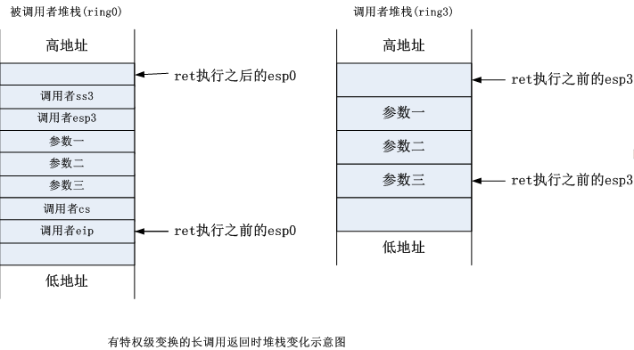
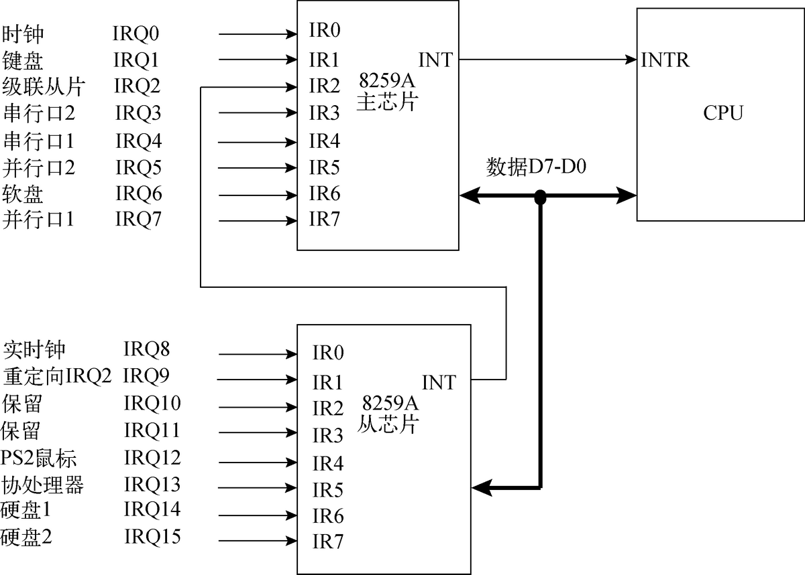

# 64位操作系统——（二）kernel


---

作者：王赛宇

参考列表：

- 主要参考：《一个六十四位操作系统的设计与实现》——田雨
- 《Using as》 ——Dean Elsner &  Jay Fenlason  & friends
- nasm 用戶手册
- [处理器startup.s 常见汇编指令...](https://blog.csdn.net/uunubt/article/details/84838260)

---


## 前情提要


在第一章节中，我们学习、研读了`bootloader`的代码，`bootloader`可以被分为两个过程：

- `boot`：计算机上电，自检完成后自动执行`0x7c00`处的`boot`程序，该程序被限制了大小`512KB`，所以它仅用于进行计算机磁盘设定以及加载、跳转到`loader`
- `loader`：从`boot`处跳转而来，进入`loader`时计算机仍处于`实模式`，尽可操作`1MB`内存，但我们进入了`Big Real Mode`让计算机能够操作`4GB`的内存，并通过这种方法将检索到的`kernel`程序放置在了内存的`1MB`处，并且通过两步(`实模式` -- `保护模式` -- `长模式`)的方法进入了长模式，在长模式下cpu可以操作非常大的内存(`16T`)，每一次切换模式，我们都使用一条`长跳转语句`来切换当前代码的运行状态，在跳转到长模式时，使用长跳转跳转到了`内核程序`所在的地址，到此为止我们完成了从`bootloader`模块到操作系统内核的切换，电脑的控制权交到了`操作系统内核`的手中。

在这一章中，我们将继续完成64位操作系统，值得一提的是，在上一章中，由于主要语言是汇编，我们（我太菜了dbq）只能以解读、copy为主，但是在这一章中，主要语言从汇编变成了C语言，我希望我们的主要任务从解读变为`理解 --> 复现`；下面，我们开始这一章的学习。


## 内核执行头程序`head.S`

我们还是需要写一小会汇编。

### 什么是内核执行头程序

我们知道，在`loader`的最后进行了一次长跳转，跳转到了`kernel.bin`的起始地址，这个起始地址实际上就是物理地址`0x100000`，内核头程序就是被装载到`0x100000`上的程序，它是内核程序的一部分，但内核执行头程序是一个汇编程序，它主要负责为操作系统创建段结构与页结构，设置某些结构的默认处理函数以及配置关键寄存器等工作。

接下来，还有一个非常重要的问题：**如何将内核执行头程序装载到我们想要的地址？**

这里我们需要自己去写一个链接脚本，在连接脚本中，会对不同程序的空间进行布局。这个链接脚本不是我们当前阶段需要关心的内容，我们直接使用作者提供的即可。但我们需要知道：

> 内核层的起始线性地址`0xffff800000000000`对应着物理地址`0`处，内核程序的起始线性地址位于`0xffff800000000000 + 0x100000`。


### 定义各种表以及段结构（数据段）

这里我们还是以解读为主了：

```gas
#//=======    GDT_Table

.section .data // 数据段

.globl GDT_Table // 声明全局符号，可以被其他程序调用

GDT_Table:
    // 一次写8个Byte
    .quad    0x0000000000000000    /*0 NULL descriptor 00*/
    .quad    0x0020980000000000    /*1 KERNEL Code 64-bit Segment 08*/
    .quad    0x0000920000000000    /*2 KERNEL Data 64-bit Segment 10*/
    .quad    0x0020f80000000000    /*3 USER    Code 64-bit Segment 18*/
    .quad    0x0000f20000000000    /*4 USER    Data 64-bit Segment 20*/
    .quad    0x00cf9a000000ffff    /*5 KERNEL Code 32-bit Segment 28*/
    .quad    0x00cf92000000ffff    /*6 KERNEL Data 32-bit Segment 30*/
    .fill    10,8,0                    /*8 ~ 9    TSS (jmp one segment <7>) in long-mode 128-bit 40*/
    // 重复十次，每次覆盖八个字节，每个位置都填充为0
GDT_END:

GDT_POINTER:
GDT_LIMIT:    .word    GDT_END - GDT_Table - 1
GDT_BASE:     .quad    GDT_Table

//=======     IDT_Table

.globl IDT_Table

IDT_Table:
    .fill 512,8,0
IDT_END:

IDT_POINTER:
IDT_LIMIT:    .word    IDT_END - IDT_Table - 1
IDT_BASE:     .quad    IDT_Table

//=======     TSS64_Table

.globl        TSS64_Table

TSS64_Table:
    .fill 13,8,0
TSS64_END:

TSS64_POINTER:
TSS64_LIMIT:    .word    TSS64_END - TSS64_Table - 1
TSS64_BASE:     .quad    TSS64_Table

```

在解读之前给大家推荐一个网站，大家可以使用这个网站来搜索相应的汇编关键词：https://sourceware.org/binutils/docs/as/，本文档中的汇编知识全部来自于这个网站（需要注意的是，我们这里不再使用上一章节的nasm了，使用的是GNU提供的汇编器`GAS`）

这里在做的事情还是和上一章最后在做的事情一样：定义了`GDT表`、`IDT表`、`TSS64`，这里的`TSS64`是任务状态段。他们都会被存储在内核程序的数据段中。


我们来熟悉一下里面的一些语句：

- `.section .data`：这个语句的前半部分`.section`表示把代码分成若干段，程序被加载时会加载到不同的地址，`.data`代表这部分代码书写的是程序的数据段，数据段是可读可写的。
- `.globl GDT_Table`：首先这个语句的`.globl`是一个声明，这个声明是告诉汇编器，后面的符号需要被连接器用到，所以要在目标文件的符号表中标记它是一个全局符号，这里是告诉连接器GDT_Table是一个全局符号，GDT_Table是一个标签，他的内容在下面进行了定义
- `.quad    0x0000000000000000`：`.quad`指令类似于上一章中的`db`指令，都是用于填充二进制的，但是`.quad`指令是用于填充一个`8 Byte`的二进制数字的，如果你仔细一数，就发现上面的十六进制数字由16个0构成，占空间`8 Byte`。
- `.fill   10,8,0`：这个`.fill`的标准用法如下`fill repeat, size, value`，这里就表示重复十次，每次写8个字节，填充的内容是0。
- `GDT_LIMIT:    .word    GDT_END - GDT_Table - 1`：这里的`.word`实际上和`.quad `是相似的，只不过它是存储了`4Byte`的数据。

这里出现的所有汇编语句我们都解释一遍了，大体上来说这里是一个数据段，定义了两个表个一个段，同时使用`.globl`使定义的数据段成为全局符号，可以被其他程序调用。


### 创建并初始化页表及页表项


```gas
//=======    init page
.align 8

.org    0x1000

__PML4E:
    .quad    0x102007
    .fill    255,8,0
    .quad    0x102007
    .fill    255,8,0

.org    0x2000

__PDPTE:
    .quad    0x103003
    .fill    511,8,0

.org    0x3000

__PDE:
    .quad    0x000083
    .quad    0x200083
    .quad    0x400083
    .quad    0x600083
    .quad    0x800083
    .quad    0xe0000083        /*0x a00000*/
    .quad    0xe0200083
    .quad    0xe0400083
    .quad    0xe0600083       /*0x1000000*/
    .quad    0xe0800083 
    .quad    0xe0a00083
    .quad    0xe0c00083
    .quad    0xe0e00083
    .fill    499,8,0


```


这段代码中有两个我们不大熟悉的地方：

- `.align 8`：这个地方代表我们将下一条语句进行对齐，对齐的单位是8，比如说这下语句本来会被放在结尾是5的内存中，那么加入这条语句后，就会将下条语句的地址进行对齐，对齐的方法是后移。官方给出的描述是：`'.align 8'将位置计数器递增到它的8的倍数。如果位置计数器已经是8的倍数，则无需更改。`

- `.org    0x3000`：`.org`表示当前节的位置计数器前进到给定的位置，如果这个位置有错，那么就忽略这条语句。官方的指南中有这样的描述：`.org`只能增加或不改变位置计数器；您不能使用`.org`将位置计数器向后移动。

  以本程序为例，这个`.org 0x3000`会试图将当前的代码放置在程序头部偏移`0x3000`的位置，那么程序头部的位置我们已经在最开始的时候说过了，就是：`0xffff800000000000 + 0x100000`，那么`__PDE`会被存放在线性地址为`0xffff800000000000 + 0x100000 + 0x3000`的位置，其他的也是同理。


这里定义的是页表相关的数据。此页表将线性地址0和`0xffff800000000000`映射为同一物理页以方便页表切换，即程序在配置页表前运行于线性地址`0x100000`附近，经过跳转后运行于线性地址`0xffff800000000000`附近。这里将前10 MB物理内存分别映射到线性地址`0`处和`0xffff800000000000`处，接着把物理地址`0xe0000000`开始的16 MB内存映射到线性地址`0xa00000`处和`0xffff800000a00000`处，最后使用伪指令`.fill`将数值0填充到页表的剩余499个页表项里。


### 再次进行IA-32e模式初始化

```gas
.section .text

.globl _start

_start:

    mov    $0x10,    %ax
    mov    %ax,      %ds
    mov    %ax,      %es
    mov    %ax,      %fs
    mov    %ax,      %ss
    mov    $0x7E00,  %esp

//=======    load GDTR

    lgdt    GDT_POINTER(%rip)

//=======  load      IDTR

    lidt   IDT_POINTER(%rip)

    mov    $0x10,    %ax
    mov    %ax,      %ds
    mov    %ax,      %es
    mov    %ax,      %fs
    mov    %ax,      %gs
    mov    %ax,      %ss

    movq   $0x7E00,    %rsp

//=======  load      cr3

    movq   $0x101000,   %rax
    movq   %rax,        %cr3
    movq   switch_seg(%rip),    %rax
    pushq  $0x08
    pushq  %rax
    lretq

//=======  64-bit mode code

switch_seg:
    .quad  entry64

entry64:
    movq   $0x10,    %rax
    movq   %rax,     %ds
    movq   %rax,     %es
    movq   %rax,     %gs
    movq   %rax,     %ss
    movq   $0xffff800000007E00,    %rsp        /* rsp address */

    movq   go_to_kernel(%rip),     %rax        /* movq address */
    pushq  $0x08
    pushq  %rax
    lretq

go_to_kernel:
    .quad    Start_Kernel
```


这里的流程和前面完全一致，我们主要来解读汇编代码：


- `.section .text`表示一个新的段，这个`.text`表示这里是代码段

- `_start`相当于c语言的`main`函数，他必须被声明为`globl`，程序从这里开始执行

- `mov    $0x10,    %ax`将立即数`0x10`赋值给寄存器`%ax`

- `mov    %ax,      %ds`将`%ax`寄存器中的值赋值给`%ds`

- `lgdt GDT_POINTER(%rip)`这里仍然是在装载GDT表，但是寻址方式有所变化：

  |                  | Intel汇编语言格式      | AT&T汇编语言格式     |
  | :--------------- | :--------------------- | :------------------- |
  | RIP-Relative寻址 | `[rip + displacement]` | `displacement(%rip)` |

- 函数跳转：这里作者用了一个非常有意思的方法，总体来说：作者伪造了函数调用的现场，假装自己被调用了，然后再假装自己调用结束，返回了。这样cpu就会进入我们刚才push到栈中的地址，或者说是“返回到”刚才push到栈中的地址。


做了这些讲解之后，这段代码就非常好懂了：

- 首先：初始化了一系列寄存器的值
- 第二步：读取了GDT、IDT表，更改了cr3
- 第三步：使用特殊的跳转方法跳转到了`entry 64`函数
- 第四步：在`entry 64`函数中，完成进入64位操作系统的操作后，跳转到`Start_Kernel`函数

由于这里没有定义`Start_Kernel`函数，所以是无法完成跳转的


### makefile

kernel的makefile，这个非常简单，我们就不多讲解了。

```gas
all: head.o

head.o: head.S
	gcc -E head.S > ./build/head.s
	as --64 -o ./build/head.o ./build/head.s

clean: 
	rm -rf ./build/*
```


对于主文件夹下的makefile这里我们用到了makefile中的for循环：

```makefile
BOOT_SRC_DIR=./src/boot
KERNEL_SRC_DIR=./src/kernel
SUBDIRS=$(BOOT_SRC_DIR) $(KERNEL_SRC_DIR)

define \n # 定义换行符，下面要用


endef
BOOT_BUILD_DIR=$(BOOT_SRC_DIR)/build
KERNEL_BUILD_DIR=$(KERNEL_SRC_DIR)/build
PROJECT_BUILD_DIR=./build

all: 
# 遍历每一个文件夹，进行编译
	$(foreach dir, $(SUBDIRS), cd $(dir) && $(MAKE) ${\n})


install: 
# 将boot的bin写入到引导扇区内 

	echo "特别声明：不要删除boot.img，如果删除了， 请到64位操作系统书中36页寻找复原方法"
	dd if=$(BOOT_BUILD_DIR)/boot.bin of=$(PROJECT_BUILD_DIR)/boot.img bs=512 count=1 conv=notrunc 
	sudo mount $(PROJECT_BUILD_DIR)/boot.img /media/ -t vfat -o loop
	sudo cp $(BOOT_BUILD_DIR)/loader.bin /media
	sudo cp $(BOOT_BUILD_DIR)/kernel.bin /media
	sync
	sudo umount /media/
	echo 挂载完成，请进入build文件夹后输入"bochs"以启动虚拟机

clean:
# 遍历每一个文件夹，进行删除
	$(foreach dir, $(SUBDIRS), cd $(dir) && $(MAKE) clean ${\n})

```

这里方法也很简单，就是遍历每一个`SUBDIRS`中的文件夹，进行make操作，操作完再回来，再进入下一个文件夹。

这里使用了`define `定义了换行符，然后使用`foreach`方法，对于每一个`$(SUBDIRS)`中的文件夹`dir`，我们输出的内容是：

```shell
cd $(dir) && $(MAKE) ${\n}
```

意思就是进入文件夹、执行make、输出换行，之所以输出换行，是因为makefile中的cd仅在当前行有效，也就是说，我们换行就相当于回到主文件夹下重新执行了，这样就可以完成循环进入所有子文件夹，执行make的操作。


## 内核主程序

简单回顾一下，我们在上个小节中完成了三个表的声明与数据填充，并且重新进行了`IA-32e`模式的初始化，在内核执行头程序的最后，跳转到了`Start_Kernel`函数，这个`Start_Kernel`函数就是这一节我们想要介绍的内核主程序的主体。一般情况下，它将负责调各个系统模块的初始化函数，在初始化结束后，他会创建出系统的第一个进程`init`，并且将控制权交给`init`进程。


当然了，在这一个小节中，我们只是写一个“假的”内核主程序，在之后的其他小节中，我们会继续完善它。这一节主要讲解怎么去编译、链接它。


### 写一个“假的”内核主程序


这个就很脑瘫了，我们只要写一个含有`Start_Kernel`函数的程序即可，这里是`main.c`：(终于见到亲切的高级语言了)

```C
// 内核主程序，执行完内核执行头程序后会跳转到Start_Kernel函数中
void Start_Kernel() {
	while(1){
        ;
    }
}
```

这里我们就让他原地空转（死循环），接下来我们讨论如何编译它的问题。


### 编译内核主程序

这里我们继续完善我们的`makefile`文件，在此之前我们来完整的看一下当前的文件夹结构（之前从来没介绍过，大家可能看我的makefile的时候会很懵逼）：

```
64BIT_OS 
├─ README.md : 项目描述文件
├─ build ：整个项目生成的可执行空间， 在这个文件夹下执行bochs就可以直接打开生成好的虚拟机
│  ├─ .bochsrc ：虚拟机的描述文件
│  └─ boot.img ：虚拟机的镜像文件
├─ docs ：这个文档所在的文件夹，用于存储文档以及文档中用到的图片
├─ makefile ： 整个项目的make脚本
└─ src ：源码目录
   ├─ boot：bootloader模块
   │  ├─ boot.asm ：boot
   │  ├─ build ：bootloader模块编译生成的文件都存储在这里
   │  ├─ fat12.inc ：被%include的东西
   │  ├─ loader.asm ：loader
   │  └─ makefile ：bootloader模块的makefile文件，该脚本生成的文件都放在boot\biuild文件夹下
   └─ kernel：内核模块
      ├─ build ：kernel模块编译生成的文件都存储在这里
      ├─ head.S
      ├─ main.c
      └─ makefile ： 内核的make脚本
```


这里我们继续完善的是`kernel/makefile`。在自己写之前，我们先来了解一下一个编译器在编译一个文件的时候执行的操作，为了完整的演示整个过程，我们再写一套专门用来演示的程序：（当然，你可以不看着一部分，这一部分只是为了让你深刻理解gcc编译器在编译一段程序的完整过程中会干些什么）

#### 演示程序

`temp.h`

```c
int a = 1;
int b = 2;
int c = 3;

```

`temp.c`

```C


#include "temp.h"


int main() {
        a = b + 1;
}
```


这里我们使用`gcc temp.c`就会生成一个可执行文件`a.out`，执行`a.out`时什么都不会输出，因为我们没有让这个程序输出。


#### 编译过程

- 预编译：我们在控制台执行指令`gcc -E temp.c -o temp.i`表示执行预编译，并且指定输出文件为`temp.i`，完成后打开`temp.i`查看：

  ```C
  # 1 "temp.c"
  # 1 "<built-in>"
  # 1 "<command-line>"
  # 1 "/usr/include/stdc-predef.h" 1 3 4
  # 1 "<command-line>" 2
  # 1 "temp.c"
  
  
  
  
  
  # 1 "temp.h" 1
  int a = 1;
  int b = 2;
  int c = 3;
  # 7 "temp.c" 2
  
  
  int main() {
   a = b + 1;
  }
  
  ```

  可以看到，这里生成了一个文件，这个文件的实质就是把`temp.h`中的内容复制了进来。

- 汇编：继续执行`gcc -S temp.i -o temp.s`：

  ```gas
          .file   "temp.c"
          .text
          .globl  a
          .data
          .align 4
          .type   a, @object
          .size   a, 4
  a:
          .long   1
          .globl  b
          .align 4
          .type   b, @object
          .size   b, 4
  b:
          .long   2
          .globl  c
          .align 4
          .type   c, @object
          .size   c, 4
  c:
          .long   3
          .text
          .globl  main
                            
  main:
  .LFB0:
          .cfi_startproc
          endbr64
          pushq   %rbp
          .cfi_def_cfa_offset 16
          .cfi_offset 6, -16
          movq    %rsp, %rbp
          .cfi_def_cfa_register 6
          movl    b(%rip), %eax
          addl    $1, %eax
          movl    %eax, a(%rip)
          movl    $0, %eax
          popq    %rbp
          .cfi_def_cfa 7, 8
          ret
          .cfi_endproc
  .LFE0:
          .size   main, .-main
          .ident  "GCC: (Ubuntu 9.3.0-17ubuntu1~20.04) 9.3.0"
          .section        .note.GNU-stack,"",@progbits
          .section        .note.gnu.property,"a"
          .align 8
          .long    1f - 0f
          .long    4f - 1f
          .long    5
  0:
          .string  "GNU"
  1:
          .align 8
          .long    0xc0000002
          .long    3f - 2f
  2:
          .long    0x3
  3:
          .align 8
  4:
  
  ```

  这里生成了我们非常眼熟的`gas`汇编语言。

- 生成编译好但没有连接的文件：`gcc - c temp.s -o temp.o`

  这里生成的是一个二进制文件，打开它来看没啥意义

- 链接：`gcc temp.o -o temp`：

  ```shell
  $ ./temp
  
  ```

  当然，执行他还是啥都不会发生，但是能够执行

到此为止，我们就把整个流程走了一遍了，相信大家都大致理解了编译的过程。


#### 应用到项目中

回想一下我们要做的事情：先编译`main.c`，然后再让他按照我们的想法链接，于是我们就要先编译一下`main.c`，即在`makefile`中添加：

```makefile
main.o: main.c
# 编译main.c内核主程序
	gcc -mcmodel=large -fno-builtin -m64 -c main.c -o ./build/main.o
```

接下来我们指定链接脚本，并且进行链接：

```makefile
system: head.o main.o
	ld -b elf64-x86-64 -o ./build/system ./build/head.o ./build/main.o -T Kernel.lds
```

这句的意思就是链接`head.o\main.o`两个文件，指定输入的文件类型是`efl64-x86-64`，并且指定了链接脚本是`Kernel.lds`。

我们这里也新建一个链接脚本：

```shell
OUTPUT_FORMAT("elf64-x86-64","elf64-x86-64","elf64-x86-64")
OUTPUT_ARCH(i386:x86-64)
ENTRY(_start)
SECTIONS
{

        . = 0xffff800000000000 + 0x100000;
        .text :
        {
                _text = .;
                *(.text)

                _etext = .;
        }
        . = ALIGN(8);
        .data :
        {
                _data = .;
                *(.data)

                _edata = .;
        }
        .bss :
        {
                _bss = .;
                *(.bss)
                _ebss = .;
        }

        _end = .;
}
```

这段脚本非常简单：

- `OUTPUT_FORMAT`：指定输出的文件类型（和输入一样）
- `OUTPUT_ARCH`：指定输出的体系结构
- `ENTRY`：指定程序的入口（开始执行的地方）
- `SECTIONS`：指定了程序被加载到哪里，每个段的相对关系以及对齐位置


相应的，`all`也不再依赖`head.o/main.o`了，而是转而依赖`system`即可，之后还需要添加：

```makefile
all: system
# 生成kernel.bin
	objcopy -I elf64-x86-64 -S -R ".eh_frame" -R ".comment" -O binary ./build/system ./build/kernel.bin
```

这里使用了`objcopy`生成了`kernel.bin`，这里我们就生成了`真·内核`，所以我们就把上一章中的假内核删掉就可以了。我们要做出于以下改变：

- 将boot文件夹下的makefile中生成kernel.bin的语句和依赖删除（自己删，或者看我的源码，这里就不啰嗦了，非常简单）

- 更改主文件夹下拷贝`kernel.bin`的语句（说白了就是把copy的源改一下就可以了）：

  ```makefile
  sudo cp $(KERNEL_BUILD_DIR)/kernel.bin /media
  ```

  

#### 简单验证

我们要验证一下到此为止是否正确执行，这里我们使用反汇编指令：

```shell
objdump -D system
```

找到`Start Kernel`部分

```gas
ffff80000010400c:       48 8d 05 f5 ff ff ff    lea    -0xb(%rip),%rax        # ffff800000104008 <Start_Kernel+0x8>
ffff800000104013:       49 bb 68 11 00 00 00    movabs $0x1168,%r11
ffff80000010401a:       00 00 00 
ffff80000010401d:       4c 01 d8                add    %r11,%rax
ffff800000104020:       eb fe                   jmp    ffff800000104020 <Start_Kernel+0x20>
```

这里就标记出了while语句的线性地址`ffff800000104020`

```shell
^C00156063365i[      ] Ctrl-C detected in signal handler.
Next at t=156063366
(0) [0x000000104020] 0008:ffff800000104020 (unk. ctxt): jmp .-2 (0xffff800000104020) ; ebfe
<bochs:2> r
CPU0:
rax: ffff8000_00105170 rcx: 00000000_c0000080
rdx: 00000000_00000000 rbx: 00000000_00000000
rsp: ffff8000_00007df8 rbp: ffff8000_00007df8
rsi: 00000000_00008098 rdi: 00000000_0000bd00
r8 : 00000000_00000000 r9 : 00000000_00000000
r10: 00000000_00000000 r11: 00000000_00001168
r12: 00000000_00000000 r13: 00000000_00000000
r14: 00000000_00000000 r15: 00000000_00000000
rip: ffff8000_00104020
eflags 0x00000092: id vip vif ac vm rf nt IOPL=0 of df if tf SF zf AF pf cf
```

RIP寄存器存放着当前指令的地址，这里指示的正是当前的跳转指令，也就是说程序已经进入了死循环，验证结果为正确。

### clion

接下来我们的项目会用clion来接管，主要原因是：好看，提示比较全，当然，由于我的git配置的原因（我故意的），大家克隆下来的项目不会有任何迹象，这里我就简单介绍一下主要的方法，这里我是用的脚本来做的一键执行，因为我们的代码中需要赋权，赋权需要密码，所以我就没把握的脚本放到github上面，这里我就把我的脚本分享一下：

```shell
#!/usr/bin/env zsh
make clean
make
echo [passowrd] | sudo -S make install
make clean

cd build
bochs
```

在clion配置中，配置`run.sh`作为项目运行的脚本即可。上面的password直接填写自己的密码即可。


## 屏幕显示

之前在`loader`中，我们已经设置了显示模式：`模式号：0x180、分辨率：1440×900、颜色深度：32 bit`。我们在屏幕上显示东西的原理就是：将现实的画面存储到内存中的`帧缓存`区域中，`帧缓存`中的每一个存储单元对应着屏幕上的一个像素点。帧缓存的起始地址是：`0xe0000000`，我们之前在定义页表的过程中，已经进行了两组映射：

- `0xe0000000` 到 `0xffff800000a00000`
- `0xe0000000` 到 `0xa00000`


### 在屏幕上显示色彩


#### 屏幕布局（画布）

首先，我们需要了解屏幕的布局：


我们的坐标系是从左上角为原点的。


#### 单点像素构成

我们刚才说了，这个用的是`32bit`的颜色，这个描述方式只有前`24`位是有效位，他们分别表示`rgb`的值（其实就是标准的rgb描述）。

```C
#define COLOR_OUTPUT_ADDR (int *)0xffff800000a00000
#define LINE_SIZE 1440


// 画点的方法，给出坐标与颜色，将其覆盖
void plot_color_point(int x, int y, char r, char g, char b);

// 内核主程序，执行完内核执行头程序后会跳转到Start_Kernel函数中
void Start_Kernel() {
    int *addr = (int *)0xffff800000a00000;
    int row, col;
    // 根据行列进行绘图，先画20行红色
    for(row = 0; row < 20; row++){
        for(col = 0; col < LINE_SIZE; col++){
            plot_color_point(row, col, 0xff, 0x00, 0x00);
        }
    }

    for(row = 20; row < 60; row++){
        for(col = 0; col < LINE_SIZE; col++){
            plot_color_point(row, col, 0x00, 0xff, 0x00);
        }
    }

    for(row = 60; row < 140; row++){
        for(col = 0; col < LINE_SIZE; col++){
            plot_color_point(row, col, 0x00, 0x00, 0xff);
        }
    }

    for(row = 140; row < 300; row++){
        for(col = 0; col < LINE_SIZE; col++){
            plot_color_point(row, col, 0xff, 0xff, 0xff);
        }
    }

	while(1){
        ;
    }
}

/**
 * 在屏幕上画一个点
 * @author wangsaiyu@cqu.edu.cn
 * @param x 在第x行上面画点
 * @param y 在第y列上面画点
 * @param r 点的红色色彩值
 * @param g 点的绿色色彩值
 * @param b 点的蓝色色彩值
 */
void plot_color_point(int x,int y, char r, char g, char b){

    int* addr = COLOR_OUTPUT_ADDR + x * LINE_SIZE +y;

    *((char *)addr+0)=r;
    *((char *)addr+1)=g;
    *((char *)addr+2)=b;
    *((char *)addr+3)=(char)0x00;
}
```


我们将在屏幕上画一个点的方法进行封装，我们只需要给出需要绘画的点的横纵坐标以及rgb值即可进行绘图。绘图的方法也非常简单且暴力，就是直接覆盖对应的内存区域。在主程序中，我们多次调用这个方法进行绘图，绘出了四个不同颜色的矩形，效果如下：


## 显示字符串

在这一小节中，我们来实现向屏幕输出单个字符以及如何向屏幕输出一个字符串。我们的目标是实现一个`printk`函数，能够向屏幕输出一个字符串。


### 一个字符如何组成

我们都知道，电脑上看到的画面是由一个一个像素点组成的，同理，我们看到的字符也是由很多的像素点组成的，在我们的系统中，一个字符占`16行8列`的空间，如下：


我们使用一个数组来记录每个字符的方块的内容：

```C
unsigned char font_ascii[256][16]=
{
    ……
    /*    0040    */
    {0x02,0x04,0x08,0x08,0x10,0x10,0x10,0x10,0x10,0x10,0x10,0x08,0x08,0x04,0x02, 0x00}, // '('
    {0x80,0x40,0x20,0x20,0x10,0x10,0x10,0x10,0x10,0x10,0x10,0x20,0x20,0x40,0x80, 0x00}, // ')'
    {0x00,0x00,0x00,0x00,0x00,0x10,0x92,0x54,0x38,0x54,0x92,0x10,0x00,0x00,0x00, 0x00}, // '*'
    {0x00,0x00,0x00,0x00,0x00,0x10,0x10,0x10,0xfe,0x10,0x10,0x10,0x00,0x00,0x00, 0x00}, // '+'
    {0x00,0x00,0x00,0x00,0x00,0x00,0x00,0x00,0x00,0x00,0x00,0x18,0x18,0x08,0x08, 0x10}, // ','
    {0x00,0x00,0x00,0x00,0x00,0x00,0x00,0x00,0xfe,0x00,0x00,0x00,0x00,0x00,0x00, 0x00}, // '-'
    {0x00,0x00,0x00,0x00,0x00,0x00,0x00,0x00,0x00,0x00,0x00,0x00,0x18,0x18,0x00, 0x00}, // '.'
    {0x02,0x02,0x04,0x04,0x08,0x08,0x08,0x10,0x10,0x20,0x20,0x40,0x40,0x40,0x80, 0x80}, // '/'
    {0x00,0x18,0x24,0x24,0x42,0x42,0x42,0x42,0x42,0x42,0x42,0x24,0x24,0x18,0x00, 0x00}, //48    '0'
    {0x00,0x08,0x18,0x28,0x08,0x08,0x08,0x08,0x08,0x08,0x08,0x08,0x08,0x3e,0x00, 0x00}, // '1'
    ……
};
```

这里是这个数组的局部，这是一个二维数组，他的size是`[256][16]`，`font_ascii[3]`就代表`ASCII`码为3的字符的方块内容，其中一个数字代表一列，该数字的每一位代表一个像素是否进行填充。


### 如何移动光标并且打印文字

在上一段中，我们讲了单个字符是如何构成的，有了这个基础，就可以来学习怎么移动光标，并且打印单个文字了。


#### 使用一个结构体来描述这些功能

在输出字符串的时候，需要对屏幕进行操作（实际上就是对用于显示的缓冲区进行操作），那么这个时候我们就想到了去建立一个"类"来描述这个过程，我们来看一下这个`cursor类`需要描述哪些东西：

- 屏幕的大小
- 光标的位置
- 每个字符所占的方块的尺寸
- 操作的缓冲区的起始地址以及长度

上面列出来的就是我们的缓冲区需要描述的属性，那么下一个问题，我们的光标在当前阶段需要进行哪些操作：

- 向后移动一位
- 模拟制表符操作
- 模拟回退操作
- 模拟换行操作
- 清空屏幕
- 输出一个字符

这是我所想到的，我们的缓冲区需要进行的操作，经过上面的思考后，我们的"类"就有了一个雏形（当然了，C语言没法面向对象，所以我们只能用变量+函数的形式来爽一下了）：（这里我构建了一个程序`position.h`来描述相关的信息）


```C

#ifndef __POSITION_H__
#define __POSITION_H__


struct position
{
    int XResolution; // 屏幕行数
    int YResolution; // 屏幕列数

    int XPosition; // 当前光标左上角所在位置
    int YPosition; // 当前光标右上角所在位置

    int XCharSize; // 每个字符所占位置的行数
    int YCharSize; // 每个字符所占位置的列数

    unsigned int * FB_addr; // 显示缓冲区的首地址
    unsigned long FB_length; // 显示缓冲区的长度
}Pos;

// 函数，给出一个描述屏幕的结构体，将光标后移一位
void doNext(struct position * curPos);

// 函数，给出一个描述屏幕的结构体，在当前位置模拟换行操作
void doEnter(struct position * curPos);

// 函数，给出一个描述屏幕的结构体，在当前位置模拟Backspace退格操作
void doBackspace(struct position * curPos);

// 函数，给出一个描述屏幕的结构体，在当前位置模拟Tab制表符操作（制表符大小为8个空格）
void doTab(struct position * curPos);

// 函数，给出一个描述屏幕的结构体，清空屏幕上所有的东西，并且将光标置为(0, 0)
void doClear(struct position * curPos);

// 函数，给出一个描述屏幕的结构体，以及想要在当前位置输出的文字的背景颜色、文字颜色、文字格式在当前位置进行输出
void doPrint(struct position * curPos,const int backColor, const int fontColor, const char* charFormat);


#endif
```

#### 各种方法的实现


接下来我们在`position.c`中，实现这些功能即可：

```C
#include "position.h"

// 实现position中的一些函数
char* defaultFill = "                                                                ";

/**
 * 给出当前的位置结构体，将光标移动到下一区域
 * @param curPos 一个指针，指向被操作的位置结构体
 */ 
void doNext(struct position* curPos){
    curPos->YPosition = curPos->YPosition + curPos->YCharSize;
    if(curPos->YPosition >= curPos->YResolution) doEnter(curPos); // 试探，如果错误，就直接重置
}

/**
 * 给出当前的位置结构体，模拟回车时的操作
 * @param curPos 一个指针，指向被操作的位置结构体
 */ 
void doEnter(struct position * curPos){
    curPos->YPosition = 0;
    curPos->XPosition = curPos->XPosition + curPos->XCharSize; // 平移
    if(curPos->XPosition >= curPos->XResolution) doClear(curPos); // 试探，如果错误，就直接重置
}

/**
 * 给出当前的位置结构体，将光标置为(0, 0)[暂时不实现清空屏幕的功能]
 * @param curPos 一个指针，指向被操作的位置结构体
 */ 
void doClear(struct position * curPos){
    curPos->XPosition = 0;
    curPos->YPosition = 0;
}

/**
 * 给出当前的位置结构体，以及想要在当前位置输出的文字的背景颜色、文字颜色、文字格式在当前位置进行输出
 * @param curPos 一个指针，指向被操作的位置结构体
 * @param backColor 背景颜色
 * @param fontColor 字体颜色
 * @param charFormat  字体样式会根据字体样式进行颜色填充
 */ 
void doPrint(struct position * curPos,const int backColor, const int fontColor, const char* charFormat){
    int row, col;

    // 遍历每一个像素块，进行输出
   for(row = curPos->XPosition; row < curPos->XPosition + curPos->XCharSize; row ++){
        for(col = curPos->YPosition; col < curPos->YPosition + curPos->YCharSize; col ++){
            int* pltAddr = curPos->FB_addr + curPos->YResolution * row + col; // 当前方块需要覆盖像素块的缓冲区地址
            int groupId =  row - curPos->XPosition; //  算出来在第几个char中
            int memberNum = col - curPos->YPosition; // 算出来在该char中是第几位
            char isFont = charFormat[groupId] & (1 << (curPos->YCharSize - memberNum)); // 判断该位是否为1

            (*pltAddr) = isFont ? fontColor : backColor; 
        }
    }
    
    
}

/**
 * 给出当前的位置结构体，在当前位置模拟退格键[退格键不会将回车删除（也就是说，无论怎么退格，Y值都不会变）]
 * @param curPos 一个指针，指向被操作的位置结构体
 */ 
void doBackspace(struct position* curPos){
    // 先在当前位置画一个空格（把之前的字符覆盖掉） 画的时候背景是黑色
    doPrint(curPos, 0x00000000, 0x00000000, defaultFill);

    // 如果不是行的第一个，那么就减一个空位
    curPos->YPosition = (curPos->YPosition - curPos->YCharSize <= 0) ? 0 : 
                        curPos->YPosition - curPos->YCharSize; 
}

/**
 * 给出当前的位置结构体，在当前位置模拟输入一次制表符
 * 这里无论如何都要做一次，然后直到对齐4位为止
 * @param curPos 一个指针，指向被操作的位置结构体
 */ 
void doTab(struct position * curPos){
    do{
        doNext(curPos);
    } while(((curPos->YPosition / curPos->YCharSize) & 4) == 0);
}
```


这里按照惯例，来讲解一下代码，我终于摆脱了copy作者代码的阴影，开始自己创作了，下面我们来简单的讲一下这些函数：

- `doNext`：将位置向后移动一个方格，如果当前位置已经是行末，那么就调用`doEnter()`

- `doEnter`：将位置移动到下一行的行初，如果移动后超出了屏幕，就调用`doClear`

- `doClear`：将位置移动到左上角（暂时没有让他带有清空屏幕的功能）

- `doPrint`：输出一个字符，在执行这个函数的过程中，有几个需要讲解的点：

  - `int* pltAddr = curPos->FB_addr + curPos->YResolution * row + col;`：计算我们要覆盖的屏幕显示缓冲区内存地址。

  - `charFormat[groupId] & (1 << (curPos->YCharSize - memberNum))`：作者给出的字符表是反着的，他实际的作用如下：

     

    实际上就是对比当前位是否为0。

- `doBackspace`将当前的位置用黑色覆盖，然后将位置向前移动一个即可。

- `doTab`：无论何时使用`TAB`的时候，都会向后至少移动一格，基于这个理论，我们使用一个`do-while()`就可以非常容易解决了。后面写的判断，就是一个简易的膜4，对于CPU来说，按位与运算只需要一个时钟周期即可完成，而取余数运算是基于除法运算的，对于64位的cpu而言，最简单的除法操作需要64个时钟周期，就算用华莱士数+both来做优化，也需要让流水线停止等待很久，所以说，对于`2^n`形式的数字进行取余数，可以使用按位与的方式来判断其是否为0，这样可以极大地加快其运算速度。


#### 对实现结果的验证

我们想要输出字符串，就直接连续调用这个函数即可

我们在main函数中，实例化一个结构体，并且调用一些打印的方法来验证一下我们的程序是否正确：

```C
// 初始化屏幕
struct position* myPos = &(struct position){
    SCREEN_ROW_LEN, SCREEN_COL_LEN,  // 屏幕行列
    0, 0, // 当前光标位置
    CHAR_ROW_LEN, CHAR_COL_LEN, // 字符行列
    COLOR_OUTPUT_ADDR, sizeof(int) * SCREEN_COL_LEN * SCREEN_ROW_LEN
};

doClear(myPos);

int curChar; 
for(curChar = 40; curChar < 130; curChar ++){ // 输出给出的表格中的每一个字符
    doPrint(myPos, 0xffffff00, 0x00000000, font_ascii[curChar]);
    doNext(myPos);
    if(curChar % 10 == 0) {
        if(curChar % 20 == 0) doBackspace(myPos);
        doEnter(myPos);
        if(curChar % 30 == 0) doTab(myPos);
    }
}
```

每输出10个字符输出一个换行符，每输出20个字符输出一个退格，每输出30个输出一个TAB，执行结果如下，完全无误：


### 输出带有格式化信息的字符串


- 首先，我们需要来复现一下使用场景，这里使用我们常用的`printf`函数来做类比：

  ```c
  printf("numa:%d\n", numa);
  ```

  我们来解读一下这个句子，首先，这个句子包括两个大的部分，前面是一个字符串，他表示我们最终需要输出的字符串，在这个字符串中，可能会有一些**占位符**，具体来说，这些占位符可能是基础的：`%d, %s, %c`等等，也有可能是`%06d`这种的，当然，除此之外，这个字符串中可能还有一些较为特殊的字符，比如：`\n, \t, \b`这三个，他们分别表示回车、制表符、回退，这三个都无法直接输出，所以我们需要进行特殊的判断。

  综上所述，我们这个输出一行字的函数可以被拆分为两个阶段：

  - **预处理**：给出一个格式字符串如`"numa:%d\n"`以及跟随的参数`numa`（这个参数的数量未知），对字符串进行解析，得到一个能够直接进行输出的字符串（相当于直接把后面的参数融合到字符串中）。
  - **输出**：读取预处理完毕的字符串，逐个字符进行输出，输出到屏幕上，这里的输出非常简单，只需要调用上面封装好的操作即可


#### 格式化字符串处理

这里就属于`dirty work`了，我直接就是一手copy（这里主要在做的工作就是解析字符串，然后来区分其中的`%d,%.3f,%*d,`这种的，然后再用后面的参数填充，这里我就不讲了，直接把作者的代码贴过来就可以了），当然，贴过来之前，我还是改了一下的，因为还需要适配我们写的显示模块：

```C
#include <stdarg.h>
#include "printk.h"
#include "lib.h"
#include "linkage.h"
#include "position.h"

extern inline int strlen(char* String);

/**
 * 给出一段字符串，将字符串转换为数字
 * @param s 输入的字符串
 * @return 返回的数字， 整数类型
 */
int skip_atoi(const char **s)
{
	int i=0;

	while (is_digit(**s))
		i = i*10 + *((*s)++) - '0';
	return i;
}

/**
 * 根据给出的参数，格式化输出一个数字
 * @param str
 * @param num
 * @param base
 * @param size
 * @param precision
 * @param type
 * @return 一个字符串，格式化完成后的该数字
 */
static char * number(char * str, long num, int base, int size, int precision,	int type)
{
	char c,sign,tmp[50];
	const char *digits = "0123456789ABCDEFGHIJKLMNOPQRSTUVWXYZ";
	int i;

	if (type&SMALL) digits = "0123456789abcdefghijklmnopqrstuvwxyz";
	if (type&LEFT) type &= ~ZEROPAD;
	if (base < 2 || base > 36)
		return 0;
	c = (type & ZEROPAD) ? '0' : ' ' ;
	sign = 0;
	if (type&SIGN && num < 0) {
		sign='-';
		num = -num;
	} else
		sign=(type & PLUS) ? '+' : ((type & SPACE) ? ' ' : 0);
	if (sign) size--;
	if (type & SPECIAL)
		if (base == 16) size -= 2;
		else if (base == 8) size--;
	i = 0;
	if (num == 0)
		tmp[i++]='0';
	else while (num!=0)
		tmp[i++]=digits[do_div(num,base)];
	if (i > precision) precision=i;
	size -= precision;
	if (!(type & (ZEROPAD + LEFT)))
		while(size-- > 0)
			*str++ = ' ';
	if (sign)
		*str++ = sign;
	if (type & SPECIAL)
		if (base == 8)
			*str++ = '0';
		else if (base==16) 
		{
			*str++ = '0';
			*str++ = digits[33];
		}
	if (!(type & LEFT))
		while(size-- > 0)
			*str++ = c;

	while(i < precision--)
		*str++ = '0';
	while(i-- > 0)
		*str++ = tmp[i];
	while(size-- > 0)
		*str++ = ' ';
	return str;
}


/**
 * 对给出的字符串进行初始化（识别占位符并且根据需求进行填入）
 * @param buf 格式化后的字符串将返回到buf数组中
 * @param fmt 一个字符串，表示需要进行格式化的字符串如："numa : %06d !\n"
 * @param args 用户输入的参数，用于对前面的字符串进行填充
 * @return 格式化后字符串的结束位置
 */
int vsprintf(char * buf,const char *fmt, va_list args)
{
	char * str,*s;
	int flags;
	int field_width;
	int precision;
	int len,i;

	int qualifier;		/* 'h', 'l', 'L' or 'Z' for integer fields */

	for(str = buf; *fmt; fmt++)
	{

		if(*fmt != '%')
		{
			*str++ = *fmt;
			continue;
		}
		flags = 0;
		repeat:
			fmt++;
			switch(*fmt)
			{
				case '-':flags |= LEFT;	
				goto repeat;
				case '+':flags |= PLUS;	
				goto repeat;
				case ' ':flags |= SPACE;	
				goto repeat;
				case '#':flags |= SPECIAL;	
				goto repeat;
				case '0':flags |= ZEROPAD;	
				goto repeat;
			}

			/* get field width */

			field_width = -1;
			if(is_digit(*fmt))
				field_width = skip_atoi(&fmt);
			else if(*fmt == '*')
			{
				fmt++;
				field_width = va_arg(args, int);
				if(field_width < 0)
				{
					field_width = -field_width;
					flags |= LEFT;
				}
			}
			
			/* get the precision */

			precision = -1;
			if(*fmt == '.')
			{
				fmt++;
				if(is_digit(*fmt))
					precision = skip_atoi(&fmt);
				else if(*fmt == '*')
				{	
					fmt++;
					precision = va_arg(args, int);
				}
				if(precision < 0)
					precision = 0;
			}
			
			qualifier = -1;
			if(*fmt == 'h' || *fmt == 'l' || *fmt == 'L' || *fmt == 'Z')
			{	
				qualifier = *fmt;
				fmt++;
			}
							
			switch(*fmt)
			{
				case 'c':

					if(!(flags & LEFT))
						while(--field_width > 0)
							*str++ = ' ';
					*str++ = (unsigned char)va_arg(args, int);
					while(--field_width > 0)
						*str++ = ' ';
					break;

				case 's':
				
					s = va_arg(args,char *);
					if(!s)
						s = '\0';
					len = strlen(s);
					if(precision < 0)
						precision = len;
					else if(len > precision)
						len = precision;
					
					if(!(flags & LEFT))
						while(len < field_width--)
							*str++ = ' ';
					for(i = 0;i < len ;i++)
						*str++ = *s++;
					while(len < field_width--)
						*str++ = ' ';
					break;

				case 'o':
					
					if(qualifier == 'l')
						str = number(str,va_arg(args,unsigned long),8,field_width,precision,flags);
					else
						str = number(str,va_arg(args,unsigned int),8,field_width,precision,flags);
					break;

				case 'p':

					if(field_width == -1)
					{
						field_width = 2 * sizeof(void *);
						flags |= ZEROPAD;
					}

					str = number(str,(unsigned long)va_arg(args,void *),16,field_width,precision,flags);
					break;

				case 'x':

					flags |= SMALL;

				case 'X':

					if(qualifier == 'l')
						str = number(str,va_arg(args,unsigned long),16,field_width,precision,flags);
					else
						str = number(str,va_arg(args,unsigned int),16,field_width,precision,flags);
					break;

				case 'd':
				case 'i':

					flags |= SIGN;
				case 'u':

					if(qualifier == 'l')
						str = number(str,va_arg(args,unsigned long),10,field_width,precision,flags);
					else
						str = number(str,va_arg(args,unsigned int),10,field_width,precision,flags);
					break;

				case 'n':
					
					if(qualifier == 'l')
					{
						long *ip = va_arg(args,long *);
						*ip = (str - buf);
					}
					else
					{
						int *ip = va_arg(args,int *);
						*ip = (str - buf);
					}
					break;

				case '%':
					
					*str++ = '%';
					break;

				default:

					*str++ = '%';	
					if(*fmt)
						*str++ = *fmt;
					else
						fmt--;
					break;
			}

	}
	*str = '\0';
	return str - buf;
}

char buf[500];

/**
 * 给出颜色与需要输出的东西，进行输出
 * @param FRcolor 一个整形数字，表示想要输出的字体颜色
 * @param BKcolor 一个整形数字，表示想要输出的背景颜色
 * @param fmt 一个字符串，表示用户输出的字符串
 * @param ... 可变长的参数列表，表示想要填充到字符串中的参数
 */
int color_printk(unsigned int FRcolor,unsigned int BKcolor,const char * fmt,...)
{
	int i = 0;
	int count = 0;
	int line = 0;
	va_list args;
	va_start(args, fmt);

	i = vsprintf(buf,fmt, args);

	va_end(args);

	for(count = 0;count < i;count++)
	{
		if(buf[count] == '\n') doEnter(&globalPosition);
		else if(buf[count] == '\b') doBackspace(&globalPosition);
		else if(buf[count] == '\t') doTab(&globalPosition);
		else doPrint(&globalPosition, BKcolor, FRcolor, font_ascii[buf[count]]);
        doNext(&globalPosition);
	}
	return i;
}

```


我们调用这个`color_printk`：

```C
doEnter(&globalPosition);
color_printk(YELLOW,BLACK,"Hello World!");
doEnter(&globalPosition);
```

效果如下：


#### 关键点1：多文件共享全局变量（讲给和我一样没学好C语言的人）

作者给出的文件的写法上存在一些错误（或者说是不规范的地方），比如我们在多个地方`#include"font.h"`之后，就会有`multiple define`的错误，经过上面的讲解，相信大家也能分析出来出现这样错误的原因：

- 文件A调用了`font.h`
- 文件B也调用了`font.h`
- 预编译、汇编、二进制 文件A，在这个过程中，没有任何错误，并且预编译文件A时已经复制了`font.h`中的内容
- 同理，预编译B的时候也复制了`font.h`中的内容
- 最后一步：链接，这个时候就不对了，A/B都定义了`font_ascii`这个字符数组，那怎么办呢？报错吧

好了，这样就启示我们，不要在`.h`文件中定义数据。那问题就来了，不在`.h`中定义，怎么做到`#include`后开箱即用呢？其实也很简单，我们需要在一个`.c`文件中定义想要全局使用的变量（如`font_ascii`），然后再在`.h`文件中使用关键字`extern `引入该变量即可，我们来看一下在这个项目中，是如何使用这个方法的：

`font.c`

```C
unsigned char font_ascii[256][16] = ......; // 定义数据
```

`font.h`

```C
#ifndef __FONT_H__
#define __FONT_H__

extern unsigned char font_ascii[256][16];

#endif
```

其实如果用户`#include"font.h"`，实际上就是使用了关键词`extern unsigned char font_ascii[256][16];`，来声明要使用这个全局变量。编译的时候，实际上编译器通过`extern`关键词知道我们要使用 `font_ascii`这个字符数组，但是实际上编译器是不知道`font_ascii`在哪里的。但是到了链接的时候，由于我们把`font.c`这个文件一起加进来编译了，所以程序执行的时候能够知道`font_ascii`的值。


#### 关键点2：可变长参数

作者的程序中，`#include <stdarg.h>`是引入了一个库，这个库的主要作用是：他可以让函数能够接收未知数量的变量，那么什么是未知数量的变量呢？

```C
printf("%d,%d,%c\n", numa, numb, charc);
```

我们来分析一下`printf`这个函数的构成：首先是一个字符串`"%d,%d,%c\n"`，然后后面会根据字符串中的占位符的数量跟上很多变量，也就是说：在写程序的时候不知道后面会跟多少参数，那么就可用这个库来解决这个问题，在这个程序中我们将`color_printk`声明成下面的样子：

```C
int color_printk(unsigned int FRcolor,unsigned int BKcolor,const char * fmt,...)
```

这里的`fmt`就相当于`printf`中的字符串，后面的`...`就是未知的参数了，我们来看下如何使用这个库：

- `va_list args;`:创建一个 **va_list** 类型变量
- `va_start(args, fmt)`：给出上一个参数的位置，将args指向第一个可变参数
- `va_arg(args, int)`：取出下一个`int`类型的参数
- `va_end(vl);`：结束标志

##### 可变长参数的原理

这里我们还是来阅读下源码：

```C++
#define va_start(AP, LASTARG)                         \
 (AP = ((char *) &(LASTARG) + __va_rounded_size (LASTARG)))//ap指向下一个参数，lastarg不变
```

这个地方，我们给出的va_list就对应这里的ap，给出的上一个参数`fmt`就对应着这里的`LASTARG`，这里的含义是：`va_list`的第一个元素的内存地址是上一个参数的内存地址+`__va_rounded_size (LASTARG)`。其中`__va_rounded_size (LASTARG)`：

```C
#define __va_rounded_size(TYPE)  \
  (((sizeof (TYPE) + sizeof (int) - 1) / sizeof (int)) * sizeof (int))
```

那么为什么这样就能指向`va_list`的首地址了呢？其实非常简单，我们不妨想一下函数入栈的操作：从右到左依次入栈；也就是说这些参数在内存中是线性排列的。那就是说：只要我们知道`va_list`前的第一个元素的地址，那么我们就不难知道`va_list`的地址了。

同理，我们想找到`va_list`下一个元素的位置也是非常简单，我们只需要知道这次想要读取的元素占了内存中多少个字节即可。


## 系统异常

首先通过以往的经验来谈一下什么是异常：(谈这些的时候都是基于对mips32架构的理解，而不是x86，所以和这个项目可能有些不同)：

 异常可能来源于中断、陷阱、系统调用、无效指令、溢出等等等等，简而言之就是如果执行到当前出现了cpu无法解决的问题的时候就会抛出异常；这里需要特别注意的是：**异常是由`cpu`抛出的**，**操作系统进行处理的**；在mips中，cpu检测到异常后，会将流水线停掉，将异常信息记录到`cp0`寄存器中，然后跳转到异常处理例程。异常处理例程是由操作系统来决定的，该例程所在内存地址是约定俗成的（固定的，必须装载在固定位置）。


### 异常的分类

作者给出了一些描述：

> - **错误（fault）**。错误是一种可被修正的异常。只要错误被修正，处理器可将程序或任务的运行环境还原至异常发生前（已在栈中保存CS和EIP寄存器值），并重新执行产生异常的指令，也就是说异常的返回地址指向产生错误的指令，而不是其后的位置。
> - **陷阱（trap）**。陷阱异常同样允许处理器继续执行程序或任务，只不过处理器会跳过产生异常的指令，即陷阱异常的返回地址指向诱发陷阱指令之后的地址。
> - **终止（abort）**。终止异常用于报告非常严重的错误，它往往无法准确提供产生异常的位置，同时也不允许程序或任务继续执行，典型的终止异常有硬件错误或系统表存在不合逻辑、非法值。
>
> 当终止异常产生后，程序现场不可恢复，也无法继续执行。当错误异常和陷阱异常产生后，程序现场可以恢复并继续执行，只不过错误异常会重新执行产生异常的指令，而陷阱异常会跳过产生异常的指令。

除此之外，还有一个异常的分类表：

| 向量号 | 助记符 | 异常/中断描述           | 异常/中断类型 | 错误码      | 触发源                          |
| :----- | :----- | :---------------------- | :------------ | :---------- | :------------------------------ |
| 0      | #DE    | 除法错误                | 错误          | No          | DIV或IDIV指令                   |
| 1      | #DB    | 调试异常                | 错误/陷阱     | No          | 仅供Intel处理器使用             |
| 2      | —      | NMI中断                 | 中断          | No          | 不可屏蔽中断                    |
| 3      | #BP    | 断点异常                | 陷阱          | No          | INT 3指令                       |
| 4      | #OF    | 溢出异常                | 陷阱          | No          | INTO指令                        |
| 5      | #BR    | 越界异常                | 错误          | No          | BOUND指令                       |
| 6      | #UD    | 无效/未定义的机器码     | 错误          | No          | UD2指令或保留的机器码           |
| 7      | #NM    | 设备异常（FPU不存在）   | 错误          | No          | 浮点指令WAIT/FWAIT指令          |
| 8      | #DF    | 双重错误                | 终止          | Yes（Zero） | 任何异常、NMI中断或INTR中断     |
| 9      | —      | 协处理器段越界（保留）  | 错误          | No          | 浮点指令                        |
| 10     | #TS    | 无效的TSS段             | 错误          | Yes         | 访问TSS段或任务切换             |
| 11     | #NP    | 段不存在                | 错误          | Yes         | 加载段寄存器或访问系统段        |
| 12     | #SS    | SS段错误                | 错误          | Yes         | 栈操作或加载栈段寄存器SS        |
| 13     | #GP    | 通用保护性异常          | 错误          | Yes         | 任何内存引用和保护检测          |
| 14     | #PF    | 页错误                  | 错误          | Yes         | 任何内存引用                    |
| 15     | —      | Intel保留，请勿使用     | —             | No          | —                               |
| 16     | #MF    | x87 FPU错误（计算错误） | 错误          | No          | x87 FPU浮点指令或WAIT/FWAIT指令 |
| 17     | #AC    | 对齐检测                | 错误          | Yes(Zero)   | 引用内存中的任何数据            |
| 18     | #MC    | 机器检测                | 终止          | No          | 如果有错误码，其与CPU类型有关   |
| 19     | #XM    | SIMD浮点异常            | 错误          | No          | SSE/SSE2/SSE3浮点指令           |
| 20     | #VE    | 虚拟化异常              | 错误          | No          | 违反EPT                         |
| 21-31  | —      | Intel保留，请勿使用     | —             | —           | —                               |
| 32-255 | —      | 用户自定义中断          | 中断          | —           | 外部中断或执行INT n指令         |

当发生异常的时候，我们就可以通过`向量号`来知道异常的类型，同时通过`错误码`来检测异常的原因。


#### 预备知识1：IDT表&中断门

参考：[**《编写操作系统之路》**](https://www.bilibili.com/video/BV127411K72M)


在前面的学习中，IDT表已经多次出现了，我们每次都在对IDT表进行定义，以及使用`lidt`指令对IDT表进行更新、读取，但我们根本不知道它是干什么的。它的学名叫做**中段描述符表**。在IDT表中保存的是一个个“门”，那么每一个门中都保存着很多信息，在这些信息中最为关键的（我们需要理解的）就是：

- 选择子：就是段选择子
- 偏移：在相应段中的偏移地址

这个门可以被分为：中断门、调用门、陷阱门、任务门，为了方便理解，我们从调用门开始学起。

- 调用门：调用门非常简单，他的作用就是被调用，方法是`call 调用门`，在执行这样的语句的时候实际上就是在做`call 选择子：偏移`，这个过程就等同于调用一个函数，但是于直接调用函数不同，使用调用门可以实现从低特权级到高特权级的转移。比如说：想要从用户模式的代码B调用搞特权级的A，如果直接`call`，那么就会出现错误（保护模式特性），这个时候使用`调用门`就可以解决这个问题。
- **中断门**：中断门和调用门基本相同，唯一的不同点在于在使用中断门时，系统会自动屏蔽掉其他中断


#### 预备知识2：特权级转换实现

参考：

- [**《编写操作系统之路》**](https://www.bilibili.com/video/BV127411K72M) 
- **[总结：特权级之间的转换](https://blog.csdn.net/bfboys/article/details/52420211)**

##### 段内跳转

首先我们来看一下最简单的函数跳转（段内跳转）：

```assembly
; 调用函数
push eax ; 压入参数2
push ebx ; 压入参数1
call function ; 调用

; 被调用的函数
function:
	mov ebx, [esp + 4] ; 取出参数1
	mov ebx, [esp + 8] ; 取出参数2
	...
	ret ; 返回
```

这个过程应当是大家熟悉的，我们将参数压栈的顺序和取出参数的顺序应该是相反的，这是栈的基本特征。但是同时产生了一个问题：为什么取出最后一个`push`进去的参数需要`+4`呢？

- 这是因为我们在使用`call`的时候，处理器默认将下一条需要执行的指令的地址也压入了栈中，这样在执行`ret`结束函数时，可以直接使用栈中的地址进行跳转，来达到继续执行的目的。而这个过程对于用户来说是不可见的。

段内跳转前后的栈内存如下：


##### 段间跳转（特权级相同）

上面所讲述的跳转方法是段内跳转的方法。下面我们来看一下段间跳转，首先来看一张图，这张图表示的是长调用且不发生特权级转移时堆栈的变化：


可以看到，唯一的区别在于长跳转的时候，不仅保存了偏移，还保存了段选择符号，以便回到不同段的代码处继续执行。


##### 段间转换（特权级不同）

首先需要说明的是，如果需要在不同特权级的段之间进行跳转的话，那么是不可以直接使用call +地址的形式来进行跳转的。而是需要使用我们上面说的各种门描述符来进行跳转，使用的方法就是：`call  gate`，这样的方法就能在不同特权级的代码段之间切换了。那么我们来看，如何切换：

在不同特权级下的堆栈段不同，所以每一个任务最多可能在4个特权级间转移，所以，每个任务实际上需要4个堆栈。那么我们就遇到了第一个问题：**如何保存不同特权级下的堆栈？**

其实解决方法非常简单，因为intel已经给我们提供好了，我们使用一个叫做`TSS`的表格来存储cpu当前运行时的很多状态，其中的一项就是我们这里需要存储的：不同栈的`ss和esp`，需要注意的是，特权级`0,1`的都保存在`tss`段 ，是只读的。只有在访问更高特权级的时候，才会创建新的堆栈，同时在调用结束的时候，相应的堆栈也会被销毁，以供下一次调用。


我们来看一下调用前后栈的变化：


返回时：



现在，我们面临着最后一个问题：**中间需要的很多信息从哪里来？**

其实这个问题也很简单。。我们上面不是讲了一个门嘛，门里面含有两个Byte专门用于储存目标代码段的一些属性，比如参数数量等等。


最后我们总结一下在进行特权级切换时的流程：

1. 从门中获得目标的特权级，来让TSS知道该切换到哪个ss和esp
2. 从TSS中读取新的ss和esp
3. 对ss进行校验（如果不存在就会爆出异常）
4. 暂时保存这个时候的ss:esp，也就是调用者的ss，esp
5. 加载新的ss、esp
6. 将刚才保存的ss、esp加载到栈中
7. 将调用者堆栈中的参数拷贝到新的栈中，其中参数的数量由门中属性区域的Param Count来决定，最多只有31个参数
8. 将当前调用者的cs:eip压栈。
9. 加载门中指定的`cs:eip`，开始执行新的代码，这样就完成了特权级变化的跳转


虽然这个过程很复杂， 但是它的原理很简单，如果你没有看懂也没有关系，你可以去网上搜索其他人的讲解。这个过程实际上是被intel公司封装好了的，我们只需要懂它的大概原理就可以进行使用了。下面一节的内容可能与现在的内容有部分重复。


#### 预备知识3：中断处理过程（摘自《一个六十四位操作系统的设计与实现》有部分改动）


我们观察到上面的每一种异常/中断，都对应这样一个向量，发生中断时会用到之前定义过的`IDT中段描述符表`，来检索相应的门描述符，然后再通过地址映射的方法，找到中断处理例程的代码段的地址，最后转移到目标地址进行执行，整个过程如下图所示：


当发生中断时，会检测产生中断的程序的特权级，并且与代码寄存器的特权级进行比较：

- 如果中断/异常处理程序的特权级更高，则会在中断/异常处理程序执行前切换栈空间，以下是栈空间的切换过程：

  (1) 处理器会从任务状态段TSS中取出对应特权级的栈段选择子和栈指针，并将它们作为中断/异常处理程序的栈空间进行切换。在栈空间切换的过程中，处理器将自动把切换前的SS和ESP寄存器值压入中断/异常处理程序栈。

  (2) 在栈空间切换的过程中，处理器还会保存被中断程序的EFLAGS、CS和EIP寄存器值到中断/异常处理程序栈。

  (3) 如果异常会产生错误码，则将其保存在异常栈内，位于EIP寄存器之后。

- 如果中断/异常处理程序的特权级与代码段寄存器的特权级相等。

  (1) 处理器将保存被中断程序的EFLAGS、CS和EIP寄存器值到栈中（如图4-7所示）。

  (2) 如果异常会产生错误码，则将其保存在异常栈内，位于EIP寄存器之后。

   

  处理器必须借助`IRET`指令才能从异常/中断处理程序返回。

- **异常/中断处理的标志位使用**。当处理器穿过中断门或陷阱门执行异常/中断处理程序时，处理器会在标志寄存器EFLAGS入栈后复位TF标志位，以关闭单步调试功能。（处理器还会复位VM、RF和NT标志位。）在执行`IRET`指令的过程中，处理器会还原被中断程序的标志寄存器EFLAGS，进而相继还原TF、VM、RF和NT等标志位。

  中断门与陷阱门的不同之处在于执行处理程序时对IF标志位（位于标志寄存器EFLAGS中）的操作。

  - 当处理器穿过中断门执行异常/中断处理程序时，处理器将复位IF标志位，以防止其他中断请求干扰异常/中断处理程序。处理器会在随后执行`IRET`指令时，将栈中保存的EFLAGS寄存器值还原，进而置位IF标志位。
  - 当处理器穿过陷阱门执行异常/中断处理程序时，处理器却不会复位IF标志位。

  其实，中断和异常向量同在一张IDT内，只是它们的向量号不同罢了。IDT表的前32个向量号被异常占用，而且每个异常的向量号固定不能更改，从向量号32开始被中断处理程序所用。


### 检测除法错误

通过上面的学习，我们已经掌握了这部分的基本原理，接下来我们通过看作者代码+自己写的方法来进行应用。


#### 初始化IDT表格

回顾下总体的过程，在发生异常的时候，cpu会拿着异常向量在`IDT`表格中进行查找，将代码跳转到相应的表项记录的地址。所以我们就需要对`IDT`表格进行初始化，给每一个异常号分配一个异常处理例程。这个过程非常好理解。

```assembly
setup_IDT:							
	leaq	ignore_int(%rip),	%rdx
	movq	$(0x08 << 16),	%rax
	movw	%dx,	%ax
	movq	$(0x8E00 << 32),	%rcx		
	addq	%rcx,	%rax
	movl	%edx,	%ecx
	shrl	$16,	%ecx
	shlq	$48,	%rcx
	addq	%rcx,	%rax
	shrq	$32,	%rdx
	leaq	IDT_Table(%rip),	%rdi
	mov	$256,	%rcx
rp_sidt:
	movq	%rax,	(%rdi)
	movq	%rdx,	8(%rdi)
	addq	$0x10,	%rdi
	dec	%rcx
	jne	rp_sidt
```

我认为，我们不需要再去单句单句的去理解这段汇编干了什么了，因为说实话。。不是很有意义，我们的重点应该放在这段代码达到了什么目的上面。简单说，这段代码改变了IDT表的值，对IDT表进行了初始化，将idt表的每一项都填上了相同的值，这个值的意思是，当前门会跳转到这个`ignore_int`函数中进行处理，那么他是怎么实现的呢？（我还是会讲，就是不要太在意单个语句的作用，当前阶段学x86投入产出有点低）：

- 首先，在`setup_IDT`中，我们定义了一个标准的门（这个门会跳转到`ignore_int`函数）
- 然后，获取了IDT表的地址`leaq	IDT_Table(%rip),	%rdi`
- 最后，使用循环，每次覆盖IDT表的一项，覆盖256次（这是因为IDT表格一共有256个条目【为什么有256条目？没为什么！】）
- 每执行完一次循环，就会自减`dec	%rcx`，直到覆盖完成后结束：`jne	rp_sidt`。

#### 初始化TSS

我们接着回忆过程，在跳转的时候，我们需要使用TSS来保存、切换状态，那么我们在这里需要给TSS一个初始的状态（TSS也需要初始化）


```assembly
setup_TSS64:
    leaq    TSS64_Table(%rip),    %rdx
    xorq    %rax,    %rax
    xorq    %rcx,    %rcx
    movq    $0x89,   %rax
    shlq    $40,     %rax
    movl    %edx,    %ecx
    shrl    $24,     %ecx
    shlq    $56,     %rcx
    addq    %rcx,    %rax
    xorq    %rcx,    %rcx
    movl    %edx,    %ecx
    andl    $0xffffff,    %ecx
    shlq    $16,     %rcx
    addq    %rcx,    %rax
    addq    $103,    %rax
    leaq    GDT_Table(%rip),    %rdi
    movq    %rax,    64(%rdi)
    shrq    $32,     %rdx
    movq    %rdx,    72(%rdi)

    mov     $0x40,   %ax
    ltr     %ax

    movq    go_to_kernel(%rip),    %rax        /* movq address */
    pushq   $0x08
    pushq   %rax
    lretq
```


这部分程序负责初始化GDT（IA-32e模式）内的TSS Descriptor，并通过LTR汇编指令把TSS Descriptor的选择子加载到TR寄存器中。


#### 异常处理模块

其实我觉得，前面两个部分，知道有这么个东西就可以了，这里才是重要的地方。

```assembly
//=======    ignore_int

ignore_int:
    cld
    pushq    %rax
    pushq    %rbx
    pushq    %rcx
    pushq    %rdx
    pushq    %rbp
    pushq    %rdi
    pushq    %rsi

    pushq    %r8
    pushq    %r9
    pushq    %r10
    pushq    %r11
    pushq    %r12
    pushq    %r13
    pushq    %r14
    pushq    %r15

    movq     %es,     %rax
    pushq    %rax
    movq     %ds,     %rax
    pushq    %rax

    movq     $0x10,   %rax
    movq     %rax,    %ds
    movq     %rax,    %es

    leaq     int_msg(%rip),    %rax            /* leaq get address */
    pushq    %rax
    movq     %rax,    %rdx
    movq     $0x00000000,    %rsi
    movq     $0x00ff0000,    %rdi
    movq     $0,      %rax
    callq    color_printk
    addq     $0x8,    %rsp

Loop:
    jmp      Loop

    popq     %rax
    movq     %rax,    %ds
    popq     %rax
    movq     %rax,    %es

    popq     %r15
    popq     %r14
    popq     %r13
    popq     %r12
    popq     %r11
    popq     %r10
    popq     %r9
    popq     %r8

    popq     %rsi
    popq     %rdi
    popq     %rbp
    popq     %rdx
    popq     %rcx
    popq     %rbx
    popq     %rax
    iretq

int_msg:
    .asciz "Unknown interrupt or fault at RIP\n"
```

到此为止，我们就完成了对异常的监听，并且进行简单的处理（过于简单，直接输出提示，并且宕机），向`main`函数中加入`int a  = 1 / 0`，获得以下结果：


### 完善异常处理


#### 添加门

现在给出一段代码，这段代码可以添加一个门：

```assembly
#define _set_gate(gate_selector_addr,attr,ist,code_addr)             \
do                                                                   \
{    unsigned long __d0,__d1;                                        \
    __asm__ __volatile__    (    "movw    %%dx,    %%ax     \n\t"    \
                                 "andq    $0x7,    %%rcx    \n\t"    \
                                 "addq    %4,      %%rcx    \n\t"    \
                                 "shlq    $32,     %%rcx    \n\t"    \
                                 "addq    %%rcx,   %%rax    \n\t"    \
                                 "xorq    %%rcx,   %%rcx    \n\t"    \
                                 "movl    %%edx,   %%ecx    \n\t"    \
                                 "shrq    $16,     %%rcx    \n\t"    \
                                 "shlq    $48,     %%rcx    \n\t"    \
                                 "addq    %%rcx,   %%rax    \n\t"    \
                                 "movq    %%rax,   %0       \n\t"                \
                                 "shrq    $32,     %%rdx    \n\t"                \
                                 "movq    %%rdx,   %1       \n\t"                \
                                 :"=m"(*((unsigned long)(gate_selector_addr))),  \
                                 "=m"(*(1 + (unsigned long *)(gate_selector_addr
                                     ))),"=&a"(__d0), "=&d"(__d1)                \
                                 :"i"(attr << 8),                                \
                                 "3"((unsigned long *)(code_addr)),"2"(0x8 <<
                                 16),"c"(ist)                                    \
                                 :"memory"                                       \
                                       );                                        \
}while(0)
```

实际上我们不需要理解这段代码到底是怎么运作的，我们需要知道的重点是：

- 定义的方法：`define`，当我们输入` _set_gate`的时候，实际上就是将下面的代码全都复制进来了。
- 执行的参数：
  - gate_selector_addr：对应的IDT表的向量号
  - attr： 添加到IDT中的项目的类型（陷阱、中断、系统调用）
  - ist： 用于填充TSS中的内容
  - code_addr：跳转到的目标地址
- 执行的结果：系统遇到中断的时候，会使用中断向量进行检索IDT表，向我们已经定义好的目标地址进行带权跳转。


#### 对添加门的代码进行二次封装

我们在这里对添加门的代码进行二次封装：

```assembly
/**
 * 创建陷阱门
 * @param n 对应的IDT表的条目号
 * @param ist 用于填充TSS
 * @param addr 跳转的目标地址，需要传递一个函数指针
 */ 
inline void set_intr_gate(unsigned int n,unsigned char ist,void * addr) 
{
	_set_gate(IDT_Table + n , 0x8E , ist , addr);	//P,DPL=0,TYPE=E
}

/**
 * 创建一个陷阱门
 * @param n 对应的IDT表的条目号
 * @param ist 用于填充TSS
 * @param addr 跳转的目标地址，需要传递一个函数指针
 */ 
inline void set_trap_gate(unsigned int n,unsigned char ist,void * addr)
{
	_set_gate(IDT_Table + n , 0x8F , ist , addr);	//P,DPL=0,TYPE=F
}

/**
 * 创建一个DPL为3的陷阱门
 * @param n 对应的IDT表的条目号
 * @param ist 用于填充TSS
 * @param addr 跳转的目标地址，需要传递一个函数指针
 */ 
inline void set_system_gate(unsigned int n,unsigned char ist,void * addr)
{
	_set_gate(IDT_Table + n , 0xEF , ist , addr);	//P,DPL=3,TYPE=F
}

/**
 * 创建一个DPL是0的中断门
 * @param n 对应的IDT表的条目号
 * @param ist 用于填充TSS
 * @param addr 跳转的目标地址，需要传递一个函数指针
 */ 
inline void set_system_intr_gate(unsigned int n,unsigned char ist,void * addr)	//int3
{
	_set_gate(IDT_Table + n , 0xEE , ist , addr);	//P,DPL=3,TYPE=E
}

```

这样就可以更加方便的添加各种门了。对应的门的类型已经在代码中注明。

在这里有一个小的细节，我们还是需要讲一下的，我们在当前这个`gate.h`文件中写了这样的代码，尽心了一些变量类型的定义与声明：

```c
struct desc_struct 
{
	unsigned char x[8];
};

struct gate_struct
{
	unsigned char x[16];
};

extern struct desc_struct GDT_Table[];
extern struct gate_struct IDT_Table[];
extern unsigned int TSS64_Table[26];
```

可以看到，这里我们使用了一个`GDT_Table`，但是我们并没有在`.c`文件中进行定义，这是因为我们之前在`head`文件中的`.global`之中进行了定义，定义时的代码段如下：

```assembly
.section .data

.globl GDT_Table

GDT_Table:
	.quad	0x0000000000000000			/*0	NULL descriptor		       	00*/
	.quad	0x0020980000000000			/*1	KERNEL	Code	64-bit	Segment	08*/
	.quad	0x0000920000000000			/*2	KERNEL	Data	64-bit	Segment	10*/
	.quad	0x0020f80000000000			/*3	USER	Code	64-bit	Segment	18*/
	.quad	0x0000f20000000000			/*4	USER	Data	64-bit	Segment	20*/
	.quad	0x00cf9a000000ffff			/*5	KERNEL	Code	32-bit	Segment	28*/
	.quad	0x00cf92000000ffff			/*6	KERNEL	Data	32-bit	Segment	30*/
	.fill	10,8,0					/*8 ~ 9	TSS (jmp one segment <7>) in long-mode 128-bit 40*/
GDT_END:

```

这样的定义方法，实际上和我们上一节中说的在`.c`文件中声明全局变量，然后再在`.h`文件中使用`extern`关键词进行引入相同。


#### 添加各种门

在这一节中，我们会看一下作者是如何添加各种门的

作者给了我们一种实现的方法：

```C
#include "trap.h"

void sys_vector_init()
{
    set_trap_gate(0,1,divide_error);
    set_trap_gate(1,1,debug);
    set_intr_gate(2,1,nmi);
    set_system_gate(3,1,int3);
    set_system_gate(4,1,overflow);
    set_system_gate(5,1,bounds);
    set_trap_gate(6,1,undefined_opcode);
    set_trap_gate(7,1,dev_not_available);
    set_trap_gate(8,1,double_fault);
    set_trap_gate(9,1,coprocessor_segment_overrun);
    set_trap_gate(10,1,invalid_TSS);
    set_trap_gate(11,1,segment_not_present);
    set_trap_gate(12,1,stack_segment_fault);
    set_trap_gate(13,1,general_protection);
    set_trap_gate(14,1,page_fault);
    //15 Intel reserved. Do not use.
    set_trap_gate(16,1,x87_FPU_error);
    set_trap_gate(17,1,alignment_check);
    set_trap_gate(18,1,machine_check);
    set_trap_gate(19,1,SIMD_exception);
    set_trap_gate(20,1,virtualization_exception);

    //set_system_gate(SYSTEM_CALL_VECTOR,7,system_call);
}
```

同理，需要在`trap.h`之中预定义各种各样的处理函数:

```C
#ifndef __TRAP_H__

#define __TRAP_H__

#include "linkage.h"
#include "printk.h"
#include "lib.h"

/*

*/

 void divide_error();
 void debug();
 void nmi();
 void int3();
 void overflow();
 void bounds();
 void undefined_opcode();
 void dev_not_available();
 void double_fault();
 void coprocessor_segment_overrun();
 void invalid_TSS();
 void segment_not_present();
 void stack_segment_fault();
 void general_protection();
 void page_fault();
 void x87_FPU_error();
 void alignment_check();
 void machine_check();
 void SIMD_exception();
 void virtualization_exception();


/*

*/

void sys_vector_init();


#endif

```


在这里，我们定义了一些参数的偏移量：

`entry.S`

```assembly
#include "linkage.h"

R15 =    0x00
R14 =    0x08
R13 =    0x10
R12 =    0x18
R11 =    0x20
R10 =    0x28
R9  =    0x30
R8  =    0x38
RBX =    0x40
RCX =    0x48
RDX =    0x50
RSI =    0x58
RDI =    0x60
RBP =    0x68
DS  =    0x70
ES  =    0x78
RAX =    0x80
FUNC    = 0x88
ERRCODE = 0x90
RIP =    0x98
CS  =    0xa0
RFLAGS =    0xa8
OLDRSP =    0xb0
OLDSS  =    0xb8
```


这里定义的函数会在汇编中实现，实现方法如下：

```assembly
ENTRY(debug)
	pushq	$0
	pushq	%rax
	leaq	do_debug(%rip),	%rax
	xchgq	%rax,	(%rsp)
	jmp	error_code
```

这里的`ENTRY`是一个宏定义，是在`linkage.h`之中定义的，定义方法如下：

```C

#define SYMBOL_NAME(X)	X

#define SYMBOL_NAME_STR(X)	#X

#define SYMBOL_NAME_LABEL(X) X##:


#define ENTRY(name)		\
.global	SYMBOL_NAME(name);	\
SYMBOL_NAME_LABEL(name)
```

这个`ENTERY`实际上就是一个声明全局函数的方法。


在这个叫做`debug`的函数的最后，会进入到`error_code`这个代码段，改代码段如下：

```assembly
error_code:
	pushq	%rax
	movq	%es,	%rax
	pushq	%rax
	movq	%ds,	%rax
	pushq	%rax
	xorq	%rax,	%rax

	pushq	%rbp
	pushq	%rdi
	pushq	%rsi
	pushq	%rdx
	pushq	%rcx
	pushq	%rbx
	pushq	%r8
	pushq	%r9
	pushq	%r10
	pushq	%r11
	pushq	%r12
	pushq	%r13
	pushq	%r14
	pushq	%r15	
	
	cld
	movq	ERRCODE(%rsp),	%rsi
	movq	FUNC(%rsp),	%rdx	

	movq	$0x10,	%rdi
	movq	%rdi,	%ds
	movq	%rdi,	%es

	movq	%rsp,	%rdi
	////GET_CURRENT(%ebx)

	callq 	*%rdx

	jmp	ret_from_exception	
```

可以看到，这个代码段实际上就是把各种寄存器的状态push到了栈中，然后调用了相应的方法，调用方法结束后跳转到`ret_from_exception`代码段进行复原，复原的代码段定义如下：

```assembly
ret_from_exception:
	/*GET_CURRENT(%ebx)	need rewrite*/
ENTRY(ret_from_intr)
	jmp	RESTORE_ALL	/*need rewrite*/
```


而RESTORE_ALL就像下面一样：它的作用也非常简单，就是把各种push进来的都pop出去即可

```assembly
RESTORE_ALL:
    popq    %r15;
    popq    %r14;
    popq    %r13;
    popq    %r12;
    popq    %r11;
    popq    %r10;
    popq    %r9;
    popq    %r8;
    popq    %rbx;
    popq    %rcx;
    popq    %rdx;
    popq    %rsi;
    popq    %rdi;
    popq    %rbp;
    popq    %rax;
    movq    %rax,    %ds;
    popq    %rax;
    movq    %rax,    %es;
    popq    %rax;
    addq    $0x10,   %rsp;
    iretq;
```


所以说，在整个过程中，汇编语言执行的是：将现场压入栈中，调用C语言函数进行处理、等待函数执行完毕、恢复现场的作用。我们来看一下div的异常处理：

```C
void do_divide_error(unsigned long rsp,unsigned long error_code)
{
	unsigned long * p = NULL;
	p = (unsigned long *)(rsp + 0x98);
	color_printk(RED,BLACK,"do_divide_error(0),ERROR_CODE:%#018lx,RSP:%#018lx,RIP:%#018lx\n",error_code , rsp , *p);
	while(1);
}
```

这个处理方式也是非常简单的，就是直接将错误的信息输出了。


同理，我们再来看一个：

```assembly
ENTRY(invalid_TSS)
    pushq    %rax
    leaq     do_invalid_TSS(%rip),    %rax
    xchgq    %rax,    (%rsp)
    jmp      error_code
```

这个与前面的debug有一些区别，区别在于：`invalid_TSS`是一个有返回错误码的中断，intel的cpu直接隐式的帮助我们将错误码push到栈中了，所以我们就不需要重复push了，我们之前的时候push 0 实际上就是将`error_code`置为了0.


最后，我们来看一个特殊的（唯一一个特殊的）：

```assembly

ENTRY(nmi)
	pushq	%rax
	cld;			
	pushq	%rax;	
	
	pushq	%rax
	movq	%es,	%rax
	pushq	%rax
	movq	%ds,	%rax
	pushq	%rax
	xorq	%rax,	%rax
	
	pushq	%rbp;		
	pushq	%rdi;		
	pushq	%rsi;		
	pushq	%rdx;		
	pushq	%rcx;		
	pushq	%rbx;		
	pushq	%r8;		
	pushq	%r9;		
	pushq	%r10;		
	pushq	%r11;		
	pushq	%r12;		
	pushq	%r13;		
	pushq	%r14;		
	pushq	%r15;
	
	movq	$0x10,	%rdx;	
	movq	%rdx,	%ds;	
	movq	%rdx,	%es;
	
	movq	$0,	%rsi
	movq	%rsp,	%rdi

	callq	do_nmi

	jmp	RESTORE_ALL
```


`#NMI`不可屏蔽中断不是异常，而是一个外部中断，从而不会生成错误码。`#NMI`应该执行中断处理过程，这段程序最后会跳转到`do_nmi`函数进行处理。了解了我们处理函数的入口后，我们接下来看一下几种错误码的组成。

在继续前进之前，我们先来梳理一下现在学习的内容，我画了一张图方便大家理解：


#### \#TS异常错误码格式


- 段选择子:索引IDT,GDT,LDT等描述符表内的描述符
- EXT: 如果EXT是1,就说明当前异常是在程序向外投递外部事件的过程中触发,比如说想抛出异常结果抛出异常的过程的时候异常了.
- IDT: 如果是1,就说明段选择子记录的是IDT表中的描述符;为0说明是GDT或LDT的内容.
- TI: 当IDT是0的时候生效, 当TI为1则说明段选择子指向LDT内的描述符,否则指向GDT的描述符.

为了将这些错误进行报告,我们这样封装即可:

```C
/**
 * 无效的TSS段, 可能发生在:访问TSS段或者任务切换时(这个时候也访问TSS)
 * 包含一个错误码, 该错误码由五个部分组成:
 * - 段选择子\ TI\ IDT\ EXT _ 保留位
 * @param rsp 段基址
 * @param error_code 错误码,由段选择子\ TI\ IDT\ EXT _ 保留位五个部分组成
 * 
 */ 
void do_invalid_TSS(unsigned long rsp,unsigned long error_code)
{
	unsigned long * p = NULL;
	p = (unsigned long *)(rsp + 0x98);
	printk("do_invalid_TSS(10),ERROR_CODE:%#018lx,RSP:%#018lx,RIP:%#018lx\n",error_code , rsp , *p);

	switch (error_code & 6) {
        case 2: printk("Ref to IDT");break; // IDT
        case 4: printk("Ref to LDT");break; // LDT
        case 0: printk("Ref to GDT");break; // GDT
        default: printk("Ref ERROR!!!");break; // 错误码出错了
    }

	printk("Segment Selector Index:%#010x\n",error_code & 0xfff8);

	while(1);
}
```

为了输出方便,我封装了`printk`宏,该宏自动将背景颜色设置为黑色,将字体设置为白色(他的实现与color_printk)完全相同,只不过默认了颜色参数.

#### \#PF异常错误码格式

PF错误是页错误,在进行内存引用时可能被触发：


不同位置所代表的含义已经在上面被列举出来了，我们当前阶段只需要根据不同的情况进行输出即可。下面是处理程序：

```C
/**
 * 页错误，在访问内存出错时出现, 输出相应的错误类型
 * @param rsp 段基址
 * @param error_code 错误码,由段选择子\ TI\ IDT\ EXT _ 保留位五个部分组成
 */
void do_page_fault(unsigned long rsp,unsigned long error_code)
{
	unsigned long * p = NULL;
	unsigned long cr2 = 0;

	__asm__	__volatile__("movq	%%cr2,	%0":"=r"(cr2)::"memory");

	p = (unsigned long *)(rsp + 0x98);
	printk("do_page_fault(14),ERROR_CODE:%#018lx,RSP:%#018lx,RIP:%#018lx\n",error_code , rsp , *p);

	// 如果是0，就说明是缺页异常， 否则就说明是页级保护异常
	if(!(error_code & 0x01)) printk("Page Not-Present,\t");
	else printk("Page is Protected!\t"); 

	// 检查W/R位，如果为1就说明写入错误，否则读取错误
	if(error_code & 0x02) printk("Write Cause Fault,\t");
	else printk("Read Cause Fault,\t");

	// 检查U/S位，1代表普通用户访问时出现错误，否则超级用户访问时错误
	if(error_code & 0x04) printk("Fault in user(3)\t");
	else printk("Fault in supervisor(0,1,2)\t");

	// RSVD位，如果为1则说明页表的保留项引发异常
	if(error_code & 0x08) printk(",Reserved Bit Cause Fault\t");

	// I/D位，如果为1则说明获取指令时发生异常
	if(error_code & 0x10) printk(",Instruction fetch Cause Fault");

	printk("\n");
	printk("CR2:%#018lx\n",cr2);

	while(1);
}
```

相信到此为止，大家一定对异常处理的入口有了一定的理解了。我们的异常处理部分也到此为止了，如果大家有兴趣的话，可以在本次提交的源代码仓库中查看如何`printk`各种异常。当然，这样的做法是没有什么意义的，它只能让我们看到发生了什么样的异常，然后宕机，而不能进行真正的处理，我们可能需要在后面再进行真正的处理。


#### 编译验证

##### 编译

相信大家也有相同的体会，kernel的makefile脚本，随着文件数量的增多，变得越来越长了，为了解决这个问题，这里更改了makefile脚本，如下：

```makefile
C_FILE_LIST=main position printk font gate trap
C_FILE_BUILD_GOALS=$(foreach file, $(C_FILE_LIST), ./build/$(file).o)

ASM_FILE_LIST=head entry
ASM_FILE_BUILD_GOALS=$(foreach file, $(ASM_FILE_LIST), ./build/$(file).o)

define \n


endef

all: system
# 生成kernel.bin
        objcopy -I elf64-x86-64 -S -R ".eh_frame" -R ".comment" -O binary ./build/system ./build/kernel.bin

system: Kernel.lds build_all_c_code build_all_asm_code
# 
        ld -b elf64-x86-64 $(ASM_FILE_BUILD_GOALS) $(C_FILE_BUILD_GOALS) -T Kernel.lds -o ./build/system

build_all_c_code:
        $(foreach file, $(C_FILE_LIST), gcc -mcmodel=large -fno-builtin -fno-stack-protector -m64 -c $(file).c -o ./build/$(file).o  ${\n})

build_all_asm_code:
        $(foreach file, $(ASM_FILE_LIST), gcc -E $(file).S > ./build/$(file).s  ${\n} as --64 -o ./build/$(file).o ./build/$(file).s ${\n})

clean: 
        rm -rf ./build/*

```

这里的实现方式就是循环编译没一个文件，然后最后在一起链接。

##### 验证

这里对main.c进行了更改，这里对异常处理函数进行了限定， 对TSS进行了读取与初始化，相应的，我们需要将head.S中读取TSS的代码删除，以避免重复读取，产生错误：

```C
doEnter(&globalPosition);

    // TSS段描述符的段选择子加载到TR寄存器
    load_TR(8);

    // 初始化
	set_tss64(
        0xffff800000007c00, 0xffff800000007c00, 
        0xffff800000007c00, 0xffff800000007c00, 
        0xffff800000007c00, 0xffff800000007c00,
        0xffff800000007c00, 0xffff800000007c00, 
        0xffff800000007c00, 0xffff800000007c00
    );

	sys_vector_init(); // 初始化IDT表，确定各种异常的处理函数

    int a = 1 / 0;

	while(1){
        ;
    }
```


最后执行结果如下：


可以看到，屏幕上已经打印出了相应的错误。


## 初级内存管理单元

在这一节中，我们讨论的是入门级的内存管理内容主要包括下面三个部分：

- 获取物理内容信息
- 统计可用物理内存页数量
- 分配物理页


### 简单回顾

在开始这一节的学习之前，我们来回顾一下上一章中，操作系统启动的过程中都做了些什么：


注意我标记为黑色的部分，在loader中，我们已经对计算机的内存信息进行了检查，并且将检测的信息进行了存储，相应的代码如下：

```assembly
;=======	获取内存的类型及其对应的地址范围

	mov	ax,	1301h
	mov	bx,	000Fh
	mov	dx,	0400h		;row 4
	mov	cx,	44
	push	ax
	mov	ax,	ds
	mov	es,	ax
	pop	ax
	mov	bp,	StartGetMemStructMessage
	int	10h

	mov	ebx,	0
	mov	ax,	0x00
	mov	es,	ax
	mov	di,	MemoryStructBufferAddr	

Label_Get_Mem_Struct:

	mov	eax,	0x0E820
	mov	ecx,	20
	mov	edx,	0x534D4150
	int	15h
	jc	Label_Get_Mem_Fail
	add	di,	20
    inc	dword	[MemStructNumber]

	cmp	ebx,	0
	jne	Label_Get_Mem_Struct
	jmp	Label_Get_Mem_OK

Label_Get_Mem_Fail:

    mov	dword	[MemStructNumber],	0

	mov	ax,	1301h
	mov	bx,	008Ch
	mov	dx,	0500h		;row 5
	mov	cx,	23
	push	ax
	mov	ax,	ds
	mov	es,	ax
	pop	ax
	mov	bp,	GetMemStructErrMessage
	int	10h

Label_Get_Mem_OK:
	
	mov	ax,	1301h
	mov	bx,	000Fh
	mov	dx,	0600h		;row 6
	mov	cx,	29
	push	ax
	mov	ax,	ds
	mov	es,	ax
	pop	ax
	mov	bp,	GetMemStructOKMessage
	int	10h	

```

这里我们通过`int 15h`中断，将一个个内存块的信息进行保存，我们不用完整的复习`int 15h`的相关内容，只需知道三个关键点：

- 一、 `int 15h`将内存信息保存到了 `es:di`，这里每次做完一次之后`di`都会增加20

- 二、存储的内存信息格式如下：

  | 偏移 | 名称         | 意义                 |
  | ---- | ------------ | :------------------- |
  | 0    | BaseAddrLow  | 基地址的低 32 位     |
  | 4    | BaseAddrHigh | 基地址的高 32 位     |
  | 8    | LengthLow    | ⻓度(字节)的低 32 位 |
  | 12   | LengthHigh   | ⻓度(字节)的高 32 位 |
  | 16   | Type         | 这个内存区域的类型   |

  我们可以看到，这里的信息实际上就是在用`起点 + 长度`的方法来描述一块内存，其中，内存类型如下：

  | 取值 | 名称                 | 意义                                                         |
  | ---- | -------------------- | ------------------------------------------------------------ |
  | 1    | AddressRangeMemory   | 可以被OS使用的内存                                           |
  | 2    | AddressRangeReserved | 正在使用的区域或者不能系统保留不能使用的区域                 |
  | 其他 | 未定义               | 各个具体机器会有不同的意义，在这里我们暂时不用关心，将它视为AddressRangeReserved即可 |

- 三、这些信息被保存在`0x7e00`地址下


那剩下的事情就变得简单且枯燥了，我们只需要从`0x7e00`开始读取，一次读取20字节，20字节中包含5个整形，每个整型变量都表示一个参数。剩下的事情都会变得非常自然，我们只需要读取即可。


### 读取内存分布

在这里，我们新建一个文件`memory.h/memory.c`来描述内存相关的操作，为了描述每个内存块，我们建立一个和上面表格结构相同的结构体：

```C
/**
 * 用于描述一个内存块的结构体
 * baseAddrHigh : baseAddrLow 拼接起来就是基地址
 * lengthHigh : lengthLow 拼接起来就是内存块长度
 * type 内存类型， 1 ：可被os使用， 2 ： 正在使用或不可使用 其他：没有意义
 */
struct Memory_Block_E820{
    unsigned int baseAddrLow;
    unsigned int baseAddrHigh;
    unsigned int lengthLow;
    unsigned int lengthHigh;
    unsigned int type;
};
```

除此之外，我们还需要一个函数来对内存信息进行初始化，以读取存储在内存`0x7e00`为首的内存信息,就叫他`init_memory`,我们在`memory.h`中对其进行声明，在`memory.c`中对其进行实现即可：

```C
/**
 * 读取内存中存储的内存块信息
 * 默认读取基地址为0x7e00，这里填写线性地址
 * 会输出每一块内存的信息，并且输出总可用内存
 */ 
void init_memory(){
	unsigned long TotalMem = 0 ;
	struct Memory_Block_E820 *p = NULL;	
	
	printk("Display Physics Address MAP,Type(1:RAM,2:ROM or Reserved,3:ACPI Reclaim Memory,4:ACPI NVS Memory,Others:Undefine)\n");
	p = (struct Memory_Block_E820 *)0xffff800000007e00; // 将基地址对齐

    // 循环遍历，输出内存信息
	for(int i = 0;i < 32;i++){

        // 输出内存信息
		printk("Address:%#010x,%08x\tLength:%#010x,%08x\tType:%#010x\n", \
            p->baseAddrHigh,p->baseAddrLow,p->lengthHigh,p->lengthLow,p->type);

        // 统计可用内存
		unsigned long tmp = 0;
		if(p->type == 1){ // 如果内存可用
			tmp = p->lengthHigh;
			TotalMem +=  p->lengthLow;
			TotalMem +=  tmp  << 32;
		}

		if(p->type > 4)
			break;		
	}

    // 输出总可用内存
	printk("OS Can Used Total RAM:%#018lx\n",TotalMem);
}

```

这个函数并没有进行存储，而直接将信息进行了输出，我们在`main`中添加相应的输出，进行查看（需要注意的是，你需要把除0错误去掉，要不然会宕机），更改后的程序片段如下：

```C
sys_vector_init(); // 初始化IDT表，确定各种异常的处理函数

init_memory(); // 输出所有内存信息

while(1){
    ;
}
```

由于我们新建了一个`memory`，所以我们需要向`makefile`文件中添加相应的描述：

```makefile
C_FILE_LIST=main position printk font gate trap memory
C_FILE_BUILD_GOALS=$(foreach file, $(C_FILE_LIST), ./build/$(file).o)
```

添加的方法非常简单，我们只需要将memory添加到`C_FILE_LIST`的尾部即可，可见我们之前的写法带来了极大的便利。

运行结果如下：


我们的这个虚拟机一共有`0x7ff8f000`的内存，换算一下大约是2G，这与我们之前做配置的时候分配的值是相近的，不完全相同是因为我们其他部分还占用了一部分的内存。


### 统计可用内存

在上一节中，我们的内存块的描述信息分了高低位来表示，但显然这不大合理。所以我们准备用新的方法来表示（就是把两个int合成一个long）：

```C
/**
 * 用于描述一个内存块的结构体
 * baseAddr 基地址
 * length 内存块长度
 * type 内存类型， 1 ：可被os使用， 2 ： 正在使用或不可使用 其他：没有意义
 */
struct Memory_Block_E820{
    unsigned long baseAddr;
    unsigned long length;
    unsigned int type;
}__attribute__((packed));
```

同时，为了记录全局信息，我们使用一个全局描述表来进行存储，同样，全局描述表也是一个结构体：

```C
/**
 * 全局的内存信息描述
 */
struct Global_Memory_Descriptor{
	struct Memory_Block_E820 	e820[32];
	unsigned long   e820_length;	
};

extern struct Global_Memory_Descriptor memory_management_struct;
```

相应的，我们需要对这部分的读取代码进行更改：

```C
// 循环遍历，输出内存信息
for(int i = 0;i < 32;i++, p++){

    // 输出内存信息
    printk("Address:%#018lx\tLength:%#018lx\tType:%#010x\n", p->baseAddr,p->length,p->type);

    // 统计可用内存
    unsigned long tmp = 0;
    if(p->type == 1) TotalMem += p->length;

    // 存储内存块信息， 更新长度
    memory_management_struct.e820[i] = (struct Memory_Block_E820){p->baseAddr, p->length, p->type};
    memory_management_struct.e820_length = i;

    if(p->type > 4) break;		
}
```

更改后运行结果如下：


实际上结果没有改变，因为我们只不过是换了个类型而已，内存空间是没有变的

接下来，我们要对结构体数组中的可用物理内存段进行2 MB物理页边界对齐，并统计出可用物理页的总量，为此，需要进行一些宏定义，这些宏定义我们就用作者给出的，如下：

```C
#define PTRS_PER_PAGE    512 // 页表中条目的个数

#define PAGE_OFFSET ((unsigned long)0xffff800000000000) // 内核层起始线性地址

#define PAGE_1G_SHIFT    30 // 1GB = 1Byte << 30
#define PAGE_2M_SHIFT    21 // 2MB = 1Byte << 21
#define PAGE_4K_SHIFT    12 // 4kB = 1Byte << 12

#define PAGE_2M_SIZE     (1UL << PAGE_2M_SHIFT) // 2M内存的大小
#define PAGE_4K_SIZE     (1UL << PAGE_4K_SHIFT) // 4K内存的大小

// Mask， 类似于子网掩码
#define PAGE_2M_MASK     (~ (PAGE_2M_SIZE - 1)) // 1111..0000 
#define PAGE_4K_MASK     (~ (PAGE_4K_SIZE - 1)) // 1111..0000 

// 将参数addr按2 MB页的上边界对齐
#define PAGE_2M_ALIGN(addr)   (((unsigned long)(addr) + PAGE_2M_SIZE - 1) & PAGE_2M_MASK)
#define PAGE_4K_ALIGN(addr)   (((unsigned long)(addr) + PAGE_4K_SIZE - 1) & PAGE_4K_MASK)

// 将内核层虚拟地址转换成物理地址
#define Virt_To_Phy(addr)  ((unsigned long)(addr) - PAGE_OFFSET)

// 将物理地址转换成内核层虚拟地址
#define Phy_To_Virt(addr)  ((unsigned long *)((unsigned long)(addr) + PAGE_OFFSET))
```


各个宏的含义已经在上面的代码中定义，需要特别注意的是对齐的方法：

- 首先有一个MASK， 这个mask和计算机网络中的子网掩码非常相似，我们可以把内存块地址的前半部分看做计算机网络中的公网ip，公网ip加上偏移，就是完整的ip地址，这里我们的mask就像是子网掩码，1标记的地方描述了当前的地址空间处于那个页中（当然这个页是由我们进行划分的）。
- 对齐想要达到的目的就是：`0xxxxxxxxxx`对应的内存地址，都对应`0xxxxxxx000`这个内存块， 这里的对齐方式不是向下对齐，而是向上对齐，所以要先加上`块大小-1`再进行取余


接下来我们用这个宏来统计可用页的数量：

```C
TotalMem = 0;

for(int i = 0; i <= memory_management_struct.e820_length; i ++){

    if(memory_management_struct.e820[i].type != 1) continue;

    unsigned long start, end;
    start = PAGE_2M_ALIGN(memory_management_struct.e820[i].baseAddr); // 计算开头的向后对齐地址
    end = (
        (memory_management_struct.e820[i].baseAddr + memory_management_struct.e820[i].length)
        >> PAGE_2M_SHIFT
    ) << PAGE_2M_SHIFT; // 计算结尾的向前对齐地址

    if(end <= start) continue;

    TotalMem += (end - start) >> PAGE_2M_SHIFT;

    printk("OS Can Used Total 2M PAGEs:%#010x=%010d\n",TotalMem,TotalMem);

}
```


可以看到，我们一共有1022个可用的页，当然了，这种取页的方法存在他的局限性，比如说：每一段都要掐头去尾（因为头向后对齐，尾向前对齐），段越多，浪费的空间也就越多，但是我们还是统计出了页的信息！


### 分配可用的物理页

#### 组织结构

现在我们手中掌握了1022个物理页，那么下一步就是去管理他们了。为了更好的管理内存，我们创建了如下的结构体：

```C
/**
 * 描述一个页的基本信息
 * @param zone_struct 指向本页所属的区域结构体
 * @param PHY_address 页的物理地址
 * @param attribute 页的属性
 * @param reference_count 描述该页的引用次数
 * @param age 描述该页的创建时间
 */
struct Page {
    struct Zone *        zone_struct;
    unsigned long        PHY_address;
    unsigned long        attribute;
    unsigned long        reference_count;
    unsigned long        age;
};
```


```C
/**
 * 可用物理内存区域
 * @param pages_group 属于该zone的page的列表
 * @param pages_length 当前区域包含的页的数量
 * @param zone_start_address 本区域第一个页对齐后地址
 * @param zone_end_address  本区域最后一个页对齐后地址
 * @param zone_length 本区域经过页对齐后的地址长度
 * @param attribute 空间属性
 * @param GMD_struct 指针，指向全局描述Global_Memory_Descriptor 的实例化对象 memory_management_struct
 * @param page_using_count 已经使用的页数量
 * @param page_free_count 没有被使用的页的数量
 * @param total_pages_link 本区域物理页被引用次数之和
 */
struct Zone {
    struct Page *        pages_group;
    unsigned long        pages_length;
    unsigned long        zone_start_address;
    unsigned long        zone_end_address;
    unsigned long        zone_length;
    unsigned long        attribute;

    struct Global_Memory_Descriptor * GMD_struct;

    unsigned long        page_using_count;
    unsigned long        page_free_count;
    unsigned long        total_pages_link;
};
```


相信通过上面两个结构体的定义，大家能够理解这里内存管理的组织方式了：


其中，`B`代表不能被我们使用的内存，那么相应的，我们全局的内存描述也需要做出相应的变化：

```C
/**
 * 全局的内存信息描述
 * @param e820 cpu探索内存后存储的信息
 * @param e820_length 记录有效的内存的长度，配合e820使用
 * @param bits_map 物理地址空间页映射位图
 * @param bits_size 物理地址空间页数量
 * @param bits_length 物理地址空间页映射位图长度
 * @param pages_struct 	指向全局struct page结构体数组的指针
 * @param pages_size struct page结构体总数
 * @param pages_length struct page结构体数组长度
 * @param zones_struct 指向全局zone结构体数组的指针
 * @param zones_size zone结构体数量
 * @param zones_length zone数组长度
 * @param start_code 内核程序起始段代码地址
 * @param end_code 内核程序结束代码段地址
 * @param end_data 内核程序结束数据段地址
 * @param end_brk 内核程序的结束地址
 * @param end_of_struct 内存页管理结构的结尾地址
 */
struct Global_Memory_Descriptor{
	struct Memory_Block_E820 	e820[32];
	unsigned long               e820_length;	

    unsigned long *   bits_map;
    unsigned long     bits_size;
    unsigned long     bits_length;

    struct Page *     pages_struct;
    unsigned long     pages_size;
    unsigned long     pages_length;

    struct Zone *     zones_struct;
    unsigned long     zones_size;
    unsigned long     zones_length;

    unsigned long     start_code , end_code , end_data , end_brk;

    unsigned long     end_of_struct;
};
```

#### 初始化全局描述子存储空间

各个变量的含义已经列出，其中`bits`相关字段是`struct page`结构体的位图映射，它们是一一对应的关系。`start_code`、`end_code`、`end_data`、`end_brk`这4个成员变量，它们用于保存内核程序编译后的各段首尾地址。同时，为了获得这四个标记符的位置，我们需要使用编译器生成的全局变量：

```C
// 标记编译器生成的区间
extern char _text;
extern char _etext;
extern char _edata;
extern char _end;
```

现在，有了这些结构体之后，我们需要将这些结构体的内容进行填充，首先在主函数中，修改`start_code`、`end_code`、`end_data`、`end_brk`这4个成员变量：

```C
memory_management_struct.start_code = (unsigned long)& _text;
memory_management_struct.end_code   = (unsigned long)& _etext;
memory_management_struct.end_data   = (unsigned long)& _edata;
memory_management_struct.end_brk    = (unsigned long)& _end;
```

接下来我们开始初始化`bits_map`，在初始化前需要先改变上面初始化有效内存块信息时的条件：

```C
// 循环遍历，输出内存信息
for(int i = 0;i < 32;i++, p++){

    if(p->type > 4 || p->length == 0 || p->type < 1) break;		
    // 输出内存信息
    printk("Address:%#018lx\tLength:%#018lx\tType:%#010x\n", p->baseAddr,p->length,p->type);

    // 统计可用内存
    unsigned long tmp = 0;
    if(p->type == 1) TotalMem += p->length;

    // 存储内存块信息， 更新长度
    memory_management_struct.e820[i] = (struct Memory_Block_E820){p->baseAddr, p->length, p->type};
    memory_management_struct.e820_length = i;

}
```

这样的做法是为了截断并且剔除脏数据。完成后，再对`bits_map`进行初始化：

```C
/**
* ==========初始化 全局描述子中 与 bits map 相关的成员变量 ==========*/
// 计算bits_map的首地址， 计算方法为：内核程序的结束地址向后对齐， 即： 内核地址结束后的4k向后对齐
memory_management_struct.bits_map = (unsigned long *)((memory_management_struct.end_brk + PAGE_4K_SIZE - 1) & PAGE_4K_MASK);
// 计算bits_size， 即bits_map的大小， 其大小为最后一块可用内存地址/ 每一页的大小， 即：所有内存划分为页的页数
memory_management_struct.bits_size = TotalMem >> PAGE_2M_SHIFT; 
// 计算位图的内存长度
memory_management_struct.bits_length = (((unsigned long)(TotalMem >> PAGE_2M_SHIFT) + sizeof(long) * 8 - 1) / 8) & ( ~ (sizeof(long) - 1));
// 将bitsmap置位，全都置位为1
memset(memory_management_struct.bits_map,0xff,memory_management_struct.bits_length);

// 输出相关信息
printk("bits_map : %d, bits_size: %d, bits_length: %d\n", 
       memory_management_struct.bits_map, memory_management_struct.bits_size, memory_management_struct.bits_length);
```

其中，每一步在做什么已经在注释中写得非常清楚了，相信大家也能够模糊的了解到`bits_map`与页之间的关系——即`bits_map`与内存中的页结构一一对应。

执行结果如下：


这里大家可能存在一个疑问：为什么这里统计出来有2048页，上面统计出来有1022页?有这个疑问的人一看就是前面没仔细看:see_no_evil:，前面在统计页数的时候，统计的是可用的页数。这里在记录页数的时候，统计方法是可用地址的最后一块的地址 / 每一页的大小，两种统计方法完全不同。


接下来按照相同的思路，我们初始化`zones`以及`pages`：

```C
/**
* ==========初始化 pages ==========*/
// 记录本数组的初始地址， 初始化方法： bits_map的结束地址向后对齐
memory_management_struct.pages_struct = (struct Page *)(((unsigned long)memory_management_struct.bits_map + memory_management_struct.bits_length + PAGE_4K_SIZE - 1) & PAGE_4K_MASK);
// 记录页的数量
memory_management_struct.pages_size = TotalMem >> PAGE_2M_SHIFT;
// 记录page占用的物理空间
memory_management_struct.pages_length = ((TotalMem >> PAGE_2M_SHIFT) * sizeof(struct Page) + sizeof(long) - 1) & ( ~ (sizeof(long) - 1));
// 全都清空为0
memset(memory_management_struct.pages_struct,0x00,memory_management_struct.pages_length);

// 输出相关信息
printk("pages_struct : %d, pages_size: %d, pages_length: %d\n", 
       memory_management_struct.pages_struct, memory_management_struct.pages_size, memory_management_struct.pages_length);
/**
* ==========初始化 zones ==========*/
// 同样的方法：pages_struct首地址加物理长度
memory_management_struct.zones_struct = (struct Zone *)(((unsigned long)memory_management_struct.pages_struct + memory_management_struct.pages_length + PAGE_4K_SIZE - 1) & PAGE_4K_MASK);
// 初始化的时候，还没有zones，zones需要在后期进行统计
memory_management_struct.zones_size   = 0;
// 计算zone占用的内存空间，暂时按照五个zone来计算
memory_management_struct.zones_length = (5 * sizeof(struct Zone) + sizeof(long) - 1) & (~(sizeof(long) - 1));
// 全部清空为0
memset(memory_management_struct.zones_struct,0x00,memory_management_struct.zones_length);	//init zones memory
// 输出相关信息
printk("zones_struct : %d, zones_size: %d, zones_length: %d\n", 
       memory_management_struct.zones_struct, memory_management_struct.zones_size, memory_management_struct.zones_length);
```


这一小节中，我们将全局描述子`Global_Memory_Descriptor`的存储空间进行了初始化，接下来我们要对其中的值进行填充。


#### 初始化全局描述子内容

在前面的讲解中，我们已经搞明白了全局描述子、zones、pages之间的关系了，这里只需要实现即可。

```C
/**
		 * ==========初始化 zones & pages 的内容信息 ==========
		 */
for(int curBlock = 0; curBlock <= memory_management_struct.e820_length; curBlock ++ ){

    // 如果内存块不可用，那么跳过
    if(memory_management_struct.e820[curBlock].type != 1) continue;

    /*===================计算开始、结尾地址===================*/

    // 和上面统计可用页一样， 这里起点是右规后的地址
    unsigned long start = PAGE_2M_ALIGN(memory_management_struct.e820[curBlock].baseAddr);
    // 计算结尾的向前对齐地址
    unsigned long end = (
        (memory_management_struct.e820[curBlock].baseAddr + memory_management_struct.e820[curBlock].length)
        >> PAGE_2M_SHIFT
    ) << PAGE_2M_SHIFT; 

    // 如果没有可用空间就跳过
    if(end <= start) continue;

    /*===================初始化zone===================*/

    // 指针指向
    struct Zone* curZone = memory_management_struct.zones_struct + memory_management_struct.zones_size;
    memory_management_struct.zones_size ++;

    curZone->zone_start_address = start;
    curZone->zone_end_address = end;
    curZone->zone_length = end - start;

    curZone->page_using_count = 0;
    curZone->page_free_count = (curZone->zone_length >> PAGE_2M_SHIFT);

    curZone->total_pages_link = 0; // 总引用为0

    curZone->attribute = 0;
    curZone->GMD_struct = &memory_management_struct; // 这里取的是地址，因为前面的是指针

    curZone->pages_length = (curZone->zone_length >> PAGE_2M_SHIFT);
    // 基地址+起点所在页的数量
    curZone->pages_group =  (struct Page *)(memory_management_struct.pages_struct + (start >> PAGE_2M_SHIFT));

    /*===================初始化Pages===================*/
    struct Page* curPage = curZone->pages_group; // 指向最开始的页地址

    // 遍历该内存区域中的每一个页， 写完一个页之后， 就接着写下一个页， 直到把当前zone中的页写完
    for(int curPageId = 0; curPageId < curZone->pages_length; curPageId ++, curPage ++){

        curPage->zone_struct = curZone; // 将当前的页指向当前的zone
        // 当前page的物理地址就是： 当前zone的物理地址 + 第curPageId * 每一页的大小，其中curPageId从0开始
        curPage->PHY_address = start + PAGE_2M_SIZE * curPageId;
        curPage->attribute = 0;

        curPage->reference_count = 0;
        curPage->age = 0;

        // 把当前struct page结构体所代表的物理地址转换成bits_map映射位图中对应的位。
        // 这里的bits_map之中，每个变量都是一个unsigned long 类型的 64位整数
        // 每一位可以表示该位所对应的page是否使用
        *(memory_management_struct.bits_map + ((curPage->PHY_address >> PAGE_2M_SHIFT) >> 6)) ^= 
            1UL << (curPage->PHY_address >> PAGE_2M_SHIFT) % 64;
    }
}
```

我们看一下整体的流程：

- 我们先初始化了Zone的信息，对于每一个内存块，如果该块的`Type`是1，则添加一个Zone，zone的范围是块的首地址向后对齐，尾地址向前对齐，这样的做法能够让Zone分配页的时候足够安全。
- 分配完zone后，我们循环遍历zone中每一块可用的2MB\_Page，将其分配为一个Page，并将该Page的所属Zone指向当前的Zone

这有一点不好理解，需要我们特殊强调。回忆一下我们如何初始化`bits_map`：

```C
// 计算位图的内存长度
memory_management_struct.bits_length = (((unsigned long)(TotalMem >> PAGE_2M_SHIFT) + sizeof(long) * 8 - 1) / 8) & ( ~ (sizeof(long) - 1));
```

这里在做的事情是：将页的数量除八后以八为单位向后对齐，那么接下来，除八有什么意义么？实际上，我们结合这一段代码中的：

```C
// 把当前struct page结构体所代表的物理地址转换成bits_map映射位图中对应的位。
// 这里的bits_map之中，每个变量都是一个unsigned long 类型的 64位整数
// 每一位可以表示该位所对应的page是否使用
*(memory_management_struct.bits_map + ((curPage->PHY_address >> PAGE_2M_SHIFT) >> 6)) ^= 
            1UL << (curPage->PHY_address >> PAGE_2M_SHIFT) % 64;
```

就会非常好理解了：bitsmap的每一位对应着一个page是否可用，那么一个字节就能够表达8个page；到此为止相信大家一定能理解为什么需要除8后对齐以及bitsmap与page之间一对一的关系了。（不懂的回去多看几遍）他们之间的关系实际上就是bitsmap的每一位都是用来表示一个page是否被使用，在初始化时，bitsmap被置为全1，在初始化page的时候，将可以使用的page置为0，代表可用。

在中间插入一些printk函数，输出一些提示信息，如下（下一小节会根据这些信息来进行一些讲解）：


#### 进行初始化的收尾工作

先来讲为什么要收尾：可以注意到，第一段内存的大小不足2MB，无法构成一个页，所以他不会被初始化。这是一个随机事件么？不！这是因为0~2 MB的物理内存页包含多个物理内存段，其中还囊括了内核程序。所以必须对该页进行特殊初始化：


```C
/**
* ==========对第一段内存进行初始化（第一段比较特殊，包含多个物理内存段所以要特殊处理）==========
*/
// 将pages_struct的初始地址指向
memory_management_struct.pages_struct->zone_struct = memory_management_struct.zones_struct;

memory_management_struct.pages_struct->PHY_address = 0UL;
memory_management_struct.pages_struct->attribute = 0;
memory_management_struct.pages_struct->reference_count = 0;
memory_management_struct.pages_struct->age = 0;

memory_management_struct.zones_length = (memory_management_struct.zones_size * sizeof(struct Zone) + sizeof(long) - 1) & ( ~ (sizeof(long) - 1));
```


接下来我们还需要进行一些其他的设置：

```C
// 两个不同类型的地址区间，现在付的值暂时没有意义
ZONE_DMA_INDEX = 0;
ZONE_NORMAL_INDEX = 0;

for(int i = 0;i < memory_management_struct.zones_size;i++) {
    struct Zone * z = memory_management_struct.zones_struct + i;
    printk("zone_start_address:%#018lx,zone_end_address:%#018lx,\n\
		zone_length:%#018lx,pages_group:%#018lx,pages_length:%#018lx\n", \
           z->zone_start_address,z->zone_end_address,z->zone_length,z->pages_group,z->pages_length);
    // 如果起始地址符合条件，那么就将其设置为非映射区间
    if(z->zone_start_address == 0x100000000)
        ZONE_UNMAPED_INDEX = i;
}
	
	// 记录向后规格化后的结束地址
memory_management_struct.end_of_struct = (unsigned long)((unsigned long)
	memory_management_struct.zones_struct + memory_management_struct.zones_length + sizeof(long) * 32
) & ( ~ (sizeof(long) - 1));
```

这段程序主要是记录从哪一段开始没有被页表映射，以及全局内存描述结构体的结束地址。接下来，我们将全局描述结构体所在的页以及该页前面的页描述为：`正在使用+经过页表映射的页+内核初始化程序+内核层页`，程序如下：

```C
/**
* ==========输出提示信息以及将前面的页设置为 正在使用+经过页表映射的页+内核初始化程序+内核层页==========
*/

printk("start_code:%#018lx,end_code:%#018lx,end_data:%#018lx, end_brk:%#018lx,end_of_struct:%#018lx\n",memory_management_struct.start_code, memory_management_struct.end_code,memory_management_struct.end_data,memory_management_struct.end_brk, memory_management_struct.end_of_struct);
// 获取结构体所在页
int curPageId = Virt_To_Phy(memory_management_struct.end_of_struct) >> PAGE_2M_SHIFT;

// 对前面的页进行初始化
for(int pageId = 0;pageId <= curPageId;pageId++) 
    page_init(memory_management_struct.pages_struct + pageId,PG_PTable_Maped | PG_Kernel_Init | PG_Active | PG_Kernel);
```

这里一使用了一些宏，这些宏的部分定义如下：

```C
// 经过页表映射的页
#define PG_PTable_Maped	(1 << 0)
// 内核初始化程序
#define PG_Kernel_Init	(1 << 1)
// 被引用的页
#define PG_Referenced	(1 << 2)
// 脏的页
#define PG_Dirty	(1 << 3)
// 使用中的页
#define PG_Active	(1 << 4)
// 内核层页
#define PG_Kernel	(1 << 7)
// 共享属性
#define PG_K_Share_To_U	(1 << 8)
```

不同关键词的含义已经在注释中写清楚了，不同的位代表不同的属性，相互之间或起来互不影响，想要判断有没有该属性直接与该数字按位与就可以与出来了。接下来我们看一下`page_init`函数：

```C
/**
 *  @param page 指针，指向想要被初始化的 page
 *  @param flag 初始化时的参数
 */
void page_init(struct Page * page,unsigned long flag){
	if(!page->attribute) { // 如果该页没有使用过
        *(memory_management_struct.bits_map + ((page->PHY_address >> PAGE_2M_SHIFT) >> 6)) |= 1UL << (page->PHY_address >> PAGE_2M_SHIFT) % 64;
        page->attribute = flag; // 将状态置为flag
        page->reference_count++; // 被使用了，ref ++
		// 对对应的zone进行修改
        page->zone_struct->page_using_count++; 
        page->zone_struct->page_free_count--;
        page->zone_struct->total_pages_link++;
    }
	// 如果已经被引用，或是有共享属性，那么就不需要在调整可用页数，而是直接改变引用数量，并且调整页的属性即可
	else if((page->attribute & PG_Referenced) || (page->attribute & PG_K_Share_To_U) || (flag & PG_Referenced) || (flag & PG_K_Share_To_U)) {
		page->attribute |= flag;
        page->reference_count++;
        page->zone_struct->total_pages_link++;
	}
	// 既没有被引用，又没有共享属性，而且状态也不为空，那么就 添加页表属性，并置位bit映射位图的相应位。
	else {
		*(memory_management_struct.bits_map + ((page->PHY_address >> PAGE_2M_SHIFT) >> 6)) |= 1UL << (page->PHY_address >> PAGE_2M_SHIFT) % 64;
        page->attribute |= flag;
	}

	return 0UL;
}

```

这个函数中包含着三种情况：

- 如果该页从来没有使用过，那么就直接将flag赋值上去，并且添加引用，降低可用页数量
- 如果已经被引用或共享，那么就对没有的属性进行添加（使用或运算符进行运算），并且添加引用
- 如果都不是，那么仅仅是添加页表属性，并置位`bit`映射位图的相应位。


### 清空页表项

```C
Global_CR3 = Get_gdt();

color_printk(INDIGO,BLACK,"Global_CR3\t:%#018lx\n",Global_CR3);
color_printk(INDIGO,BLACK,"*Global_CR3\t:%#018lx\n",*Phy_To_Virt(Global_CR3) & (~0xff));
color_printk(PURPLE,BLACK,"**Global_CR3\t:%#018lx\n",*Phy_To_Virt(*Phy_To_Virt (Global_CR3) & (~0xff)) & (~0xff));

for(i = 0;i < 10;i++)
    *(Phy_To_Virt(Global_CR3) + i) = 0UL;

flush_tlb();
```

首先使用`get_gdt`获取CR3寄存器的基地址，CR3是页目录基址寄存器，保存页目录表的物理地址，也就是说：`*Global_CR3`表示的就是页表的地址，`**Global_CR3`表示的就是页表的第一项的内容。紧接着为了消除一致性页表映射，将页表的前十项清零，并且使用`flush_tlb`使清零生效。

其中，Get_gdt与`flush_tlb`代码如下，这里就不做讲解了：

```C
#define flush_tlb()                                                 \
do                                                                  \
{                                                                   \
    unsigned long    tmpreg;                                        \
    __asm__ __volatile__     (                                      \
                               "movq    %%cr3,    %0       \n\t"    \
                               "movq    %0,       %%cr3    \n\t"    \
                               :"=r"(tmpreg)                        \
                               :                                    \
                               :"memory"                            \
                             );                                     \
}while(0)

unsigned long * Get_gdt()
{
    unsigned long * tmp;
    __asm__ __volatile__    (
                              "movq    %%cr3,    %0    \n\t"
                              :"=r"(tmp)
                              :
                              :"memory"
                            );
    return tmp;
}
```


程序执行结果如下：


### 分配物理内存页函数

在分配的过程中，为了描述需要的内存的类型，有了下面三个宏定义：

```C
// 内核使用的内存
#define ZONE_DMA	(1 << 0)
// 普通内存
#define ZONE_NORMAL	(1 << 1)
// 不被页表映射的内存
#define ZONE_UNMAPED	(1 << 2)
```

我们来梳理一下应该怎么去分配内存：

- 首先根据不同的需求，查找不同的zone
- 在满足需求的段中，查找可用page
- 将可用page进行`init`操作，然后返回

在这个过程中，我们将`zone_dma`和`zone_NORMAL`都设置为了0，因为我们暂时不会对这两种内存进行查找，在日后我们还会对其进行更改。而`UNMAPD`非映射内存的区间我们已经定义。剩下的事情，只需要按照需求进行遍历即可，我们在`memory.h`中定义一个函数

```C
struct Page* malloc_page(int zone_select,int number,unsigned long page_flags);
```

并且在`memory.c`中实现它，首先我们需要根据需求的内存类型确定查找范围：

```C
int begin_zone, end_zone;

// 根据zone_select选择开始的zone
switch (zone_select){
    case ZONE_DMA:
        begin_zone = 0;
        end_zone = ZONE_DMA_INDEX;
        break;
    case ZONE_NORMAL:
        begin_zone = ZONE_DMA_INDEX;
        end_zone = ZONE_NORMAL_INDEX;
        break;
    case ZONE_UNMAPED:
        begin_zone = ZONE_UNMAPED_INDEX;
        end_zone = memory_management_struct.zones_size;
        break;

    default:
        printk("Malloc ERROR ! NO SUCH KIND OF MEMORY!");
        return NULL;
        break;
}
```

如果需要的内存类型有误，那么最后的结果将为空。接下来我们逐一检索：

```C
// 遍历每一个zone进行检索
for(int cur_zone_id = begin_zone; cur_zone_id < end_zone; cur_zone_id ++){

    struct Zone* cur_zone = memory_management_struct.zones_struct + cur_zone_id; // 获取当前zone

    // 如果当前的Zone中，没有足够的页，那么就找下一个
    if(cur_zone->page_free_count < number) continue;

    unsigned long start = (cur_zone->zone_start_address >> PAGE_2M_SHIFT); // 开始的页号
    unsigned long end = (cur_zone->zone_end_address >> PAGE_2M_SHIFT); // 结束的页号 

    unsigned long cur_jump_width = 64 - (start % 64); // 当前想要走到64位对齐的下一个位置需要走多远

    // 顺序检查
    for(int cur_page_id = start; cur_page_id < end; cur_page_id += (cur_page_id % 64 == 0) ? 64 : cur_jump_width ){
        unsigned long *cur_bits_map = memory_management_struct.bits_map + (cur_page_id >> 6); // 将指针指向当前page所在的bitsmap元素
        unsigned long shift_index = (cur_page_id % 64);// 确定当前bitsmap元素的哪一位描述当前页

        for(int check_page_id = shift_index; check_page_id < 64 - shift_index; check_page_id ++){
            if( !(((*cur_bits_map >> check_page_id) |(*(cur_bits_map + 1) << (64 - check_page_id))) &
                  (number == 64 ? 0xffffffffffffffffUL : ((1UL << number) - 1))) ){
                // 如果当前bitsmap元素中，0 ~ number 的没有被使用，那么就将其分配
                unsigned long  st_page;
                st_page = cur_page_id + check_page_id - 1;
                // 循环初始化
                for(int init_page_id = 0; init_page_id < number; init_page_id ++){
                    struct Page* init_page_ptr = memory_management_struct.pages_struct + st_page + init_page_id;
                    page_init(init_page_ptr,page_flags);
                }
                // 找到了就返回页
                return (struct Page *)(memory_management_struct.pages_struct + st_page);
            }
        }
    }
}
// 没找到就返回空 
return NULL;
```

这里实现的方法非常的弱，简而言之就是这样：

- 检查每一个bitsmap， 从开头进行检查（如果当前对齐64位的话，那么就从第0位开始，如果没有就从当前位开始）：
  - 有没有连续number个可以分配的page？没有的话就找下一个bitsmap元素，有的话就返回

通过这个算法我们就看出来，这个算法有非常多的bug：

- 空间够但是分配不了的问题（随便一想就有很多）：
  - 一、不在同一个bitsmap元素中，但是连续空间足够
  - 二、在同一个bitsmap元素中，但是最开始的被分配了
  - 等等

这两种情况我画了个图：


在未来，我们会对这种算法进行优化，如果我们使用这种内存分配算法，那么我们写出来的操作系统一定是一场灾难。但是现在，我们的主要关注点在于如何组织内存、如何描述内存、内存块、zone、page之间的关系，以及如何使用bitsmap位图来描述特定页是否被使用。这才是这一节的重点。


接下来我们来验证一下：

```C
init_memory(); // 输出所有内存信息

printk("alloc pages!\n");

struct Page* pages = alloc_pages(ZONE_NORMAL,64,PG_PTable_Maped | PG_Active | PG_Kernel);

for(int i = 0;i <= 64;i++){
    printk("page%d\tattribute:%#018lx\taddress:%#018lx\t",i,(pages + i)->attribute,(pages + i)->PHY_address);
    i++;
    printk("page%d\tattribute:%#018lx\taddress:%#018lx\n",i,(pages + i)->attribute,(pages + i)->PHY_address);
}

printk("memory_management_struct.bits_map:%#018lx\n",*memory_management_struct.bits_map);
printk("memory_management_struct.bits_map:%#018lx\n",*(memory_management_struct.bits_map + 1));
```

结果如下：


额，我们输出的太多了，效果非常不好，于是我决定把前面乱输出的给去了，最后显示如下：


- 前64个（0~63）内存页结构的属性值已被设置为`0x91` 

- 物理地址从`0x200000`开始，这与`zone_start_address`成员变量记录的地址值是一致的

结果是正确的，但是这个函数仍然有非常非常多的bug，但是正如前面所说，这一部分最重要的是认识、学习内存的组织形式等等基础知识。


## 中断处理

在这一节中，我们了解一下计算机是如何与外部设备进行通信的，相信大家都有听说过，计算机的键盘是通过中断进行相关操作的，那么这里我们来看一下与之配对的设备：这里我们介绍的是一个比较早年间的设备，它是单核处理器时代的经典中断控制器，在当年被广泛使用。


### 8259A PIC 与CPU之间的连通

首先，8259A PIC可以被分为主芯片与从芯片，如下图所示：



总体来说，结构如下：

- CPU与只能与主芯片进行通信，如果从芯片想要与CPU进行通信，那么需要通过主芯片的`IR2`引脚导入，并从主芯片的`INT`引脚导出，来将中断信号发送给`CPU`的`INTR`引脚，进行相关处理。
- `INT`信号更像是一个使能信号，他负责标记是否发生中断，与之共同工作的事一条数据总线：它包含着八位数据，主芯片、从芯片、CPU都可以进行读写。

不同端口的作用已经在图中列出，我们的键盘应该就是连接在主芯片上的，接下来我们来看一下`8259A 主芯片`中的具体结构：


通过这张图，我们来梳理一下当中断事件发生时`8259A`芯片以及`CPU`都扮演着什么样的角色：

- **主芯片检测到中断事件**：中断事件发生（`IR 0-- 7`寄存器捕获到了时钟上升沿）
- **使用中断屏蔽寄存器进行筛选**：如果发生的事件是被允许的（不被屏蔽的），那么就继续，反之则结束
- **通过优先级解析器选择处理顺序**：将所有待处理中断按照设定进行排序，先处理优先级更高的中断事件，向正在处理服务寄存器发送该事件
- **与CPU之间第一次握手**：正在服务寄存器接到新的事件并且存储结束后，会向CPU发送INT中断（上升沿），CPU返回`INTA`信号，表示收到
- **与CPU之间第二次握手**：随后CPU会再次返回一个`INTA`信号，这时，正在服务寄存器存储对应事件，`8259A`芯片向数据总线中写入中断向量号，cpu读取到总线中的中断向量后，执行异常处理例程（我们已经写过了）。
- 收尾处理：
  - **8259A 使用自动结束中断**：在第二个INTA脉冲信号的结尾处复位正在服务寄存器ISR的对应位
  - **8259A 未使用自动结束中断**：CPU必须在中断处理程序的结尾处向8259A芯片发送一个EOI（End of Interrupt，结束中断）命令，来复位ISR的对应位。如果中断请求来自于从芯片，那么我们就需要发送两个`EOI`。

相信经过上面的阅读，大家能够了解主、从芯片与CPU之间的关系，以及他们是如何发送异常事件、CPU如何根据信号进行处理、如何进行收尾的了。在这个过程中，有一些不确定的状态：

- 优先级如何确定？
- 屏蔽何种中断？
- 是否使用自动结束中断模式？
- 等等

为了更改这些状态，我们在下一节中会对该芯片进行配置。


### 8259A PIC 初始化

通过配置ICW寄存器组和OCW寄存器组，可控制8259A芯片的初始模式与运行模式。


### **ICW**

ICW寄存器是一个32位的寄存器，他可以被分为：`ICW1`, `ICW2`, `ICW3`, `ICW4`四个寄存器，作者给出了这些寄存器不同位的描述：


##### **ICW1**

| 位   | 描述                        |
| ---- | --------------------------- |
| 5~7  | 对于PC机，该位必须为0       |
| 4    | 对于ICW，该位必须为1        |
| 3    | 触发模式，现已忽略，必须为0 |
| 2    | 忽略，必须为0               |
| 1    | 1=单片8259A，0=级联8259A    |
| 0    | 1=使用ICW4，0=不使用ICW4    |

主/从8259A芯片的ICW1寄存器都固定初始化为00010001B（11h）。


##### **ICW2**

| 位   | 描述       |
| ---- | ---------- |
| 3~7  | 中断向量号 |
| 0~2  | 0          |

主8259A芯片的中断向量号设置为20h（占用中断向量号20h~27h），从8259A芯片的中断向量号设置为28h（占用中断向量号28h~2fh）。


##### **ICW3**


- 对于主芯片而言：

| 位   | 描述                        |
| ---- | --------------------------- |
| 7    | 1=IR7级联从芯片，0=无从芯片 |
| 6    | 1=IR6级联从芯片，0=无从芯片 |
| 5    | 1=IR5级联从芯片，0=无从芯片 |
| 4    | 1=IR4级联从芯片，0=无从芯片 |
| 3    | 1=IR3级联从芯片，0=无从芯片 |
| 2    | 1=IR2级联从芯片，0=无从芯片 |
| 1    | 1=IR1级联从芯片，0=无从芯片 |
| 0    | 1=IR0级联从芯片，0=无从芯片 |

这个用于记录各个引脚是否级联了从芯片。

- 对于从芯片而言： 

| 位   | 描述                         |
| ---- | ---------------------------- |
| 3~7  | 必须为0                      |
| 0~2  | 从芯片连接到主芯片的IR引脚号 |


##### **ICW4**

| 位   | 描述                                                         |
| ---- | ------------------------------------------------------------ |
| 5~7  | 恒为0                                                        |
| 4    | 1=SFNM模式，0=FNM模式                                        |
| 3、2 | 缓冲模式：00=无缓冲模式，10=从芯片缓冲模式，11=主芯片缓冲模式 |
| 1    | 1=AEOI模式，0=EOI模式                                        |
| 0    | 1=8086/88模式，0=MCS 80/85模式                               |

在这个项目中，我们遵从作者的意见将主/从8259A芯片的ICW4寄存器设置为01h即可，即：FNM + 无缓冲模式 + EOI + 8086/88 模式：

> - **AEOI模式**：此模式可使中断控制器收到CPU发送来的第2个INTA中断响应脉冲后，自动复位ISR寄存器的对应位。
> - **EOI模式**：在EOI模式下，处理器执行完中断处理程序后，必须手动向中断控制器发送中断结束`EOI`指令，来复位ISR寄存器的对应位。
> - **FNM（Fully Nested Mode，全嵌套模式）**：在此模式下，中断请求的优先级按引脚名从高到低依次为IR0~IR7。如果从8259A芯片的中断请求正在被处理，那么该从芯片将被主芯片屏蔽直至处理结束，即使从芯片产生更高优先级的中断请求也不会得到执行。
> - **SFNM（Special Fully Nested Mode，特殊全嵌套模式）**：该模式与FNM基本相同，不同点是当从芯片的中断请求正在被处理时，主芯片不会屏蔽该从芯片，这使得主芯片可以接收来自从芯片的更高优先级中断请求。在中断处理程序返回时，需要先向从芯片发送`EOI`命令，并检测从芯片的ISR寄存器值，如果ISR寄存器仍有其他中断请求，则无需向主芯片发送`EOI`命令。


### **OCW**

OCW由`OCW 1 -- 3`三个寄存器构成，这些都不是我们了解的重点，所以这里直接摘抄作者的书了：

> - **OCW1寄存器**
>
>   OCW1是中断屏蔽寄存器，该寄存器共有8位，每位的含义如表4-12所示。
>
>   **表4-12　OCW1寄存器位功能说明**
>
>   | 位   | 描述                                   |
>   | ---- | -------------------------------------- |
>   | 7    | 1=屏蔽IRQ7中断请求，0=允许IRQ7中断请求 |
>   | 6    | 1=屏蔽IRQ6中断请求，0=允许IRQ6中断请求 |
>   | 5    | 1=屏蔽IRQ5中断请求，0=允许IRQ5中断请求 |
>   | 4    | 1=屏蔽IRQ4中断请求，0=允许IRQ4中断请求 |
>   | 3    | 1=屏蔽IRQ3中断请求，0=允许IRQ3中断请求 |
>   | 2    | 1=屏蔽IRQ2中断请求，0=允许IRQ2中断请求 |
>   | 1    | 1=屏蔽IRQ1中断请求，0=允许IRQ1中断请求 |
>   | 0    | 1=屏蔽IRQ0中断请求，0=允许IRQ0中断请求 |
>
>   这个寄存器非常好理解。但还请注意，尽量屏蔽掉不使用的中断请求引脚，以防止接收不必要的中断请求，进而导致中断请求过于拥堵。
>
> - **OCW2寄存器**
>
>   OCW2依然是个8位的寄存器，表4-13是其每位的含义。
>
>   **表4-13　OCW2寄存器位功能说明**
>
>   | 位   | 描述           |
>   | ---- | -------------- |
>   | 7    | 优先级循环状态 |
>   | 6    | 特殊设定标志   |
>   | 5    | 非自动结束标志 |
>   | 4    | 恒为0          |
>   | 3    | 恒为0          |
>   | 0~2  | 优先级设定     |
>
>   对于OCW2寄存器的D5~D7位，它们可以组合成多种模式，表4-14记录了这些组合值代表的含义。
>
>   **表4-14　OCW2寄存器的D5~D7位组合值含义**
>
>   | D7   | D6   | D5   | 含义                          |
>   | ---- | ---- | ---- | ----------------------------- |
>   | 0    | 0    | 0    | 循环AEOI模式（清除）          |
>   | 0    | 0    | 1    | 非特殊`EOI`命令（全嵌套方式） |
>   | 0    | 1    | 0    | 无操作                        |
>   | 0    | 1    | 1    | 特殊`EOI`命令（非全嵌套方式） |
>   | 1    | 0    | 0    | 循环AEOI模式（设置）          |
>   | 1    | 0    | 1    | 循环非特殊`EOI`命令           |
>   | 1    | 1    | 0    | 设置优先级命令                |
>   | 1    | 1    | 1    | 循环特殊`EOI`命令             |
>
>   循环模式（D7=1）：8259A芯片使用一个8位的循环队列保存各引脚中断请求，当一个中断请求结束后，这个引脚的优先级将自动降为最低，然后排入优先级队列的末尾处，以此类推。
>
>   特殊循环（D7=1，D6=1）：特殊循环模式在循环模式的基础上，将D0~D2位指定的优先级设置为最低优先级，随后再按照循环模式循环降低中断请求的优先级。
>
> - **OCW3寄存器**
>
>   OCW3同样是一个8位的寄存器，表4-15是对OCW3寄存器各位功能的描述。
>
>   **表4-15　OCW3寄存器位功能说明**
>
>   | 位   | 描述                                           |
>   | ---- | ---------------------------------------------- |
>   | 7    | 恒为0                                          |
>   | 6、5 | 特殊屏蔽模式：11=开启特殊屏蔽，10=关闭特殊屏蔽 |
>   | 4    | 恒为0                                          |
>   | 3    | 恒为1                                          |
>   | 2    | 1=轮询，0=无查询                               |
>   | 1、0 | 10=读IRR寄存器，11=读ISR寄存器                 |
>
>   特殊屏蔽模式：在某些场合，我们希望中断处理程序能够被更低优先级的中断请求打断，采用特殊屏蔽模式，可在置位IMR寄存器（OCW1寄存器）的同时复位对应的ISR寄存器位，从而可以处理其他优先级的中断请求。


### 触发中断

在开始这个模块之前，请大家来回忆一下异常处理相关的内容：异常处理是如何被触发的？

- CPU在执行指令的时候检测到异常，检测到异常的时候，不同异常对应不同的异常向量
- 根据异常向量在IDT中进行检索，找到对应的异常处理门
- 保存现场，通过该门进行一次远跳转，进入异常处理例程
- 异常处理例程处理结束后，恢复现场

那么中断又应该被如何处理呢？实际上中断处理的过程与异常处理的过程完全相同，因为我们在异常处理那一节中就讲过了： **异常可能来源于中断、陷阱、系统调用、无效指令、溢出等等等等**，换而言之中断就是异常的一种，那么中断和我们前面处理的又有什么不同呢？**中断是由外部设备产生的任务暂停，而普通的异常就是处理器产生的暂停**。

那么总体来说，他们的处理方法基本上还是完全一致的，那么我们按照原有的思路进行书写即可：


#### 制作入口函数


**保存现场**

```C
// 宏定义， 用于保存现场
#define SAVE_ALL				\
	"cld;			\n\t"		\
	"pushq	%rax;		\n\t"		\
	"pushq	%rax;		\n\t"		\
	"movq	%es,	%rax;	\n\t"		\
	"pushq	%rax;		\n\t"		\
	"movq	%ds,	%rax;	\n\t"		\
	"pushq	%rax;		\n\t"		\
	"xorq	%rax,	%rax;	\n\t"		\
	"pushq	%rbp;		\n\t"		\
	"pushq	%rdi;		\n\t"		\
	"pushq	%rsi;		\n\t"		\
	"pushq	%rdx;		\n\t"		\
	"pushq	%rcx;		\n\t"		\
	"pushq	%rbx;		\n\t"		\
	"pushq	%r8;		\n\t"		\
	"pushq	%r9;		\n\t"		\
	"pushq	%r10;		\n\t"		\
	"pushq	%r11;		\n\t"		\
	"pushq	%r12;		\n\t"		\
	"pushq	%r13;		\n\t"		\
	"pushq	%r14;		\n\t"		\
	"pushq	%r15;		\n\t"		\
	"movq	$0x10,	%rdx;	\n\t"		\
	"movq	%rdx,	%ds;	\n\t"		\
	"movq	%rdx,	%es;	\n\t"
```

这里和`error_code`模块非常相似，也是用于保存中断事件发生时的通用寄存器的值的，但是不同的是，中断触发的过程中，是不会压入错误码的，所以这里无法复用`error_code`模块。


#### **生成入口函数的宏定义**

```C
#define IRQ_NAME2(nr) nr##_interrupt(void)
#define IRQ_NAME(nr) IRQ_NAME2(IRQ##nr)

#define Build_IRQ(nr)                                               \
void IRQ_NAME(nr);                                                  \
__asm__ (    SYMBOL_NAME_STR(IRQ)#nr"_interrupt:        \n\t"       \
             "pushq    $0x00                            \n\t"       \
             SAVE_ALL                                               \
             "movq     %rsp,     %rdi                   \n\t"       \
             "leaq     ret_from_intr(%rip),    %rax     \n\t"       \
             "pushq    %rax                    \n\t"                \
             "movq     $"#nr",   %rsi          \n\t"                \
             "jmp      do_IRQ                  \n\t"                \
        );
```

这段宏代码用于定义中断处理程序的入口部分，我们就不在讲解了。

#### 使用宏定义生成入口函数

上面我们写了一个生成入口函数的宏定义，只需要给出中断向量号就可以生成相应的入口函数了，在这里使用这个宏定义来生成我们需要的入口函数：

```C
Build_IRQ(0x20)
Build_IRQ(0x21)
Build_IRQ(0x22)
Build_IRQ(0x23)
Build_IRQ(0x24)
Build_IRQ(0x25)
Build_IRQ(0x26)
Build_IRQ(0x27)
Build_IRQ(0x28)
Build_IRQ(0x29)
Build_IRQ(0x2a)
Build_IRQ(0x2b)
Build_IRQ(0x2c)
Build_IRQ(0x2d)
Build_IRQ(0x2e)
Build_IRQ(0x2f)
Build_IRQ(0x30)
Build_IRQ(0x31)
Build_IRQ(0x32)
Build_IRQ(0x33)
Build_IRQ(0x34)
Build_IRQ(0x35)
Build_IRQ(0x36)
Build_IRQ(0x37)
    
// 定义并初始化中断处理函数表
void (* interrupt[24])(void) = {
	IRQ0x20_interrupt,IRQ0x21_interrupt,IRQ0x22_interrupt,
    IRQ0x23_interrupt,IRQ0x24_interrupt,IRQ0x25_interrupt,
    IRQ0x26_interrupt,IRQ0x27_interrupt,IRQ0x28_interrupt,
    IRQ0x29_interrupt,IRQ0x2a_interrupt,IRQ0x2b_interrupt,
    IRQ0x2c_interrupt,IRQ0x2d_interrupt,IRQ0x2e_interrupt,
    IRQ0x2f_interrupt,IRQ0x30_interrupt,IRQ0x31_interrupt,
    IRQ0x32_interrupt,IRQ0x33_interrupt,IRQ0x34_interrupt,
    IRQ0x35_interrupt,IRQ0x36_interrupt,IRQ0x37_interrupt,
};


```

入口函数定义完毕后，我们将其加入到一个数组中，该数组标记着不同中断向量所对应着的处理函数。根据我们的定义：

```C
"jmp	do_IRQ	\n\t"
```

这些函数被执行后，都将跳转到`do_IRQ`函数进行统一处理。

在最后，我们使用一个函数，将这些信息录入到`IDT`表格中：

```C
/**
 * 初始化中断处理程序的地址
 */
void init_interrupt(){

    // 装载 IDT Table
    for(int i = 32;i < 56;i++)
        set_intr_gate(i , 2 , interrupt[i - 32]);

    printk("8259A init \n");

    // 设置寄存器
    //8259A-master    ICW1-4
    io_out8(0x20,0x11);
    io_out8(0x21,0x20);
    io_out8(0x21,0x04);
    io_out8(0x21,0x01);

    //8259A-slave    ICW1-4
    io_out8(0xa0,0x11);
    io_out8(0xa1,0x28);
    io_out8(0xa1,0x02);
    io_out8(0xa1,0x01);

    //8259A-M/S    OCW1
    io_out8(0x21,0x00);
    io_out8(0xa1,0x00);

    sti();
}
```

到此为止，我们对中断的初始化就告一段落了，接下来就写一个函数`do_IRQ`来处理中断即可：


#### 中断处理函数`do_IRQ`

```C

// 中断处理程序do_IRQ
void do_IRQ(unsigned long regs,unsigned long nr) { 
	printk("do_IRQ:%#08x\t",nr); // 中断处理（直接输出）
	io_out8(0x20,0x20); // 向主芯片返回信息
}
```

可以看到这里的IRQ处理非常的简易，仅仅是做了输出与例行返回。


### 测试

在makefile中添加新建的`interrupt`，并且在`main.c`中进行引入，在`main.c`中调用`init_interrupt`函数进行中断函数的初始化，执行后结果如下：


屏幕上不断的输出`0x20`的时钟中断。

之后的输出可能会很多，我们更改`do_clear()`函数，让其刷新整个屏幕（刷新缓冲区）：

```C
/**
 * 给出当前的位置结构体，将光标置为(0, 0)[暂时不实现清空屏幕的功能]
 * @param curPos 一个指针，指向被操作的位置结构体
 */ 
void doClear(struct position * curPos){
    curPos->XPosition = 0;
    curPos->YPosition = 0;
    memset(curPos->FB_addr, 0x00, curPos->FB_length);
}
```

当输出超过当前屏幕之后，屏幕会被清空（就像翻页了一样，只不过翻不回来了），执行结果如下：


是的，没啥区别，就是好看了一点点。

## 键盘驱动

在开始键盘驱动这个部分之前，我们先来明确一下目的：就像上一节和上上节一样，我们在当前阶段的目的是学习、了解一个雏形，而非掌握全部知识。所以在这一节键盘驱动中，也是同理，我们将学习一个简单的键盘驱动模型，并且进行简单的实现。首先我们来看一张图：


在这个过程中，主要涉及到三个设备：

- 8259：主芯片，刚才已经介绍过了
- 8042：键盘控制器芯片，用于与键盘连通，用于处理相关的信号，也可以用来处理鼠标相关的信息
- 8048：键盘上面的芯片，当用户按键后会将相应的信息发送到8042

当键盘被按下后，8048会向8042发送信号；8042接收到信号后会将其编码为统一的键盘扫描码，并且将其放置在输出缓冲区中待处理器读取。如果处理器没有读取、清空的话，那么8042就不会接收8048传输的信息。


接下来我们要干的事情就是：接收中断信号，输出编码信息，清空缓冲区：

想要完成这些更改非常简单：

```C
/**
 * 初始化中断处理程序的地址
 */
void init_interrupt(){

    // 装载 IDT Table
    for(int i = 32;i < 56;i++)
        set_intr_gate(i , 2 , interrupt[i - 32]);

    printk("8259A init \n");

    // 设置寄存器
    //8259A-master    ICW1-4
    io_out8(0x20,0x11);
    io_out8(0x21,0x20);
    io_out8(0x21,0x04);
    io_out8(0x21,0x01);

    //8259A-slave    ICW1-4
    io_out8(0xa0,0x11);
    io_out8(0xa1,0x28);
    io_out8(0xa1,0x02);
    io_out8(0xa1,0x01);

    //8259A-M/S	OCW1
	io_out8(0x21,0xfd);
	io_out8(0xa1,0xff);

    sti();
}


// 中断处理程序do_IRQ
void do_IRQ(unsigned long regs,unsigned long nr) { 
	
    printk("do_IRQ:%#08x\t",nr);
    unsigned char x = io_in8(0x60);
    printk("key code:%#08x\n",x);
    io_out8(0x20,0x20);
}
```

更改结束后结果如下（我在bochs的界面中一顿操作后的结果）：


## 进程管理

接下来我们进入到进程管理的模块，在这个模块中，我们先来了解什么是进程管理；进程管理需要管理哪些资源；我们会实现简单的进程机制并且创建出第一个进程；最终实现进程管理相应的内容，接下来我们先看第一个问题：

### 进程管理是什么？

首先需要说明的是，在这里我们讨论的是比较古老的CPU进程管理的模型。


我们都知道，对于单核单线程的CPU来说，CPU在同一时刻只能执行一条指令，不能执行多条指令。但是回想一下我们平时使用计算机的应用场景：我们在办公，带开了VSCode，又打开了QQ准备看看消息，那么这里的VSCode和QQ是两个毫不相干的app，他们两个就可以被看作两个进程，我们想用谁就用谁，但是从本质上来说他们两个不可能同时运行，只能以极快的速度进行交替，来达到同时运行的效果。那么在这个过程中来控制不同的进程如何切换、何时切换的就是进程管理机制了。


### 进程控制结构体

在上一小节中，我们知道了什么是进程，现在需要思考的是：想要管理进程，需要记录进程的哪些信息？


#### task_struct——进程信息描述结构体

```C
/**
 * 描述进程的资源使用情况的结构体
 * @param list 	双向链表，用于连接各个进程控制结构体
 * @param state 用于记录进程的状态，随时可能改变，所以使用volatile关键字声明
 * @param flags 进程标志，表示（线程、进程、内核线程）
 * @param mm 内存空间分布描述结构体，用来描述程序段信息、内存页表等
 * @param thread 进程切换时使得保留信息
 * @param addr_limit 进程地址空间范围 0x00000000,00000000 - 0x00007FFF,FFFFFFFF为应用程，0xffff,8000,0000,0000 - 0xffff,ffff,ffff,ffff 为内核层
 * @param pid 进程id
 * @param counter 进程可用时间片
 * @param signal 进程的信号量
 * @param priority 进程的优先级
 */
struct task_struct {
    struct List list;
    volatile long state;
    unsigned long flags;

    struct mm_struct *mm;
    struct thread_struct *thread;

    /*0x0000,0000,0000,0000 - 0x0000,7fff,ffff,ffff 用户层*/
    /*0xffff,8000,0000,0000 - 0xffff,ffff,ffff,ffff 内核层*/
    unsigned long addr_limit; 

    long pid;
    long counter;
    long signal;
    long priority;
};
```

这个结构体描述了一个进程需要拥有的一些基本信息，他们的意义已经在注释中写好了。其中的mm_struct、thread_struct还没有定义。除此之外，还是用了`volatile`关键词来声明`state`，这是因为进程的状态可能会在意想不到的地方被修改，所以需要每次使用该变量的时候，都从内存中直接读取，这样就可以保证使用该变量的最新版本了。


#### mm_struct——内存分布描述结构体

在这一小节中，我们来看一下上节中提到的`mm_struct`结构体：

```C
/**
 * 用于描述一个进程的内存空间的结构体
 * @param pgd 内存页表指针(页目录基地址与页表属性的组合值)
 * @param start_code 代码段起始地址
 * @param end_code 代码段结束地址
 * @param start_data 数据段起始地址
 * @param end_data 数据段结束地址
 * @param start_rodata 只读数据段起始地址
 * @param end_rodata 只读数据段结束地址
 * @param start_brk 堆区起始地址
 * @param end_brk 堆区结束地址
 * @param start_stack 应用层栈基址
 * 
 */
struct mm_struct {
    pml4t_t *pgd;// 指向一个页表

    unsigned long start_code,end_code;
    unsigned long start_data,end_data;
    unsigned long start_rodata,end_rodata;
    unsigned long start_brk,end_brk;
    unsigned long start_stack;
};
```

同理，可以通过注释就可以了解到一个进程对应的内存部分的描述信息了。

这里的`pml4t_t`的定义如下：

```C
typedef struct {unsigned long pml4t;} pml4t_t;
#define	mk_mpl4t(addr,attr)	((unsigned long)(addr) | (unsigned long)(attr))
#define set_mpl4t(mpl4tptr,mpl4tval)	(*(mpl4tptr) = (mpl4tval))
```


#### thread_struct——进程调度切换现场

```C
/**
 * 用于保存进程调度、切换的现场
 * @param rsp0 内核层栈基地址
 * @param rip 内核层代码指针
 * @param rsp 内核层当前栈指针
 * @param fs 相应寄存器
 * @param gs  相应寄存器
 * @param cr2 相应寄存器
 * @param trap_nr 异常号
 * @param error_code 错误码
 */
struct thread_struct {
    unsigned long rsp0;

    unsigned long rip;
    unsigned long rsp;

    unsigned long fs;
    unsigned long gs;

    unsigned long cr2;
    unsigned long trap_nr;
    unsigned long error_code;
};
```


#### task_union——使用联合体分配内核层的栈与进程描述子空间


**什么是联合体？**

联合体使用`union`来进行声明，和struct类似，在一个union中可以声明多个属性，但是不同点在于：结构体中所有成员线性排列，互不影响，联合体中所有成员都挤在一起，一定会互相影响，我们来看一下这里的`task_union`：


```C
/**
 * task_struct和内核层栈区共用一段内存
 * task --> stack 两者公用 stack的空间
 */
union task_union {
    struct task_struct task;
    unsigned long stack[STACK_SIZE / sizeof(unsigned long)];
}__attribute__((aligned (8)));    //8 Bytes align
```

这里生成了一个联合体，我们来看一下他的内存结构，为了演示他的内存结构，我们来单独写一个小程序：

```C
#include<stdio.h>

#define STACK_SIZE 1234

union task_union {
    int temp;
    unsigned long stack[STACK_SIZE / sizeof(unsigned long)];
}__attribute__((aligned (8)));    //8 Bytes align
int main(){
    union task_union temp;
    printf("%ld,%ld\n", &(temp.temp), (temp.stack));
    return 0;
}                                              
```

运行结果如下：

```C
140736676612912,140736676612912
```

换而言之：temp成员和stack成员的首地址相同，他们享有同样的内存空间，可以通过不同类型的成员完成不同类型的调用，放到我们这个联合体中就是：


#### 将task_union实例化

```C

/** 实例化第一个进程 */


struct task_struct *init_task[NR_CPUS] = {&init_task_union.task,0};
struct mm_struct init_mm = {0};


// 初始化调用现场
struct thread_struct init_thread = {
    .rsp0 = (unsigned long)(init_task_union.stack + STACK_SIZE / sizeof(unsigned long)),
    .rsp = (unsigned long)(init_task_union.stack + STACK_SIZE / sizeof(unsigned long)),
    .fs = KERNEL_DS,
    .gs = KERNEL_DS,
    .cr2 = 0,
    .trap_nr = 0,
    .error_code = 0
};


// 零号进程的实例
union task_union init_task_union __attribute__((__section__ (".data.init_task"))) = (union task_union){
    .task = {
        .state = TASK_UNINTERRUPTIBLE,
        .flags = PF_KTHREAD,
        .mm = &init_mm,
        .thread = &init_thread,
        .addr_limit = 0xffff80000000000,
        .pid = 0,
        .counter = 1,
        .signal = 0,
        .priority = 0
    }
};

```

在这里，我们`init_task_union`放到了`.data.init_task`这个程序段中，放入后我们在链接脚本中，对该段进行特殊的说明，添加的部分如下：

```kotlin
.rodata : {
    _rodata = .;	
    *(.rodata)
    _erodata = .;
}

. = ALIGN(32768);
.data.init_task : { *(.data.init_task) }
```

实质上这里多出来了一个只读数据区，并且将刚才实例化的union放到了这个只读数据区中，实现的方法是将`.data.init_task : { *(.data.init_task) }`放置到了`.rodata`部分下。同时在放置的时候，使用32KB对齐的方法，可以避免今后申请空间时产生的隐患。


#### tss_struct——IA-32e模式下的tss结构


声明

```C
struct tss_struct{
	unsigned int  reserved0;
	unsigned long rsp0;
	unsigned long rsp1;
	unsigned long rsp2;
	unsigned long reserved1;
	unsigned long ist1;
	unsigned long ist2;
	unsigned long ist3;
	unsigned long ist4;
	unsigned long ist5;
	unsigned long ist6;
	unsigned long ist7;
	unsigned long reserved2;
	unsigned short reserved3;
	unsigned short iomapbaseaddr;
}__attribute__((packed));
```

实例化：

```C
struct tss_struct init_tss[NR_CPUS] = { 
    [0 ... NR_CPUS-1] = {
        .reserved0 = 0,
        .rsp0 = (unsigned long)(init_task_union.stack + STACK_SIZE / sizeof(unsigned long)),
        .rsp1 = (unsigned long)(init_task_union.stack + STACK_SIZE / sizeof(unsigned long)),
        .rsp2 = (unsigned long)(init_task_union.stack + STACK_SIZE / sizeof(unsigned long)),
        .reserved1 = 0,
        .ist1 = 0xffff800000007c00,
        .ist2 = 0xffff800000007c00,
        .ist3 = 0xffff800000007c00,
        .ist4 = 0xffff800000007c00,
        .ist5 = 0xffff800000007c00,
        .ist6 = 0xffff800000007c00,
        .ist7 = 0xffff800000007c00,
        .reserved2 = 0,
        .reserved3 = 0,
        .iomapbaseaddr = 0
    } 
};
```

这里的`tss`结构体使用`__attribute__((packed))`进行声明，这个我们之前也接触过了，这是紧凑结构，不会对变量进行字节对齐。


#### pt_regs —— 用于记录调用现场的结构体

```C
struct pt_regs {
    unsigned long r15;
    unsigned long r14;
    unsigned long r13;
    unsigned long r12;
    unsigned long r11;
    unsigned long r10;
    unsigned long r9;
    unsigned long r8;
    unsigned long rbx;
    unsigned long rcx;
    unsigned long rdx;
    unsigned long rsi;
    unsigned long rdi;
    unsigned long rbp;
    unsigned long ds;
    unsigned long es;
    unsigned long rax;
    unsigned long func;
    unsigned long errcode;
    unsigned long rip;
    unsigned long cs;
    unsigned long rflags;
    unsigned long rsp;
    unsigned long ss;
};
```

之后我们会实现系统调用，系统调用的执行过程与我们之前接触到的中断与异常类似。我们同样需要记录一些寄存器在调用前的值，调用前的值被存储在该结构体中。

#### get_current——获取当前进程

首先我们来研究一下，我们是怎么获取当前进程描述结构体的首地址的，来看下面这张图(参考自 : 《[内核 current宏解析](https://www.cnblogs.com/cherishui/p/4255690.html)》)：


一个线程对应着两个栈，一个是内核栈还有一个是用户栈，sp指针指向内核栈。图中的结构就是我们定义的：`task_union`，现在我们知道这个`task_union`的中间地址了，我们该如何得知这个联合体的首地址呢？这就要用到刚才定义的`32Btye`对齐了，当他是三十二字节对其的情况下，我们直接将当前地址向前对齐就可以得到首地址了。当然了，值得注意的是我们的栈大小为`32Byte`，和上图所示有细微的差异，不过整体来说方法完全相同：

```C
inline struct task_struct * get_current() {
	struct task_struct * current = NULL;
	__asm__ __volatile__ ("andq %%rsp,%0	\n\t":"=r"(current):"0"(~32767UL));
	return current;
}

#define current get_current()

#define GET_CURRENT                    \
    "movq    %rsp,    %rbx    \n\t"    \
    "andq    $-32768,%rbx     \n\t"
```


### init 进程

在上面的程序中，我们声明并初始化了第一个进程的描述结构体：`init_task_union`，并且了解了进程信息是如何保存的，以及如何通过地址对齐获得当前执行的进程。下面我们将继续学习进程相关的内容：

#### 进程切换函数

```C
#define switch_to(prev,next)			\
do{							\
	__asm__ __volatile__ (	"pushq	%%rbp	\n\t"	\
				"pushq	%%rax	\n\t"	\
				"movq	%%rsp,	%0	\n\t"	\
				"movq	%2,	%%rsp	\n\t"	\
				"leaq	1f(%%rip),	%%rax	\n\t"	\
				"movq	%%rax,	%1	\n\t"	\
				"pushq	%3		\n\t"	\
				"jmp	__switch_to	\n\t"	\
				"1:	\n\t"	\
				"popq	%%rax	\n\t"	\
				"popq	%%rbp	\n\t"	\
				:"=m"(prev->thread->rsp),"=m"(prev->thread->rip)		\
				:"m"(next->thread->rsp),"m"(next->thread->rip),"D"(prev),"S"(next)	\
				:"memory"		\
				);			\
}while(0)
```

可以看到，这个`switch_to`在做的事情实际上就是：将RDI和RSI寄存器的值作为参数传递给`__switch_to`函数，然后再在`__switch_to`函数中进行具体的处理，接下来继续看`__switch_to`函数：

```C
/**
 * 进程切换的处理函数， 得到当前和下一个进程的地址， 进行切换
 */
void __switch_to(struct task_struct *prev,struct task_struct *next) {

	init_tss[0].rsp0 = next->thread->rsp0;
	set_tss64(init_tss[0].rsp0, init_tss[0].rsp1, init_tss[0].rsp2, init_tss[0].ist1, init_tss[0].ist2, init_tss[0].ist3, init_tss[0].ist4, init_tss[0].ist5, init_tss[0].ist6, init_tss[0].ist7);

	__asm__ __volatile__("movq	%%fs,	%0 \n\t":"=a"(prev->thread->fs));
	__asm__ __volatile__("movq	%%gs,	%0 \n\t":"=a"(prev->thread->gs));

	__asm__ __volatile__("movq	%0,	%%fs \n\t"::"a"(next->thread->fs));
	__asm__ __volatile__("movq	%0,	%%gs \n\t"::"a"(next->thread->gs));

	printk("prev->thread->rsp0:%#018lx\n",prev->thread->rsp0);
	printk("next->thread->rsp0:%#018lx\n",next->thread->rsp0);
}
```

这里进行了如下操作：

- 将`next`进程的内核层栈基地址设置到TSS结构体对应的成员变量中。
- 保存当前进程的FS与GS段寄存器值
- 将`next`进程保存的寄存器信息还原


#### 使用进程切换函数


```C
/**
 * 初始化init进程， 并且进行进程切换
 */
void task_init() {
    struct task_struct *p = NULL;

    // 初始化初始进程
    init_mm = (struct mm_struct){
        (pml4t_t *)Global_CR3,
        memory_management_struct.start_code, memory_management_struct.end_code,
        (unsigned long)&_data, memory_management_struct.end_data,
        (unsigned long)&_rodata, (unsigned long)&_erodata,
        0, memory_management_struct.end_brk,
        _stack_start
    };

    set_tss64(init_thread.rsp0, init_tss[0].rsp1, init_tss[0].rsp2, init_tss[0].ist1, init_tss[0].ist2, init_tss[0].ist3, init_tss[0].ist4, init_tss[0].ist5, init_tss[0].ist6, init_tss[0].ist7);

    init_tss[0].rsp0 = init_thread.rsp0;

    list_init(&init_task_union.task.list); // 将当前的前后都置为自己
    kernel_thread(init, 10, CLONE_FS | CLONE_FILES | CLONE_SIGNAL);
    init_task_union.task.state = TASK_RUNNING;
    p = container_of(list_next(&current->list),struct task_struct,list);
    switch_to(current,p);
}
```


这个函数可以分为前后两段：

- 前半段中， 对`init`进程的内存结构进行了设置，其中`_stack_start`是一个全局变量，其定义如下：

  ```C
  ENTRY(_stack_start)
      .quad init_task_union + 32768
  ```

- 后半段中`kernel_thread`使用`init`函数创建出了第二个进程，并且使用`switch_to`宏定义进行了函数之间的切换。这个被创建出来，并且切换过去的进程就是`init`进程。

  这里传入的`init`如下：

  ```C
  /**
   * 第一个进程，清空屏幕并输出Hello World! 激动人心的时刻！
   */
  unsigned long init(unsigned long arg) {
      doClear(&globalPosition);
      printk("Hello World!\ninit task is running,arg:%#018lx\n",arg);
      return 1;
  }
  ```

  有了`init`进程需要执行的程序，接下来我们调用了`kernel_thread`来为操作系统创建进程：

  ```C
  /**
   * 创建进程的函数， 传入一个函数指针以及一些参数， 为操作系统创建一个进程
   */
  int kernel_thread(unsigned long (* fn)(unsigned long), unsigned long arg, unsigned long flags) {
      struct pt_regs regs; // 用于保存现场的结构体
      memset(&regs,0,sizeof(regs));
  
  
      regs.rbx = (unsigned long)fn;
      regs.rdx = (unsigned long)arg;
  
      regs.ds = KERNEL_DS;
      regs.es = KERNEL_DS;
      regs.cs = KERNEL_CS;
      regs.ss = KERNEL_DS;
      regs.rflags = (1 << 9);
      regs.rip = (unsigned long)kernel_thread_func;
  
      return do_fork(&regs,flags,0,0);
  }
  ```

  在这个函数中，我们创建了一个`pt_regs`结构体，来为新的进程准备执行现场的数据，我们最需要关注其中的两点

  - **`regs.rip = (unsigned long)kernel_thread_func;`** :将`kernel_thread_func`的入口进行保存，在执行相应进程前，会先执行`kernel_thread_func`函数。

  - **`do_fork(&regs,flags,0,0)`**：将新进程的执行现场数据传递给`do_fork`函数，进行进一步处理

  - `do_fork`函数的实现

    ```C
    unsigned long do_fork(struct pt_regs * regs, unsigned long clone_flags, unsigned long stack_start, unsigned long stack_size) {
    	struct task_struct *tsk = NULL;
    	struct thread_struct *thd = NULL;
    	struct Page *p = NULL;
    	
    	printk("alloc_pages,bitmap:%#018lx\n",*memory_management_struct.bits_map);
    
    	p = alloc_pages(ZONE_NORMAL,1,PG_PTable_Maped | PG_Active | PG_Kernel);// 申请页
    
    	printk("alloc_pages,bitmap:%#018lx\n",*memory_management_struct.bits_map);
    
    	tsk = (struct task_struct *)Phy_To_Virt(p->PHY_address); // 将线程描述子放到相应的页中
    	printk("struct task_struct address:%#018lx\n",(unsigned long)tsk);
    
    	memset(tsk,0,sizeof(*tsk)); // 复制当前进程(复制的是势力， 没有改变指针指向的位置)
    	*tsk = *current;
    
    	list_init(&tsk->list);
    	list_add_to_before(&init_task_union.task.list,&tsk->list);	// 添加关系， 链接入进程队列并且伪造执行现场
    	tsk->pid++;
    	tsk->state = TASK_UNINTERRUPTIBLE;
    
    	thd = (struct thread_struct *)(tsk + 1);
    	tsk->thread = thd;	
    
    	memcpy(regs,(void *)((unsigned long)tsk + STACK_SIZE - sizeof(struct pt_regs)),sizeof(struct pt_regs));
    
    	thd->rsp0 = (unsigned long)tsk + STACK_SIZE;
    	thd->rip = regs->rip;
    	thd->rsp = (unsigned long)tsk + STACK_SIZE - sizeof(struct pt_regs);
    
        // 如果
    	if(!(tsk->flags & PF_KTHREAD)) // 进程运行于应用层空间， 就将预执行函数设置为： ret_from_intr
    		thd->rip = regs->rip = (unsigned long)ret_from_intr;
    
    	tsk->state = TASK_RUNNING;
    
    	return 0;
    }
    ```

    在这个函数中：

    - 我们首先为新的进程设置了内存空间
    - 然后将当前进程控制结构体中的数据复制到新分配物理页中，并进一步初始化
    - 最后根据程序是否运行在应用层空间，设置不同的执行函数(这里的`ret_from_intr`是在异常处理阶段定义的函数，用于恢复异常处理现场)

  - `kernel_thread_func`的实现

    ```C
    extern void kernel_thread_func(void);
    __asm__ (
    "kernel_thread_func:	\n\t"
    "	popq	%r15	\n\t"
    "	popq	%r14	\n\t"	
    "	popq	%r13	\n\t"	
    "	popq	%r12	\n\t"	
    "	popq	%r11	\n\t"	
    "	popq	%r10	\n\t"	
    "	popq	%r9	\n\t"	
    "	popq	%r8	\n\t"	
    "	popq	%rbx	\n\t"	
    "	popq	%rcx	\n\t"	
    "	popq	%rdx	\n\t"	
    "	popq	%rsi	\n\t"	
    "	popq	%rdi	\n\t"	
    "	popq	%rbp	\n\t"	
    "	popq	%rax	\n\t"	
    "	movq	%rax,	%ds	\n\t"
    "	popq	%rax		\n\t"
    "	movq	%rax,	%es	\n\t"
    "	popq	%rax		\n\t"
    "	addq	$0x38,	%rsp	\n\t"
    /////////////////////////////////
    "	movq	%rdx,	%rdi	\n\t"
    "	callq	*%rbx		\n\t"
    "	movq	%rax,	%rdi	\n\t"
    "	callq	do_exit		\n\t"
    );
    ```

    这一段代码负责还原进程执行现场、运行进程以及退出进程，退出进程前，会执行`do_exit`函数退出进程。

    - `do_exit`实现：

      ```C
      unsigned long do_exit(unsigned long code) {
          printk("exit task is running,arg:%#018lx\n",code);
          while(1);
          
          return 0UL;
      }
      ```

- 回到`task_init`函数， 我们后面使用宏定义`container_of`获得了对应的结构体，并且使用`switch_to`进行了切换。

  ```C
  #define container_of(ptr,type,member)                            \
  ({    \
      typeof(((type *)0)->member) * p = (ptr);                    \
      (type *)((unsigned long)p - (unsigned long)&(((type *)0)->member));        \
  })
  ```

  总体来说这段程序非常让人崩溃，其中最重要的就是：
  
  - 0指针的使用：
    - `typeof(((type *)0)->member) * p = (ptr);` ：获取给出的成员的地址
    - `(unsigned long)&(((type *)0)->member))` ： 这里的`(((type *)0)->member))`可以计算出该成员相对该结构体头部地址的相对地址，那么该成员的地址减掉该成员的相对地址，就是该结构体的地址了。

### 测试与调试


如果你在过程中和我一样出现了问题，你可以看一下这一部分，我的主要问题在于：触发了保护中断，这是由于内存地址错误而导致的，通过观察我们异常处理的输出（`RIP`寄存器）我的错误定位在：从`__switch_to`函数退出时，执行`ret`语句时，出现了错误。于是我联想到这可能是因为退出后跳转到的地址有误而触发的中断，遂使用`printk`语句输出了将要跳转到的`kernel_thread_func`函数的地址，果然，该函数地址存在错误，引发了cpu产生中断。


解决方法： 我这里并没有对这个错误产生的原因过度追究，因为我不大想学太多汇编的知识，还是希望将注意力集中在主线任务上。但是还是可以通过以往的经验提供一条行之有效的解决方案：将`kernel_thread_func`的定义迁移到`entry.S`中，声明为全局变量即可，声明如下：

```gas
.global kernel_thread_func
kernel_thread_func:
	popq	%r15	
	popq	%r14	
	popq	%r13	
	popq	%r12	
	popq	%r11	
	popq	%r10	
	popq	%r9	
	popq	%r8	
	popq	%rbx	
	popq	%rcx	
	popq	%rdx	
	popq	%rsi	
	popq	%rdi	
	popq	%rbp	
	popq	%rax	
	movq	%rax,	%ds	
	popq	%rax		
	movq	%rax,	%es	
	popq	%rax		
	addq	$0x38,	%rsp	
	
	movq	%rdx,	%rdi	
	callq	*%rbx		
	movq	%rax,	%rdi	
	callq	do_exit		
```

同理，我们在`task.h`中使用`extern`语句进行引用即可。

### 运行测试

在main.c中的 `Start_Kernel`函数中加入`task_init`函数：

```C
    init_memory(); // 输出所有内存信息

    init_interrupt();

    task_init();
```

使用`bochs`虚拟机进行执行：


其中，下面的四条信息是由键盘中断产生的（要截屏得嘛），上面的信息是由我们的`init`进程以及`exit`函数输出的。


这一章花了我三个周的时间，在前一个半周我就已经将全部内容基本完成了，在后一个半周中我陷入了刚才所说的bug中，再加之我还有挺多其他的事情要做，遂多次产生过想要放弃的想法，但是最后还是稳定住了心态，一次一次的找错最后才把这个问题解决。