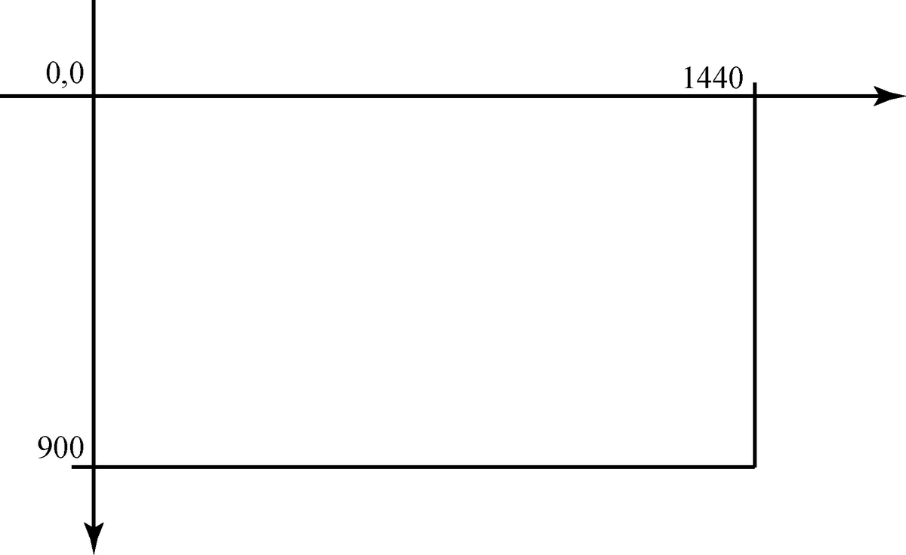
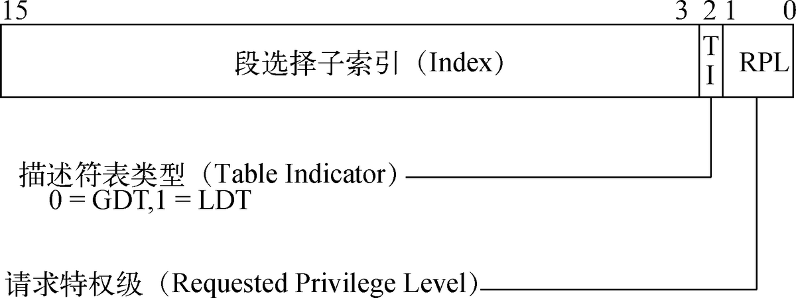
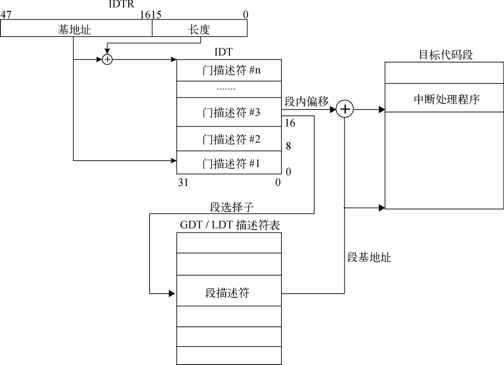

# 64位操作系统——（三）应用层


---

作者：王赛宇

参考列表：

- 主要参考：《一个六十四位操作系统的设计与实现》——田雨**（本章中大量使用了本书中的图片）**
- 《Using as》 ——Dean Elsner &  Jay Fenlason  & friends
- nasm 用戶手册
- [处理器startup.s 常见汇编指令...](https://blog.csdn.net/uunubt/article/details/84838260)

---


在上一章中，我们完成了操作系统内核层的框架，之所以说是框架，是因为对于每一个小的分支，我们只是完成了最基础的部分。在上一章的最后一节中，我们创建了一条`init`进程，在进入`init`进程后输出了`Hello World!`，完成后进入`do_exit`函数，我们在`do_exit`时，输出了一些提示信息，并让计算机宕机。


## Kernel知识回顾

### 内核层总览

在这一节中，我们来学习操作系统应用层的知识，在此之前，我们复习一下上一章中的内容，首先来看一张图：


让我们来从按照进入内核后的执行顺序将整个过程概括性的理一下：


### 内核执行头文件

内核执行头文件是从`loader`中通过：`jmp SelectorCode64: OffsetOfKernelFile`语句进入的，他的主要作用是对各种结构和表进行初始化，在执行内核主程序前，需要先执行内核执行头文件，其实现原理主要为：

- 指定程序装载地址：`. = 0xffff800000000000 + 0x100000;`

- 指定不同代码段的位置：

  ```kotlin
  .text : {
      _text = .;
      *(.text)
  
      _etext = .;
  }
  ```


### 内核主程序

内核主程序是通过内核执行头文件中的`movq   go_to_kernel(%rip), %rax`语句进入的，这个语句伪造了函数的调用现场，在执行`lretq`后，将会从内核执行头文件跳转到内核主程序中的`Start_Kernel`函数。

`Start_Kernel`函数中我们调用了其他定义好的方法，进行了屏幕输出、中断初始化、内存初始化、创建进程等操作。


### 屏幕输出

首先，我们了解了屏幕的布局：



其次，我们可以直接操作以`#define COLOR_OUTPUT_ADDR (int *)0xffff800000a00000`为首的内存区域，来直接控制显示的内容，其中每4个Byte表示一个像素点，前三位用于显示，表示(R, G, B)，第四位保留。在了解这个原理后，实现输出文字的功能就非常简单了（前提是我们使用了作者给出的字体样式头文件），输出文字实际上也是逐像素输出的。


### 中断处理

其核心原理如下图：


发生中断后，会产生中断向量号，我们在进入操作系统初期，执行内核主程序时，会对IDT表重新初始化，将我们的中断处理函数，全都装载到IDT中，这样发生异常时就可以按照IDT中的内容进行索引，找到对应的处理例程；在异常处理时我们需要将现场保存，同时有些中断会产生错误码并将错误码自动入栈，有些则不，为了统一，我们将不产生错误码的中断也push了0入栈，将其它信息入栈后，会跳转到对应的函数中进行处理，这些工作都是有汇编代码完成的；进入到处理例程后，我们直接进行了输出。


同理，键盘的处理是通过`IRQ`中断实现的。


### 内存管理

我们通过`struct Global_Memory_Descriptor memory_management_struct`来描述全局的内存信息，当然，在初始阶段，我们通过另一个较为简单的数据结构：`struct Memory_Block_E820`来读取我们存储在指定地址处的内存信息。在完成简单的信息读取后，我们构建了`GMD->Zones->Pages`的三层结构，同时为了描述Pages的可用性，我们构建了`bits_map`，`bits_map`的每一位对应着一个`Page`，如果某`Page`可用，那么对应的 `bits_map`的位是0，其结构如下（上一章原图）：


随后我们完成了一个极其简单的内存分配（或者说非常nt的内存分配），其核心思路就是探测有没有一个Zone中有连续的`need_pages`个可用Page。


### 线程管理（重点 与本章高度相关）

首先需要明确的是：每个线程都有一套自己的描述子以及自己的栈空间，我们将其定义为`task_union`，也称其为`PCB`，其分布如下：


其中，task是用来描述一个进程的基本信息的成员，我们需要记录如下信息：

```C
struct task_struct {
    struct List list;
    volatile long state;
    unsigned long flags;
    struct mm_struct *mm;
    struct thread_struct *thread;
    unsigned long addr_limit; 
    long pid;
    long counter;
    long signal;
    long priority;
};
```

其中，较为重要的是：`mm_struct *mm`用于记录当前进程掌握的页信息，`thread_struct *thread`用于描述进程调度切换现场。

PCB之间的组织关系如下：


不同的PCB之间通过链表进行连接。


### 其他（这里讲的是32位的，但是总体来说原理相同）

>  参考：
>
> - [【构建操作系统】全局描述符表*GDT*](https://zhuanlan.zhihu.com/p/25867829) 
> - [GDT、GDTR、LDT、LDTR的学习](https://blog.csdn.net/yeruby/article/details/39718119)

在学习这一节的内容之前，我们再来复习一下，关于IDT、GDT、TSS的一些内容，以及中断时是如何产生跳转的（这段重新写了，因为自己掌握的并不好）：

#### 保护模式下寻址


可以被拆分为以下几个阶段：

- 一、根据段选择子在描述表中进行查询，段选择子就是表示想要找的段在GDT中是第几个表项
- 二、使用段选择子在GDT表中（也有可能是IDT）找到相应的描述符，找到描述符时就相当于知晓了线性地址空间中的段基址
- 三、根据找到的段基址和段内偏移，就可以找到一个线性地址
- 四、找到线性地址后，对线性地址进行划分，使用高位在页目录中找到对应的页目录项，页目录项指向一个页表的基地址
- 五、再根据线性地址中间的`Table`项，在页表中进行查找，即可找到页表项，页表项是一个基地址
- 六、页表项+`Offset`就是最后的物理地址了


### 段选择子




结构如上，可以结合`保护模式寻址`进行理解，段选择子是用于在GDT表中进行查询的，其中的`段选择子索引`类似于数组的下标，你可以将找到目标描述符的过程理解为C语言中获取数组中元素的过程：`GDT[Index]`。剩余的3位为查找引入了一些限制： `TI`表示是在GDT中找还是在LDT中找，这里的LDT相当于是一个局部的描述符表，其组织结构与GDT相同。此外还有`RPL`，它代表当前请求的特权级，特权级分配如下（之前也讲过了）：


也就是说这里的特权级的数值越低，特权越高。

我们先带着问题继续向下看：


#### GDT


GDT是一个全局描述表（Global Descriptor Table），既然是个表就会存储很多条目，存储的条目如上图所示，每个条目占`64bit`：

我们可以通过段选择子来找到上面这样的一个段描述子，他大致可以被分为：

- 段基地址：被分为了很多段，合体之后就是完整的段基址了

- DPL：目标段的特权级

- G&段长度：这两个是配合使用的，先用一句C语言来表示一下真实的段长度：

  `ground_truth_limit = limit * G ? 4KB : 1Byte`;

  也就是说，在G是0的时候段长度的单位是`1Byte`，反之则为`4KB`

- D/B：这个有点复杂，作者是这样解释的：

  此位用于标识代码段的操作数位宽，或者栈段的操作数位宽以及上边界（32位代码/数据段应该为1，16位代码/数据段应该为0）

  - 可执行代码段，此位指定有效地址和操作数的默认宽度。置位时默认使用32位地址、32位或8位操作数；复位时默认使用16位地址、16位或8位操作数。前缀66h可调整默认操作数，而前缀67h可调整有效地址宽度
  - 栈段（SS寄存器中的数据段），此位指定栈指针的默认操作数。置位时默认使用32位栈指针（ESP），复位时默认使用16位栈指针（SP）。如果栈段是向下扩展的数据段，此位指定栈段的上边界
  -  向下扩展的数据段，此位指定上边界位宽。置位时上边界是FFFFFFFFh（4 GB），复位时上边界是FFFFh（64 KB）

#### IDT

IDT与GDT是相似的，他们都是描述表，只不过描述的信息不同，GDT是在描述全局段信息，而IDT在描述的是`interrupt`即中断信息，想要在IDT表中找到对应的表项，也需要使用`索引`，而这里的`索引`就是`中断向量号`，找到的表项则是一个个的`门描述符`，如下：


其中，门又被分为中断门、陷阱门、等等，但是我们只用了上面这两种，他们的区别在于：

- Type位上不同
- 在使用中断门时，系统会自动屏蔽掉其他中断


可以看到：每个门描述符都记录着一些关键信息：

- 段选择子+段内偏移：指向一个地址，表示处理该中断例程的入口
- DPL： 描述符特权级

当然，还有一种叫做调用门：


他比中断门多了一个参数个数。


异常处理的总体流程如下：



总体来说就是：当中断发生时，通过IDTR寄存器找到IDT表的地址，然后再根据中断向量的大小，找到对应的IDT表项，IDT表项中对应着一个段选择子和一个偏移量，然后我们拿着这个段选择子去GDT或是LDT去找段基地址，拿到的段基地址和偏移量求和就是最终中断处理程序的线性地址了。


#### TSS

在上面的过程中，我们忽略了一些细节，而TSS就是完善这个细节的，他是负责在任务切换过程中记录寄存器信息、切换栈的，总的来说就是：

- 提权时栈切换用到了 TSS
- 切换一堆寄存器

当然，我们也需要知道，我们的程序只能从内核往应用中去跳转，而不能直接从应用向内核跳转，想要完成这一目标，就只能通过系统调用实现


IA-32e模式下的TSS与上面的差别巨大，我们下章再讲。


## 跳转到应用层

我们在上一章中已经讲过了如何借助门级指令实现带有特权级的跳转，在这一节中，出于性能考虑，作者介绍了Intel推出的一套新的指令`SYSENTER/SYSEXIT`，他们实现快速系统调用。它的特点是：**不会执行数据压栈**，而且在跨特权级跳转时**不会对段描述符进行检测**，所以他执行的快；但是`SYSENTER/SYSEXIT`这对指令只能完成**`0,3`两个特权级之间的转换**。

作者是这样描述的：

> `SYSEXIT`指令是一个快速返回3特权级的指令，它只能执行在0特权级下。在执行`SYSEXIT`指令之前，处理器必须为其提供3特权级的衔接程序以及3特权级的栈空间，这些数据将保存在MSR寄存器和通用寄存器中。
>
> - **IA32_SYSENTER_CS**（位于MSR寄存器组地址174h处）。它是一个32位寄存器，用于索引3特权级下的代码段选择子和栈段选择子。在IA-32e模式下，代码段选择子为`IA32_SYSENTER_CS[15:0]+32`，否则为`IA32_SYSENTER_CS [15:0]+16`；而栈段选择子是将代码段选择子加8。
> - **RDX寄存器**。该寄存器保存着一个Canonical型地址（64位特有地址结构，将在第6章中详细介绍），在执行指令时会将其载入到RIP寄存器中（这是用户程序的第一条指令地址）。如果返回到非64位模式，那么只有低32位被装载到RIP寄存器中。
> - **RCX寄存器**。该寄存器保存着一个Canonical型地址，执行指令时会将其载入到RSP寄存器中（这是3特权级下的栈指针）。如果返回到非64位模式，只有低32位被装载到RSP寄存器中。
>
> 此处的IA32_SYSENTER_CS寄存器可借助`RDMSR/WRMSR`指令进行访问。在执行`SYSEXIT`指令的过程中，处理器会根据IA32_SYSENTER_CS寄存器的值加载相应的段选择子到CS和SS寄存器。值得注意的是，`SYSEXIT`指令不会从描述符表（在GDT或LDT）中加载段描述符到CS和SS寄存器，取而代之的是向寄存器写入固定值。此举虽然执行速度快，但不能保证段描述符的正确性，必须由操作系统负责确保段描述符的正确性。


### 系统调用返回模块

```gas
ENTRY(ret_system_call)
    movq    %rax,    0x80(%rsp)
    popq    %r15
    popq    %r14
    popq    %r13
    popq    %r12
    popq    %r11
    popq    %r10
    popq    %r9
    popq    %r8
    popq    %rbx
    popq    %rcx
    popq    %rdx
    popq    %rsi
    popq    %rdi
    popq    %rbp
    popq    %rax
    movq    %rax,    %ds
    popq    %rax
    movq    %rax,    %es
    popq    %rax
    addq    $0x38,   %rsp
    .byte   0x48
    sysexit
```

这段代码就是做了一些现场的还原

### 更改head.S中的GDT

```C
GDT_Table:
    .quad 0x0000000000000000    /*0 NULL descriptor                     00*/
    .quad 0x0020980000000000    /*1 KERNEL    Code    64-bit Segment    08*/
    .quad 0x0000920000000000    /*2 KERNEL    Data    64-bit Segment    10*/
    .quad 0x0000000000000000    /*3 USER      Code    32-bit Segment    18*/
    .quad 0x0000000000000000    /*4 USER      Data    32-bit Segment    20*/
    .quad 0x0020f80000000000    /*5 USER      Code    64-bit Segment    28*/
    .quad 0x0000f20000000000    /*6 USER      Data    64-bit Segment    30*/
    .quad 0x00cf9a000000ffff    /*7 KERNEL    Code    32-bit Segment    38*/
    .quad 0x00cf92000000ffff    /*8 KERNEL    Data    32-bit Segment    40*/
    .fill 10,8,0                /*10 ~ 11 TSS (jmp one segment <9>) in long-mode 128-bit 50*/
```

新增了一个32位的代码段描述符和一个32位的数据段描述符， 由于我们插入的位置在前面，所以后面使用GDT的部分需要做出相应的更改：


#### 更改`setup_TSS64`:

```C
movq	%rax,	80(%rdi)
shrq	$32,	%rdx
movq	%rdx,	88(%rdi)
```

#### 更改主程序中的读取

```C
// TSS段描述符的段选择子加载到TR寄存器
load_TR(10);
```


### 更改`do_fork`时调用的返回函数

```C
if(!(tsk->flags & PF_KTHREAD)) {// 进程运行于应用层空间， 就将预执行函数设置为： ret_system_call
    thd->rip = regs->rip = (unsigned long)ret_system_call;
    printk("app run in appLabel, pre function is ret_system_call");
}
```

### 将64位的0特权级代码段选择子设置到IA32_SYSENTER_CS寄存器中

```C
/**
 * 初始化init进程， 并且进行进程切换
 */
void task_init() {

	wrmsr(0x174,KERNEL_CS);
```

其中，wrmsr是一个函数，它的作用与汇编中的wrmsr相同，

```C++
void wrmsr(unsigned long address,unsigned long value){
    __asm__ __volatile__("wrmsr    \n\t"::"d"(value >> 32),"a"(value & 0xffffffff), "c"(address):"memory");
}
```


### 完善init进程

```C++
unsigned long init(unsigned long arg) {

    struct pt_regs *regs;

    printk("init task is running,arg:%#018lx\n",arg);

    current->thread->rip = (unsigned long)ret_system_call;
    current->thread->rsp = (unsigned long)current + STACK_SIZE - sizeof(struct pt_regs);
    regs = (struct pt_regs *)current->thread->rsp;

    __asm__    __volatile__ ( "movq    %1,    %%rsp    \n\t"
                              "pushq %2    \n\t"
                              "jmp   do_execve \n\t"
                              ::"D"(regs),"m"(current->thread->rsp),"m"(current->thread->rip):"memory");

    return 1;
}

void user_level_function(){
    while(1);
}

unsigned long do_execve(struct pt_regs * regs){
    regs->rdx = 0x800000;    //RIP
    regs->rcx = 0xa00000;    //RSP
    regs->rax = 1;
    regs->ds = 0;
    regs->es = 0;
    color_printk(RED,BLACK,"do_execve task is running\n");

    memcpy(user_level_function,(void *)0x800000,1024);

    return 0;
}
```

我们来解读一下这一系列的代码：

- 首先我们通过之前的`switch_to`函数切换到了`init`进程进行处理，init中进行了一些预处理
- `do_execve`函数会通过设置`struct pt_regs`结构体的成员变量来搭建应用程序的执行环境
- `do_execve`返回时，处理器会跳转到`ret_system_call`
- 进入`ret_system_call`会将刚才操作的结构体中的寄存器返还到寄存器中


### 对之前信息的更改

这个地方和之前一样，我们需要清空一些状态：

不再清理对页表映射：

```C++
	// for(int i = 0;i < 10;i++)
	// 	*(Phy_To_Virt(Global_CR3) + i) = 0UL;
```

更改页表：

```C++
//=======	init page
.align 8

.org	0x1000

__PML4E:

	.quad	0x102007
	.fill	255,8,0
	.quad	0x102007
	.fill	255,8,0

.org	0x2000

__PDPTE:
	
	.quad	0x103007
	.fill	511,8,0

.org	0x3000

__PDE:

    .quad    0x000087
    .quad    0x200087
    .quad    0x400087
    .quad    0x600087
    .quad    0x800087          /* 0x800083 */
    .quad    0xe0000087        /*0x a00000*/
    .quad    0xe0200087
    .quad    0xe0400087
    .quad    0xe0600087        /*0x1000000*/
    .quad    0xe0800087        
    .quad    0xe0a00087
    .quad    0xe0c00087
    .quad    0xe0e00087
    .fill    499,8,0
```


### 执行：

我们对`user_level_function`中的函数进行反汇编，获取while语句与函数头之间的相对地址：

```C++
ffff800000109ac2 <user_level_function>:
ffff800000109ac2:	f3 0f 1e fa          	endbr64 
ffff800000109ac6:	55                   	push   %rbp
ffff800000109ac7:	48 89 e5             	mov    %rsp,%rbp
ffff800000109aca:	f3 0f 1e fa          	endbr64 
ffff800000109ace:	48 8d 05 f5 ff ff ff 	lea    -0xb(%rip),%rax        # ffff800000109aca <user_level_function+0x8>
ffff800000109ad5:	49 bb 76 2e 00 00 00 	movabs $0x2e76,%r11
ffff800000109adc:	00 00 00 
ffff800000109adf:	4c 01 d8             	add    %r11,%rax
ffff800000109ae2:	c7 45 fc 00 00 00 00 	movl   $0x0,-0x4(%rbp)
ffff800000109ae9:	83 45 fc 01          	addl   $0x1,-0x4(%rbp)
ffff800000109aed:	eb fe                	jmp    ffff800000109aed <user_level_function+0x2b>
```

获取该地址后，我们计算出，死循环的地址：`jmp`相对函数头的偏移量是`0x2b`， 我们对该函数进行了拷贝，拷贝到了`0x800000`，那么拷贝后她的地址就是：

`0x80002b`，我们在改地址设置断点，即可查看有没有进入该函数：


此时，bochs提醒我们已经检测到了断点：

```C++
(0) Breakpoint 1, 0x000000000080002b in ?? ()
Next at t=81334049
(0) [0x00000080002b] 002b:000000000080002b (unk. ctxt): jmp .-2 (0x000000000080002b) ; ebfe
<bochs:3> 
```

验证成功。

那么，如果我们想要调用`printk`呢？

```C++
void user_level_function(){
    printk("test");
    while(1);
}
```

但是不幸的是，我们的`user_level_function`之中是不可以调用之前的写过的`pirntk`函数的，为什么呢？我们从反汇编的代码入手：

```C++
ffff8000001058cb <printk>:
.....
.....
ffff800000109ac2 <user_level_function>:
```

可以看到，`user_level_function`在内存中是在`printk`函数后面的，我们计算他们的地址上的差值：

```python
>>> 0x109ac2 - 0x1058cb
16887
```

随后，我们在bochs中设置断点，查看进入`user_levle_function`后的行为：

```C++
(0) Breakpoint 1, 0x0000000000800000 in ?? ()
Next at t=81334035
(0) [0x000000800000] 002b:0000000000800000 (unk. ctxt): rep multibyte nop         ; f30f1efa
<bochs:3> s
Next at t=81334036
(0) [0x000000800004] 002b:0000000000800004 (unk. ctxt): push rbp                  ; 55
<bochs:4> s
Next at t=81334037
(0) [0x000000800005] 002b:0000000000800005 (unk. ctxt): mov rbp, rsp              ; 4889e5
<bochs:5> s
Next at t=81334038
(0) [0x000000800008] 002b:0000000000800008 (unk. ctxt): push r15                  ; 4157
<bochs:6> s
Next at t=81334039
(0) [0x00000080000a] 002b:000000000080000a (unk. ctxt): sub rsp, 0x0000000000000008 ; 4883ec08
<bochs:7> s
Next at t=81334040
(0) [0x00000080000e] 002b:000000000080000e (unk. ctxt): rep multibyte nop         ; f30f1efa
<bochs:8> s
Next at t=81334041
(0) [0x000000800012] 002b:0000000000800012 (unk. ctxt): lea rdx, qword ptr ds:[rip-11] ; 488d15f5ffffff
<bochs:9> s
Next at t=81334042
(0) [0x000000800019] 002b:0000000000800019 (unk. ctxt): mov r11, 0x0000000000002e90 ; 49bb902e000000000000
<bochs:10> s
Next at t=81334043
(0) [0x000000800023] 002b:0000000000800023 (unk. ctxt): add rdx, r11              ; 4c01da
<bochs:11> s
Next at t=81334044
(0) [0x000000800026] 002b:0000000000800026 (unk. ctxt): mov rax, 0x000000000000149c ; 48b89c14000000000000
<bochs:12> s
Next at t=81334045
(0) [0x000000800030] 002b:0000000000800030 (unk. ctxt): lea rdi, qword ptr ds:[rdx+rax] ; 488d3c02
<bochs:13> s
Next at t=81334046
(0) [0x000000800034] 002b:0000000000800034 (unk. ctxt): mov r15, rdx              ; 4989d7
<bochs:14> s
Next at t=81334047
(0) [0x000000800037] 002b:0000000000800037 (unk. ctxt): mov eax, 0x00000000       ; b800000000
<bochs:15> s
Next at t=81334048
(0) [0x00000080003c] 002b:000000000080003c (unk. ctxt): mov rcx, 0xffffffffffff8f6b ; 48b96b8fffffffffffff
<bochs:16> s
Next at t=81334049
(0) [0x000000800046] 002b:0000000000800046 (unk. ctxt): add rcx, rdx              ; 4801d1
<bochs:17> s
Next at t=81334050
(0) [0x000000800049] 002b:0000000000800049 (unk. ctxt): call rcx                  ; ffd1
<bochs:18> s
Next at t=81334051
(0) [0x0000007fbe09] 002b:00000000007fbe09 (unk. ctxt): add byte ptr ds:[rax], al ; 0000
```


可以看到，在执行`call rcx`指令后，程序跳转到了：`0x00000000007fbe09`这个地址，这是一次函数调用，这次函数调用就是调用了printk函数，我们计算一下跳转到的地址和`0x800000`之间的偏差：

```C++
>>> 0x800000 - 0x7fbe09
16887
```

震惊！这个偏差和之前的偏差是一样的，那么这个时候我们就知道了：这里我们是暴力的将这个函数拷贝到了我们的目标地址，跳转时使用的是相对地址进行跳转的。我们的程序在拷贝到`0x800000`之后，仍然使用相对地址进行跳转的话那么就会出现问题！


## 系统调用API

概括的来讲，我们在上一节中完成了：从内核态通过`SYSEXIT`指令跳出到用户态的目标；我们学到了：`SYSEXIT`提供了一种从内核态离开，到达用户态的方法。如果我们只是用这种方法的话，就只能完成内核态调用用户态的方法，而不能让运行在用户态的应用进程完成一些只有在内核态才能够进行的操作（比如查看一下cpu的型号）。实质上我们需要借用`SYSENTER`的方法来完成这一目标，对于该指令，作者是这样描述的：

> `SYSENTER`指令是一个快速进入0特权级的指令。在执行`SYSENTER`指令之前，处理器必须为其提供0特权级的衔接程序以及0特权级的栈空间，这些数据将保存在MSR寄存器和通用寄存器中。
>
> - **IA32_SYSENTER_CS**（MSR寄存器组地址174h处）。这个MSR寄存器的低16位装载的是0特权级的代码段选择子，该值也用于索引0特权级的栈段选择子（IA32_SYSENTER_CS [15:0]+8），因此其值不能为NULL。
> - **IA32_SYSENTER_ESP**（MSR寄存器组地址175h处）。这个MSR寄存器里的值将会被载入到RSP寄存器中，该值必须是Canonical型地址。在保护模式下，只有寄存器的低32位被载入到RSP寄存器中。
> - **IA32_SYSENTER_EIP**（MSR寄存器组地址176h处）。这个MSR寄存器里的值将会被载入到RIP寄存器中，该值必须是Canonical型地址。在保护模式下，只有寄存器的低32位被载入到RIP寄存器中。
>
> 在执行`SYSENTER`指令的过程中，处理器会根据IA32_SYSENTER_CS寄存器的值加载相应的段选择子到CS和SS寄存器。`SYSENTER`指令与`SYSEXIT`指令都必须由操作系统负责确保段描述符的正确性。


### 系统调用入口函数：

```gas
ENTRY(system_call)
	sti
	subq	$0x38,	%rsp			 
	cld;					 

	pushq	%rax;				 	
	movq	%es,	%rax;			 	
	pushq	%rax;				 	
	movq	%ds,	%rax;			 	
	pushq	%rax;				 	
	xorq	%rax,	%rax;			 	
	pushq	%rbp;				 	
	pushq	%rdi;				 	
	pushq	%rsi;				 	
	pushq	%rdx;				 	
	pushq	%rcx;				 
	pushq	%rbx;				 	
	pushq	%r8;				 	
	pushq	%r9;				 	
	pushq	%r10;				 
	pushq	%r11;				 
	pushq	%r12;				 	
	pushq	%r13;				 
	pushq	%r14;				 	
	pushq	%r15;				 	
	movq	$0x10,	%rdx;			 	
	movq	%rdx,	%ds;			 	
	movq	%rdx,	%es;			 
	movq	%rsp,	%rdi			 	
			
	callq	system_call_function		 	////////
```

这里和之前写的还是有几分相似的，这里依然是将函数调用的现场进行保存，并且将当前的栈指针传递给函数`system_call_function`。这里的栈指针指向`pt_regs`。接下来我们就需要一个`system_call_function`来处理系统调用请求：

```C++
/**
 * 根据系统调用号返回一个系统调用处理函数
 */
unsigned long system_call_function(struct pt_regs * regs) {
    return system_call_table[regs->rax](regs);
}
```

这里`system_call_function`的作用就是当用户进行一次系统调用的时候，我们就从`system_call_table`中按照相应的下标返回一个相应的处理函数。

```C++
#define MAX_SYSTEM_CALL_NR 128

typedef unsigned long (* system_call_t)(struct pt_regs * regs);

unsigned long no_system_call(struct pt_regs * regs) {
    printk("no_system_call is calling,NR:%#04x\n",regs->rax);
    return -1;
}

system_call_t system_call_table[MAX_SYSTEM_CALL_NR] = {
    [0 ... MAX_SYSTEM_CALL_NR-1] = no_system_call
};

```

### 写MSR寄存器

```C++
wrmsr(0x174,KERNEL_CS);
wrmsr(0x175,current->thread->rsp0);
wrmsr(0x176,(unsigned long)system_call);
```

这里就是根据前面作者的提示来初始化一下这些寄存器。


### 调用系统调用函数

```C++
void user_level_function(){

	long ret = 0;
	__asm__    __volatile__    (    "leaq    sysexit_return_address(%%rip), %%rdx                           \n\t"
                                    "movq    %%rsp,    %%rcx            \n\t"
                                    "sysenter                           \n\t"
                                    "sysexit_return_address:            \n\t"
                                    :"=a"(ret):"0"(15):"memory");
    while(1);
}
```


### 执行

我们重新执行，结果如下：


## 实现输出的系统调用

在上面的一节中，我们了解了系统调用的整个框架，在此基础上，我们就可以添加各种各样的系统调用了。现在我们没法在用户态进行输出，这样的设计非常的反人类，所以我们先写一个用于输出的系统调用。


### 声明系统调用函数&注册系统调用函数

我们将一号系统调用设计为进行输出的系统调用，首先我们需要写一个函数：

```C++
unsigned long sys_printf(struct pt_regs * regs) {
    printk((char *)regs->rdi);
    return 1;
}
```

这个函数用于输出用户给出的字符串，接着我们需要将她进行注册：

```C++
system_call_t system_call_table[MAX_SYSTEM_CALL_NR] = {
    [0] = (system_call_t)no_system_call,
	[1] = (system_call_t)sys_printf,
	[2 ... MAX_SYSTEM_CALL_NR-1] = (system_call_t)no_system_call,
};
```

这个注册，实质上就是将这个函数保存在这个列表的对应位置。


### 调用&验证

我们更改自己的应用程序即可：

```C++
void user_level_function(){

	long ret = 0;
	char output_string[] = "Hello World!";
	__asm__    __volatile__    (    "leaq    sysexit_return_address(%%rip), %%rdx                           \n\t"
                                    "movq    %%rsp,    %%rcx            \n\t"
                                    "sysenter                           \n\t"
                                    "sysexit_return_address:            \n\t"
                                    :"=a"(ret):"0"(1),"D"(output_string):"memory");
    while(1);
}
```

我们继续执行验证：


好了！我们的系统调用编写成功了！


说一下后面的安排吧，其实到现在为止，我们的操作系统已经打好了一个雏形了，这已经是一个五脏俱全的小操作系统了，虽然按照我们的看法他算不上一个操作系统。。在后面的学习中，我们会进一步丰富这个操作系统。但是在此之前，我准备：

- 重构代码：说实话，前面的代码非常狗屎，需要重构一下，来调整一下码风和结构，我们会一起学习、应用谷歌C++代码规范（皮毛）
- 温习框架：将前面涉及到的主要流程以及主要框架进行梳理，在确保自己将前面的知识掌握的牢固后，在开始下一步的学习

