# 64位操作系统——（四）处理器体系结构


---

作者： 王赛宇

说明： 本章中存在对书《[一个64位操作系统的设计与实现](https://www.ituring.com.cn/book/2450)》（作者田雨）的大段引用，引用部分使用暗灰色背景标出

----

在前三个章节中，我们实现了一个简单的操作系统。这个操作系统有最最简单的内存管理、进程切换的方法，当然这些方法非常简陋。在后面的章节中，我们会跟随作者的书，继续去完善我们的系统。在这一节中，我们先学习一些有关当前的`intel`体系结构的东西。

这些知识都是我从作者那里接受过来的知识，然后再输出到文档里面，如果你看我写的文档，那大概属于二手知识了。所以我还是建议你直接去看作者的书，如果有理解不了的地方，来看看这个文档作为辅助理解是最好的。当然，我也不会把所有的内容都写上来，而是将一些我认为遇到过、有用的知识写上来。


## 基础功能与新特性

这一节主要讲的是`Intel Pentium 4`以及后续的处理器的特性


### 运行模式

我们先来回想一下，在bootloader中我们在几个模式之间进行了切换？


那么在此基础上，我们来了解一下`intel cpu`为我们提供了哪些运行模式：

- **实模式**：这个就是我们完成Bios自检后留存的模式，在该模式下，cpu处于`16位宽`状态，同时只有20工作的根地址线，所以只能访问`1MB`内存，当然，我们也可以打开`Big Real Mode`模式来操作`4GB`内存范围内的数据，至于`Big Real Mode`如何运行，我们后面再做讲解。
- **保护模式**：这个是三十二位处理器运行的主要模式，特征是可以访问`4GB`的数据，及`4GB`的代码（`Big Real Mode`只能跑`1MB`代码，所以才叫`Real Modd`）
- **系统管理模式** ：这个没有接触过，相当于是处理器提供给操作系统的接口，这个接口可以用于电源管理等，当调用这一系列接口的时候，CPU就会陷入系统管理模式（这和系统调用很相似，不同的是服务的提供者）
- **虚拟8086模式**：处理器为保护模式提供的一种运行模式，允许处理器在保护模式下执行8086软件和多任务环境。（猜测是）
- **IA-32e模式**：64为处理器的主要运行模式，包含兼容模式和64位模式两种主要模式。


作者给出了一张图，这张图描述了不同模式之间的转移方法：

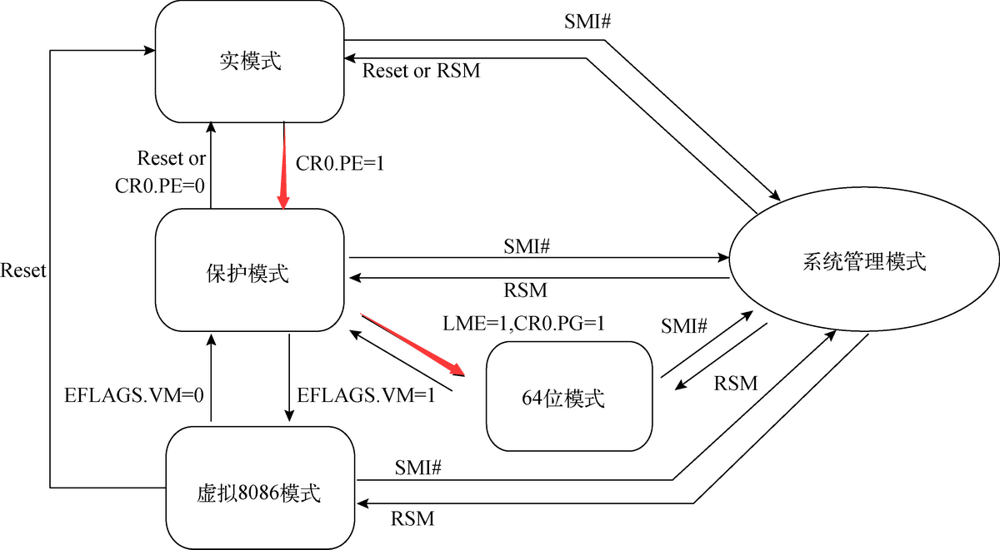

我们用到了标红的两种转移。同时，如果想要检测计算机是否在`IA-32e`模式，只需要检测`IA32_EFER`寄存器的`LME`位是否为1即可。


### 通用寄存器

对于一个32位CPU，一共有八个通用寄存器：

`EAX, EBX, ECX, EDX, ESI, EDI, EBP, ESP`

我们最熟悉的是`ESP`，他负责记录当前执行程序的栈指针，我们不能随便改他，除此之外，这些寄存器还有一些特殊用途：

> | 名称 | 特殊功能描述                                     |
> | :--- | :----------------------------------------------- |
> | EAX  | 用于累加操作或保存计算结果                       |
> | EBX  | 作为DS数据段寄存器的段内偏移指针                 |
> | ECX  | 字符串和循环操作的计数器                         |
> | EDX  | I/O地址指针                                      |
> | ESI  | 作为DS数据段寄存器的段内偏移指针（源地址指针）   |
> | EDI  | 作为ES数据段寄存器的段内偏移指针（目标地址指针） |
> | ESP  | 栈指针                                           |
> | EBP  | 栈帧（段内偏移指针）                             |


对于64位CPU而言，`Intel`多给了8个寄存器：

`RAX, RBX, RCX, RDX, RDI, RSI, RBP, RSP`

可以看到，这八个寄存器和上面的是对应的，引用博客[RAX,eax,ax,ah,al 关系](https://blog.csdn.net/qwq1503/article/details/100108831)中的一个图，他们的关系非常好说明：

```
|63..32|31..16|15-8|7-0|
               |AH.|AL.|
               |AX.....|
       |EAX............|
|RAX...................|
```


### CPUID指令


#### 检测是否支持CPUID指令

通过EFLAGS标志寄存器的ID标志位（位于EFLAGS寄存器的第21位）可检测出处理器是否支持`CPUID`指令。

#### CPUID查询指令

首先看这张图：


cpuid 指令由 eax 寄存器获得输入，执行 cpuid 指令前，将功能号传给 eax 寄存器:

输入：

- eax：主功能号，支持的最大主功能号是14h
- ecx：扩展信息的主功能号， 从80000000h到80000008h

输出：

- eax
- ebx
- ecx
- edx


我们在检测是否支持CPUID指令的时候用到了`EFLAGS标志寄存器`，我们来了解下：

### EFLAGS标志寄存器

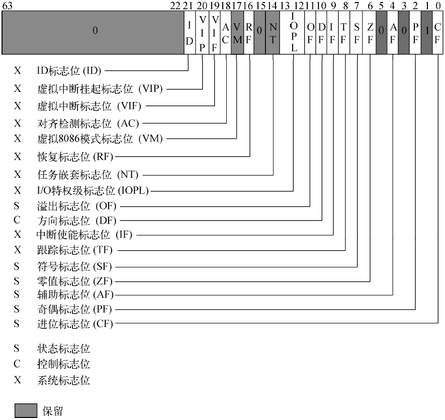

我们刚才检测是否支持`CPUID`的时候，检测的是EFLAGS寄存器的第21位：ID位，它的作用就是标记CPU是否支持`CPUID`指令。

EFLAGS标志寄存器的值可以通过特殊的汇编指令进行更改。当程序通过**调用门执行任务切换时**，处理器会把EFLAGS标志寄存器值**保存到任务状态段TSS内**，并将目标任务状态段TSS内的值**更新到EFLAGS标志寄存器**中。可以根据标志位功能将他们分为：**状态标志、方向标志、系统标志和IOPL区域等几部分**：

#### 状态标志

状态标识用于反应运算结果的特征，如下，（表来源于作者书）：

> 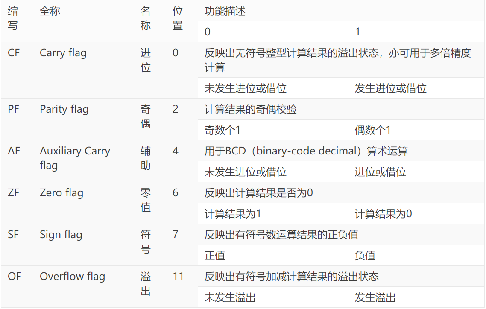

破案了，我们之前用的各种判断CF、ZF的条件跳转就是判断`EFLAGS标志寄存器`相应位的值，其中有一些技巧：

- CF标志位可反映出有符号整型数计算结果的溢出状态
- AF标志位可反映出BCD整型数计算结果的溢出状态
- SF标志位可反映出有符号整型数计算结果的正负值
- ZF标志位可反映出整型数（有符号和无符号）的计算结果

在上面的标识中，只有CF标志位可通过`STC`、`CLC`和`CMC`汇编指令更改位值，它也可借助位操作指令将指定位值复制到CF标志位。


#### 方向标志

`DF`就是方向标识，它控制着字符串指令的操作方向。`DF == 1`可使字符串指令按从高至低的地址方向，反之则反。汇编指令`STD`与`CLD`可用于置位和复位DF方向标志位。（我们之前用过这个）


#### 系统标志和IOPL区域

这些位负责控制I/O端口地址访问权限、屏蔽硬件中断请求、使能单步调试、任务嵌套以及使能虚拟8086模式等，其功能如下：

> | 缩写 | 全称                              | 位置  | 功能描述                    |
> | :--- | :-------------------------------- | :---- | :-------------------------- |
> | TF   | Trap                              | 8     | 使能单步调试功能            |
> | IF   | InterruptEnable                   | 9     | 使能中断（响应可屏蔽中断）  |
> | IOPL | I/O Privilege Level Field         | 12,13 | 访问I/O端口地址的最低特权级 |
> | NT   | Nested Task                       | 14    | 允许任务嵌套调用            |
> | RF   | Resume                            | 16    | 允许调试异常                |
> | VM   | Virtual-8086 Mode                 | 17    | 使能Virtual-8086模式        |
> | AC   | Alignment Check or Access Control | 18    | 数据对齐检测                |
> | VIF  | Virtual Interrupt                 | 19    | IF中断使能标志位的虚拟镜像  |
> | VIP  | Virtual interrupt pending         | 20    | 中断挂起                    |
> | ID   | Identification                    | 21    | 检测`CPUID`指令             |

需要注意的是：如果希望**修改上述系统标志位或IOPL区域**，则**必须拥有足够的执行权限**（0特权级）。


### 控制寄存器

目前，Intel处理器共拥有6个控制寄存器（CR0、CR1、CR2、CR3、CR4和CR8），在前面的过程中我们主要用到了`CR3`寄存器。他们都是由一些标志位组成的，通过操作这些标识位可以控制处理器的运行模式，作者给出了一个表来描述这些寄存器：

> | 寄存器 | 功能描述                     |
> | :----- | :--------------------------- |
> | CR0    | 控制处理器的状态和运行模式   |
> | CR1    | 保留                         |
> | CR2    | 引起`#PF`异常的线性地址      |
> | CR3    | 记录页目录的物理基地址和属性 |
> | CR4    | 体系结构扩展功能的使能标志位 |
> | CR8    | 读写访问的任务优先级寄存器   |

我们之前用到的`CR3`主要适用于内存管理的。

下面是这些寄存器的结构，在IA-32模式下，这些寄存器都是32位的，在IA-32e模式下，这些寄存器是64位的，但是除了地址类的寄存器外，其它的结构依然没有变化，多出来的位均作为拓展使用：

> 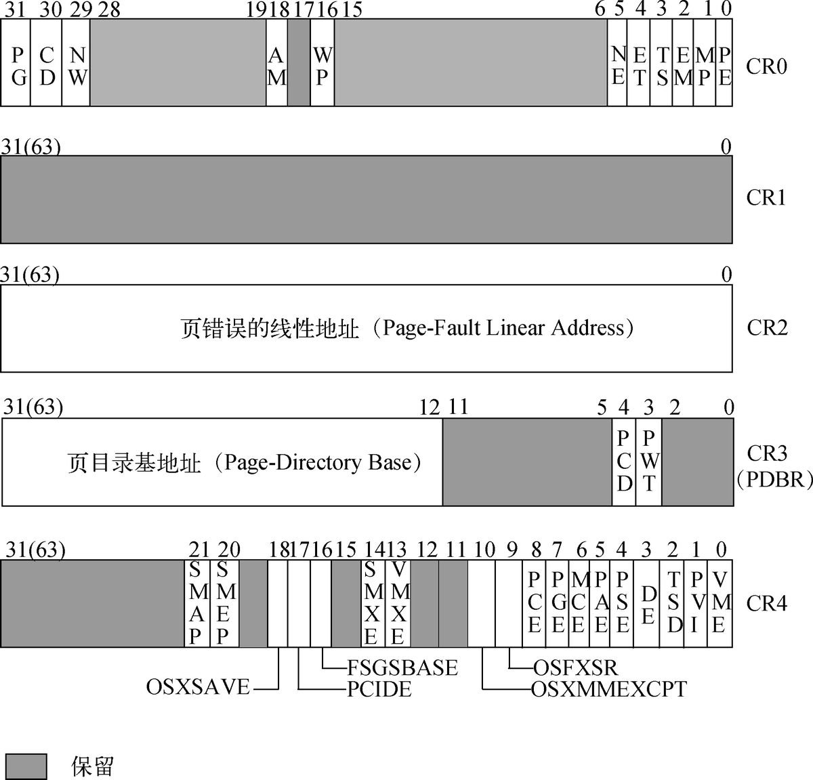

这些保留位必须被置为0，否则会触发异常；CR2、CR3不会对输入的地址进行检测；CR8仅在64位模式下有；

作者还给出了各个控制位的功能描述，我也将这些信息全都拷贝下来：

> | 缩写       | 全称                                                         | 功能描述                                                  |
> | :--------- | :----------------------------------------------------------- | :-------------------------------------------------------- |
> | PG         | Paging                                                       | 使能分页管理机制                                          |
> | CD         | Cache Disable                                                | 控制系统内存的缓存机制                                    |
> | NW         | Not Write-through                                            | 控制系统内存的写穿机制                                    |
> | AM         | Alignment Mask                                               | 数据对齐检测                                              |
> | WP         | Write Protect                                                | 开启只读页的写保护                                        |
> | NE         | Numeric Error                                                | 选择x87FPU的错误通知机制                                  |
> | ET         | Extension Type                                               | 检测Intel 387 DX协处理器                                  |
> | TS         | Task Switched                                                | 延迟保存浮点处理器的数据                                  |
> | EM         | Emulation                                                    | 检测x87 FPU协处理器                                       |
> | MP         | Monitor Coprocessor                                          | 使能`WAIT`指令监控                                        |
> | PE         | Protection Enable                                            | 开启保护模式                                              |
> | PCD        | Page-level Cache Disable                                     | 页级禁止缓存标志位                                        |
> | PWT        | Page-level Write-Through                                     | 页级写穿标志位                                            |
> | SMAP       | SMAP-Enable Bit                                              | 限制超级权限对用户数据的访问                              |
> | SMEP       | SMEP-Enable Bit                                              | 限制超级权限对用户程序的执行                              |
> | OSXSAVE    | XSAVE and Processor Extended States-Enable Bit               | 开启`XSAVE`、`XRSTOR`、`XGETBV`、`XSETBV`等指令的增强功能 |
> | PCIDE      | PCID-Enable Bit                                              | 开启PCID功能                                              |
> | FSGSBASE   | FSGSBASE-Enable Bit                                          | 使能`RDFSBASE`、`WRFSBASE`以及`RDGSBASE`、`WRGSBASE`指令  |
> | SMXE       | SMX-Enable Bit                                               | 开启SMX功能                                               |
> | VMXE       | VMX-Enable Bit                                               | 开启VMX功能                                               |
> | OSXMMEXCPT | Operating System Support for Unmasked SIMD Floating-Point Exceptions | 允许处理器执行SIMD浮点异常（#XM）                         |
> | OSFXSR     | Operating System Support for FXSAVE and FXRSTOR instructions | 限制`FXSAVE`、`FXRSTOR`指令的功能                         |
> | PCE        | Performance-Monitoring Counter Enable                        | 限制`RDPMC`指令的执行权限                                 |
> | PGE        | Page Global Enable                                           | 开启全局页表功能                                          |
> | MCE        | Machine-Check Enable                                         | 开启机器检测异常                                          |
> | PAE        | Physical Address Extension                                   | 开启页管理机制的物理地址寻址扩展                          |
> | PSE        | Page Size Extensions                                         | 允许32位分页模式使用4 MB物理页                            |
> | DE         | Debugging Extensions                                         | 使能DR4、DR5调试寄存器                                    |
> | TSD        | Time Stamp Disable                                           | 限制`RDTSC`、`RDTSCP`指令的执行权限                       |
> | PVI        | Protected-Mode Virtual Interrupts                            | 使能`EFLAGS.VIF`标志位                                    |
> | VME        | Virtual-8086 Mode Extensions                                 | 使能Virtual-8086模式的中断/异常                           |
> | TPL        | Task Priority Level                                          | 阻塞中断的最高特权级阈值                                  |

当`CR0.PE == 0`时如果`CR0.PG == 1`，那么会触发异常；CR0.CD与CR0.NW标志位联合控制着处理器的缓存和读写策略（来自作者）：

> | CD   | NW   | 缓存和读写策略                             |
> | :--- | :--- | :----------------------------------------- |
> | 0    | 0    | 标准缓冲模式，提供最高效的缓存策略         |
> | 0    | 1    | 无效设置，触发错误码为0的`#GP`异常         |
> | 1    | 0    | 处理器无法缓存数据，但需要保持内存的一致性 |
> | 1    | 1    | 处理器无需保持内存与缓存的一致性           |


> 除CRn控制寄存器和XCR0扩展控制寄存器（用于控制浮点计算功能）外，EFER寄存器也用于控制系统功能。它是MSR寄存器组的IA32_EFER寄存器，它提供了控制IA-32e运行模式开启的标志位，以及关于页表访问限制的控制区域。下图是IA32_EFER寄存器的位功能说明。
>
> 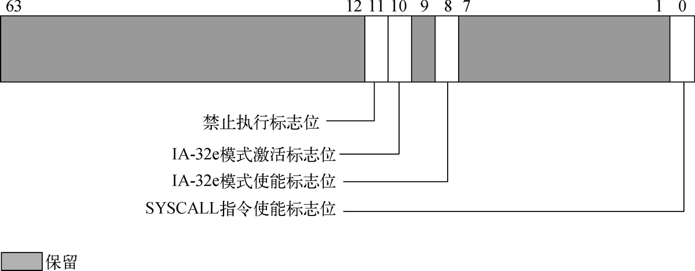


> IA32_EFER寄存器的各标志位功能，其中的LME标志位最为重要，它用于开启IA-32e模式，而第0位则是`SYSCALL/SYSRET`指令的使能位。这对指令由AMD公司引入，Intel处理器对它们仅提供了有限的支持。
>
> | 位    | 缩写 | 读写 | 功能描述                                         |
> | :---- | :--- | :--- | :----------------------------------------------- |
> | 0     | SCE  | R/W  | `SYSCALL/SYSRET`指令的使能标志位（64位模式有效） |
> | 1:7   | —    | —    | 保留                                             |
> | 8     | LME  | R/W  | 使能IA-32e模式                                   |
> | 9     |      |      | 保留                                             |
> | 10    | LMA  | R    | 当`IA32_EFER_LMA=1`表明IA-32e模式已开启          |
> | 11    | NXE  | R/W  | 开启页访问限制功能（PAE模式可用）                |
> | 12:63 | —    | —    | 保留                                             |


### MSR寄存器

MSR（Model-Specific Register）寄存器组可提供性能监测、运行轨迹跟踪与调试以及其他处理器功能。我们在编写系统调用指令的时候也使用了MSR寄存器，我们使用的是该寄存器针对SYSENTER和SYSEXIT设计的六个区。


## 地址空间

地址空间可以被分为**虚拟地址空间**和**物理地址空间**两大类，不同地址类型之间是可以相互转化的。


### 虚拟地址

大多数虚拟地址并不能独立的转化为物理地址，下面我们开始了解：

- **逻辑地址：**形如下面这样的就是逻辑地址：`SelectorCode : Offset`，可以看到，这样的一个逻辑地址由段基址和段内偏移地址两部分组成，这里的偏移地址也被称为有效地址，逻辑地址最终会被转化为线性地址。
- **线性地址**：正如前面所说，线性地址由逻辑地址中的基址和偏移量组合而成，这就导致程序无法直接访问线性地址。平坦地址是一种特殊的线性地址，将段基地址和段长度覆盖了整个线性地址空间，而非线性地址空间中的某一部分区域；当段 基地址为0时，段内偏移地址（有效地址）与线性地址在数值上相等。


### 物理地址

物理地址就是用于访问硬件设备的地址，在**开启分页机制时，线性地址会经过页表映射后变为物理地址，否则就将直接变为物理地址**，物理地址也可以根据访问物理设备的不同进行分类：

- **IO地址：**IO地址和内存地址相互隔离，必须借助特殊的`IN, OUT`语句才能够进行访问，我们在书写键盘中断的时候就使用了IO操作，由此推测，IO地址主要用于控制一些外部可拓展的设备。
- **内存地址**：内存地址不仅包括内存条的可用空间，还包括了其他外部硬件设备的地址空间，这些设备和物理内存共享一片地址空间。我们在探测可用的内存地址的时候，使用了`INT 15h`指令来获取内存地址空间的相关信息


## 实模式

我们在刚刚上电的时候，进入的就是实模式，当然由于使用需要，我们也只有在刚上电的时候才会用实模式了。


### 实模式寻址

实模式是不存在分页机制的，仅支持逻辑地址的：`Base : Offset`的寻址方式，该地址到线性地址的转化如下：
$$
Linar Address = Base << 4 + Offset
$$
在实模式下，所有的寄存器都是16位的，也正是基于这种寻址方式，CPU的寻址能力从原来的$2^{16}$增强为了$2^{20}$即`1MB`，当然，我们也可以进入`Big Real Mode`来对`4GB`范围内的数据进行修改，我们后面会仔细讲解。

### 实模式的中断向量表

实模式下也有一个中断向量表，叫做IVT，他的方法依然是用中断向量号进行索引，在表中找到相应表项后进行跳转，每个表项由`Base` & `Offset`两部分构成，每个表项占`4Byte`空间，整个表占`1KB`空间，支持处理256个中断，其结构如下图：

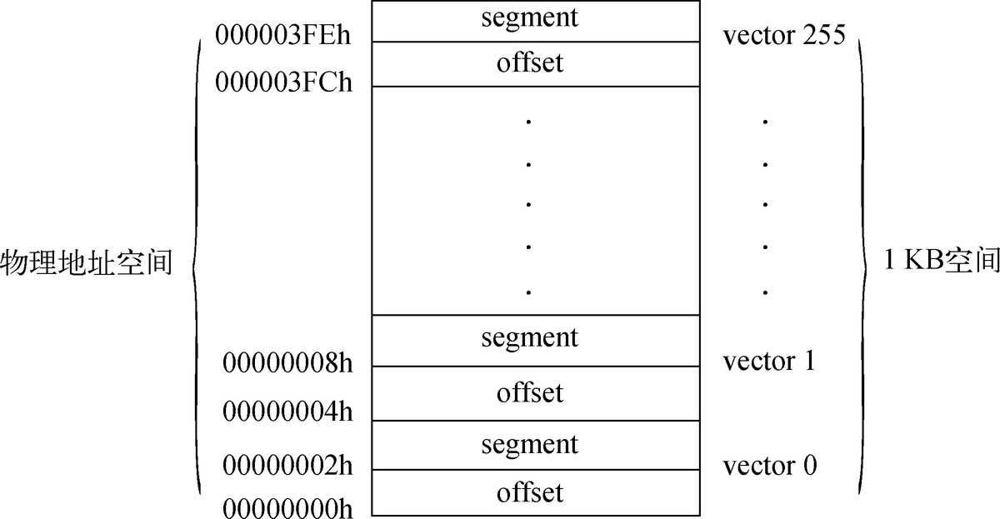

在计算机启动后，BIOS会在物理地址0处创建中断向量表IVT。如果希望在程序运行过程中修改或保存中断向量表，我们可借助`LIDT`和`SIDT`指令实现。


实模式的知识点就结束了，我们可以看到实模式的中断向量表与保护模式下的中断向量表差距极大，这就导致其安全策略非常有限，接下来我们来了解保护模式：


## 保护模式

在学习保护模式前，先来解释何为保护：这里的保护是相对实模式而言的，那么我们先来看**实模式哪里不保护了？**

- 实模式对地址的访问没有做任何限制，应用程序想要访问、更改任何内存都没有任何限制（甚至可以通过直接更改前1KB的内存来更改异常处理函数入口）

那么接下来，我们就来看看，`Intel`的工程师是怎么解决这个问题的


### 保护模式特征


#### 保护模式寻址

首先，保护模式引入了分段管理和分页管理机制，其总体布局如下（这个图我们在上一章节中已经有讲了）：

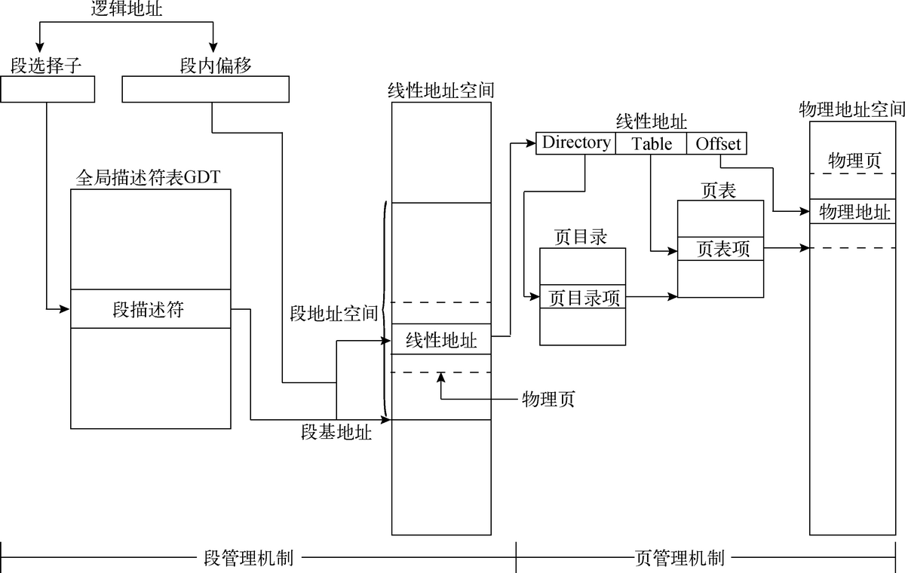

- 在保护模式中，我们仍然沿用逻辑地址的形式，但是，我们的逻辑地址的基地址变为了段选择子，并且逻辑地址向线性地址的转化从原来的左移相加转变为了通过段选择子获取段基地址后与段偏移量相加。
- 在获取线性地址后，加入了页表（可选项），通过页表映射后即可获得最后的物理地址。


#### 保护模式特权级

是的，这里在上一章中还是讲过：

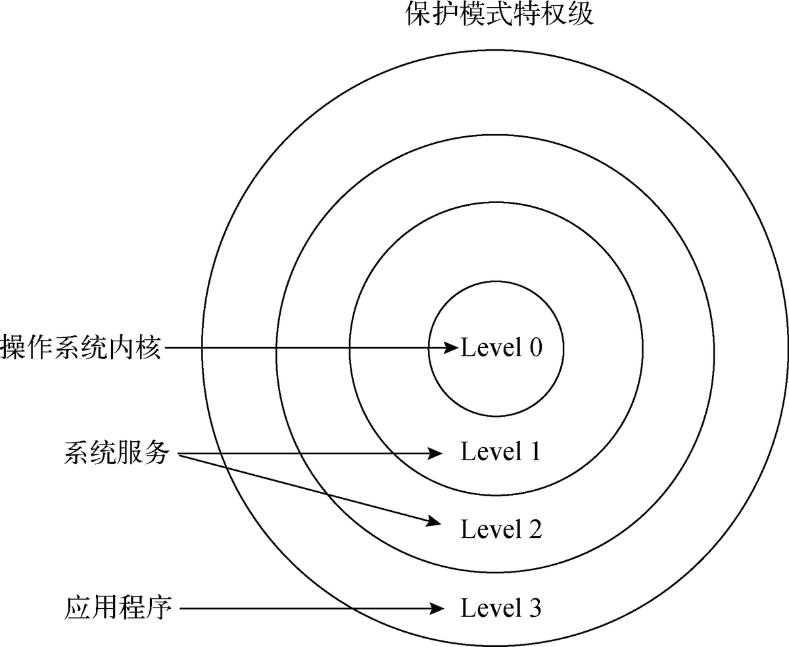

保护模式将特权分为0~3四个特权级，其中0特权级用来跑操作系统内核，3特权级用来跑应用程序，中间的两个特权级我们没有用上，但是可以用来跑一些系统服务（如一些系统调用）。某些特殊的指令只能在0特权级下运行，如果在其他特权级下跑了相应的指令，就会触发异常。为了描述特权级，操作系统引入了三个特权级类型：

- **CPL当前特权级**：描述的是当前执行的程序的特权级，当处理器执行特权级不同的代码的时候，才会修改CPL。
- **DPL描述符特权级：**就是用来描述描述符描述的目标的特权级的，比如我们`system_call`的目标就是系统的内核态，那么其相对应的门级描述符的DPL就是`0`，这里需要注意的是，DPL是嵌在描述子中的，这里说的描述子就是`GDT\IDT`等描述子，这些描述子的共同特点就是导向一个目标，也就是说这里的`DPL`是用来描述：**想要访问相应的目标，需要多少的特权级**
- **RPL请求特权级：**他表示这个请求的特权级，他嵌入在段选择子中

在进行访问的时候，实质上判断的是：`max(RPL, CPL) <= DPL`，如果满足这个的话，那么就能够访问


#### 段选择子及其选择过程

这是一个段选择子：

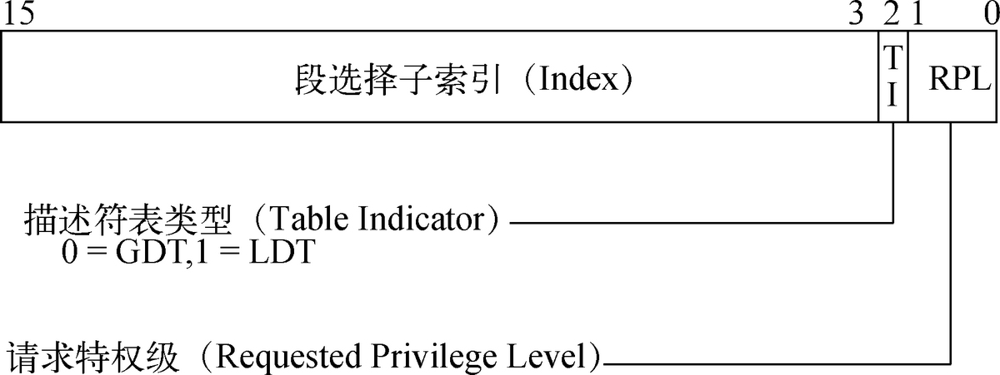

| 缩写 | 全称                      | 功能描述                         |
| :--- | :------------------------ | :------------------------------- |
| —    | Index                     | 用于索引目标段描述符             |
| TI   | Table Indicator           | 指示目标段描述符所在描述符表类型 |
| RPL  | Requested Privilege Level | 请求特权级                       |

段选择子是如何找到相应的内存段的呢？如下图所示：

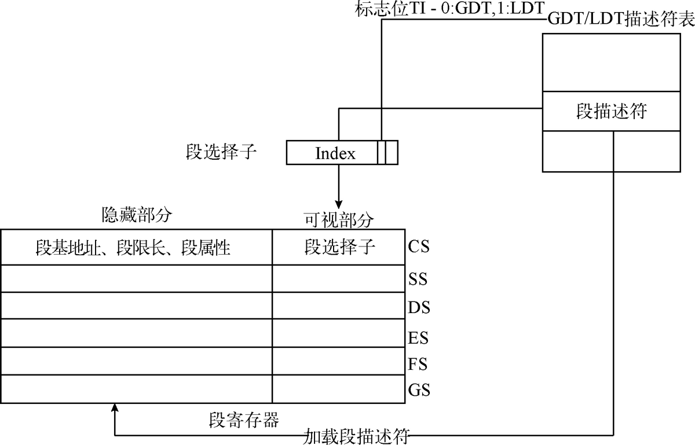

使用index进行索引，在GDT或LDT表中找到相应的描述符，找到描述符后，对`CPL,DPL,RPL`进行检测，如果检测无误，那么就将相应的描述符加载到段寄存器中，进行缓存。加载到段寄存器中的段对于用户来说就是一个”可用的段“，这和`Cache`非常相似。


在检索描述符的过程中，未必一定要从GDT中进行搜索：

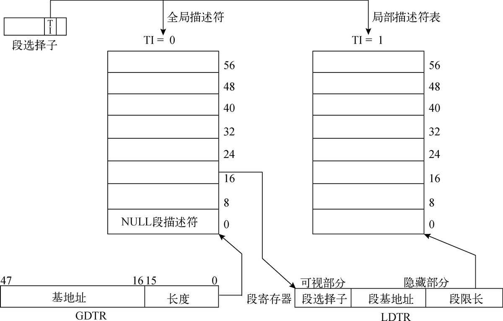

刚才讲述段选择子时，我们还有一个`TI`位，这个`TI`位用于指示是从GDT还是从LDT中进行搜索；作者对GDT和LDT的描述如下：

> - **全局描述符表（Global Descriptor Table，GDT）**。它本身不是一个段描述符，而是一个线性地址空间中的数据结构。在使用GDT前，必须使用LGDT汇编指令将其线性基地址和长度加载到GDTR寄存器中。由于段描述符的长度为8 B，那么GDT的线性基地址按8 B边界对齐可使处理器的运行效果最佳，GDT的长度为$8N - 1$（$N$是段描述符项数)。
> - **局部描述符表（Local Descriptor Table，LDT）**。它是一个LDT段描述符类型的系统数据段，因此处理器必须使用GDT的一个段描述符来管理它。处理器使用LLDT汇编指令可将GDT表内的LDT段描述符加载到LDTR寄存器，随后处理器会自动完成加载伪描述符结构体的工作。LDT段描述符可以保存在GDT的任何地方，如果系统支持多个LDT表，那么系统必须在GDT表中为每个LDT表创建独立的段描述符和段存储空间。为了避免地址转换，LDTR寄存器同样会保存LDT段描述符的段选择子、线性基地址以及长度。

如果想让操作系统在保护模式下运行，那么我们至少要建立一个GDT表，并将操作系统运行所必须的程序和数据保存在表中，事实上我们以后也不会去建LDT表了，只用GDT表也够了。当然，如果我们想要创建LDT也可以，可以创建一个或多个。


### 保护模式段管理机制

这一部分我们在上一章以及上一节中都已经有过简单的讲解，接下来我们对其进行全面的了解：

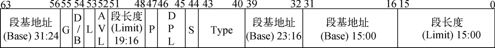

每个段描述子，由`8Byte`组成，我们可以通过段选择子来找到上面这样的一个段描述子，他大致可以被分为：

- 段基地址：被分为了很多段，合体之后就是完整的段基址了

- DPL：目标段的特权级

- G&段长度：这两个是配合使用的，先用一句C语言来表示一下真实的段长度：

  `ground_truth_limit = limit * G ? 4KB : 1Byte`;

  也就是说，在G是0的时候段长度的单位是`1Byte`，反之则为`4KB`

- D/B：这个有点复杂，作者是这样解释的：

  此位用于标识代码段的操作数位宽，或者栈段的操作数位宽以及上边界（32位代码/数据段应该为1，16位代码/数据段应该为0）

  - 可执行代码段，此位指定有效地址和操作数的默认宽度。置位时默认使用32位地址、32位或8位操作数；复位时默认使用16位地址、16位或8位操作数。前缀66h可调整默认操作数，而前缀67h可调整有效地址宽度
  - 栈段（SS寄存器中的数据段），此位指定栈指针的默认操作数。置位时默认使用32位栈指针（ESP），复位时默认使用16位栈指针（SP）。如果栈段是向下扩展的数据段，此位指定栈段的上边界
  - 向下扩展的数据段，此位指定上边界位宽。置位时上边界是FFFFFFFFh（4 GB），复位时上边界是FFFFh（64 KB）

除此之外，其他部分内容如下：

| 缩写 | 功能描述                                                     |
| :--- | :----------------------------------------------------------- |
| L    | 在保护模式下，此位保留使用，设置为0即可                      |
| AVL  | 此位被系统软件使用，通常情况下设置为0                        |
| P    | 表示段已在内存中，如果段寄存器加载一个不在内存中的段描述符（P=0）将会触发`#NP`异常。在复位此标志位的情况下，操作系统可自由使用其他可用的段描述符区域 |
| S    | 指定段描述符的类型，置位为代码/数据段，复位为系统段          |
| Type | 指定段/门描述符的类型，此位对S标志位作进一步解释             |

Type标志位区域可指定多种描述符类型，我们一个一个来看：

#### 代码段描述符

> | Type区域 |      |      |      | 功能                     |
> | :------- | :--- | :--- | :--- | ------------------------ |
> | 43       | 42   | 41   | 40   |                          |
> | 1        | C    | R    | A    |                          |
> | 1        | 0    | 0    | 0    | 非一致性、不可读、未访问 |
> | 1        | 0    | 0    | 1    | 非一致性、不可读、已访问 |
> | 1        | 0    | 1    | 0    | 非一致性、可读、未访问   |
> | 1        | 0    | 1    | 1    | 非一致性、可读、已访问   |
> | 1        | 1    | 0    | 0    | 一致性、不可读、未访问   |
> | 1        | 1    | 0    | 1    | 一致性、不可读、已访问   |
> | 1        | 1    | 1    | 0    | 一致性、可读、未访问     |
> | 1        | 1    | 1    | 1    | 一致性、可读、已访问     |
>
> - **A标志位（Accessed，已访问）**。它记录代码段是否已被访问过，当A=1时表示代码段已被访问过，当A=0时表示代码段未被访问过。处理器只负责置位此标志位，并不负责复位，从而只能借助程序手动将其复位。（建议在修改A和和P标志位时使用LOCK前缀锁总线。）
> - **R标志位（Readable，可读）**。可执行程序虽然可以被处理器运行，但如果想读取程序段中的数据就必须置位此标志位。当然，可执行程序段始终不能写入数据。在操作特权级允许的前提下，我们可以将CS段寄存器作为操作前缀，或将代码段描述符载入到数据段寄存器，来读取代码段中的数据。
> - **C标志位（Conforming，一致性）**。代码段可分为一致性代码段和非一致性代码段，处理器通过此标志位可以进行标识。一个低特权级的程序（代码段）可执行或跳转至一个高特权级（或相同特权级）的一致性代码段，并在执行高特权级代码段的过程中保持低特权级的CPL不变，即不会因为代码段进入高特权级而更新CPL值。如果程序想要跳转至一个不同特权级的非一致性代码段，除非使用调用门或者任务门，否则将会触发`#GP`异常。所有的数据段都是非一致性的，这意味着它们不能被低特权级的程序访问。

我们来回忆一下当时是怎么初始化我们的GDT的：

```gas
[SECTION gdt]

LABEL_GDT:            dd    0,0
LABEL_DESC_CODE32:    dd    0x0000FFFF,0x00CF9A00
LABEL_DESC_DATA32:    dd    0x0000FFFF,0x00CF9200

GdtLen    equ    $ - LABEL_GDT
GdtPtr    dw     GdtLen - 1
          dd     LABEL_GDT

SelectorCode32    equ        LABEL_DESC_CODE32 - LABEL_GDT
SelectorData32    equ        LABEL_DESC_DATA32 - LABEL_GDT

```

这里代码段描述符是：`0x00CF9A000000FFFF`，其数值与功能对应如下：

> | 位图范围 | 功能              | 数值（HEX） | 数值解释                |
> | :------- | :---------------- | :---------- | :---------------------- |
> | 0~15     | 段长度（15:00）   | `FFFF`      | 段长度4 GB              |
> | 16~31    | 段基地址（15:00） | `0000`      | 段基地址位于线性地址0处 |
> | 32~39    | 段基地址（23:16） | `00`        | 段基地址位于线性地址0处 |
> | 40~43    | Type区域          | `A`         | 非一致性、可读、未访问  |
> | 44       | S                 | `1`         | 代码段                  |
> | 45~46    | DPL               | `00`        | 0特权级                 |
> | 47       | P                 | `1`         | 已在内存中              |
> | 48~51    | 段长度（19:16）   | `F`         | 段长度4 GB              |
> | 52       | AVL               | `0`         | 软件可用位              |
> | 53       | L                 | `0`         | 忽略                    |
> | 54       | D/B               | `1`         | 32位数据段              |
> | 55       | G                 | `1`         | 段限长的颗粒度为4 KB    |
> | 56~63    | 段基地址（31:24） | `00`        | 段基地址位于线性地址0处 |

#### 数据段描述符

#### 

> | Type区域 |      |      |      | 功能                     |
> | :------- | :--- | :--- | :--- | ------------------------ |
> | 43       | 42   | 41   | 40   |                          |
> | 0        | E    | W    | A    |                          |
> | 0        | 0    | 0    | 0    | 向上扩展、只读、未访问   |
> | 0        | 0    | 0    | 1    | 向上扩展、只读、已访问   |
> | 0        | 0    | 1    | 0    | 向上扩展、可读写、未访问 |
> | 0        | 0    | 1    | 1    | 向上扩展、可读写、已访问 |
> | 0        | 1    | 0    | 0    | 向下扩展、只读、未访问   |
> | 0        | 1    | 0    | 1    | 向下扩展、只读、已访问   |
> | 0        | 1    | 1    | 0    | 向下扩展、可读写、未访问 |
> | 0        | 1    | 1    | 1    | 向下扩展、可读写、已访问 |
>
> - **E标志位（Expansion-direction，扩展方向）**。此标志位指示数据段的扩展方向，当E=1时表示向下扩展，当E=0时表示向上扩展，通常情况下数据段向上扩展。
> - **W标志位（Write-enbale，可读写）**。它记录着数据段的读写权限，当W=1时可进行读写访问，当W=0时只能进行读访问。
> - **A标志位（Accessed，已访问）**。它的功能与代码段描述符中的已访问标志位A功能相同，即记录数据段是否被访问过。

同理，数据段描述符是：`0x0000FFFF,0x00CF9200`即为`0x0000FFFF00CF9200`，信息如下：

> | 位图范围 | 功能              | 数值(HEX) | 数值解释                 |
> | :------- | :---------------- | :-------- | :----------------------- |
> | 0~15     | 段长度（15:00）   | `FFFF`    | 段长度4 GB               |
> | 16~31    | 段基地址（15:00） | `0000`    | 段基地址位于线性地址0处  |
> | 32~39    | 段基地址（23:16） | `00`      | 段基地址位于线性地址0处  |
> | 40~43    | Type区域          | `2`       | 向上扩展、可读写、未访问 |
> | 44       | S                 | `1`       | 数据段                   |
> | 45~46    | DPL               | `00`      | 0特权级                  |
> | 47       | P                 | `1`       | 已在内存中               |
> | 48~51    | 段长度（19:16）   | `F`       | 段长度4 GB               |
> | 52       | AVL               | `0`       | 软件可用位               |
> | 53       | L                 | `0`       | 忽略                     |
> | 54       | D/B               | `1`       | 默认操作数和默认地址宽度 |
> | 55       | G                 | `1`       | 段限长的颗粒度为4 KB     |
> | 56~63    | 段基地址（31:24） | `00`      | 段基地址位于线性地址0处  |


#### **系统段描述符**

> | Type区域 |      |      |      | 功能                      |
> | :------- | :--- | :--- | :--- | ------------------------- |
> | 43       | 42   | 41   | 40   |                           |
> | 0        | 0    | 0    | 0    | 保留                      |
> | 0        | 0    | 0    | 1    | 16位TSS段描述符（有效的） |
> | 0        | 0    | 1    | 0    | LDT段描述符               |
> | 0        | 0    | 1    | 1    | 16位TSS段描述符（使用中） |
> | 0        | 1    | 0    | 0    | 16位调用门描述符          |
> | 0        | 1    | 0    | 1    | 任务门描述符              |
> | 0        | 1    | 1    | 0    | 16位中断门描述符          |
> | 0        | 1    | 1    | 1    | 16位陷阱门描述符          |
> | 1        | 0    | 0    | 0    | 保留                      |
> | 1        | 0    | 0    | 1    | 32位TSS段描述符（有效的） |
> | 1        | 0    | 1    | 0    | 保留                      |
> | 1        | 0    | 1    | 1    | 32位TSS段描述符（使用中） |
> | 1        | 1    | 0    | 0    | 32位调用门描述符          |
> | 1        | 1    | 0    | 1    | 保留                      |
> | 1        | 1    | 1    | 0    | 32位中断门描述符          |
> | 1        | 1    | 1    | 1    | 32位陷阱门描述符          |

(1) LDT段描述符

它的段描述符用于记录LDT表的位置、长度和访问权限等信息，其位功能与TSS描述符的位功能相同。这里再补充一点：LDT可在各程序或任务间起到隔离作用。操作系统使用其他方法同样可以起到程序间的隔离作用，例如为每个任务创建独立的页表结构等。但是我们不用他

(2) TSS描述符

TSS用于保存任务的处理器状态信息。和其他的段一样，处理器必须借助TSS描述符才能对任务状态段进行访问和管理。图6-13描绘了TSS描述符的位功能。

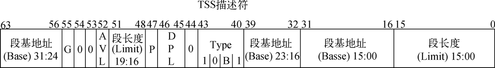


#### 保护模式的TSS

TSS是负责在任务切换过程中记录寄存器信息、切换栈的，总的来说就是：

- 提权时栈切换用到了 TSS
- 切换一堆寄存器

当然，我们也需要知道，我们的程序只能从内核往应用中去跳转，而不能直接从应用向内核跳转，想要完成这一目标，就只能通过系统调用实现

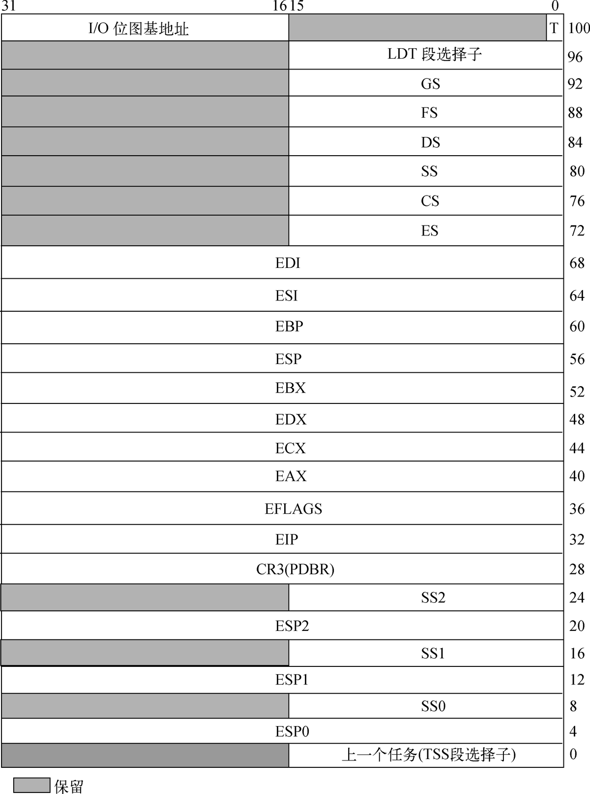


#### 保护模式的门描述符

IDT与GDT是相似的，他们都是描述表，只不过描述的信息不同，GDT是在描述全局段信息，而IDT在描述的是`interrupt`即中断信息，想要在IDT表中找到对应的表项，也需要使用`索引`，而这里的`索引`就是`中断向量号`，找到的表项则是一个个的`门描述符`，如下：

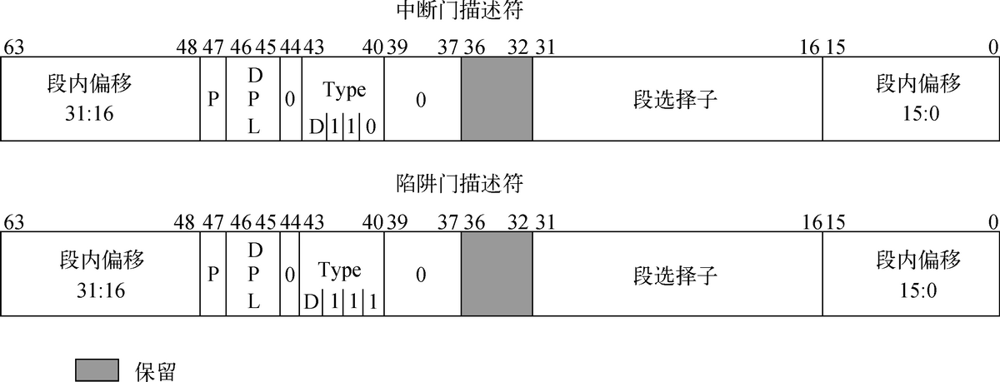

其中，门又被分为中断门、陷阱门、等等，但是我们只用了上面这两种，他们的区别在于：

- Type位上不同
- 在使用中断门时，系统会自动屏蔽掉其他中断


可以看到：每个门描述符都记录着一些关键信息：

- 段选择子+段内偏移：指向一个地址，表示处理该中断例程的入口
- DPL： 描述符特权级

当然，还有一种叫做调用门：

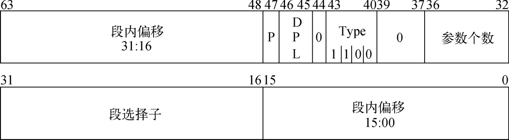

他比中断门多了一个参数个数。


### 保护模式的中断/异常处理机制

异常处理的总体流程如下：

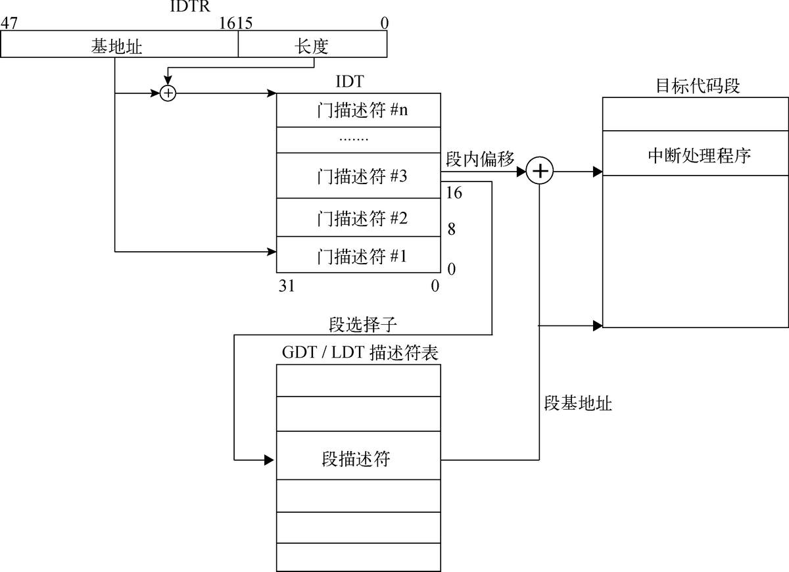

总体来说就是：当中断发生时，通过IDTR寄存器找到IDT表的地址，然后再根据中断向量的大小，找到对应的IDT表项，IDT表项中对应着一个段选择子和一个偏移量，然后我们拿着这个段选择子去GDT或是LDT去找段基地址，拿到的段基地址和偏移量求和就是最终中断处理程序的线性地址了。


### 保护模式的页管理机制

在之前的学习中，我们了解了处理器的段管理机制，我们输入的逻辑地址会经过段管理机制后被转化为线性地址。接下来我们学习页管理机制，看看线性地址是如何被转变为物理地址的。

首先先来思考一下，**分段模式有哪些局限性**？

- 分段机制没有办法突破物理内存大小的限制的，一个32位的机器的寻址范围就只有4GB
- 在多进程运行的时候，需要动态分配连续内存，没法在编译链接的时候确定各个进程的起始地址

引入页管理机制就解决了这一问题，可通过`MOV CR0`指令置位PG标志位来使能页管理机制；保护模式共支持32位分页模式、PSE模式和PAE模式三种页管理模式。


#### 32位分页模式

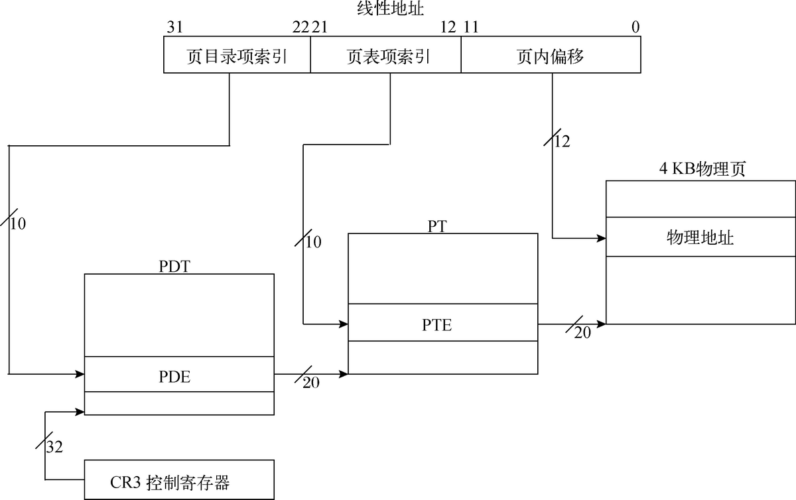

这个就是我们在计算机组成原理课程中学习过的分页模式，总体流程如下：

- 线性地址被切分为： **`页目录项索引`, `页表项索引`, `页内偏移`**三个部分
- 先使用页目录项索引，在PDT中找到相应的页目录
- 在找到的页目录中，使用页表项索引，找到相应的页表
- 在找到的页表中，使用相应的偏移找到对应的物理地址

其中，`页目录项索引`, `页表项索引`, `页内偏移`的位宽与人为划分相关，同时，想要找到PDT，需要CR3控制寄存器作为索引，无论是PDT或是PT抑或是内存页，除了存储索引、数据的部份外，还有部分描述区：

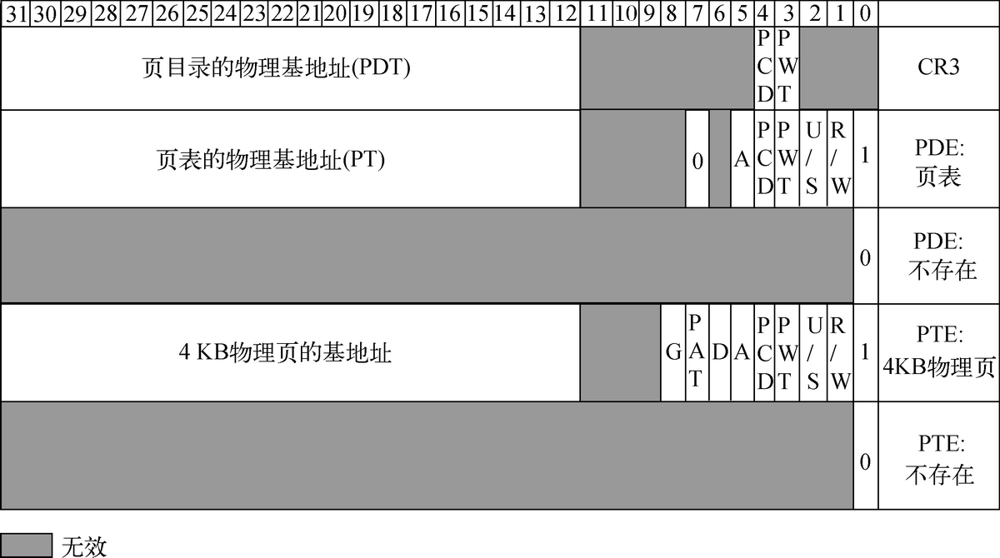

其功能如下：

> 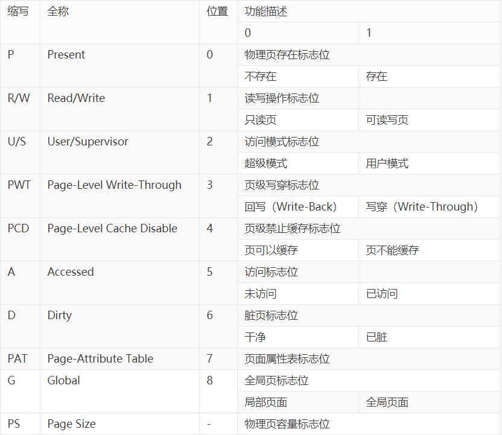

同时，在MSR寄存器中，有一个`IA32_PAT寄存器`，它用于设置页属性PAT的内存类型，其结构如下：

> 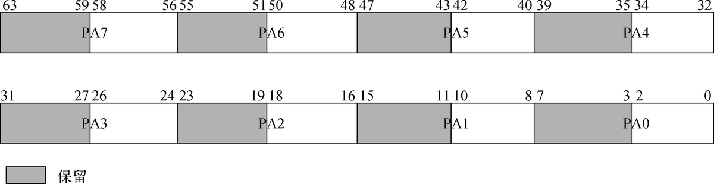

由8个部分组成，每个部分都包含三个有效位和五个保留位，保留位必须被置为0，其中有效位的含义如下：

> | PAT  | PCD  | PWT  | PAT项 | 内存类型 |
> | :--- | :--- | :--- | :---- | :------- |
> | 0    | 0    | 0    | PAT0  | WB       |
> | 0    | 0    | 1    | PAT1  | WT       |
> | 0    | 1    | 0    | PAT2  | UC-      |
> | 0    | 1    | 1    | PAT3  | UC       |
> | 1    | 0    | 0    | PAT4  | WB       |
> | 1    | 0    | 1    | PAT5  | WT       |
> | 1    | 1    | 0    | PAT6  | UC-      |
> | 1    | 1    | 1    | PAT7  | UC       |


关于其中的WB等内存类型，描述如下：

> | PAT值  | 缩写 | 内存类型       | 功能描述                                                     |
> | :----- | :--- | :------------- | :----------------------------------------------------------- |
> | 00h    | UC   | Uncacheable    | 内存不可缓存，对设备内存I/O映射非常有用，使用在物理内存中将导致执行效率降低 |
> | 01h    | WC   | WriteCombining | 内存不可缓存，也不用强制遵循处理器总线的一致性协议。写操作可能会延迟执行，以减少内存访问次数 |
> | 02h    | —    | 保留           | 无                                                           |
> | 03h    | —    | 保留           | 无                                                           |
> | 04h    | WT   | WriteThrough   | 读写均被缓存，读操作先访问缓存行；写操作将同时写入到缓存行和内存 |
> | 05h    | WP   | WriteProtected | 读操作先访问缓存行；写操作将会扩散到总线上的所有处理器，使处理器的对应缓存行失效 |
> | 06h    | WB   | WriteBack      | 整个读写操作皆在缓存行中进行。写操作将延迟更新到内存，从而减少内存访问次数 |
> | 07h    | UC-  | Uncache        | 与UC功能相同，但可在MTRR寄存器中使用WC覆盖                   |
> | 08~FFh | —    | 保留           | 无                                                           |

#### PSE模式

PSE模式是32位分页模式的扩展，它允许处理器在保护模式下使用4 MB的物理页。其寻址过程如下：

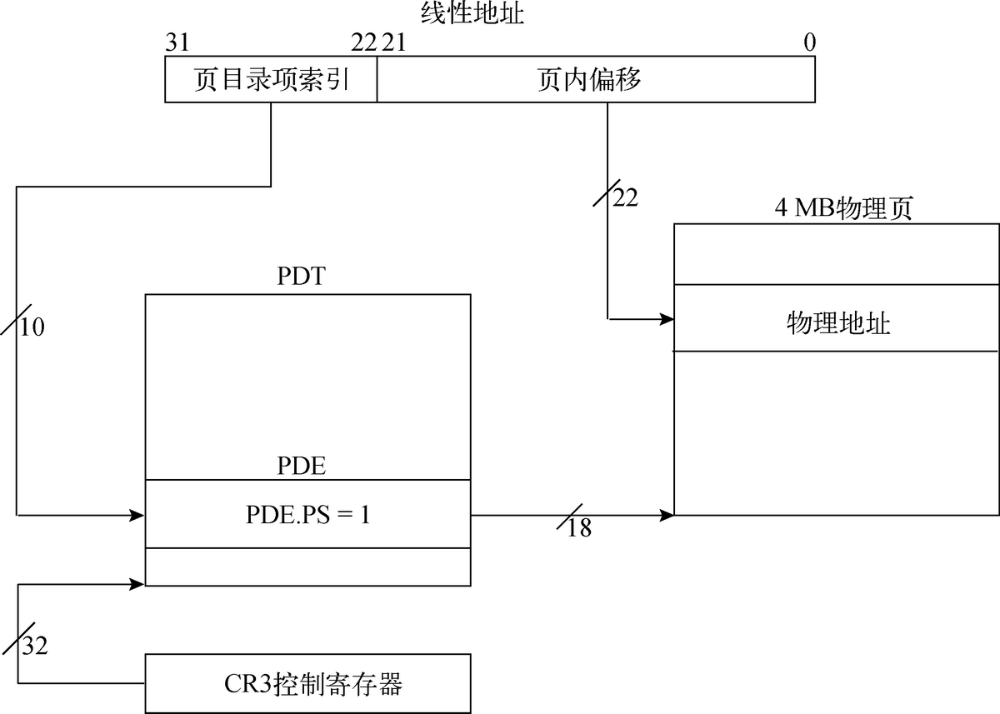


### 保护模式地址转换的过程

其实在前面的讲解中，我们已经把这个问题讲得很透彻了，这里就当作是一个小的总结吧，先看图

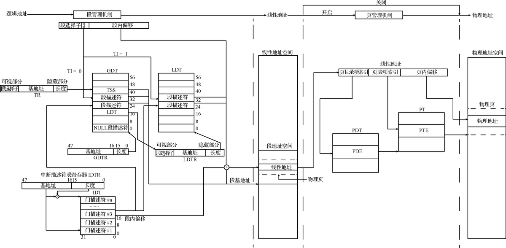


从抽象的模块来说，整个寻址通过了两个大的模块： `段管理`， `页管理`。段管理将地址从逻辑地址转化为了线性地址，而页管理机制接收线性地址，将线性地址映射为物理地址。从具体的转化、映射来说：

- 从逻辑地址到线性地址的转化是通过GDT、LDT中的描述符或是通过IDT中的门级描述符实现的
- 从线性地址到物理地址的转化是通过页表的索引实现的


## IA-32e模式

IA-32e模式又被称为长模式（long mode），在段管理部分，IA-32e模式进行了部分精简，在页管理机制中，IA-32e模式加入了更多层次的页表：

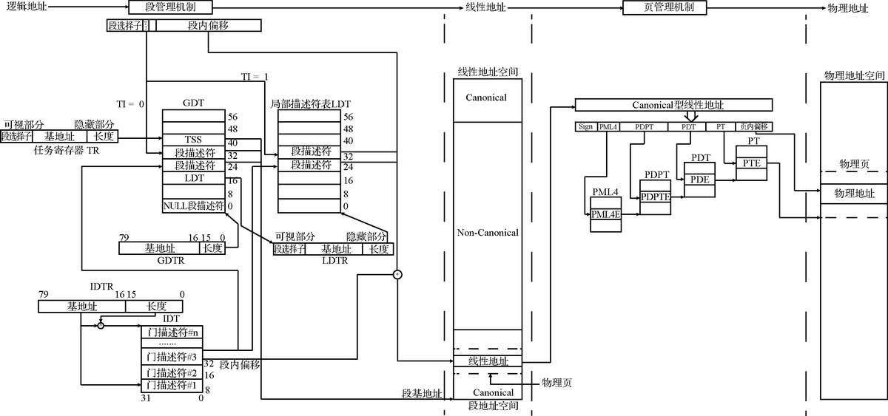


