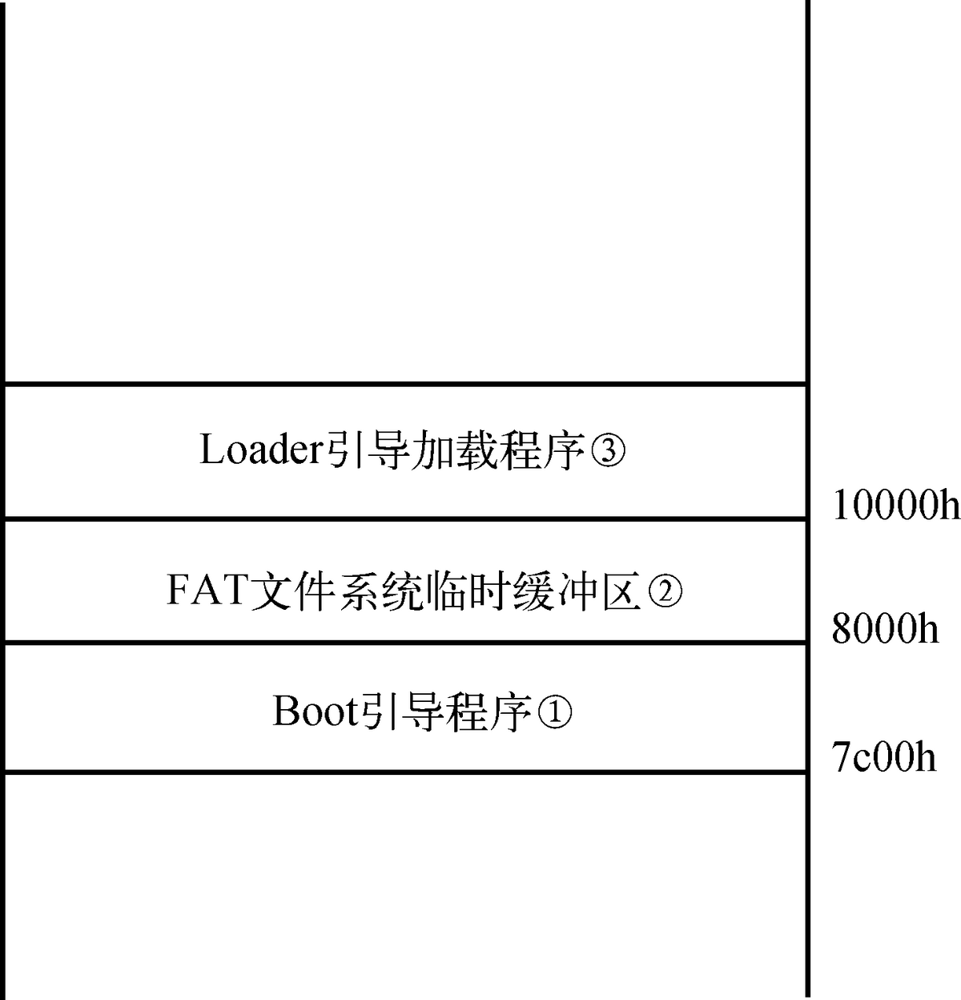

# 64位操作系统——（五）完善BootLoader

---

作者：王赛宇

参考列表：

- 主要参考：《一个六十四位操作系统的设计与实现》——田雨
- 《Using as》 ——Dean Elsner &  Jay Fenlason  & friends
- nasm 用戶手册
- [处理器startup.s 常见汇编指令...](https://blog.csdn.net/uunubt/article/details/84838260)

---

在最前面的三章中，我们学习并完成了一个运行在虚拟机中的操作系统，在后面的学习中，我们会针对每一个实现过的模块，对其进行优化。在这里，我们会对BootLoader进行完善，将我们的操作系统迁移到物理平台上运行。本章将解决以下几个问题：

- `Big Real Mode`是如何实现的？
- 在进入内核之前内存空间是如何分布的？
- 如何将我们的系统烧到U盘中？
- 在程序上要进行哪些修改？


## Big Real Mode的实现原理

首先，为什么在实模式下只能进行`1MB`以内的寻址呢？这是因为在这个模式下，我们寄存器只有`16位`，同时寻址模式是：`goal = base << 4 + offset `，这就导致，我们只能进行`1MB`的寻址。但是我们的CPU有没有更广范围的寻址能力呢？如果是比较新的CPU，那么就是有的，那么更广的寻址能力是如何实现的呢？是通过保护模式下的寻址方法实现的。那么我们就准备好保护模式运行所必须的GDT以及代码段描述符和数据段描述符，接着开启A20地址线并跳转至保护模式;在保护模式下向目标段寄存器装载段选择子，处理器在向目标段寄存器加载段选择子的同时，还将段描述符加载到目标段寄存器中（隐藏部分），随后再切换回实模式。

切换回实模式下，如果目标段寄存器的值不被更改，那么目标段寄存器仍然存放着相应描述符的信息，也就是说现在访问内存时使用的是保护模式的寻址方式，所以就能够访问到更广泛的内存区域了。


## 进入内核前的内存空间分布

这里我们不再降解如何探测内存，初级篇中我们已经有所讲解了。在之前，我们仅仅关注了哪些内存是可用的，现在我们来关注一下那些不可用的内存。这是我们在内存管理的处理探测内存时截图的一部分：


可用内存主要集中在前面一段，即：


可以看到，在前1MB的内存空间中，有着多段不同类型的内存，随后到了1MB后，有大段未被使用的可用内存。并且，在前1MB内存之内，还有一些内存空洞的存在。接下来我们来了解一下在执行boot时以及执行loader时，这1MB空间的内存中到底存着什么样的数据？



- 我们的Boot程序自动装载到了`0x7c00h`的内存区域
- Loader程序保存在FAT12文件系统中，我们的FAT文件系统临时缓冲区主要负责保存FAT12文件系统的目录项等信息
- 当我们的Boot从FAT12文件系统中找到Loader后，会将其复制到`0x10000h`为首的内存区域中

回忆起来，我们的Boot程序大小不能超过512KB，所以不能做太多的事情，所以我们的Boot程序主要任务是进行一些基础的初始化，以及在软盘中找到Loader，那么我们接下来看Loader时是怎么样的：


- 我们进入loader后，原来的boot就已经没有用了，于是`0x7c00h`就变成了我们的栈基址。
- FAT的索引区域仍然没有变化，在loader中，我们仍然需要使用这块内存进行索引，来搜索Kernel.bin
- 不断的将找到的Kernel.bin文件从软盘中读取到`0x7e00h`（缓冲区），再将缓冲区的数据拷贝到`1MB`处。到此位置内核程序加载完成后面将进行内存探测
- 进行内存探测，将探测信息存储在`0x7e00h`开头的内存区域，在内核层会对其进行使用，内存探测结束
- Loader引导加载程序将通过BIOS中断服务程序获取VBE信息，这些信息会保存在物理地址0x8000处。
- 取得VBE信息后，Loader引导加载程序还要根据VBE提供的信息再取得显示模式信息
- 随着硬件设备信息获取结束，处理器将进入保护模式。保护模式将使用物理地址0x90000处的几个物理页（4 KB）作为保护模式的临时页表。


## U盘启动

能做到这里，大家应该安装过Ubuntu系统吧，在安装Ubuntu的过程中，大家一般的做法就是：

- 从网上下载一个磁盘映像文件（ubuntu20.04.iso）
- 然后再使用U盘制作工具（UltraISO、rufus）将磁盘映像文件做到U盘里面

回忆一下写入的过程，在过程中我们需要选择启动模式，在这里我们讲解两种模式：

- USB-FDD： 模拟软盘启动模式，它可使BIOS系统将U盘模拟成软盘进行引导。
- USB-HDD： 模拟硬盘启动模式，它可使BIOS系统将U盘模拟成硬盘进行引导。

一般而言，我们在装Ubuntu、Windows的时候都是选HDD的，但是我们实现的是软盘的形式，所以我们需要选择USB-FDD模式。


### 启动盘制作

接下来我们制作启动盘，如果使用作者的方案，由于FAT12只能管理32MB的空间，所以我们需要一个比较小的U盘，为此我买了一个32MB的U盘，接下来我们按照作者给出的方法，将这个U盘格式化为`USB-FFD`的格式，`USB-FFD`就是模拟软盘的U盘（这一步在windows下进行，我没有截图）。

随后，我们进入linux系统，这里用的是`ubuntu 20.04`系统，使用：

```shell
sudo fdisk -l
```

来查看自己U盘对应的盘符，下面是我U盘所对应的：

```
Disk /dev/sdb：31.38 MiB，32899072 字节，64256 个扇区
Disk model: UDisk           
单元：扇区 / 1 * 512 = 512 字节
扇区大小(逻辑/物理)：512 字节 / 512 字节
I/O 大小(最小/最佳)：512 字节 / 512 字节
磁盘标签类型：dos
磁盘标识符：0x4e3a524f
```

可以看到，我的U盘对应的是`/dev/sdb`。接下来，我们将原本的`boot.bin`写入U盘（这段我在makefile中写好了）：

```shell
sudo dd if=$(BOOT_BUILD_DIR)/boot.bin of=/dev/sdb bs=512 count=1 conv=notrunc
```

接下来，我们让电脑默认使用`USB-FFD`进行启动，并且将U盘插入电脑，重启：


这时，我们的Boot就正常的运行起来了，但是为了在物理平台上良好的运行，我们需要对他进行一些更改：


在进行了相应的更改后，我们也为makefile文件新加了一些方法：

```makefile
install_physical: all
	sudo cp $(BOOT_BUILD_DIR)/loader.bin /media/wangsy/disk/
	sudo cp $(KERNEL_BUILD_DIR)/kernel.bin /media/wangsy/disk/
	sudo dd if=$(BOOT_BUILD_DIR)/boot.bin of=/dev/sdb bs=512 count=1 conv=notrunc
	echo 挂载完成，请将U盘插入并启动
```

其中，`/media/wangsy/disk/`是我的U盘的自动挂载路径。我们再次运行：


接下来我们继续对原有的代码进行修改：


等等等等，这里太多了，直接做一次提交，自己看吧。

