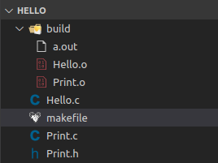
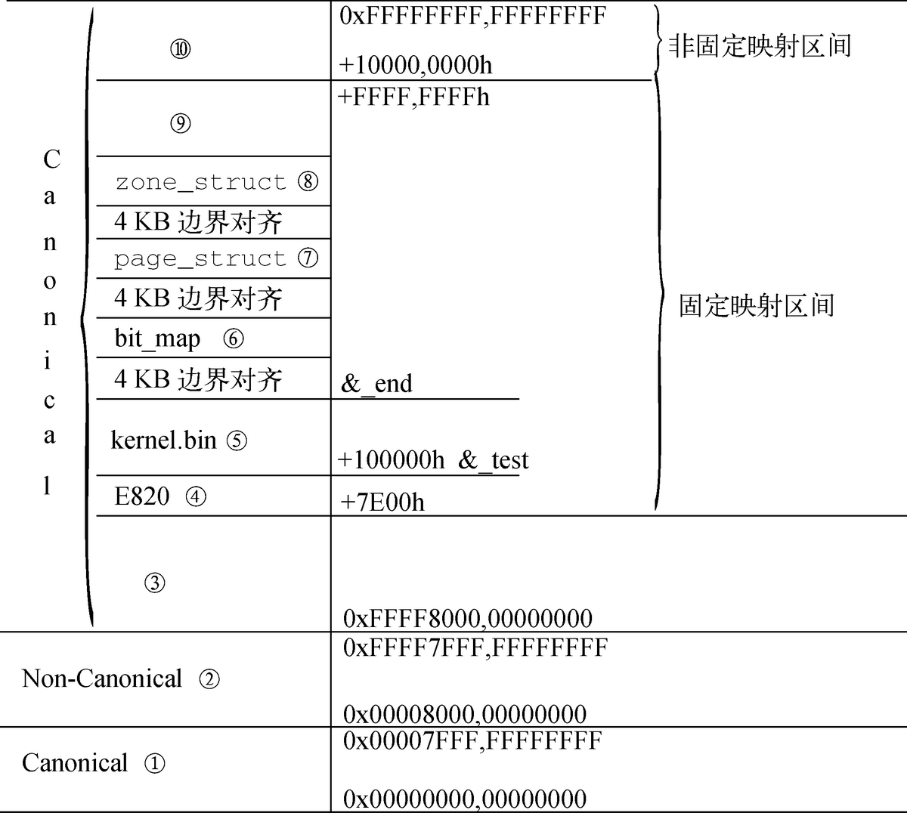
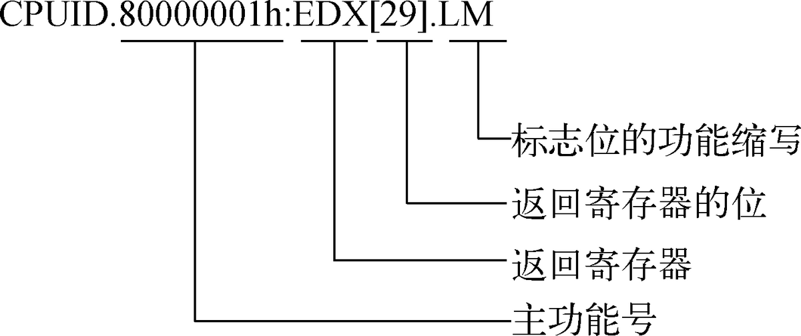
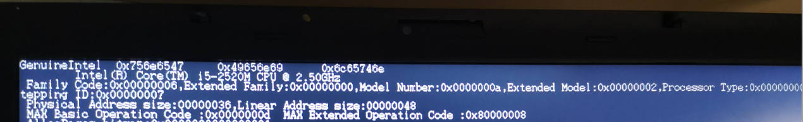

# 64位操作系统——（六）内核主程序


---

作者：王赛宇

参考列表：

- 主要参考：《一个六十四位操作系统的设计与实现》——田雨
- 《Using as》 ——Dean Elsner &  Jay Fenlason  & friends
- nasm 用戶手册
- [处理器startup.s 常见汇编指令...](https://blog.csdn.net/uunubt/article/details/84838260)

---


在上一节中，我们将操作系统从虚拟平台迁移到了物理平台，为此我们购买并制作了一个32MB的USB-FFD启动盘，并最终在我的个人电脑ThinkPadT530上完成了启动，系统的图形显示、内存初始化、中断初始化、进程切换全部无误，并且创建出了`init`守护进程，从`init`守护进程中创建出了用户进程，用户进程通过系统调用调用了我们定义好的系统调用函数，完成了HelloWorld输出。

在本节中，我们会系统的学习`makefile`文件的编写、操作系统的线性地址空间划分、获取处理器信息并展示

## makefile编写

在本节中，我们试图学习makefile文件的编写，我们会先从一个简单的例子入手，并一步一步的对它进行优化，最终我们将解读本项目中的makefile文件

### 一个最简单的例子

假设我们现在有一个这样的项目：


```C
/*Hello.c*/
#include <stdio.h>

int main (){
    printf("Hello World!");
    return 0;
}
```

现在我们想要编译运行这个程序需要在控制台中输入：

```shell
gcc Hello.c 
./a.out
```

随后，控制台就会输出我们项目的结果，这非常简单。但是如果我们多了一些其他的文件呢？

```C
/*Print.h*/
#ifndef TEST_PRINT_H
#define TEST_PRINT_H

void print(char* output_string);

#endif
/*Print.c*/
#include <stdio.h>

void print(char* output_string){
    printf("%s", output_string);
}
```

可以看到，我们对printf函数做了一个封装，让用户传进来一个字符串，然后我们调用printf函数再把字符串输出。同时，我们更改`Hello.c`中的调用方法：

```C
/*Hello.c*/
#include "Print.h"

int main (){
    print("Hello World!");
    return 0;
}
```

那么我们现在要怎么编译这个文件呢？如果我们还是像刚才一样编译：

```shell
# wangsy @ wangsaiyu in ~/Code/Hello [5:57:38] 
$ gcc Hello.c  
/usr/bin/ld: /tmp/cckAGAaD.o: in function `main':
Hello.c:(.text+0x10): undefined reference to `print'
collect2: error: ld returned 1 exit status
```

这是由于我们`include`了`Print.h`，但是`Print.h`仅对`print()`函数进行了声明，而没有对其进行实现，所以我们需要将编译语句更改一下：

```shell
gcc -c Print.c
gcc -c Hello.c
gcc Print.o Hello.o 
./a.out
```

这一次我们改动了很多，那么如果每次运行都要输入这么多东西就显得非常不ok，于是就有了makefile，我们将这一系列的行为封装在makefile中：

```makefile
all: Hello.c Print.c Print.h
	gcc -c Print.c
	gcc -c Hello.c
	gcc Print.o Hello.o 
clean: 
	rm -rf ./*.o
	rm -rf ./*.out
```

其中，`all`表示make的目标，`all`后方的文件表示makefile的依赖，下方表示执行的语句，于是我们在控制台直接输入:

```shell
make all
./a.out
```

就可以执行刚才的步骤，同时，执行`make clean`就可以删除生成的目标，这样我们就完成了一个最简单的makefile文件！

### 对不同文件进行分离

回看刚才的makefile，我们将所有的语句插入到一个目标下面了，这好么？这不好。为什么不好？因为随着项目愈发复杂，我们想要添加的目标就越来越多，需要添加的代码也越来越多，那么这个makefile文件的可读性就会越来越低，这是我们不想看到的，于是我们对他进行改写：

```makefile
all: main.o Print.o
	gcc main.o Print.o

main.o: main.c Print.h
	gcc -c main.c

Print.o: Print.c Print.h
	gcc -c Print.c
```

在这里，执行`make all`的时候，会检测`main.o, Print.o`是否存在于当前文件夹中，如果不存在，那么就在下方进行搜索，执行我们已经定义好的生成语句。这样会达到与刚才相同的效果。在这种情况下，如果我们想要添加一个文件，就只需要在`all`标签后的依赖中添加相应的依赖，然后在下方添加相应的生成方法即可。这样的做法使我们增减文件变得更加方便快捷。


### 使用变量进行表达

如果我们想把生成的文件放在一个`build`文件夹中,应该如何改变?实质上我们只需在`gcc`语句后面使用`-o`来指定输出位置即可

```makefile
all: build/Hello.o build/Print.o
	gcc build/Hello.o build/Print.o -o build/a.out

build/Hello.o: Hello.c Print.h
	gcc -c Hello.c -o build/Hello.o

build/Print.o: Print.c Print.h
	gcc -c Print.c -o build/Print.o
```

```shell
# wangsy @ wangsaiyu in ~/Code/Hello [22:23:11] 
$ make
gcc -c Hello.c -o build/Hello.o
gcc -c Print.c -o build/Print.o
gcc build/Hello.o build/Print.o -o build/a.out
```

这样我们就能达到相应的目的了:



那现在我不想让存储目标的文件夹叫build了,想让他叫Build,该怎么办呢?难道要一个一个改么,这非常无趣。这时候我们引入变量的概念：

```makefile
BUILD_DIR=build

all: $(BUILD_DIR)/Hello.o $(BUILD_DIR)/Print.o
	gcc $(BUILD_DIR)/Hello.o $(BUILD_DIR)/Print.o -o $(BUILD_DIR)/a.out

$(BUILD_DIR)/Hello.o: Hello.c Print.h
	gcc -c Hello.c -o $(BUILD_DIR)/Hello.o

$(BUILD_DIR)/Print.o: Print.c Print.h
	gcc -c Print.c -o $(BUILD_DIR)/Print.o

clean:
	rm -rf $(BUILD_DIR)/*
```

这里我们使用了一个变量`BUILD_DIR`他表示用于存储生成目标的文件夹。在下面，我们使用`$(变量名)`的方法可以对他进行引用。通过这种写法，如果有人让我们改文件夹的名字，那么我们就只需要将`BUILD_DIR`的值进行更改即可！


### 合并相同部分

我们发现，生成`Hello.o`与生成`Printk.o`的方法非常相似，如果我们又写了一百个相似的方法，那么我们难道要把这相同的两行代码重复一百次么？显然不，在这里我们引入`makefile`中的`for`循环来解决这个问题：

```makefile
BUILD_DIR=build
C_FILE_LIST=Hello Print
C_FILE_BUILD_GOALS=$(foreach file, $(C_FILE_LIST), $(BUILD_DIR)/$(file).o)

define \n


endef

all: build_all_c_code
	gcc $(C_FILE_BUILD_GOALS) -o $(BUILD_DIR)/a.out

build_all_c_code:
	$(foreach file, $(C_FILE_LIST), gcc -c $(file).c -o $(BUILD_DIR)/$(file).o ${\n})

clean:
	rm -rf $(BUILD_DIR)/*
```

我们从上向下一步一步来理解这个文件，我们先将中间的值进行输出看看，为了输出变量，我们对makefile文件进行改写：

```makefile
BUILD_DIR=build
C_FILE_LIST=Hello Print
C_FILE_BUILD_GOALS=$(foreach file, $(C_FILE_LIST), $(BUILD_DIR)/$(file).o)

define \n


endef

all: build_all_c_code
	@echo "run all"
	gcc $(C_FILE_BUILD_GOALS) -o $(BUILD_DIR)/a.out

build_all_c_code:
	@echo "run build_all_c_code"
	$(foreach file, $(C_FILE_LIST), gcc -c $(file).c -o $(BUILD_DIR)/$(file).o ${\n})

output_args:
	@echo "C_FILE_BUILD_GOALS: $(C_FILE_BUILD_GOALS)"

clean:
	rm -rf $(BUILD_DIR)/*
```

首先，我们执行`output_args`:

```shell
# wangsy @ wangsaiyu in ~/Code/Hello [22:36:41] C:130
$ make output_args
C_FILE_BUILD_GOALS:  build/Hello.o  build/Print.o
```

可以看到，我们的`C_FILE_BUILD_GOALS`就是一个字符串，他用空格分割开了我们生成的目标，他是使用

````makefile
C_FILE_BUILD_GOALS=$(foreach file, $(C_FILE_LIST), $(BUILD_DIR)/$(file).o)
````

生成的，其含义在于：

- 使用空格作为关键字将`C_FLIE_LIST`进行分割，用file变量遍历其中的每个元素
- 使用`$(BUILD_DIR)/$(file).o`进行填充，形成一个新的字符串

我们的`C_FILE_LIST=Hello Print`包含了两个目标，那么生成这样的结果也不难理解。

接下来，我们在执行`all`之前一定会执行`build_all_c_code`，`build_all_c_code`中也使用了这样的for循环，不过该for循环用于循环生成对象。

请大家结合我的讲解，进一步理解一下这个`makefile`文件的含义。当我们这么写一个makefile文件的时候，新增一个普通文件就只需要在`C_FILE_LIST`中添加一个文件名即可。执行后效果如下：

```shell
# wangsy @ wangsaiyu in ~/Code/Hello [22:36:43] 
$ make
run build_all_c_code
gcc -c Hello.c -o build/Hello.o 
gcc -c Print.c -o build/Print.o 
run all
gcc  build/Hello.o  build/Print.o -o build/a.out
```


### 理解项目中的makefile

首先我们将这个makefile摆出来：

```makefile
C_FILE_LIST=main position printk font gate trap memory lib interrupt task cpu systemcall
C_FILE_BUILD_GOALS=$(foreach file, $(C_FILE_LIST), ./build/$(file).o)

ASM_FILE_LIST=head entry
ASM_FILE_BUILD_GOALS=$(foreach file, $(ASM_FILE_LIST), ./build/$(file).o)

define \n


endef

all: system
# 生成kernel.bin
	@objcopy -I elf64-x86-64 -S -R ".eh_frame" -R ".comment" -O binary ./build/system ./build/kernel.bin

system: Kernel.lds build_all_c_code build_all_asm_code
# 
	@ld -b elf64-x86-64 $(ASM_FILE_BUILD_GOALS) $(C_FILE_BUILD_GOALS) -T Kernel.lds -o ./build/system

build_all_c_code:
	@$(foreach file, $(C_FILE_LIST), @gcc-8  -mcmodel=large -fno-builtin -fno-stack-protector -m64 -c $(file).c -o ./build/$(file).o  ${\n})

build_all_asm_code:
	@$(foreach file, $(ASM_FILE_LIST), @gcc-8 -E $(file).S > ./build/$(file).s  ${\n} as --64 -o ./build/$(file).o ./build/$(file).s ${\n})

clean: 
	@rm -rf ./build/*

```

这是内核层的makefile，`C_FILE_LIST`、`C_FILE_BUILD_GOALS`和我们刚才讲的效果完全相同，`ASM_FILE_LIST`是汇编语言代码，在生成总目标前，需要生成system文件，`system`依赖于`build_all_c_code`和`build_all_asm_code`，这非常好理解，`build_all_c_code`与上面讲解中的`build_all_c_code`效果完全相同，`build_all_asm_code`是汇编版的`build_all_c_code`。

总体来说我们这个`makefile`文件思路非常清晰，应该是非常好理解的。它最大的优点是使用起来可更改性非常好。


## `Kernel.lds`链接脚本

上一节中，我们讲解了项目中的`makefile`脚本，makefile脚本用于自动生成目标，非常值得一学。接下来我们继续学习项目中的`Kernel.lds`脚本，想较于`makefile`脚本，`Kernel.lds`脚本只需要了解即可：

```gas
OUTPUT_FORMAT("elf64-x86-64","elf64-x86-64","elf64-x86-64")
OUTPUT_ARCH(i386:x86-64)
ENTRY(_start)
SECTIONS{

        . = 0xffff800000000000 + 0x100000;
        .text : {
                _text = .;
                *(.text)

                _etext = .;
        }
        . = ALIGN(8);
        .data : {
                _data = .;
                *(.data)

                _edata = .;
        }
        .rodata : {
		_rodata = .;	
		*(.rodata)
		_erodata = .;
	}

	. = ALIGN(32768);
	.data.init_task : { *(.data.init_task) }
        .bss : {
                _bss = .;
                *(.bss)
                _ebss = .;
        }
        _end = .;
}
```

- `. = 0xffff800000000000 + 0x100000`：表示程序被装载的起始地址，这里是现行地址，表示内核程序被装载在`1MB`开头的空间中
- `OUTPUT_FORMAT(DEFAULT,BIG,LITTLE)`：这里分别表示在三种模式下输出的文件格式
- `OUTPUT_ARCH(BFDARCH)`：它指定输出文件的处理器体系结构。
- `ENTRY(SYMBOL)`。它将标识符`SYMBOL`设置为程序的入口地址，即执行程序的第一条指令所在地址。在本项目中为：`ENTRY(_start)`
- `SECTIONS`：`SECTIONS`关键字负责向链接器描述如何将输入文件中的各程序段（数据段、代码段、堆、栈、BSS）部署到输出文件中，同时还将规划各程序段在内存中的布局。

这个不是我们了解的重点，所以了解一下就可以了，个人理解这个文件重点有二：

- `. = 0xffff800000000000 + 0x100000;`标记了装载位置
- `. = ALIGN(32768);`标记了`init_task`的对齐模式，在后方利用了该对齐模式进行搜索


## 操作系统的线性地址空间划分



## 获取处理器的信息


在这一节中，我们希望能够获取CPU的信息，并且进行简单的输出，在此之前，我们先来简单的回顾一下`CPUID`指令：

### 复习与封装CPUID查询指令

#### CPUID查询指令

首先看这张图：



cpuid 指令由 eax 寄存器获得输入，执行 cpuid 指令前，将功能号传给 eax 寄存器:

输入：

- eax：主功能号，支持的最大主功能号是14h
- ecx：扩展信息的主功能号， 从80000000h到80000008h

输出：

- eax
- ebx
- ecx
- edx


#### 封装CPUID指令

我们希望在C语言里面使用相关的指令，所以需要对其进行简单的封装：

```C
/**
 * 封装的CPUID指令
 * @param main_operation: 主查询号
 * @param sub_operation: 辅查询号
 * @param res_eax: 返回的eax
 * @param res_ebx: 返回的ebx
 * @param res_ecx: 返回的ecx
 * @param res_edx: 返回的edx
 */
void DoCpuid(unsigned int main_operation, unsigned int sub_operation, unsigned int * res_eax, 
             unsigned int * res_ebx, unsigned int * res_ecx, unsigned int * res_edx) {
    __asm__ __volatile__  ("cpuid    \n\t"
                            :"=a"(*res_eax),"=b"(*res_ebx),"=c"(*res_ecx),"=d"(*res_edx)
                            :"0"(main_operation),"2"(sub_operation)
                        );
}
```


### 使用CPUID指令，输出CPU相关的信息

这里我们就不深究CPUID到底怎么用了，学起来非常的多，我们这里就图个热闹，借用作者的代码来了解一下就可以了：

```C
/* =========================================================================
 =                              gate.h中函数的实现                           =
 =========================================================================*/
void InitCpu(void) {
    int i,j;
    unsigned int cpu_factory_name[4] = {0,0,0,0};
    char    factory_name[17] = {0};
    //vendor_string
    DoCpuid(0,0,&cpu_factory_name[0],&cpu_factory_name[1],&cpu_factory_name[2],&cpu_factory_name[3]);
    *(unsigned int*)&factory_name[0] = cpu_factory_name[1];
    *(unsigned int*)&factory_name[4] = cpu_factory_name[3];
    *(unsigned int*)&factory_name[8] = cpu_factory_name[2];
    factory_name[12] = '\0';
    printk("%s\t%#010x\t%#010x\t%#010x\n",factory_name, cpu_factory_name[1],cpu_factory_name[3],cpu_factory_name[2]);
    //brand_string
    for(i = 0x80000002;i < 0x80000005;i++) {
        DoCpuid(i,0,&cpu_factory_name[0],&cpu_factory_name[1],&cpu_factory_name[2],&cpu_factory_name[3]);
        *(unsigned int*)&factory_name[0] = cpu_factory_name[0];
        *(unsigned int*)&factory_name[4] = cpu_factory_name[1];
        *(unsigned int*)&factory_name[8] = cpu_factory_name[2];
        *(unsigned int*)&factory_name[12] = cpu_factory_name[3];
        factory_name[16] = '\0';
        printk("%s",factory_name);
    }
    printk("\n");

    //Version Informatin Type,Family,Model,and Stepping ID
    DoCpuid(1,0,&cpu_factory_name[0],&cpu_factory_name[1],&cpu_factory_name[2],&cpu_factory_name[3]);
    printk("Family Code:%#010x,Extended Family:%#010x,Model Number:%#010x,Extended Model:%#010x,Processor Type:%#010x,Stepping ID:%#010x\n",(cpu_factory_name[0] >> 8 & 0xf),(cpu_factory_name[0] >> 20 & 0xff),(cpu_factory_name[0] >> 4 & 0xf),(cpu_factory_name[0] >> 16 & 0xf),(cpu_factory_name[0] >> 12 & 0x3), (cpu_factory_name[0] & 0xf));
    //get Linear/Physical Address size
    DoCpuid(0x80000008,0,&cpu_factory_name[0],&cpu_factory_name[1],&cpu_factory_name[2], &cpu_factory_name[3]);
    printk("Physical Address size:%08d,Linear Address size:%08d\n",(cpu_factory_name[0] & 0xff),(cpu_factory_name[0] >> 8 & 0xff));
    //max cpuid operation code
    DoCpuid(0,0,&cpu_factory_name[0],&cpu_factory_name[1],&cpu_factory_name[2],&cpu_factory_name[3]);
    printk("MAX Basic Operation Code :%#010x\t",cpu_factory_name[0]);
    DoCpuid(0x80000000,0,&cpu_factory_name[0],&cpu_factory_name[1],&cpu_factory_name[2], &cpu_factory_name[3]);
    printk("MAX Extended Operation Code :%#010x\n",cpu_factory_name[0]);

}
```


### 运行：

我们修改main.c:

```C
InitMemory(); // 输出所有内存信息

InitInterrupt();

DoClear(&global_position);

InitCpu();

TaskInit();

while(1){
    ;
}
```

由于前面输出的太多，在加上我屏幕太小了，所以只能在`InitInterrupt`后停止清空屏幕。我们执行make脚本，然后将它拷贝到真机上运行：




可以看到，我这个电脑的CPU型号是：`i5-2520M`，这个CPU是一个非常老的型号了，这是我初中时候的电脑。


## 小结

在这一章中，我们主要是补全了前面没有讲解透彻的知识点，在后面的章节中，我们会逐渐在原有的框架上，将原来较为简陋的功能进行完善，制作出来一个更像样的操作系统，下一节中，我们会跟随作者的文章学习并且实现一个较为高级的内存管理单元。