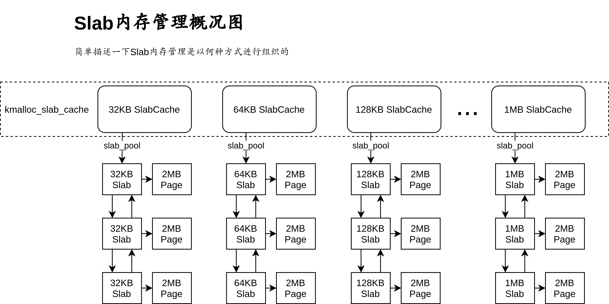

# 64位操作系统——（七）高级内存管理单元


---

作者：王赛宇

参考列表：

- 主要参考：《一个六十四位操作系统的设计与实现》——田雨
- 《Using as》 ——Dean Elsner &  Jay Fenlason  & friends
- nasm 用戶手册
- [处理器startup.s 常见汇编指令...](https://blog.csdn.net/uunubt/article/details/84838260)

---


在上一章节中，我们学习并且完善了内核主程序，着重讲解了`makefile`文件的编写。同时通过封装CPUID指令的方法，实现了CPU型号以及其他信息的查询与输出。后面的篇幅中，我们会回归到硬核知识的学习上，在本章中，我们将学习并实现一个slab内存池，来帮助我们优化内存管理模块。


## SLAB内存池


### Slab解决的问题

首先，我们先来明确一下SLAB内存池是在管理什么？SLAB内存池管理是用于管理操作系统内核使用的内存的，总体来说，我们需要实现的方法如下：


我们想要实现一个内存管理模块，我们可以通过一种方法向其请求一些内存空间，同时我们也可以将一些请求到的内存空间进行释放。这种方法我们在前面的学习中已经实现过一次了，当时我们使用的方法是：

- 遍历我们管理的每一个页，如果有连续的空间，能够达到请求的大小，那么就停止遍历
- 将找到的空间返回，以响应请求

自问自答一下：这种方法有什么局限性？个人认为，该方法会导致下面两种不好的结果：

- 前面申请的细小空间被释放后，当申请其他空间时无法利用，如下图：

  

  在不断的申请与释放中，原本连续、完整的空闲内存区域，被正在使用的内存切割，原本连续的大块区域，被切割成一些分散的小的内存区域。当我们的系统长时间运行后，我们分配较大连续内存的能力会越来越弱。如果我们没有对这种情况进行特殊处理，会在申请大块连续内存时直接报错退出。如果我们进行了特殊处理，那么就需要花费很多时间进行内存的调度。总体来说，这种分配方法会浪费很多资源。

- 第二种问题，我们在请求一个较小空间的时候，也只能分配一整个页的空间，这好么？这不好。

那么为了解决这个问题，slab应运而生了：

- 对于第一个问题：释放的资源暂时不进行规划，而是继续留存在Slab中，等待他人申请，这样的话再申请一些小空间的时候，就不会在后方的空隙中进行申请，而是在前方已经使用过的空间进行申请，这样就能够优化第一个问题的情况了。
- 对于第二个问题：将一个页拆分成很多个小的单元，放入Slab进行管辖。

### Slab的存储结构

#### 存储结构概述



我们通过这张图来了解一下Slab的存储结构，对于不同大小的内存快，我们分别进行管理，从32kb到1Mb，分别构建相应的内存池进行管理内存池使用数据结构`SlabCache`进行描述，内存池不对具体的物理内存进行管理，而是对内存池中的基本单元`Slab`进行管理。

`Slab`是内存池的基本单元，他直接管理一个物理页，将物理页的空间根据所在池的块大小进行切割，比如：`128kb`的Slab，直接管理一个`2MB`的内存页，那么他会把这一个`2MB`内存页拆分为`16`个128kb的块进行管理。

#### 存储结构体声明

```C
/** 
 * 描述Slab池的结构体
 * @param size              当前Slab池中，基本块的大小
 * @param total_using       当前Slab池中，被使用的块的数量
 * @param total_free        当前Slab池中，空闲的块的数量
 * @param cache_pool        指向当前Slab池管理的第一个Slab块
 * @param cache_dma_pool    暂时保留
 * @param constructor       块的构造函数
 * @param destructor        块的析构函数
 */
struct SlabCache {
    unsigned long    size;  // 当前Slab池中，基本块的大小
    unsigned long    total_using;  // 当前Slab池中，被使用的块的数量
    unsigned long    total_free;  // 当前Slab池中，空闲的块的数量
    struct Slab *    cache_pool;  // 指向当前Slab池管理的第一个Slab块
    struct Slab *    cache_dma_pool;  // 暂时保留
    void *(* constructor)(void * visual_address, unsigned long arg);  // 块的构造函数
    void *(* destructor) (void * visual_address, unsigned long arg);  // 块的析构函数
};
```

对于每一个Slab池，会记录其分配的块的大小、当前已经使用、可以使用的块的数量，并且会记录基本管理单元`Slab`的地址。

```C
/**
 * 用于描述一个Slab基本管理单元
 * @param list              用于记录Slab的前后关系
 * @param page              本Slab管理的页
 * @param using_count       本Slab中已经被使用的块的数量
 * @param free_count        本Slab中可用的块的数量
 * @param virtual_address   本的起始线性地址
 * @param color_length      colormap的地址长度
 * @param color_count       colormap的单元个数
 * @param color_map         colormap的主体
 */
struct Slab {
    struct List list;  // 用于记录Slab的前后关系
    struct Page * page;  // 本Slab管理的页
    unsigned long using_count;  // 本Slab中已经被使用的块的数量
    unsigned long free_count;  // 本Slab中可用的块的数量
    void * virtual_address;  // 本的起始线性地址
    unsigned long color_length;  // colormap的地址长度
    unsigned long color_count;  // colormap的单元个数
    unsigned long * color_map;  // colormap的主体
};
```

上面的结构体表示一个Slab基本管理单元，他会有一个指针，直接指向他管理的页的描述子，同时，会有一个指针用于记录他管理的页的基地址。最后，`color_map`用于标记当前页中按块划分后，哪些块可用。这种方法非常简单，与前面内存管理中的`bits_map`极为相似，在这里就不做赘述了。

### Slab池的创建

在了解Slab池的基本结构后，我们开始着手于Slab池的创建。回顾一下上面的内容，如果我们想要创建一个Slab池，需要进行哪些操作？

- 首先，我们需要初始化`SlabCache`的数据结构，标记其size，并且给其分配一个初始的`Slab`
- 为了给其分配一个初始的`Slab`，需要对`Slab`进行初始化
- 为了给Slab进行初始化，需要请求一个Page供Slab进行管理，所以需要使用以前定义的`alloc_pages`进行请求，同时，为了标记块的可用性，我们需要创建一个`color_map`来进行标记
- 现在一个`SlabCache`初始化需要的内存空间就全都请求到了，接下来，我们就需要对其数值进行初始化。
  - 对于一个Slab来说，其color_map中被管理部分全都应该为0,因为都没有被使用
  - 对于一个Slab来说，其`free_count`应该是`page_size / slab_size`，即：页的大小处以每一个块的大小，就是块的数量，初始状态下所有块可用
  - 对于一个SlabCache来说，其所有性质与Slab保持一致即可

当然，创建过程中可能会出现一些错误，出现错误的时候，不要忘记将前面申请的空间进行释放。

我们将上面的描述具体化为代码，就有了：

```C
/**
 * 给出一个SlabCache管理的内存单元的大小，以及其构造函数、析构函数，创建并初始化一个SlabCache
 * @param size          新建一个Slab内存池
 * @param constructor   一个函数指针，指向一个构造函数
 * @param destructor    一个函数指针，指向一个析构函数
 * @param arg           给出的参数
 */
struct SlabCache * CreateSlabCache(
    unsigned long size,
    void *(* constructor)(void * virtual_address,unsigned long arg),
    void *(* destructor) (void * virtual_address,unsigned long arg),
    unsigned long arg) {
    
    // 为SlabCache申请相应的内存
    struct SlabCache * slab_cache = NULL;
    slab_cache = (struct SlabCache *)kmalloc(sizeof(struct SlabCache),0);

    if (slab_cache == NULL) { // 如果没有申请到内存的话，那么就报错退出
        printk("CreateSlabCache()->kmalloc()=>slab_cache == NULL!!!\n \
                Memory is not enough!\n");
        return NULL;
    }

    // 初始化新建 slab_cache  
    memset(slab_cache,0,sizeof(struct SlabCache));
    *slab_cache = (struct SlabCache) {
        SIZEOF_LONG_ALIGN(size),  // size
        0, 0,  // using, free
        (struct Slab *)kmalloc(sizeof(struct Slab),0),  // cache_poll
        NULL,   // cache_dma_poll
        constructor, destructor  // constructor, destructor function pointer
    };

    if (slab_cache->cache_pool == NULL) { // 如果没有申请到cache_pool的空间，那么报错
        printk("CreateSlabCache()->kmalloc()=>slab_cache->cache_pool == NULL!!!\n\
                 Memory is not enough!\n");
        kfree(slab_cache); // 将前面申请的空间释放
        return NULL;
    }
    // 初始化被管理的Slab
    memset(slab_cache->cache_pool, 0, sizeof(struct Slab));
    list_init(&slab_cache->cache_pool->list); // 对管理的Slab链表头进行初始化

    // 为创建的Slab分配内存
    slab_cache->cache_pool->page = AllocPages(ZONE_NORMAL,1,0);
    if (slab_cache->cache_pool->page == NULL) {   
        printk("CreateSlabCache()->AllocPages()=>slab_cache->cache_pool->page == NULL!!!\n \
                Memory is not enough!\n");
        // 将前期分配的内存释放
        kfree(slab_cache->cache_pool); 
        kfree(slab_cache);
        return NULL;
    }

    PageInit(slab_cache->cache_pool->page, PG_Kernel); // 对申请到的页进行初始化

    (*slab_cache->cache_pool) = (struct Slab) {
        slab_cache->cache_pool->list,  // list
        slab_cache->cache_pool->page,  // 本Slab管理的页
        0, PAGE_2M_SIZE/slab_cache->size,  // using_count， free_count
        CONVERT_PHYSICAL_ADDRESS_TO_VIRTUAL_ADDRESS(slab_cache->cache_pool->page->PHY_address),  // virtual_address
        slab_cache->cache_pool->free_count,  // color_count
        ((slab_cache->cache_pool->color_count + sizeof(unsigned long) * 8 - 1) >> 6) << 3,  // color_length
        (unsigned long*)kmalloc(slab_cache->cache_pool->color_length,0)  // color_map
    };

    slab_cache->total_free = slab_cache->cache_pool->free_count;

    if (slab_cache->cache_pool->color_map == NULL) { // 如果没有申请到color_map空间，那么就报错并且清空
        printk("CreateSlabCache()->kmalloc()=>slab_cache->cache_pool->color_map == NULL\n\
                Memory is not enough!\n");
        // 将前期分配的内存释放
        free_pages(slab_cache->cache_pool->page,1);
        kfree(slab_cache->cache_pool);
        kfree(slab_cache);
        return NULL;
    }
    // 清空申请到的数据
    memset(slab_cache->cache_pool->color_map, 0, slab_cache->cache_pool->color_length);

    return slab_cache;
}
```


### Slab内存池的销毁

在刚才我们学习了SlabCache的创建，接下来我们来思考一下他的反向操作：销毁。我们需要明确以下的问题：

- 在何时允许销毁？
- 如何销毁？

我们逐个解答：

- 从安全的角度考虑，只有在没有人使用当前内存池管理的内存后才能够进行删除
- 我们只需要按照我们创建时的相反顺序进行删除即可，即：
  - 释放没一个SLab管理的页
  - 释放Slab申请的color_map空间
  - 释放Slab自身占用的空间
  - 释放当前SlabCache占用的空间

那么有了这样的基本思想，只需要使用代码实现即可：

```C
/**
 * 用于删除一个SlabCache
 * @param slab_cache 被删除的SlabCache
 */
unsigned long SlabDestroy(struct SlabCache * slab_cache) {

    if (slab_cache->total_using != 0) { // 如果有正在被使用的Slab，那么就不能删除
        printk("slab_cache->total_using != 0\n \
                SlabDestroy could only Delete a Unused SlabCache!\n");
        return 0;
    }

    struct Slab * slab_p = slab_cache->cache_pool;
    struct Slab * tmp_slab = NULL;
    while (!list_is_empty(&slab_p->list)) { // 通过链表遍历删除每一个被管理的Slab
        tmp_slab = slab_p;
        slab_p = CONTAINER_OF(list_next(&slab_p->list),struct Slab,list);
        list_del(&tmp_slab->list);  // 删除当前链表的前后关系
        kfree(tmp_slab->color_map);  // 删除当前Slab管理的color_map
        page_clean(tmp_slab->page);  // 清空当前页
        free_pages(tmp_slab->page,1);  // 释放相应的内存
        kfree(tmp_slab); // 释放当前Slab占用的内存空间
    }

    // 删除最后一个Slab对应的空间
    kfree(slab_p->color_map);
    page_clean(slab_p->page);
    free_pages(slab_p->page,1);
    kfree(slab_p);

    // 删除当前 SlabCache 占用的空间
    kfree(slab_cache);
    return 1;
}

```


### 向Slab请求内存空间

在这里我们来讨论一下如何向当前的内存池请求一个固定大小的内存空间。基于前面的数据结构，我们的流程已经非常清晰了，这里我们分两种情况进行讨论：

- 如果当前内存池中有可用的块：
  - 找到可用的块所在的Slab
  - 从Slab中找到可用的块
  - 将可用的块进行分配
- 如果没有可用的块：
  - 请求一个Slab
  - 将Slab添加到当前内存池的管辖中
  - 在该Slab中进行分配即可

我们还是将这一套体系写成代码：

```C
/**
 * 向某一个SlabCache内存池请求一个内存区域（请求区域大小由slab_cache->size确定）
 * @param slab_cache 请求的内存池
 * @param arg 请求的参数
 */
void * SlabMalloc(struct SlabCache* slab_cache, unsigned long arg) {
	struct Slab * slab_p = slab_cache->cache_pool;
	struct Slab * tmp_slab = NULL;
	int j = 0;

	if (slab_cache->total_free == 0) { // 如果没有可用的页

        struct Slab* tmp_slab = CreateSlab(slab_cache->size, "SlabMalloc()");

        if (tmp_slab == NULL) return NULL; // 如果出现错误，那么就直接返回（在出现错误的地方已经报过错了）

        list_add_to_behind(&slab_cache->cache_pool->list,&tmp_slab->list);

		slab_cache->total_free  += tmp_slab->color_count;

		for(j = 0;j < tmp_slab->color_count;j++) { // 进行搜寻
			if ( (*(tmp_slab->color_map + (j >> 6)) & (1UL << (j % 64))) == 0 ) {
				*(tmp_slab->color_map + (j >> 6)) |= 1UL << (j % 64);
			
				tmp_slab->using_count++;
				tmp_slab->free_count--;

				slab_cache->total_using++;
				slab_cache->total_free--;
				
				if (slab_cache->constructor != NULL) {
					return slab_cache->constructor((char *)tmp_slab->virtual_address + slab_cache->size * j,arg);
				} else {			
					return (void *)((char *)tmp_slab->virtual_address + slab_cache->size * j);
				}		
			}
		}
	} else { // 如果当前有足够的空间
		do {
			if (slab_p->free_count == 0) { // 如果当前的 slab 没有闲暇的地址空间，那么就根据链表，移动到下一个Slab结构体
				slab_p = CONTAINER_OF(list_next(&slab_p->list),struct Slab,list);
				continue;
			}
			for (j = 0;j < slab_p->color_count;j++) {
				if (*(slab_p->color_map + (j >> 6)) == 0xffffffffffffffffUL) { // 如果当前的color_map元素全是1，那么就直接跳过当前的64个元素，直接找下面的64个
					j += 63;
					continue;
                }
				
				if ( (*(slab_p->color_map + (j >> 6)) & (1UL << (j % 64))) == 0 ) { // 如果当前检测的位有空间的话，那么就返回相应的空间
					*(slab_p->color_map + (j >> 6)) |= 1UL << (j % 64); // 将找到的空间置为1

                    // 对计数进行更改
					slab_p->using_count++;
					slab_p->free_count--;
					slab_cache->total_using++;
					slab_cache->total_free--;

					if (slab_cache->constructor != NULL) { // 如果当前的slab_cache的构造函数不为空，那么就自动调用这个构造函数，并且返回结果
						return slab_cache->constructor((char *)slab_p->virtual_address + slab_cache->size * j,arg);
					} else { // 否则直接将结果返回
						return (void *)((char *)slab_p->virtual_address + slab_cache->size * j);
					}
				}
			}
		} while (slab_p != slab_cache->cache_pool);		
	} // 如果找到最后都没有找到的话，那么就说明实在找不到了，那么就报错吧

	printk("SlabMalloc() ERROR: can`t alloc\n");
	if (tmp_slab != NULL) { // 如果申请了内存，但是还是出现了错误，那么就释放相应内存并且退出
		list_del(&tmp_slab->list);
		kfree(tmp_slab->color_map);
		page_clean(tmp_slab->page);
		free_pages(tmp_slab->page,1);
		kfree(tmp_slab);
	}

	return NULL;
}
```

### 将请求过的空间返回给Slab

刚才讨论完了如何请求空间，接下来讨论如何对请求的空间进行释放。我们直接看一下相应的流程即可：

- 在当前的SLab池中找到，给出的空间属于哪个Slab的管理，并且进入该SLab
- 在相应的Slab中进行查找，给出的地址，是哪个块
- 更改块的信息（更改标记）以及计数信息

总体来说，代码如下：

```C
/**
 * 释放某一内存池子中特定虚拟地址的内存
 * @param slab_cache 被释放的内存池
 * @param address 被释放的地址
 * @param arg 释放时使用的参数
 */
unsigned long SlabFree(struct SlabCache * slab_cache,void * address,unsigned long arg) {
    struct Slab * slab_p = slab_cache->cache_pool;
    int index = 0;

    do {
        if (slab_p->virtual_address <= address && address < slab_p->virtual_address + PAGE_2M_SIZE) {
            index = (address - slab_p->virtual_address) / slab_cache->size;
            *(slab_p->color_map + (index >> 6)) ^= 1UL << index % 64;
            slab_p->free_count++;
            slab_p->using_count--;
            slab_cache->total_using--;
            slab_cache->total_free++;
            if (slab_cache->destructor != NULL) {
                slab_cache->destructor((char *)slab_p->virtual_address + slab_cache->size * index,arg);
            }
            if ((slab_p->using_count == 0) && (slab_cache->total_free >= slab_p->color_count * 3 / 2)) {
                list_del(&slab_p->list);
                slab_cache->total_free -= slab_p->color_count;
                kfree(slab_p->color_map);
                page_clean(slab_p->page);
                free_pages(slab_p->page,1);
                kfree(slab_p);
            }
            return 1;
        } else {
            slab_p = CONTAINER_OF(list_next(&slab_p->list),struct Slab,list);
            continue;
        }
    } while (slab_p != slab_cache->cache_pool);

    printk("slab_free() ERROR: address not in slab\n");
    return 0;
}
```


## 基于SLAB内存池技术的通用内存管理单元

在上面的一节中，我们学习了如何对一个Slab池进行初始化、销毁以及如何向一个Slab池请求一个固定大小的资源、如何将请求的资源释放。但是很明显，我们写的东西没法用，在这一节中，我们会在内存管理单元中对系统的Slab内存池进行初始化，并且书写对外使用的内核内存管理接口。在这一节的开始，我们先来学习系统的Slab池的初始化：


### 通用内存管理单元的初始化函数

首先，我们先来了解，系统的Slab应该长什么样子，这里我们再把刚才的图拿来看一下：


在系统内部，会有很多大小不同的Slab池，我们在运行初期想要对这些池挨个进行初始化。那么在开始之前，先问自己个问题：为什么要有这么多个池？

- 一个32KB的内存池，每次只能返回一块32KB的内存区域，一个1MB的内存池一次也只能返回一块1MB的内存区域
- 池的大小分的越细致，由于池大小而被浪费的空间也会越小

好的，相信上面的说法已经能够回答这个问题了，接下来，我们就将这些池子定义出来：

```C
/**
 * 用于记录不同内存池的size
 */
struct SlabCache kmalloc_slab_cache[16] = {
    {32,        0,  0,  NULL,   NULL,   NULL,   NULL},
    {64,        0,  0,  NULL,   NULL,   NULL,   NULL},
    {128,       0,  0,  NULL,   NULL,   NULL,   NULL},
    {256,       0,  0,  NULL,   NULL,   NULL,   NULL},
    {512,       0,  0,  NULL,   NULL,   NULL,   NULL},
    {1024,      0,  0,  NULL,   NULL,   NULL,   NULL},
    {2048,      0,  0,  NULL,   NULL,   NULL,   NULL},
    {4096,      0,  0,  NULL,   NULL,   NULL,   NULL},
    {8192,      0,  0,  NULL,   NULL,   NULL,   NULL},
    {16384,     0,  0,  NULL,   NULL,   NULL,   NULL},
    {32768,     0,  0,  NULL,   NULL,   NULL,   NULL},
    {65536,     0,  0,  NULL,   NULL,   NULL,   NULL},
    {131072,    0,  0,  NULL,   NULL,   NULL,   NULL},
    {262144,    0,  0,  NULL,   NULL,   NULL,   NULL},
    {524288,    0,  0,  NULL,   NULL,   NULL,   NULL},
    {1048576,   0,  0,  NULL,   NULL,   NULL,   NULL},
};
```

这一步非常简单。然后，我们再对其挨个进行初始化即可，初始化的过程我们已经在上一节中详细的讨论过了：

```C
/**
 * 对内置的SlabCache进行Init操作
 */
unsigned long SlabInit() {
    
    unsigned long struct_from_page = (memory_management_struct.end_of_struct >> PAGE_2M_SHIFT);
    // 遍历，为cache_pool请求空间
    for(int i = 0; i < 16; ++i) {
        // 直接在memory_management_struct后面手动开空间， 分配给Slab
        kmalloc_slab_cache[i].cache_pool = (struct Slab*)memory_management_struct.end_of_struct;
        memory_management_struct.end_of_struct += sizeof(struct Slab) + 10 * sizeof(long); // 该空间被使用向后移动，防止冲突
        list_init(&kmalloc_slab_cache[i].cache_pool->list);
        // 为color_Map分配空间，每一个Slab初始的大小都为y一个页的大小，即为2M，那么colormap的位长度就是(PageSize/SlabSize)
        // 占用的long 类型数量为(PageSize/SlabSize) << 6
        *kmalloc_slab_cache[i].cache_pool = (struct Slab) {
            kmalloc_slab_cache[i].cache_pool->list,  // list
            NULL, 0, (PAGE_2M_SIZE / kmalloc_slab_cache[i].size),  // page_pointer, using_count, free_count
            NULL, (((PAGE_2M_SIZE / kmalloc_slab_cache[i].size + (1 << 6) - 1) >> 6) << 3), // virtual_address, color_length
            (PAGE_2M_SIZE / kmalloc_slab_cache[i].size), (unsigned long*)memory_management_struct.end_of_struct // color_count, color_map
        };
        // 后移end_of_struct，为color_Map腾出空间
        memory_management_struct.end_of_struct = memory_management_struct.end_of_struct +  //  加上当前colormap的地址长度，然后腾出空间防止冲突，最后进行对齐
                                                 (kmalloc_slab_cache[i].cache_pool->color_length + sizeof(long) * 10) & (~ (sizeof(long) - 1));
        // 分配cache_pool后，为当前Slab池初始化参数
        kmalloc_slab_cache[i] = (struct SlabCache) {
            kmalloc_slab_cache[i].size,  // size
            0, (PAGE_2M_SIZE / kmalloc_slab_cache[i].size), // total_using, total_free
            kmalloc_slab_cache[i].cache_pool, NULL,  // cache_pool, cache_dma_pool
            NULL, NULL  // constructor, destructor
        };

		// 清空申请的color_map
		memset(kmalloc_slab_cache[i].cache_pool->color_map,0xff,kmalloc_slab_cache[i].cache_pool->color_length);

		for(int j = 0;j < kmalloc_slab_cache[i].cache_pool->color_count;j++)
			*(kmalloc_slab_cache[i].cache_pool->color_map + (j >> 6)) ^= 1UL << j % 64;

    }
    // 将这些使用的空间进行标记
    unsigned long long struct_to_page = (memory_management_struct.end_of_struct >> PAGE_2M_SHIFT);
    for(int i = struct_from_page; i <= struct_to_page; ++i) { // 将使用到的Page进行标记
        struct Page* page =  memory_management_struct.pages_struct + i;
		*(memory_management_struct.bits_map + ((page->PHY_address >> PAGE_2M_SHIFT) >> 6)) |= 1UL << (page->PHY_address >> PAGE_2M_SHIFT) % 64;
		page->zone_struct->page_using_count++;
		page->zone_struct->page_free_count--;
		PageInit(page,PG_PTable_Maped | PG_Kernel_Init | PG_Kernel);
    }
    // 为Slab分配实际控制的Page
    for(int i = 0 ;i < 16; ++i) {
        unsigned long*  virtual_address = (unsigned long *)((memory_management_struct.end_of_struct + PAGE_2M_SIZE * i + PAGE_2M_SIZE - 1) & PAGE_2M_MASK);
		struct Page* page = Virt_To_2M_Page(virtual_address);
		*(memory_management_struct.bits_map + ((page->PHY_address >> PAGE_2M_SHIFT) >> 6)) |= 1UL << (page->PHY_address >> PAGE_2M_SHIFT) % 64;
		page->zone_struct->page_using_count++;
		page->zone_struct->page_free_count--;
		PageInit(page,PG_PTable_Maped | PG_Kernel_Init | PG_Kernel);
		kmalloc_slab_cache[i].cache_pool->page = page;
		kmalloc_slab_cache[i].cache_pool->virtual_address = virtual_address;
    }

    printk("SlabCaches Init Finished!");
    printk(
        "start_code:%#018lx,end_code:%#018lx,end_data:%#018lx,end_brk:%#018lx,end_of_struct:%#018lx\n",
        memory_management_struct.start_code,memory_management_struct.end_code,memory_management_struct.end_data,
        memory_management_struct.end_brk, memory_management_struct.end_of_struct
    );
    return 1;
}

```


由于这里使用了很多页，我们的空间有些不足了，所以我们需要对页表进行简单的调整：

```C
__PDE:

    .quad    0x000087
    .quad    0x200087
    .quad    0x400087
    .quad    0x600087
    .quad    0x800087        /* 0x800083 */
    .quad    0xa00087
    .quad    0xc00087
    .quad    0xe00087
    .quad    0x1000087
    .quad    0x1200087
    .quad    0x1400087
    .quad    0x1600087
    .quad    0x1800087
    .quad    0x1a00087
    .quad    0x1c00087
    .quad    0x1e00087
    .quad    0x2000087
    .quad    0x2200087
    .quad    0x2400087
    .quad    0x2600087
    .quad    0x2800087
    .quad    0x2a00087
    .quad    0x2c00087
    .quad    0x2e00087

    .quad    0xe0000087        /*0x 3000000*/
    .quad    0xe0200087
    .quad    0xe0400087
    .quad    0xe0600087
    .quad    0xe0800087
    .quad    0xe0a00087
    .quad    0xe0c00087
    .quad    0xe0e00087
    .fill    480,8,0
```

相应的，我们需要在`main.c`中对之前定义的显示区域进行改变：

```C
#define COLOR_OUTPUT_ADDR (int *)0xffff800003000000
```

### 通用内存的分配函数`kmalloc`

接下来，我们要向用户开放请求内存的接口`kmalloc`，具体的形式为：用户给出想要的内存大小，我们为其分配一块能够满足用户使用的空间。那么首先面临一个问题：**什么是能够满足用户使用的空间？**其实非常简单：找到一比用户请求的内存大小要大的空间就能够满足用户的需求，在满足用户需求的情况下，我们希望尽量节省内存空间，所以我们只需要在满足需求的内存块中挑选最小的进行分配即可。

通过上面的描述，我们找到了应该给用户开辟多大的内存块，换句话说就是我**们解决了在哪个SlabCache中请求固定块的问题**，接下来，我们需要对一些细分的情况进行讨论：

- 如果对应的SlabCache中没有足够的空间，那么应该怎么办？

其实这个非常简单：直接新建一个Slab块即可，我们在前面也讲过，但是我们在这里可以继续优化他的逻辑。我们来对不同情况下的color_map进行对比：

| 块大小  | Color_map长度(bit) |
| ------- | ------------------ |
| 32Byte  | 65536              |
| 128Byte | 16384              |
| 512Byte | 4096               |
| 1MB     | 2                  |

我们注意到一个现象：块的大小越大，一个Page中的块的数量越少，用于描述他的Color_Map也就越短。我们的colormap有存在哪里呢？就存在我们申请来的这个页中，如果我们块的大小太大了，同时我们的color_map+Slab的大小不够大，就会浪费非常多的空间，比如我们在极端情况下，申请来了一个`1MB的Slab`，她只管理一个`2MB`的页，在此情况下如果我们还想把总大小不超过30Byte（大概值）的结构体与ColorMap空间，放到第一个块中，那么每次申请一个`1MB的Slab`，将会有将近一半的内存空间被浪费，这好么？这不好。那么该如何解决这一问题呢？很简单，我们直接从更小的Slab中请求空间来存储这些不大的结构信息即可，于是就有了下面的分段式请求结构：

```C
struct Slab * kmalloc_create(unsigned long size) {
	int i;
	struct Slab * slab = NULL;
	struct Page * page = NULL;
	unsigned long * vaddresss = NULL;
	long structsize = 0;

	page = AllocPages(ZONE_NORMAL,1, 0);
	
	if (page == NULL) {
		printk("kmalloc_create()->AllocPages()=>page == NULL\n");
		return NULL;
	}
	
	PageInit(page,PG_Kernel);

	switch (size) {
		// 对于单元较小的，其Slab与colormap的总体积较大，正常申请即可
		case 32:
		case 64:
		case 128:
		case 256:
		case 512:

			vaddresss = CONVERT_PHYSICAL_ADDRESS_TO_VIRTUAL_ADDRESS(page->PHY_address);
			structsize = sizeof(struct Slab) + PAGE_2M_SIZE / size / 8;
			slab = (struct Slab *)((unsigned char *)vaddresss + PAGE_2M_SIZE - structsize);
			slab->color_map = (unsigned long *)((unsigned char *)slab + sizeof(struct Slab));
			slab->free_count = (PAGE_2M_SIZE - (PAGE_2M_SIZE / size / 8) - sizeof(struct Slab)) / size;
			slab->using_count = 0;
			slab->color_count = slab->free_count;
			slab->virtual_address = vaddresss;
			slab->page = page;
			list_init(&slab->list);
			slab->color_length = ((slab->color_count + sizeof(unsigned long) * 8 - 1) >> 6) << 3;
			memset(slab->color_map,0xff,slab->color_length);
			for(i = 0;i < slab->color_count;i++){
                *(slab->color_map + (i >> 6)) ^= 1UL << i % 64;
            }
			break;

		// 对于体积较大的，其块大小较大，所以colormap元素数量少，导致占用空间少，直接使用kmalloc进行申请即可
		case 1024:
		case 2048:
		case 4096:
		case 8192:
		case 16384:
		case 32768:
		case 65536:
		case 131072:
		case 262144:
		case 524288:
		case 1048576:

			slab = (struct Slab *)kmalloc(sizeof(struct Slab),0);
			slab->free_count = PAGE_2M_SIZE / size;
			slab->using_count = 0;
			slab->color_count = slab->free_count;
			slab->color_length = ((slab->color_count + sizeof(unsigned long) * 8 - 1) >> 6) << 3;
			slab->color_map = (unsigned long *)kmalloc(slab->color_length,0);
			memset(slab->color_map,0xff,slab->color_length);
			slab->virtual_address = CONVERT_PHYSICAL_ADDRESS_TO_VIRTUAL_ADDRESS(page->PHY_address);
			slab->page = page;
			list_init(&slab->list);
			for(i = 0;i < slab->color_count;i++){ 
                *(slab->color_map + (i >> 6)) ^= 1UL << i % 64;
            }
				
			break;

		default:

			printk("kmalloc_create() ERROR: wrong size:%08d\n",size);
			free_pages(page,1);
			
			return NULL;
	}	
	return slab;
}
/**
 * 使用Slab资源请求内存区域的方法
 * @param size 请求的内存资源大小， 这个大小不能超过我们最大的 slab 块的大小
 * @param gfp_flags 暂时保留
 * 
 * @return 返回一个地址，表示请求到的地址，如果返回的地址是NULL那么就说明没有请求到有效地址，大概率是因为内存中已经没有可用的空间了
 */
void * kmalloc(unsigned long size,unsigned long gfp_flages) {
	int i,j;
	struct Slab * slab = NULL;

    // 确定在哪个内存池中进行搜索

	if (size > 1048576) {  // 如果申请的内存大小大于我们能够接受的最大大小，那么就结束
		printk("kmalloc() ERROR: kmalloc size too long:%08d\n",size);
		return NULL;
	}
	for(i = 0;i < 16;i++) {  // 试探能够使用的大小，找到比请求的大的里面最小的
        if (kmalloc_slab_cache[i].size >= size) {  // 找到就停止
            break;
        }
    }
    
    // 在内存池中进行搜索

	slab = kmalloc_slab_cache[i].cache_pool; 
	if (kmalloc_slab_cache[i].total_free != 0) { // 如果当前的SlabCache中有空闲单元，那么就找到这个空闲单元所属的Slab
		do {
			if (slab->free_count == 0)
				slab = CONTAINER_OF(list_next(&slab->list),struct Slab,list);
			else
				break;
		}while(slab != kmalloc_slab_cache[i].cache_pool);	
	} else {  // 如果当前的SlabCache没有空闲单元那么就直接为当前的SlabCache添加一个Slab单元
		slab = kmalloc_create(kmalloc_slab_cache[i].size);
		if (slab == NULL) {  // 如果没有请求到相应的Slab那么就说明内存地址不足，那么就返回错误
			printk("kmalloc()->kmalloc_create()=>slab == NULL\n");
			return NULL;
		}
        // 否则就将请求到的Slab添加到当前的链表中
		kmalloc_slab_cache[i].total_free += slab->color_count;
		printk("kmalloc()->kmalloc_create()<=size:%#010x\n",kmalloc_slab_cache[i].size);///////
		list_add_to_before(&kmalloc_slab_cache[i].cache_pool->list,&slab->list);
	}

    // 当前的Slab是有空闲的Slab，在当前的Slab中进行搜索即可
	for(j = 0;j < slab->color_count;j++) {
		if (*(slab->color_map + (j >> 6)) == 0xffffffffffffffffUL) {
			j += 63;
			continue;
		}
		if ( (*(slab->color_map + (j >> 6)) & (1UL << (j % 64))) == 0 ) {
			*(slab->color_map + (j >> 6)) |= 1UL << (j % 64);
			slab->using_count++;
			slab->free_count--;
			kmalloc_slab_cache[i].total_free--;
			kmalloc_slab_cache[i].total_using++;
			return (void *)((char *)slab->virtual_address + kmalloc_slab_cache[i].size * j);
		}
	}

	printk("kmalloc() ERROR: no memory can alloc\n");
	return NULL;
}

```

### 通用内存的回收函数`kfree`

接下来我们书写一个回收的函数，这个函数的总体流程与刚才的回收完全相同，只不过遍历的目标从单一的`SlabCache`变为了系统管理的所有`SlabCache`，代码如下：

```C
/**
 * 释放一个由Slab管理的内存区域
 * @param address 想要释放的区域的首地址
 * @return 如果成功，那么返回1, 否则返回0
 * 
 * <h3>原理</h3>
 * <p>
 *      我们知道，每个Slab都直接管理一个物理页，同时，我们的物理页都是对齐了的。
 * </p>
 * <p>
 *      我们将被释放的内存的首地址与被管理的内存页的首地址进行比较，如果这两个地址完全相同
 *      那么就说明：想要被释放的内存在这个物理页中，即：使用的内存，被当前的Slab进行管理
 * </p>
 */
unsigned long kfree(void * address) { // 用于释放内存
	int i;
	int index;
	struct Slab * slab = NULL;
	void * page_base_address = (void *)((unsigned long)address & PAGE_2M_MASK);

	for(i = 0;i < 16;i++) { // 查找当前内存在哪个Slab的管辖内
		slab = kmalloc_slab_cache[i].cache_pool;
		do {
			if (slab->virtual_address == page_base_address) {
				index = (address - slab->virtual_address) / kmalloc_slab_cache[i].size;
				*(slab->color_map + (index >> 6)) ^= 1UL << index % 64;
				slab->free_count++;
				slab->using_count--;
				kmalloc_slab_cache[i].total_free++;
				kmalloc_slab_cache[i].total_using--;
				if ((slab->using_count == 0) && (kmalloc_slab_cache[i].total_free >= slab->color_count * 3 / 2) && (kmalloc_slab_cache[i].cache_pool != slab)) {
					switch(kmalloc_slab_cache[i].size) { // 对于小单元的处理
						case 32:
						case 64:
						case 128:
						case 256:	
						case 512:
							list_del(&slab->list);
							kmalloc_slab_cache[i].total_free -= slab->color_count;
							page_clean(slab->page);
							free_pages(slab->page,1);
							break;
						default:
							list_del(&slab->list);
							kmalloc_slab_cache[i].total_free -= slab->color_count;
							kfree(slab->color_map);
							page_clean(slab->page);
							free_pages(slab->page,1);
							kfree(slab);
							break;
					}
				}
				return 1;
			} else {
				slab = CONTAINER_OF(list_next(&slab->list),struct Slab,list);
            }

		} while (slab != kmalloc_slab_cache[i].cache_pool);
	
	}
	
	printk("kfree() ERROR: can`t free memory\n");
	
	return 0;
}
```


### 辅助函数

这两个函数功能及其简单，自己看吧：

```C
void free_pages(struct Page * page,int number){	
	int i = 0;
	if (page == NULL) {
		printk("free_pages() ERROR: page is invalid\n");
		return ;
	}	
	if (number >= 64 || number <= 0) {
		printk("free_pages() ERROR: number is invalid\n");
		return ;	
	}
	for (i = 0;i<number;i++,page++) {
		*(memory_management_struct.bits_map + ((page->PHY_address >> PAGE_2M_SHIFT) >> 6)) &= ~(1UL << (page->PHY_address >> PAGE_2M_SHIFT) % 64);
		page->zone_struct->page_using_count--;
		page->zone_struct->page_free_count++;
		page->attribute = 0;
	}
}


unsigned long page_clean(struct Page * page) {
	page->reference_count--;
	page->zone_struct->total_pages_link--;
	if (!page->reference_count) {
		page->attribute &= PG_PTable_Maped;
	}
	return 1;
}
```


### 验证

到现在为止，我们的内存管理模块就写好了，我们来执行一下进行验证为了进行验证，我们对`main.c`进行更改：

```C++
InitMemory(); // 输出所有内存信息

InitInterrupt();


DoClear(&global_position);

SlabInit();

struct Slab *tmp, *slab;
printk("kmalloc test\n");
for (int i = 0;i< 16;i++) {
    printk("size:%#010x\t", kmalloc_slab_cache[i].size);
    printk("color_map(before):%#018lx\t",*kmalloc_slab_cache[i].cache_pool->color_map);
    tmp = kmalloc(kmalloc_slab_cache[i].size,0);
    if(tmp == NULL)
        printk("kmalloc size:%#010x ERROR\n",kmalloc_slab_cache[i].size);
    printk("color_map(middle):%#018lx\t",*kmalloc_slab_cache[i].cache_pool->color_map);
    kfree(tmp);
    printk("color_map(after):%#018lx\n",*kmalloc_slab_cache[i].cache_pool->color_map);
}

kmalloc(kmalloc_slab_cache[15].size,0);
kmalloc(kmalloc_slab_cache[15].size,0);
kmalloc(kmalloc_slab_cache[15].size,0);
kmalloc(kmalloc_slab_cache[15].size,0);
kmalloc(kmalloc_slab_cache[15].size,0);
kmalloc(kmalloc_slab_cache[15].size,0);
kmalloc(kmalloc_slab_cache[15].size,0);

printk("color_map(0):%#018lx,%#018lx\n",kmalloc_slab_cache[15].cache_pool->color_map,*kmalloc_slab_cache[15].cache_pool->color_map);
slab = CONTAINER_OF(list_next(&kmalloc_slab_cache[15].cache_pool->list),struct Slab,list);
printk("color_map(1):%#018lx,%#018lx\n",slab->color_map, *slab->color_map);
slab = CONTAINER_OF(list_next(&slab->list),struct Slab,list);
printk("color_map(2):%#018lx,%#018lx\n",slab->color_map, *slab->color_map);
slab = CONTAINER_OF(list_next(&slab->list),struct Slab,list);
printk("color_map(3):%#018lx,%#018lx\n",slab->color_map, *slab->color_map);

while(1){
    ;
}
```

这里就是我们在进行完中断初始化后，就清空屏幕进行Slab初始化，并且使用定义好的kmalloc接口，进行内存请求，并且进行输出测试。测试结果如下：


可以看到，整体结果符合预期，非常nice。