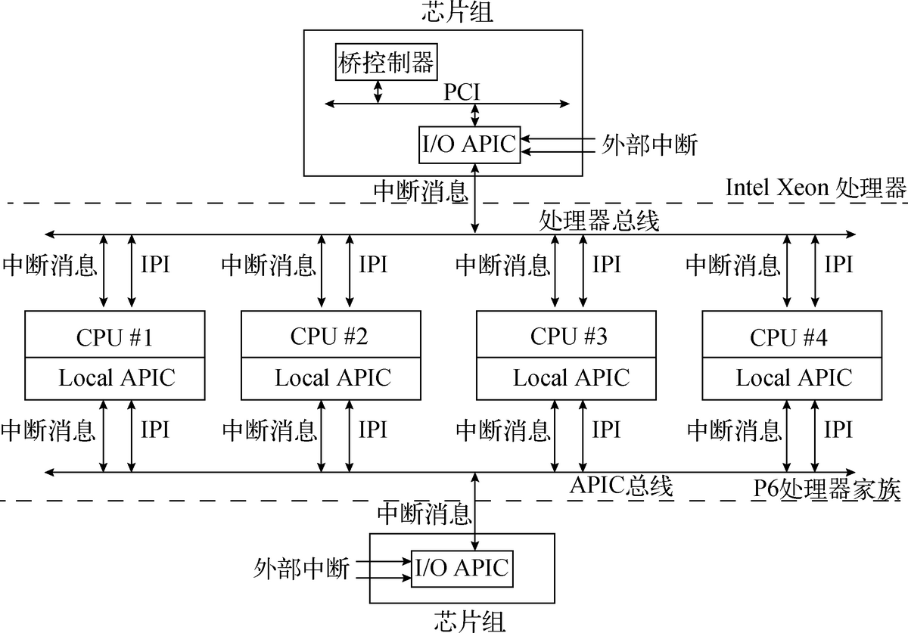

# 64位操作系统——（八）高级中断处理单元

---

作者：王赛宇

参考列表：

- 主要参考：《一个六十四位操作系统的设计与实现》——田雨
- 《Using as》 ——Dean Elsner &  Jay Fenlason  & friends
- nasm 用戶手册
- [处理器startup.s 常见汇编指令...](https://blog.csdn.net/uunubt/article/details/84838260)

---

在上一节中，我们完成了一个Slab内存池，并且完善了前期的内存管理单元，接下来我们将继续完善我们的操作系统，这里我们将把高级中断处理单元应用到我们的系统中 ，在开始写代码之前，我们按照常理来学习一下相关的基础知识：

## APIC

我们之前学习的是一种叫做：`8259A PIC`的中断处理单元，它是单核处理器时代的中断处理控制芯片，我们注意到，它的特点是`8259A PIC`每次都将中断请求信号投递给一个指定的处理器，如果我们仍然使用这样的架构，那么在面对大量中断的情况下，我们的处理器会变得非常拉跨。

接下来我们学习被称为`APIC`的中断处理单元，先通过下面的图片来了解一下（图片来自《一个六十四位操作系统的设计与实现》——田雨）：

通过这个图片，我们了解到，一共有两种APIC，他们分别是：

- **`Local APIC`：**处理器的每一个核心中都包含一个`Local APIC`，对于内部：他可以与内部的处理器核心进行通信，收发中断请求，对于外部：
  - **收发中断信息：**
  - **收发`IPI`**，所谓的`IPI`就是处理器间的中断信息，与普通中断信息不同的是，它不会被`I/O APIC`捕获。IPI消息主要应用于多核处理器环境下，通过它可实现各处理器**核心间的通信**，这也是多核处理器之间使用的主要通信手段。
- **`I/O APIC`：**是主板芯片组的一部分，他主要负责接收外部`I/O`设备发来的中断请求，并且将这些中断请求封装为中断消息发送给`Local APIC`

在多核处理器中，`I/O APIC`可以将外部的中断请求分发到目标处理器的`Local APIC`控制器中，或者分发到系统总线上的处理器组中。

### Local APIC

每一个处理器的核心中都有一个`Local APIC`，他可以：

- 接受`I/O APIC`发来的中断请求
- 接受其他处理器传来的`IPI`

在这里，我们的重点放在`Local APIC`与`I/O APIC`之间。

